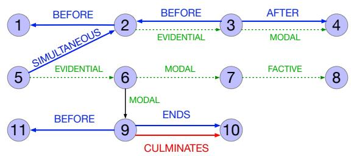

## 21.6 Temporally Annotated Datasets: TimeBank

The TimeBank corpus consists of American English text annotated with temporal information (Pustejovsky et al., 2003). The annotations use TimeML (Saur´ı et al., 2006), a markup language for time based on Allen’s interval algebra discussed above (Allen, 1984). There are three types of TimeML objects: an EVENT represent events and states, a TIME represents time expressions like dates, and a LINK represents various relationships between events and times (event-event, event-time, and timetime). The links include temporal links (TLINK) for the 13 Allen relations, aspectual links (ALINK) for aspectual relationships between events and subevents, and SLINKS which mark factuality.

Consider the following sample sentence and its corresponding markup shown in Fig. 21.13, selected from one of the TimeBank documents.

(21.34) Delta Air Lines earnings soared 33% to a record in the fiscal first quarter, bucking the industry trend toward declining profits.

This text has three events and two temporal expressions (including the creation time of the article, which serves as the document time), and four temporal links that capture the using the Allen relations:

• Soaring<sub>e1</sub> is included in the fiscal first quarter<sub>t58</sub>

• Soaring<sub>e1</sub> is before 1989-10-26<sub>t57</sub>

• Soarin $\mathrm { i g } _ { e 1 }$ is simultaneous with the bucking<sub>e3</sub>

```html
<TIMEX3 tid="t57" type="DATE" value="1989-10-26" functionInDocument="CREATION_TIME">10/26/89 </TIMEX3>

Delta Air Lines earnings <EVENT eid="e1" class="OCCURRENCE"> soared </EVENT> 33% to a record in <TIMEX3 tid="t58" type="DATE" value="1989-Q1" anchorTimeID="t57"> the fiscal first quarter </TIMEX3>, <EVENT eid="e3" class="OCCURRENCE">bucking</EVENT> the industry trend toward <EVENT eid="e4" class="OCCURRENCE">declining</EVENT> profits.
```

Figure 21.13 Example from the TimeBank corpus.

• Declining<sub>e4</sub> includes soaring<sub>e1</sub>

We can also visualize the links as a graph. The TimeBank snippet in Eq. 21.35 would be represented with a graph like Fig. 21.14.

(21.35) [DCT:11/02/891]<sub>1</sub>: Pacific First Financial Corp. said<sub>2</sub> shareholders approved<sub>3</sub> its acquisition<sub>4</sub> by Royal Trustco Ltd. of Toronto for \$27 a share, or \$212 million. The thrift holding company said<sub>5</sub> it expects<sub>6</sub> to obtain<sub>7</sub> regulatory approval<sub>8</sub> and complete<sub>9</sub> the transaction<sub>10</sub> by year-end<sub>11</sub>.

  
Figure 21.14 A graph of the text in Eq. 21.35, adapted from (Ocal et al., 2022). TLINKS are shown in blue, ALINKS in red, and SLINKS in green.
