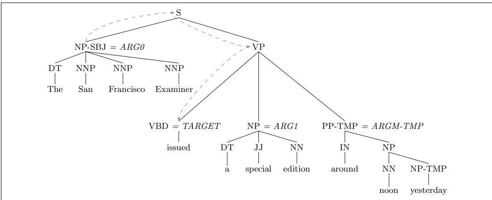
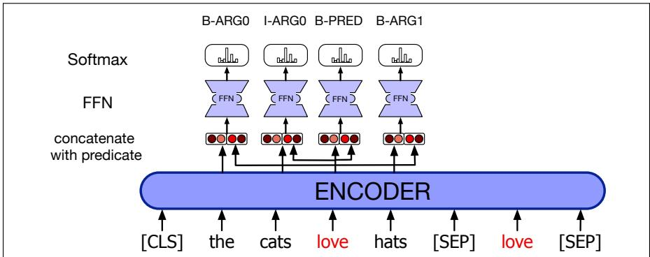

# emantic Role Labeling

“Who, What, Where, When, With what, Why, How” The seven circumstances, associated with Hermagoras and Aristotle (Sloan, 2010)

Sometime between the 7th and 4th centuries BCE, the Indian grammarian Pan¯ <sub>.</sub> ini<sup>1</sup> wrote a famous treatise on Sanskrit grammar, the As<sub>.</sub>t<sub>.</sub>adhy¯ ay¯ ¯ı (‘8 books’), a treatise

that has been called “one of the greatest monuments of human intelligence” (Bloomfield, 1933, 11). The work describes the linguistics of the Sanskrit language in the form of 3959 sutras, each very efficiently (since it had to be memorized!) expressing part of a formal rule system that brilliantly prefigured modern mechanisms of formal language theory (Penn and Kiparsky, 2012). One set of rules describes the karakas¯ , semantic relationships between a verb and noun arguments, roles like agent, instrument, or destination. Pan¯ <sub>.</sub> ini’s work was the earliest we know of that modeled the linguistic realization of events and their


participants. This task of understanding how participants relate to events—being able to answer the question “Who did what to whom” (and perhaps also “when and where”)—is a central question of natural language processing.

Let’s move forward 2.5 millennia to the present and consider the very mundane goal of understanding text about a purchase of stock by XYZ Corporation. This purchasing event and its participants can be described by a wide variety of surface forms. The event can be described by a verb (sold, bought) or a noun (purchase), and XYZ Corp can be the syntactic subject (of bought), the indirect object (of sold), or in a genitive or noun compound relation (with the noun purchase) despite having notionally the same role in all of them:

• XYZ corporation bought the stock.

• They sold the stock to XYZ corporation.

• The stock was bought by XYZ corporation.

• The purchase of the stock by XYZ corporation...

• The stock purchase by XYZ corporation...

In this chapter we introduce a level of representation that captures the commonality between these sentences: there was a purchase event, the participants were XYZ Corp and some stock, and XYZ Corp was the buyer. These shallow semantic representations , semantic roles, express the role that arguments of a predicate take in the event, codified in databases like PropBank and FrameNet. We’ll introduce semantic role labeling, the task of assigning roles to spans in sentences, and selectional restrictions, the preferences that predicates express about their arguments, such as the fact that the theme of eat is generally something edible.

## 22.1 Semantic Roles

Consider the meanings of the arguments Sasha, Pat, the window, and the door in these two sentences.

(22.1) Sasha broke the window.

(22.2) Pat opened the door.

The subjects Sasha and Pat, what we might call the breaker of the windowbreaking event and the opener of the door-opening event, have something in common. They are both volitional actors, often animate, and they have direct causal responsibility for their events.

Thematic roles are a way to capture this semantic commonality between breakers and openers. We say that the subjects of both these verbs are agents. Thus, AGENT is the thematic role that represents an abstract idea such as volitional causation. Similarly, the direct objects of both these verbs, the BrokenThing and OpenedThing, are both prototypically inanimate objects that are affected in some way by the action. The semantic role for these participants is theme.

<table><tr><td>Thematic Role</td><td>Definition</td></tr><tr><td>AGENT</td><td>The volitional causer of an event</td></tr><tr><td>EXPERIENCER</td><td>The experiencer of an event</td></tr><tr><td>FORCE</td><td>The non-volitional causer of the event</td></tr><tr><td>THEME</td><td>The participant most directly affected by an event</td></tr><tr><td>RESULT</td><td>The end product of an event</td></tr><tr><td>CONTENT</td><td>The proposition or content of a propositional event</td></tr><tr><td>INSTRUMENT</td><td>An instrument used in an event</td></tr><tr><td>BENEFICIARY</td><td>The beneficiary of an event</td></tr><tr><td>SOURCE</td><td>The origin of the object of a transfer event</td></tr><tr><td>GOAL</td><td>The destination of an object of a transfer event</td></tr><tr><td colspan="2">Figure 22.1 Some commonly used thematic roles with their definitions.</td></tr></table>

Although thematic roles are one of the oldest linguistic models, as we saw above, their modern formulation is due to Fillmore (1968) and Gruber (1965). Although there is no universally agreed-upon set of roles, Figs. 22.1 and 22.2 list some thematic roles that have been used in various computational papers, together with rough definitions and examples. Most thematic role sets have about a dozen roles, but we’ll see sets with smaller numbers of roles with even more abstract meanings, and sets with very large numbers of roles that are specific to situations. We’ll use the general term semantic roles for all sets of roles, whether small or large.

## 22.2 Diathesis Alternations

The main reason computational systems use semantic roles is to act as a shallow meaning representation that can let us make simple inferences that aren’t possible from the pure surface string of words, or even from the parse tree. To extend the earlier examples, if a document says that Company A acquired Company B, we’d like to know that this answers the query Was Company B acquired? despite the fact that the two sentences have very different surface syntax. Similarly, this shallow semantics might act as a useful intermediate language in machine translation.

<table><tr><td>Thematic Role</td><td>Example</td></tr><tr><td>AGENT</td><td>The waiter spilled the soup.</td></tr><tr><td>EXPERIENCER</td><td>John has a headache.</td></tr><tr><td>FORCE</td><td>The wind blows debris from the mall into our yards.</td></tr><tr><td>THEME</td><td>Only after Benjamin Franklin broke the ice...</td></tr><tr><td>RESULT</td><td>The city built a regulation-size baseball diamond...</td></tr><tr><td>CONTENT</td><td>Mona asked “You met Mary Ann at a supermarket?”</td></tr><tr><td>INSTRUMENT</td><td>He poached catfish, stunning them with a shocking device...</td></tr><tr><td>BENEFICIARY</td><td>Whenever Ann Callahan makes hotel reservations for her boss...</td></tr><tr><td>SOURCE</td><td>I flew in from Boston.</td></tr><tr><td>GOAL</td><td>I drove to Portland.</td></tr><tr><td colspan="2">Figure 22.2 Some prototypical examples of various thematic roles.</td></tr></table>

Semantic roles thus help generalize over different surface realizations of predicate arguments. For example, while the AGENT is often realized as the subject of the sentence, in other cases the THEME can be the subject. Consider these possible realizations of the thematic arguments of the verb break:

(22.3) John broke the window. AGENT THEME

(22.4) John broke the window with a rock. AGENT THEME INSTRUMENT

(22.5) The rock broke the window. INSTRUMENT THEME

(22.6) The window broke. THEME

(22.7) The window was broken by John. THEME AGENT

These examples suggest that break has (at least) the possible arguments AGENT, THEME, and INSTRUMENT. The set of thematic role arguments taken by a verb is often called the thematic grid, θ-grid, or case frame. We can see that there are (among others) the following possibilities for the realization of these arguments of break:

AGENT/Subject, THEME/Object

AGENT/Subject, THEME/Object, INSTRUMENT/PP<sub>with</sub>

INSTRUMENT/Subject, THEME/Object

THEME/Subject

It turns out that many verbs allow their thematic roles to be realized in various syntactic positions. For example, verbs like give can realize the THEME and GOAL arguments in two different ways:

(22.8) a. Doris gave the book to Cary. AGENT THEME GOAL

b. Doris gave Cary the book. AGENT GOAL THEME

These multiple argument structure realizations (the fact that break can take AGENT, INSTRUMENT, or THEME as subject, and give can realize its THEME and GOAL in either order) are called verb alternations or diathesis alternations. The alternation we showed above for give, the dative alternation, seems to occur with particular semantic classes of verbs, including “verbs of future having” (advance, allocate, offer, owe), “send verbs” (forward, hand, mail), “verbs of throwing” (kick, pass, throw), and so on. Levin (1993) lists for 3100 English verbs the semantic classes to which they belong (47 high-level classes, divided into 193 more specific classes) and the various alternations in which they participate. These lists of verb classes have been incorporated into the online resource VerbNet (Kipper et al., 2000), which links each verb to both WordNet and FrameNet entries.

## 22.3 Semantic Roles: Problems with Thematic Roles

Representing meaning at the thematic role level seems like it should be useful in dealing with complications like diathesis alternations. Yet it has proved quite difficult to come up with a standard set of roles, and equally difficult to produce a formal definition of roles like AGENT, THEME, or INSTRUMENT.

For example, researchers attempting to define role sets often find they need to fragment a role like AGENT or THEME into many specific roles. Levin and Rappaport Hovav (2005) summarize a number of such cases, such as the fact there seem to be at least two kinds of INSTRUMENTS, intermediary instruments that can appear as subjects and enabling instruments that cannot:

(22.9) a. Shelly cut the banana with a knife.

b. The knife cut the banana.

(22.10) a. Shelly ate the sliced banana with a fork.

b. \*The fork ate the sliced banana.

In addition to the fragmentation problem, there are cases in which we’d like to reason about and generalize across semantic roles, but the finite discrete lists of roles don’t let us do this.

Finally, it has proved difficult to formally define the thematic roles. Consider the AGENT role; most cases of AGENTS are animate, volitional, sentient, causal, but any individual noun phrase might not exhibit all of these properties.

These problems have led to alternative semantic role models that use either many fewer or many more roles.

The first of these options is to define generalized semantic roles that abstract over the specific thematic roles. For example, PROTO-AGENT and PROTO-PATIENT are generalized roles that express roughly agent-like and roughly patient-like meanings. These roles are defined, not by necessary and sufficient conditions, but rather by a set of heuristic features that accompany more agent-like or more patient-like meanings. Thus, the more an argument displays agent-like properties (being volitionally involved in the event, causing an event or a change of state in another participant, being sentient or intentionally involved, moving) the greater the likelihood that the argument can be labeled a PROTO-AGENT. The more patient-like the properties (undergoing change of state, causally affected by another participant, stationary relative to other participants, etc.), the greater the likelihood that the argument can be labeled a PROTO-PATIENT.

The second direction is instead to define semantic roles that are specific to a particular verb or a particular group of semantically related verbs or nouns.

In the next two sections we describe two commonly used lexical resources that make use of these alternative versions of semantic roles. PropBank uses both protoroles and verb-specific semantic roles. FrameNet uses semantic roles that are specific to a general semantic idea called aframe.

## 22.4 The Proposition Bank

The Proposition Bank, generally referred to as PropBank, is a resource of sentences annotated with semantic roles. The English PropBank labels all the sentences in the Penn TreeBank; the Chinese PropBank labels sentences in the Penn Chinese TreeBank. Because of the difficulty of defining a universal set of thematic roles, the semantic roles in PropBank are defined with respect to an individual verb sense. Each sense of each verb thus has a specific set of roles, which are given only numbers rather than names: Arg0, Arg1, Arg2, and so on. In general, Arg0 represents the PROTO-AGENT, and Arg1, the PROTO-PATIENT. The semantics of the other roles are less consistent, often being defined specifically for each verb. Nonetheless there are some generalization; the Arg2 is often the benefactive, instrument, attribute, or end state, the Arg3 the start point, benefactive, instrument, or attribute, and the Arg4 the end point.

Here are some slightly simplified PropBank entries for one sense each of the verbs agree and fall. Such PropBank entries are called frame files; note that the definitions in the frame file for each role (“Other entity agreeing”, “Extent, amount fallen”) are informal glosses intended to be read by humans, rather than being formal definitions.

(22.11) agree.01

Arg0: Agreer

Arg1: Proposition

Arg2: Other entity agreeing

Ex1: $\mathrm { [ _ { A r g 0 } }$ The group] agreed $\mathrm { [ _ { A r g 1 } }$ it wouldn’t make an offer].

Ex2: [<sub>ArgM-TMP</sub> Usually] $\mathrm { [ _ { A r g 0 } }$ John] agrees $\operatorname { I } _ { \mathbf { A r g } 2 }$ with Mary] [<sub>Arg1</sub> on everything].

(22.12) fall.01

Arg1: Logical subject, patient, thing falling

Arg2: Extent, amount fallen

Arg3: start point

Arg4: end point, end state of arg1

Ex1: $\mathrm { [ _ { A r g 1 } }$ Sales] $f e l l _ { \mathrm { \Delta A r g 4 } }$ to \$25 million] $\mathrm { [ _ { A r g 3 } }$ from \$27 million].

Ex2: $\mathrm { [ _ { A r g 1 } }$ The average junk bond] $f e l l _ { \mathrm { \Delta A r g 2 } }$ by 4.2%].

Note that there is no Arg0 role for fall, because the normal subject of fall is a PROTO-PATIENT.

The PropBank semantic roles can be useful in recovering shallow semantic information about verbal arguments. Consider the verb increase:

(22.13) increase.01 “go up incrementally”

Arg0: causer of increase

Arg1: thing increasing

Arg2: amount increased by, EXT, or MNR

Arg3: start point

Arg4: end point

A PropBank semantic role labeling would allow us to infer the commonality in the event structures of the following three examples, that is, that in each case Big Fruit Co. is the AGENT and the price of bananas is the THEME, despite the differing surface forms.

(22.14) $\mathrm { [ _ { A r g 0 } }$ Big Fruit Co. ] increased $\mathrm { [ _ { A r g 1 } }$ the price of bananas].

(22.15) $\mathrm { [ _ { A r g 1 } }$ The price of bananas] was increased again $\mathrm { [ _ { A r g 0 } }$ by Big Fruit Co. ]

(22.16) $\mathrm { [ _ { A r g 1 } }$ The price of bananas] increased $\left[ \operatorname { A r g } 2 \ 5 \% \right]$

PropBank also has a number of non-numbered arguments called ArgMs, (ArgM-TMP, ArgM-LOC, etc.) which represent modification or adjunct meanings. These are relatively stable across predicates, so aren’t listed with each frame file. Data labeled with these modifiers can be helpful in training systems to detect temporal, location, or directional modification across predicates. Some of the ArgMs include:

<table><tr><td>TMP</td><td>when?</td><td>yesterday evening, now</td></tr><tr><td>LOC</td><td>where?</td><td>at the museum, in San Francisco</td></tr><tr><td>DIR</td><td>where to/from?</td><td>down, to Bangkok</td></tr><tr><td>MNR</td><td>how?</td><td>clearly, with much enthusiasm</td></tr><tr><td>PRP/CAU</td><td>why?</td><td>because ..., in response to the ruling themselves, each other</td></tr><tr><td>REC</td><td></td><td></td></tr><tr><td>ADV</td><td>miscellaneous</td><td></td></tr><tr><td>PRD</td><td>secondary predication</td><td>...ate the meat raw</td></tr></table>

While PropBank focuses on verbs, a related project, NomBank (Meyers et al., 2004) adds annotations to noun predicates. For example the noun agreement in Apple’s agreement with IBM would be labeled with Apple as the Arg0 and IBM as the Arg2. This allows semantic role labelers to assign labels to arguments of both verbal and nominal predicates.

## 22.5 FrameNet

While making inferences about the semantic commonalities across different sentences with increase is useful, it would be even more useful if we could make such inferences in many more situations, across different verbs, and also between verbs and nouns. For example, we’d like to extract the similarity among these three sentences:

(22.17) $\mathrm { [ _ { A r g 1 } }$ The price of bananas] increased $\left[ _ { \mathrm { A r g 2 } } 5 \% \right]$

(22.18) $\mathrm { [ _ { A r g 1 } }$ The price of bananas] rose $\left[ _ { \mathrm { A r g } 2 } 5 \% \right]$

(22.19) There has been a $\mathrm { [ } _ { \mathrm { A r g } 2 } 5 \% ]$ rise $\mathrm { [ _ { A r g 1 } }$ in the price of bananas].

Note that the second example uses the different verb rise, and the third example uses the noun rather than the verb rise. We’d like a system to recognize that the price of bananas is what went up, and that 5% is the amount it went up, no matter whether the 5% appears as the object of the verb increased or as a nominal modifier of the noun rise.

The FrameNet project is another semantic-role-labeling project that attempts to address just these kinds of problems (Baker et al. 1998, Fillmore et al. 2003, Fillmore and Baker 2009, Ruppenhofer et al. 2016). Whereas roles in the PropBank project are specific to an individual verb, roles in the FrameNet project are specific to a frame.

What is a frame? Consider the following set of words:

reservation,flight, travel, buy, price, cost,fare, rates, meal, plane

There are many individual lexical relations of hyponymy, synonymy, and so on between many of the words in this list. The resulting set of relations does not, however, add up to a complete account of how these words are related. They are clearly all defined with respect to a coherent chunk of common-sense background information concerning air travel.

We call the holistic background knowledge that unites these words a frame (Fillmore, 1985). The idea that groups of words are defined with respect to some background information is widespread in artificial intelligence and cognitive science, where besides frame we see related works like a model (Johnson-Laird, 1983), or even script (Schank and Abelson, 1977).

A frame in FrameNet is a background knowledge structure that defines a set of frame-specific semantic roles, called frame elements, and includes a set of predicates that use these roles. Each word evokes a frame and profiles some aspect of the frame and its elements. The FrameNet dataset includes a set of frames and frame elements, the lexical units associated with each frame, and a set of labeled example sentences. For example, the change position on a scale frame is defined as follows:

This frame consists of words that indicate the change of an Item’s position on a scale (the Attribute) from a starting point (Initial value) to an end point (Final value).

Some of the semantic roles (frame elements) in the frame are defined as in Fig. 22.3. Note that these are separated into core roles, which are frame specific, and non-core roles, which are more like the Arg-M arguments in PropBank, expressing more general properties of time, location, and so on.

<table><tr><td colspan="2">Core Roles</td></tr><tr><td>ATTRIBUTE</td><td>The ATTRIBUTE is a scalar property that the ITEM possesses.</td></tr><tr><td>DIFFERENCE</td><td>The distance by which an ITEM changes its position on the scale.</td></tr><tr><td>FINAL_STATE</td><td>A description that presents the ITEM&#x27;s state after the change in the ATTRIBUTE&#x27;s value as an independent predication.</td></tr><tr><td>FINAL_VALUE</td><td>The position on the scale where the ITEM ends up.</td></tr><tr><td>INITIAL_STATE</td><td>A description that presents the ITEM&#x27;s state before the change in the ATTRIBUTE&#x27;s value as an independent predication.</td></tr><tr><td>INITIAL_VALUE</td><td>The initial position on the scale from which the ITEM moves away.</td></tr><tr><td>ITEM</td><td>The entity that has a position on the scale.</td></tr><tr><td>VALUE_RANGE</td><td>A portion of the scale, typically identified by its end points, along which the values of the ATTRIBUTE fluctuate.</td></tr><tr><td colspan="2">Some Non-Core Roles</td></tr><tr><td>DURATION</td><td>The length of time over which the change takes place.</td></tr><tr><td>SPEED</td><td>The rate of change of the VALUE.</td></tr><tr><td>GROUP</td><td>The GROUP in which an ITEM changes the value of an ATTRIBUTE in a specified way.</td></tr></table>

Here are some example sentences:

(22.20) [<sub>ITEM</sub> Oil] rose [<sub>ATTRIBUTE</sub> in price] [<sub>DIFFERENCE</sub> by 2%].

(22.21) [<sub>ITEM</sub> It] has increased [<sub>FINAL STATE</sub> to having them 1 day a month].

(22.22) [<sub>ITEM</sub> Microsoft shares] fell [<sub>FINAL</sub> <sub>VALUE</sub> to 7 5/8].

(22.23) [<sub>ITEM</sub> Colon cancer incidence] fell [<sub>DIFFERENCE</sub> by 50%] [<sub>GROUP</sub> among men].

(22.24) a steady increase [<sub>INITIAL VALUE</sub> from 9.5] [<sub>FINAL VALUE</sub> to 14.3] [<sub>ITEM</sub> in dividends]

(22.25) a [<sub>DIFFERENCE</sub> 5%] [<sub>ITEM</sub> dividend] increase...

Note from these example sentences that the frame includes target words like rise, fall, and increase. In fact, the complete frame consists of the following words:

<table><tr><td>VERBS:</td><td>dwindle</td><td>move</td><td>soar</td><td>escalation</td><td>shift</td></tr><tr><td>advance</td><td>edge</td><td>mushroom</td><td>swell</td><td>explosion</td><td>tumble</td></tr><tr><td>climb</td><td>explode</td><td>plummet</td><td>swing</td><td>fall</td><td></td></tr><tr><td>decline</td><td>fall</td><td>reach</td><td>triple</td><td>fluctuation</td><td rowspan="2">ADVERBS: increasingly</td></tr><tr><td>decrease</td><td>fluctuate</td><td>rise</td><td>tumble</td><td>gain</td></tr><tr><td>diminish</td><td>gain</td><td>rocket</td><td></td><td>growth</td><td></td></tr><tr><td>dip</td><td>grow</td><td>shift</td><td>NOUNS:</td><td>hike</td><td></td></tr><tr><td>double</td><td>increase</td><td>skyrocket</td><td>decline</td><td>increase</td><td></td></tr><tr><td>drop</td><td>jump</td><td>slide</td><td>decrease</td><td>rise</td><td></td></tr></table>

FrameNet also codes relationships between frames, allowing frames to inherit from each other, or representing relations between frames like causation (and generalizations among frame elements in different frames can be represented by inheritance as well). Thus, there is a Cause change of position on a scale frame that is linked to the Change of position on a scale frame by the cause relation, but that adds an AGENT role and is used for causative examples such as the following:

(22.26) [<sub>AGENT</sub> They] raised [<sub>ITEM</sub> the price of their soda] [<sub>DIFFERENCE</sub> by 2%].

Together, these two frames would allow an understanding system to extract the common event semantics of all the verbal and nominal causative and non-causative usages.

FrameNets have also been developed for many other languages including Spanish, German, Japanese, Portuguese, Italian, and Chinese.

## 22.6 Semantic Role Labeling

Semantic role labeling (sometimes shortened as SRL) is the task of automatically finding the semantic roles of each argument of each predicate in a sentence. Current approaches to semantic role labeling are based on supervised machine learning, often using the FrameNet and PropBank resources to specify what counts as a predicate, define the set of roles used in the task, and provide training and test sets.

Recall that the difference between these two models of semantic roles is that FrameNet (22.27) employs many frame-specific frame elements as roles, while Prop-Bank (22.28) uses a smaller number of numbered argument labels that can be interpreted as verb-specific labels, along with the more general ARGM labels. Some examples:

[You] can’t [blame] [the program] [for being unable to identify it] (22.27) COGNIZER TARGET EVALUEE REASON

[The San Francisco Examiner] issued [a special edition] [yesterday] (22.28) ARG0 TARGET ARG1 ARGM-TMP

## 22.6.1 A Feature-based Algorithm for Semantic Role Labeling

A simplified feature-based semantic role labeling algorithm is sketched in Fig. 22.4. Feature-based algorithms—from the very earliest systems like (Simmons, 1973)— begin by parsing, using broad-coverage parsers to assign a parse to the input string.

Figure 22.5 shows a parse of (22.28) above. The parse is then traversed to find all words that are predicates.

For each of these predicates, the algorithm examines each node in the parse tree and uses supervised classification to decide the semantic role (if any) it plays for this predicate. Given a labeled training set such as PropBank or FrameNet, a feature vector is extracted for each node, using feature templates described in the next subsection. A 1-of-N classifier is then trained to predict a semantic role for each constituent given these features, where N is the number of potential semantic roles plus an extra NONE role for non-role constituents. Any standard classification algorithms can be used. Finally, for each test sentence to be labeled, the classifier is run on each relevant constituent.

Figure 22.4 A generic semantic-role-labeling algorithm. CLASSIFYNODE is a 1-of-N classifier that assigns a semantic role (or NONE for non-role constituents), trained on labeled data such as FrameNet or PropBank.  
  
Figure 22.5 Parse tree for a PropBank sentence, showing the PropBank argument labels. The dotted line shows the path feature NP S VP VBD for ARG0, the NP-SBJ constituent The San Francisco Examiner.

Instead of training a single-stage classifier as in Fig. 22.5, the node-level classification task can be broken down into multiple steps:

1. Pruning: Since only a small number of the constituents in a sentence are arguments of any given predicate, many systems use simple heuristics to prune unlikely constituents.

2. Identification: a binary classification of each node as an argument to be labeled or a NONE.

3. Classification: a 1-of-N classification of all the constituents that were labeled as arguments by the previous stage

The separation of identification and classification may lead to better use of features (different features may be useful for the two tasks) or to computational efficiency.

## Global Optimization

The classification algorithm of Fig. 22.5 classifies each argument separately (‘locally’), making the simplifying assumption that each argument of a predicate can be labeled independently. This assumption is false; there are interactions between arguments that require a more ‘global’ assignment of labels to constituents. For example, constituents in FrameNet and PropBank are required to be non-overlapping. More significantly, the semantic roles of constituents are not independent. For example PropBank does not allow multiple identical arguments; two constituents of the same verb cannot both be labeled ARG0 .

Role labeling systems thus often add a fourth step to deal with global consistency across the labels in a sentence. For example, the local classifiers can return a list of possible labels associated with probabilities for each constituent, and a second-pass Viterbi decoding or re-ranking approach can be used to choose the best consensus label. Integer linear programming (ILP) is another common way to choose a solution that conforms best to multiple constraints.

## Features for Semantic Role Labeling

Most systems use some generalization of the core set of features introduced by Gildea and Jurafsky (2000). Common basic features templates (demonstrated on the NP-SBJ constituent The San Francisco Examiner in Fig. 22.5) include:

• The governing predicate, in this case the verb issued. The predicate is a crucial feature since labels are defined only with respect to a particular predicate.

• The phrase type of the constituent, in this case, NP (or NP-SBJ). Some semantic roles tend to appear as NPs, others as S or PP, and so on.

• The headword of the constituent, Examiner. The headword of a constituent can be computed with standard head rules, such as those given in Appendix F in Fig. 19.17. Certain headwords (e.g., pronouns) place strong constraints on the possible semantic roles they are likely to fill.

• The headword part of speech of the constituent, NNP.

• The path in the parse tree from the constituent to the predicate. This path is marked by the dotted line in Fig. 22.5. Following Gildea and Jurafsky (2000), we can use a simple linear representation of the path, NP S VP VBD. and represent upward and downward movement in the tree, respectively. The path is very useful as a compact representation of many kinds of grammatical function relationships between the constituent and the predicate.

• The voice of the clause in which the constituent appears, in this case, active (as contrasted with passive). Passive sentences tend to have strongly different linkings of semantic roles to surface form than do active ones.

• The binary linear position of the constituent with respect to the predicate, either before or after.

• The subcategorization of the predicate, the set of expected arguments that appear in the verb phrase. We can extract this information by using the phrasestructure rule that expands the immediate parent of the predicate; VP  VBD NP PP for the predicate in Fig. 22.5.

• The named entity type of the constituent.

• The first words and the last word of the constituent.

The following feature vector thus represents the first NP in our example (recall that most observations will have the value NONE rather than, for example, ARG0, since most constituents in the parse tree will not bear a semantic role):

ARG0: [issued, NP, Examiner, NNP, NP S VP VBD, active, before, VP NP PP, ORG, The, Examiner]

Other features are often used in addition, such as sets of n-grams inside the constituent, or more complex versions of the path features (the upward or downward halves, or whether particular nodes occur in the path).

It’s also possible to use dependency parses instead of constituency parses as the basis of features, for example using dependency parse paths instead of constituency paths.

## 22.6.2 A Neural Algorithm for Semantic Role Labeling

A simple neural approach to SRL is to treat it as a sequence labeling task like namedentity recognition, using the BIO approach. Let’s assume that we are given the predicate and the task is just detecting and labeling spans. Recall that with BIO tagging, we have a begin and end tag for each possible role (B-ARG0, I-ARG0; B-ARG1, I-ARG1, and so on), plus an outside tag O.

  
Figure 22.6 A simple neural approach to semantic role labeling. The input sentence is followed by [SEP] and an extra input for the predicate, in this case love. The encoder outputs are concatenated to an indicator variable which is 1 for the predicate and 0 for all other words After He et al. (2017) and Shi and Lin (2019).

As with all the taggers, the goal is to compute the highest probability tag sequence ˆy, given the input sequence of words w:

$$
\hat {y} = \underset {y \in T} {\operatorname{argmax}} P (\mathbf {y} | \mathbf {w})
$$

Fig. 22.6 shows a sketch of a standard algorithm from He et al. (2017). Here each input word is mapped to pretrained embeddings, and then each token is concatenated with the predicate embedding and then passed through a feedforward network with a softmax which outputs a distribution over each SRL label. For decoding, a CRF layer can be used instead of the MLP layer on top of the biLSTM output to do global inference, but in practice this doesn’t seem to provide much benefit.

## 22.6.3 Evaluation of Semantic Role Labeling

The standard evaluation for semantic role labeling is to require that each argument label must be assigned to the exactly correct word sequence or parse constituent, and then compute precision, recall, and F-measure. Identification and classification can also be evaluated separately. Two common datasets used for evaluation are CoNLL-2005 (Carreras and Marquez\` , 2005) and CoNLL-2012 (Pradhan et al., 2013).

## 22.7 Selectional Restrictions

We turn in this section to another way to represent facts about the relationship between predicates and arguments. A selectional restriction is a semantic type constraint that a verb imposes on the kind of concepts that are allowed to fill its argument roles. Consider the two meanings associated with the following example:

## (22.29) I want to eat someplace nearby.

There are two possible parses and semantic interpretations for this sentence. In the sensible interpretation, eat is intransitive and the phrase someplace nearby is an adjunct that gives the location of the eating event. In the nonsensical speaker-as-Godzilla interpretation, eat is transitive and the phrase someplace nearby is the direct object and the THEME of the eating, like the NP Malaysian food in the following sentences:

## (22.30) I want to eat Malaysian food.

How do we know that someplace nearby isn’t the direct object in this sentence? One useful cue is the semantic fact that the THEME of EATING events tends to be something that is edible. This restriction placed by the verb eat on the filler of its THEME argument is a selectional restriction.

Selectional restrictions are associated with senses, not entire lexemes. We can see this in the following examples of the lexeme serve:

(22.31) The restaurant serves green-lipped mussels.

## (22.32) Which airlines serve Denver?

Example (22.31) illustrates the offering-food sense of serve, which ordinarily restricts its THEME to be some kind of food Example (22.32) illustrates the provides a commercial service to sense of serve, which constrains its THEME to be some type of appropriate location.

Selectional restrictions vary widely in their specificity. The verb imagine, for example, imposes strict requirements on its AGENT role (restricting it to humans and other animate entities) but places very few semantic requirements on its THEME role. A verb like diagonalize, on the other hand, places a very specific constraint on the filler of its THEME role: it has to be a matrix, while the arguments of the adjective odorless are restricted to concepts that could possess an odor:

(22.33) In rehearsal, I often ask the musicians to imagine a tennis game.

(22.34) Radon is an odorless gas that can’t be detected by human senses.

## (22.35) To diagonalize a matrix is to find its eigenvalues.

These examples illustrate that the set of concepts we need to represent selectional restrictions (being a matrix, being able to possess an odor, etc) is quite open ended. This distinguishes selectional restrictions from other features for representing lexical knowledge, like parts-of-speech, which are quite limited in number.

## 22.7.1 Representing Selectional Restrictions

One way to capture the semantics of selectional restrictions is to use and extend the event representation of Appendix H. Recall that the neo-Davidsonian representation of an event consists of a single variable that stands for the event, a predicate denoting the kind of event, and variables and relations for the event roles. Ignoring the issue of the λ-structures and using thematic roles rather than deep event roles, the semantic contribution of a verb like eat might look like the following:

$$
\exists e, x, y \text {   Eating } (e) \land \text { Agent } (e, x) \land \text { Theme } (e, y)
$$

With this representation, all we know about y, the filler of the THEME role, is that it is associated with an Eating event through the Theme relation. To stipulate the selectional restriction that y must be something edible, we simply add a new term to that effect:

$$
\exists e, x, y \text { Eating } (e) \land \text { Agent } (e, x) \land \text { Theme } (e, y) \land \text { EdibleThing } (y)
$$

When a phrase like ate a hamburger is encountered, a semantic analyzer can form the following kind of representation:

$$
\exists e, x, y \text { Eating } (e) \land E a t e r (e, x) \land T h e m e (e, y) \land E d i b l e T h i n g (y) \land H a m b u r g e r (y)
$$

This representation is perfectly reasonable since the membership of y in the category Hamburger is consistent with its membership in the category EdibleThing, assuming a reasonable set of facts in the knowledge base. Correspondingly, the representation for a phrase such as ate a takeoff would be ill-formed because membership in an event-like category such as Takeoff would be inconsistent with membership in the category EdibleThing.

While this approach adequately captures the semantics of selectional restrictions, there are two problems with its direct use. First, using FOL to perform the simple task of enforcing selectional restrictions is overkill. Other, far simpler, formalisms can do the job with far less computational cost. The second problem is that this approach presupposes a large, logical knowledge base of facts about the concepts that make up selectional restrictions. Unfortunately, although such common-sense knowledge bases are being developed, none currently have the kind of coverage necessary to the task.

A more practical approach is to state selectional restrictions in terms of WordNet synsets rather than as logical concepts. Each predicate simply specifies a WordNet synset as the selectional restriction on each of its arguments. A meaning representation is well-formed if the role filler word is a hyponym (subordinate) of this synset.

For our ate a hamburger example, for instance, we could set the selectional restriction on the THEME role of the verb eat to the synset food, nutrient , glossed as any substance that can be metabolized by an animal to give energy and build tissue. Luckily, the chain of hypernyms for hamburger shown in Fig. 22.7 reveals that hamburgers are indeed food. Again, the filler of a role need not match the restriction synset exactly; it just needs to have the synset as one of its superordinates.

We can apply this approach to the THEME roles of the verbs imagine, lift, and diagonalize, discussed earlier. Let us restrict imagine’s THEME to the synset entity , lift’s THEME to physical entity , and diagonalize to matrix . This arrangement correctly permits imagine a hamburger and lift a hamburger, while also correctly ruling out diagonalize a hamburger.

```perl
Sense 1
hamburger, beefburger --
(a fried cake of minced beef served on a bun)
=> sandwich
    => snack food
    => dish
    => nutriment, nourishment, nutrition...
    => food, nutrient
    => substance
    => matter
    => physical entity
    => entity
```  
Figure 22.7 Evidence from WordNet that hamburgers are edible.

## 22.7.2 Selectional Preferences

In the earliest implementations, selectional restrictions were considered strict constraints on the kind of arguments a predicate could take (Katz and Fodor 1963, Hirst 1987). For example, the verb eat might require that its THEME argument be [+FOOD]. Early word sense disambiguation systems used this idea to rule out senses that violated the selectional restrictions of their governing predicates.

Very quickly, however, it became clear that these selectional restrictions were better represented as preferences rather than strict constraints (Wilks 1975b, Wilks 1975a). For example, selectional restriction violations (like inedible arguments of eat) often occur in well-formed sentences, for example because they are negated (22.36), or because selectional restrictions are overstated (22.37):

(22.36) But it fell apart in 1931, perhaps because people realized you can’t eat gold for lunch if you’re hungry.

(22.37) In his two championship trials, Mr. Kulkarni ate glass on an empty stomach, accompanied only by water and tea.

Modern systems for selectional preferences therefore specify the relation between a predicate and its possible arguments with soft constraints of some kind.

## Selectional Association

One of the most influential has been the selectional association model of Resnik (1993). Resnik defines the idea of selectional preference strength as the general amount of information that a predicate tells us about the semantic class of its arguments. For example, the verb eat tells us a lot about the semantic class of its direct objects, since they tend to be edible. The verb be, by contrast, tells us less about its direct objects. The selectional preference strength can be defined by the difference in information between two distributions: the distribution of expected semantic classes P(c) (how likely is it that a direct object will fall into class c) and the distribution of expected semantic classes for the particular verb P(c v) (how likely is it that the direct object of the specific verb v will fall into semantic class c). The greater the difference between these distributions, the more information the verb is giving us about possible objects. The difference between these two distributions can be quantified by relative entropy, or the Kullback-Leibler divergence (Kullback and Leibler, 1951). The Kullback-Leibler or KL divergence $D ( P | | Q )$ expresses the difference between two probability distributions P and $Q$

$$
D (P | | Q) = \sum_ {x} P (x) \log \frac {P (x)}{Q (x)}\tag{22.38}
$$

The selectional preference $S _ { R } ( \nu )$ uses the KL divergence to express how much information, in bits, the verb v expresses about the possible semantic class of its argument.

$$
\begin{array}{l} S _ {R} (v) = D (P (c | v) | | P (c)) \\ = \sum_ {c} P (c | v) \log \frac {P (c | v)}{P (c)} \end{array}\tag{22.39}
$$

Resnik then defines the selectional association of a particular class and verb as the relative contribution of that class to the general selectional preference of the verb:

$$
A _ {R} (v, c) = \frac {1}{S _ {R} (v)} P (c | v) \log \frac {P (c | v)}{P (c)}\tag{22.40}
$$

The selectional association is thus a probabilistic measure of the strength of association between a predicate and a class dominating the argument to the predicate. Resnik estimates the probabilities for these associations by parsing a corpus, counting all the times each predicate occurs with each argument word, and assuming that each word is a partial observation of all the WordNet concepts containing the word. The following table from Resnik (1996) shows some sample high and low selectional associations for verbs and some WordNet semantic classes of their direct objects.

<table><tr><td rowspan="2">Verb</td><td colspan="2">Direct Object</td><td colspan="2">Direct Object</td></tr><tr><td>Semantic Class</td><td>Assoc</td><td>Semantic Class</td><td>Assoc</td></tr><tr><td>read</td><td>WRITING</td><td>6.80</td><td>ACTIVITY</td><td>-.20</td></tr><tr><td>write</td><td>WRITING</td><td>7.26</td><td>COMMERCE</td><td>0</td></tr><tr><td>see</td><td>ENTITY</td><td>5.79</td><td>METHOD</td><td>-0.01</td></tr></table>

## Selectional Preference via Conditional Probability

An alternative to using selectional association between a verb and the WordNet class of its arguments is to use the conditional probability of an argument word given a predicate verb, directly modeling the strength of association of one verb (predicate) with one noun (argument).

The conditional probability model can be computed by parsing a very large corpus (billions of words), and computing co-occurrence counts: how often a given verb occurs with a given noun in a given relation. The conditional probability of an argument noun given a verb for a particular relation $P ( n | \nu , r )$ can then be used as a selectional preference metric for that pair of words (Brockmann and Lapata 2003, Keller and Lapata 2003):

$$
P (n | v, r) = \left\{ \begin{array}{c l} \frac {C (n , v , r)}{C (v , r)} & \text { if } C (n, v, r) > 0 \\ 0 & \text { otherwise } \end{array} \right.
$$

The inverse probability $P ( \nu | n , r )$ was found to have better performance in some cases (Brockmann and Lapata, 2003):

$$
P (v | n, r) = \left\{ \begin{array}{c l} \frac {C (n , v , r)}{C (n , r)} & \text { if } C (n, v, r) > 0 \\ 0 & \text { otherwise } \end{array} \right.
$$

An even simpler approach is to use the simple log co-occurrence frequency of the predicate with the argument log count $( \nu , n , r )$ instead of conditional probability; this seems to do better for extracting preferences for syntactic subjects rather than objects (Brockmann and Lapata, 2003).

## Evaluating Selectional Preferences

One way to evaluate models of selectional preferences is to use pseudowords (Gale et al. 1992b, Schutze¨ 1992a). A pseudoword is an artificial word created by concatenating a test word in some context (say banana) with a confounder word (say door) to create banana-door). The task of the system is to identify which of the two words is the original word. To evaluate a selectional preference model (for example on the relationship between a verb and a direct object) we take a test corpus and select all verb tokens. For each verb token (say drive) we select the direct object (e.g., car), concatenated with a confounder word that is its nearest neighbor, the noun with the frequency closest to the original (say house), to make car/house). We then use the selectional preference model to choose which of car and house are more preferred objects of drive, and compute how often the model chooses the correct original object (e.g., car) (Chambers and Jurafsky, 2010).

Another evaluation metric is to get human preferences for a test set of verbargument pairs, and have them rate their degree of plausibility. This is usually done by using magnitude estimation, a technique from psychophysics, in which subjects rate the plausibility of an argument proportional to a modulus item. A selectional preference model can then be evaluated by its correlation with the human preferences (Keller and Lapata, 2003).

## 22.8 Primitive Decomposition of Predicates

One way of thinking about the semantic roles we have discussed through the chapter is that they help us define the roles that arguments play in a decompositional way, based on finite lists of thematic roles (agent, patient, instrument, proto-agent, protopatient, etc.). This idea of decomposing meaning into sets of primitive semantic elements or features, called primitive decomposition or componential analysis, has been taken even further, and focused particularly on predicates.

Consider these examples of the verb kill:

(22.41) Jim killed his philodendron.

(22.42) Jim did something to cause his philodendron to become not alive.

There is a truth-conditional (‘propositional semantics’) perspective from which these two sentences have the same meaning. Assuming this equivalence, we could represent the meaning of kill as:

(22.43) KILL(x,y)  CAUSE(x, BECOME(NOT(ALIVE(y))))

thus using semantic primitives like do, cause, become not, and alive.

Indeed, one such set of potential semantic primitives has been used to account for some of the verbal alternations discussed in Section 22.2 (Lakoff 1965, Dowty 1979). Consider the following examples.

(22.44) John opened the door. CAUSE(John, BECOME(OPEN(door)))

(22.45) The door opened.  BECOME(OPEN(door))

(22.46) The door is open.  OPEN(door)

The decompositional approach asserts that a single state-like predicate associated with open underlies all of these examples. The differences among the meanings of these examples arises from the combination of this single predicate with the primitives CAUSE and BECOME.

While this approach to primitive decomposition can explain the similarity between states and actions or causative and non-causative predicates, it still relies on having a large number of predicates like open. More radical approaches choose to break down these predicates as well. One such approach to verbal predicate decomposition that played a role in early natural language systems is conceptual dependency (CD), a set of ten primitive predicates, shown in Fig. 22.8.

<table><tr><td>Primitive</td><td>Definition</td></tr><tr><td>ATRANS</td><td>The abstract transfer of possession or control from one entity to another</td></tr><tr><td>PTRANS</td><td>The physical transfer of an object from one location to another</td></tr><tr><td>MTRANS</td><td>The transfer of mental concepts between entities or within an entity</td></tr><tr><td>MBUILD</td><td>The creation of new information within an entity</td></tr><tr><td>PROPEL</td><td>The application of physical force to move an object</td></tr><tr><td>MOVE</td><td>The integral movement of a body part by an animal</td></tr><tr><td>INGEST</td><td>The taking in of a substance by an animal</td></tr><tr><td>EXPEL</td><td>The expulsion of something from an animal</td></tr><tr><td>SPEAK</td><td>The action of producing a sound</td></tr><tr><td>ATTEND</td><td>The action of focusing a sense organ</td></tr></table>

Figure 22.8 A set of conceptual dependency primitives.

Below is an example sentence along with its CD representation. The verb brought is translated into the two primitives ATRANS and PTRANS to indicate that the waiter both physically conveyed the check to Mary and passed control of it to her. Note that CD also associates a fixed set of thematic roles with each primitive to represent the various participants in the action.

(22.47) The waiter brought Mary the check.

$$
\begin{array}{c} \exists x, y   A t r a n s (x) \land A c t o r (x, W a i t e r) \land O b j e c t (x, C h e c k) \land T o (x, M a r y) \\ \land P t r a n s (y) \land A c t o r (y, W a i t e r) \land O b j e c t (y, C h e c k) \land T o (y, M a r y) \end{array}
$$

## 22.9 Summary

• Semantic roles are abstract models of the role an argument plays in the event described by the predicate.

• Thematic roles are a model of semantic roles based on a single finite list of roles. Other semantic role models include per-verb semantic role lists and proto-agent/proto-patient, both of which are implemented in PropBank, and per-frame role lists, implemented in FrameNet.

• Semantic role labeling is the task of assigning semantic role labels to the constituents of a sentence. The task is generally treated as a supervised machine learning task, with models trained on PropBank or FrameNet. Algorithms generally start by parsing a sentence and then automatically tag each parse tree node with a semantic role. Neural models map straight from words end-to-end.

• Semantic selectional restrictions allow words (particularly predicates) to post constraints on the semantic properties of their argument words. Selectional preference models (like selectional association or simple conditional probability) allow a weight or probability to be assigned to the association between a predicate and an argument word or class.

## Historical Notes

Although the idea of semantic roles dates back to Pan¯ <sub>.</sub> ini, they were re-introduced into modern linguistics by Gruber (1965), Fillmore (1966) and Fillmore (1968). Fillmore had become interested in argument structure by studying Lucien Tesniere’s\` groundbreaking El<sup>´</sup> ements de Syntaxe Structurale´ (Tesniere\` , 1959) in which the term ‘dependency’ was introduced and the foundations were laid for dependency grammar. Following Tesniere’s terminology, Fillmore first referred to argument roles as\` actants (Fillmore, 1966) but quickly switched to the term case, (see Fillmore (2003)) and proposed a universal list of semantic roles or cases (Agent, Patient, Instrument, etc.), that could be taken on by the arguments of predicates. Verbs would be listed in the lexicon with their case frame, the list of obligatory (or optional) case arguments.

The idea that semantic roles could provide an intermediate level of semantic representation that could help map from syntactic parse structures to deeper, more fully-specified representations of meaning was quickly adopted in natural language processing, and systems for extracting case frames were created for machine translation (Wilks, 1973), question-answering (Hendrix et al., 1973), spoken-language processing (Nash-Webber, 1975), and dialogue systems (Bobrow et al., 1977). Generalpurpose semantic role labelers were developed. The earliest ones (Simmons, 1973) first parsed a sentence by means of an ATN (Augmented Transition Network) parser. Each verb then had a set of rules specifying how the parse should be mapped to semantic roles. These rules mainly made reference to grammatical functions (subject, object, complement of specific prepositions) but also checked constituent internal features such as the animacy of head nouns. Later systems assigned roles from prebuilt parse trees, again by using dictionaries with verb-specific case frames (Levin 1977, Marcus 1980).

By 1977 case representation was widely used and taught in AI and NLP courses, and was described as a standard of natural language processing in the first edition of Winston’s 1977 textbook Artificial Intelligence.

In the 1980s Fillmore proposed his model of frame semantics, later describing the intuition as follows:

“The idea behind frame semantics is that speakers are aware of possibly quite complex situation types, packages of connected expectations, that go by various names—frames, schemas, scenarios, scripts, cultural narratives, memes—and the words in our language are understood with such frames as their presupposed background.” (Fillmore, 2012, p. 712)

The word frame seemed to be in the air for a suite of related notions proposed at about the same time by Minsky (1974), Hymes (1974), and Goffman (1974), as well as related notions with other names like scripts (Schank and Abelson, 1975)

and schemata (Bobrow and Norman, 1975) (see Tannen (1979) for a comparison). Fillmore was also influenced by the semantic field theorists and by a visit to the Yale AI lab where he took notice of the lists of slots and fillers used by early information extraction systems like DeJong (1982) and Schank and Abelson (1977). In the 1990s Fillmore drew on these insights to begin the FrameNet corpus annotation project.

At the same time, Beth Levin drew on her early case frame dictionaries (Levin, 1977) to develop her book which summarized sets of verb classes defined by shared argument realizations (Levin, 1993). The VerbNet project built on this work (Kipper et al., 2000), leading soon afterwards to the PropBank semantic-role-labeled corpus created by Martha Palmer and colleagues (Palmer et al., 2005).

The combination of rich linguistic annotation and corpus-based approach instantiated in FrameNet and PropBank led to a revival of automatic approaches to semantic role labeling, first on FrameNet (Gildea and Jurafsky, 2000) and then on PropBank data (Gildea and Palmer, 2002, inter alia). The problem first addressed in the 1970s by handwritten rules was thus now generally recast as one of supervised machine learning enabled by large and consistent databases. Many popular features used for role labeling are defined in Gildea and Jurafsky (2002), Surdeanu et al. (2003), Xue and Palmer (2004), Pradhan et al. (2005), Che et al. (2009), and Zhao et al. (2009). The use of dependency rather than constituency parses was introduced in the CoNLL-2008 shared task (Surdeanu et al., 2008). For surveys see Palmer et al. (2010) and Marquez et al.\` (2008).

The use of neural approaches to semantic role labeling was pioneered by Collobert et al. (2011), who applied a CRF on top of a convolutional net. Early work like Foland, Jr. and Martin (2015) focused on using dependency features. Later work eschewed syntactic features altogether; Zhou and Xu (2015b) introduced the use of a stacked (6-8 layer) biLSTM architecture, and (He et al., 2017) showed how to augment the biLSTM architecture with highway networks and also replace the CRF with A\* decoding that make it possible to apply a wide variety of global constraints in SRL decoding.

Most semantic role labeling schemes only work within a single sentence, focusing on the object of the verbal (or nominal, in the case of NomBank) predicate. However, in many cases, a verbal or nominal predicate may have an implicit argument: one that appears only in a contextual sentence, or perhaps not at all and must be inferred. In the two sentences This house has a new owner. The sale wasfinalized 10 days ago. the sale in the second sentence has no ARG1, but a reasonable reader would infer that the Arg1 should be the house mentioned in the prior sentence. Finding these arguments, implicit argument detection (sometimes shortened as iSRL) was introduced by Gerber and Chai (2010) and Ruppenhofer et al. (2010). See Do et al. (2017) for more recent neural models.

To avoid the need for huge labeled training sets, unsupervised approaches for semantic role labeling attempt to induce the set of semantic roles by clustering over arguments. The task was pioneered by Riloff and Schmelzenbach (1998) and Swier and Stevenson (2004); see Grenager and Manning (2006), Titov and Klementiev (2012), Lang and Lapata (2014), Woodsend and Lapata (2015), and Titov and Khoddam (2014).

Recent innovations in frame labeling include connotation frames, which mark richer information about the argument of predicates. Connotation frames mark the sentiment of the writer or reader toward the arguments (for example using the verb survive in he survived a bombing expresses the writer’s sympathy toward the subject he and negative sentiment toward the bombing. See Chapter 23 for more details.

Selectional preference has been widely studied beyond the selectional association models of Resnik (1993) and Resnik (1996). Methods have included clustering (Rooth et al., 1999), discriminative learning (Bergsma et al., 2008a), and topic models (Seaghdha ´ 2010, Ritter et al. 2010), and constraints can be expressed at the level of words or classes (Agirre and Martinez, 2001). Selectional preferences have also been successfully integrated into semantic role labeling (Erk 2007, Zapirain et al. 2013, Do et al. 2017).

## Exercises