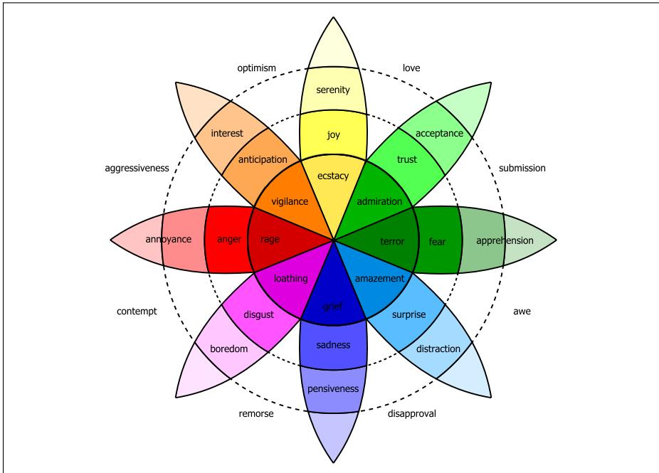

## 23.1 Defining Emotion

One of the most important affective classes is emotion, which Scherer (2000) defines as a “relatively brief episode of response to the evaluation of an external or internal event as being of major significance”.

Detecting emotion has the potential to improve a number of language processing tasks. Emotion recognition could help dialogue systems like tutoring systems detect that a student was unhappy, bored, hesitant, confident, and so on. Automatically detecting emotions in reviews or customer responses (anger, dissatisfaction, trust) could help businesses recognize specific problem areas or ones that are going well. Emotion can play a role in medical NLP tasks like helping diagnose depression or suicidal intent. Detecting emotions expressed toward characters in novels might play a role in understanding how different social groups were viewed by society at different times.

Computational models of emotion in NLP have mainly been based on two families of theories of emotion (out of the many studied in the field of affective science). In one of these families, emotions are viewed as fixed atomic units, limited in number, and from which others are generated, often called basic emotions (Tomkins

1962, Plutchik 1962), a model dating back to Darwin. Perhaps the most well-known of this family of theories are the 6 emotions proposed by Ekman (e.g., Ekman 1999) to be universally present in all cultures: surprise, happiness, anger, fear, disgust, sadness. Another atomic theory is the Plutchik (1980) wheel of emotion, consisting of 8 basic emotions in four opposing pairs: joy–sadness, anger–fear, trust–disgust, and anticipation–surprise, together with the emotions derived from them, shown in Fig. 23.2.

  
Figure 23.2 Plutchik wheel of emotion.

The second class of emotion theories widely used in NLP views emotion as a space in 2 or 3 dimensions (Russell, 1980). Most models include the two dimensions valence and arousal, and many add a third, dominance. These can be defined as:

valence: the pleasantness of the stimulus

arousal: the level of alertness, activeness, or energy provoked by the stimulus

dominance: the degree of control or dominance exerted by the stimulus or the emotion

Sentiment can be viewed as a special case of this second view of emotions as points in space. In particular, the valence dimension, measuring how pleasant or unpleasant a word is, is often used directly as a measure of sentiment.

In these lexicon-based models of affect, the affective meaning of a word is generally fixed, irrespective of the linguistic context in which a word is used, or the dialect or culture of the speaker. By contrast, other models in affective science represent emotions as much richer processes involving cognition (Barrett et al., 2007). In appraisal theory, for example, emotions are complex processes, in which a person considers how an event is congruent with their goals, taking into account variables like the agency, certainty, urgency, novelty and control associated with the event (Moors et al., 2013). Computational models in NLP taking into account these richer theories of emotion will likely play an important role in future work.
