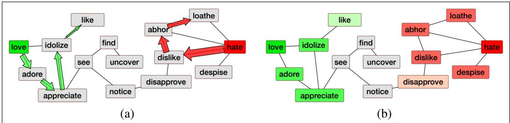

## 23.4 Semi-supervised Induction of Affect Lexicons

Another common way to learn sentiment lexicons is to start from a set of seed words that define two poles of a semantic axis (words like good or bad), and then find ways to label each word w by its similarity to the two seed sets. Here we summarize two families of seed-based semi-supervised lexicon induction algorithms, axis-based and graph-based.

## 23.4.1 Semantic Axis Methods

One of the most well-known lexicon induction methods, the Turney and Littman (2003) algorithm, is given seed words like good or bad, and then for each word w to be labeled, measures both how similar it is to good and how different it is from bad. Here we describe a slight extension of the algorithm due to An et al. (2018), which is based on computing a semantic axis.

In the first step, we choose seed words by hand. There are two methods for dealing with the fact that the affect of a word is different in different contexts: (1) start with a single large seed lexicon and rely on the induction algorithm to fine-tune it to the domain, or (2) choose different seed words for different genres. Hellrich et al. (2019) suggests that for modeling affect across different historical time periods, starting with a large modern affect dictionary is better than small seedsets tuned to be stable across time. As an example of the second approach, Hamilton et al. (2016a) define one set of seed words for general sentiment analysis, a different set for Twitter, and yet another set for sentiment in financial text:

<table><tr><td>Domain</td><td>Positive seeds</td><td>Negative seeds</td></tr><tr><td>General</td><td>good, lovely, excellent, fortunate, pleasant, delightful, perfect, loved, love, happy</td><td>bad, horrible, poor, unfortunate, unpleasant, disgusting, evil, hated, hate, unhappy</td></tr><tr><td>Twitter</td><td>love, loved, loves, awesome, nice, amazing, best, fantastic, correct, happy</td><td>hate, hated, hates, terrible, nasty, awful, worst, horrible, wrong, sad</td></tr><tr><td>Finance</td><td>successful, excellent, profit, beneficial, improving, improved, success, gains, positive</td><td>negligent, loss, volatile, wrong, losses, damages, bad, litigation, failure, down, negative</td></tr></table>

In the second step, we compute embeddings for each of the pole words. These embeddings can be off-the-shelf word2vec embeddings, or can be computed directly on a specific corpus (for example using a financial corpus if a finance lexicon is the goal), or we can fine-tune off-the-shelf embeddings to a corpus. Fine-tuning is especially important if we have a very specific genre of text but don’t have enough data to train good embeddings. In fine-tuning, we begin with off-the-shelf embeddings like word2vec, and continue training them on the small target corpus.

Once we have embeddings for each pole word, we create an embedding that represents each pole by taking the centroid of the embeddings of each of the seed words; recall that the centroid is the multidimensional version of the mean. Given a set of embeddings for the positive seed words $S ^ { + } = \{ E ( w _ { 1 } ^ { + } ) , E ( w _ { 2 } ^ { + } ) , . . . , E ( w _ { n } ^ { + } ) \}$ , and embeddings for the negative seed words $S ^ { - } = \{ E ( w _ { 1 } ^ { - } ) , E ( w _ { 2 } ^ { - } ) , . . . , E ( w _ { m } ^ { - } ) \}$ , the pole centroids are:

$$
\begin{array}{l} \mathbf {V} ^ {+} = \frac {1}{n} \sum_ {1} ^ {n} E (w _ {i} ^ {+}) \\ \mathbf {V} ^ {-} = \frac {1}{m} \sum_ {1} ^ {m} E (w _ {i} ^ {-}) \end{array}\tag{23.1}
$$

The semantic axis defined by the poles is computed just by subtracting the two vectors:

$$
\mathbf {V} _ {\text {axis}} = \mathbf {V} ^ {+} - \mathbf {V} ^ {-}\tag{23.2}
$$

$\pmb { \mathsf { v } } _ { a x i s }$ , the semantic axis, is a vector in the direction of positive sentiment. Finally, we compute (via cosine similarity) the angle between the vector in the direction of positive sentiment and the direction of w’s embedding. A higher cosine means that w is more aligned with $S ^ { + }$ than $S ^ { - }$

$$
\begin{array}{r c l} \text {score} (w) & = & \cos \left(E (w), \mathbf {V} _ {\text {axis}}\right) \\ & = & \frac {E (w) \cdot \mathbf {V} _ {\text {axis}}}{\| E (w) \| \| \mathbf {V} _ {\text {axis}} \|} \end{array}\tag{23.3}
$$

If a dictionary of words with sentiment scores is sufficient, we’re done! Or if we need to group words into a positive and a negative lexicon, we can use a threshold or other method to give us discrete lexicons.

## 23.4.2 Label Propagation

An alternative family of methods defines lexicons by propagating sentiment labels on graphs, an idea suggested in early work by Hatzivassiloglou and McKeown (1997). We’ll describe the simple SentProp (Sentiment Propagation) algorithm of Hamilton et al. (2016a), which has four steps:

1. Define a graph: Given word embeddings, build a weighted lexical graph by connecting each word with its k nearest neighbors (according to cosine similarity). The weights of the edge between words wi and $w _ { j }$ are set as:

$$
\mathbf {E} _ {i, j} = \arccos \left(- \frac {\mathbf {w _ {i}} ^ {\top} \mathbf {w _ {j}}}{\| \mathbf {w _ {i}} \| \| \mathbf {w _ {j}} \|}\right).\tag{23.4}
$$

2. Define a seed set: Choose positive and negative seed words.

3. Propagate polarities from the seed set: Now we perform a random walk on this graph, starting at the seed set. In a random walk, we start at a node and then choose a node to move to with probability proportional to the edge probability. A word’s polarity score for a seed set is proportional to the probability of a random walk from the seed set landing on that word (Fig. 23.7).

4. Create word scores: We walk from both positive and negative seed sets, resulting in positive (rawscore $^ + ( w _ { i } ) )$ and negative (rawscore $\mathbf { \nabla } \cdot ( w _ { i } ) )$ raw label scores. We then combine these values into a positive-polarity score as:

$$
\operatorname{score} ^ {+} \left(w _ {i}\right) = \frac {\operatorname{rawscore} ^ {+} \left(w _ {i}\right)}{\operatorname{rawscore} ^ {+} \left(w _ {i}\right) + \operatorname{rawscore} ^ {-} \left(w _ {i}\right)}\tag{23.5}
$$

It’s often helpful to standardize the scores to have zero mean and unit variance within a corpus.

5. Assign confidence to each score: Because sentiment scores are influenced by the seed set, we’d like to know how much the score of a word would change if a different seed set is used. We can use bootstrap sampling to get confidence regions, by computing the propagation B times over random subsets of the positive and negative seed sets (for example using $B = 5 0$ and choosing 7 of the 10 seed words each time). The standard deviation of the bootstrap sampled polarity scores gives a confidence measure.

  
Figure 23.7 Intuition of the SENTPROP algorithm. (a) Run random walks from the seed words. (b) Assign polarity scores (shown here as colors green or red) based on the frequency of random walk visits.

## 23.4.3 Other Methods

The core of semisupervised algorithms is the metric for measuring similarity with the seed words. The Turney and Littman (2003) and Hamilton et al. (2016a) approaches above used embedding cosine as the distance metric: words were labeled as positive basically if their embeddings had high cosines with positive seeds and low cosines with negative seeds. Other methods have chosen other kinds of distance metrics besides embedding cosine.

For example the Hatzivassiloglou and McKeown (1997) algorithm uses syntactic cues; two adjectives are considered similar if they were frequently conjoined by and and rarely conjoined by but. This is based on the intuition that adjectives conjoined by the words and tend to have the same polarity; positive adjectives are generally coordinated with positive, negative with negative:

fair and legitimate, corrupt and brutal

but less often positive adjectives coordinated with negative:

\*fair and brutal, \*corrupt and legitimate

By contrast, adjectives conjoined by but are likely to be of opposite polarity:

fair but brutal

Another cue to opposite polarity comes from morphological negation (un-, im-, -less). Adjectives with the same root but differing in a morphological negative (adequate/inadequate, thoughtful/thoughtless) tend to be of opposite polarity.

Yet another method for finding words that have a similar polarity to seed words is to make use of a thesaurus like WordNet (Kim and Hovy 2004, Hu and Liu 2004). A word’s synonyms presumably share its polarity while a word’s antonyms probably have the opposite polarity. After a seed lexicon is built, each lexicon is updated as follows, possibly iterated.

Lex+: Add synonyms of positive words (well) and antonyms (like fine) of negative words

Lex−: Add synonyms of negative words (awful) and antonyms (like evil) of positive words

An extension of this algorithm assigns polarity to WordNet senses, called Senti-WordNet (Baccianella et al., 2010). Fig. 23.8 shows some examples.

<table><tr><td colspan="2">Synset</td><td>Pos</td><td>Neg</td><td>Obj</td></tr><tr><td>good#6</td><td>‘agreeable or pleasing’</td><td>1</td><td>0</td><td>0</td></tr><tr><td>respectable#2</td><td>honorable#4 good#4 estimable#2 ‘deserving of esteem’</td><td>0.75</td><td>0</td><td>0.25</td></tr><tr><td>estimable#3</td><td>computable#1 ‘may be computed or estimated’</td><td>0</td><td>0</td><td>1</td></tr><tr><td>sting#1</td><td>burn#4 bite#2 ‘cause a sharp or stinging pain’</td><td>0</td><td>0.875</td><td>.125</td></tr><tr><td>acute#6</td><td>‘of critical importance and consequence’</td><td>0.625</td><td>0.125</td><td>.250</td></tr><tr><td>acute#4</td><td>‘of an angle; less than 90 degrees’</td><td>0</td><td>0</td><td>1</td></tr><tr><td>acute#1</td><td>‘having or experiencing a rapid onset and short but severe course’</td><td>0</td><td>0.5</td><td>0.5</td></tr></table>

Figure 23.8 Examples from SentiWordNet 3.0 (Baccianella et al., 2010). Note the differences between senses of homonymous words: estimable#3 is purely objective, while estimable#2 is positive; acute can be positive (acute#6), negative (acute#1), or neutral (acute #4).

In this algorithm, polarity is assigned to entire synsets rather than words. A positive lexicon is built from all the synsets associated with 7 positive words, and a negative lexicon from synsets associated with 7 negative words. A classifier is then trained from this data to take a WordNet gloss and decide if the sense being defined is positive, negative or neutral. A further step (involving a random-walk algorithm) assigns a score to each WordNet synset for its degree of positivity, negativity, and neutrality.

In summary, semisupervised algorithms use a human-defined set of seed words for the two poles of a dimension, and use similarity metrics like embedding cosine, coordination, morphology, or thesaurus structure to score words by how similar they are to the positive seeds and how dissimilar to the negative seeds.
