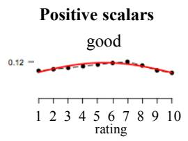
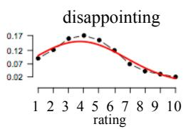
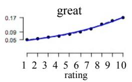
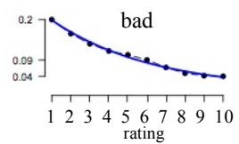
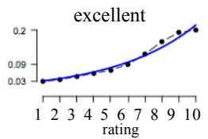
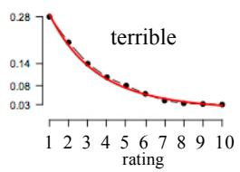
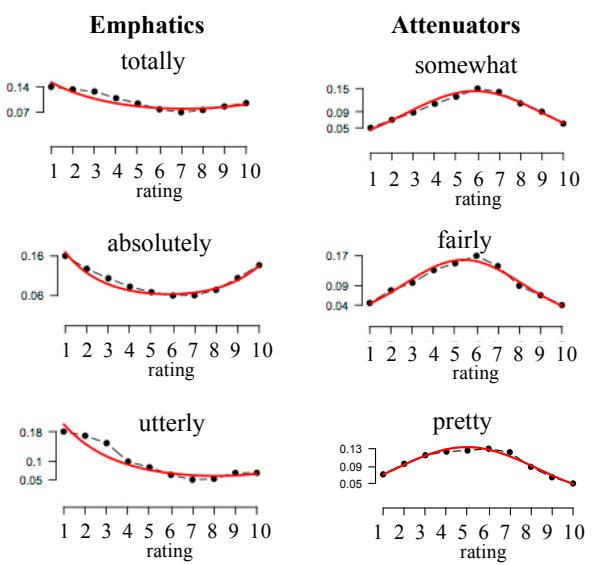

## 23.5 Supervised Learning of Word Sentiment

Semi-supervised methods require only minimal human supervision (in the form of seed sets). But sometimes a supervision signal exists in the world and can be made use of. One such signal is the scores associated with online reviews.

The web contains an enormous number of online reviews for restaurants, movies, books, or other products, each of which have the text of the review along with an associated review score: a value that may range from 1 star to 5 stars, or scoring 1 to 10. Fig. 23.9 shows samples extracted from restaurant, book, and movie reviews.

<table><tr><td colspan="2">Movie review excerpts (IMDb)</td></tr><tr><td>10</td><td>A great movie. This film is just a wonderful experience. It’s surreal, zany, witty and slapstick all at the same time. And terrific performances too.</td></tr><tr><td>1</td><td>This was probably the worst movie I have ever seen. The story went nowhere even though they could have done some interesting stuff with it.</td></tr><tr><td colspan="2">Restaurant review excerpts (Yelp)</td></tr><tr><td>5</td><td>The service was impeccable. The food was cooked and seasoned perfectly... The watermelon was perfectly square ... The grilled octopus was ... mouthwatering...</td></tr><tr><td>2</td><td>...it took a while to get our waters, we got our entree before our starter, and we never received silverware or napkins until we requested them...</td></tr><tr><td colspan="2">Book review excerpts (GoodReads)</td></tr><tr><td>1</td><td>I am going to try and stop being deceived by eye-catching titles. I so wanted to like this book and was so disappointed by it.</td></tr><tr><td>5</td><td>This book is hilarious. I would recommend it to anyone looking for a satirical read with a romantic twist and a narrator that keeps butting in</td></tr><tr><td colspan="2">Product review excerpts (Amazon)</td></tr><tr><td>5</td><td>The lid on this blender though is probably what I like the best about it... enables you to pour into something without even taking the lid off! ... the perfect pitcher! ... works fantastic.</td></tr><tr><td>1</td><td>I hate this blender... It is nearly impossible to get frozen fruit and ice to turn into a smoothie... You have to add a TON of liquid. I also wish it had a spout ...</td></tr></table>

Figure 23.9 Excerpts from some reviews from various review websites, all on a scale of 1 to 5 stars except IMDb, which is on a scale of 1 to 10 stars.

We can use this review score as supervision: positive words are more likely to appear in 5-star reviews; negative words in 1-star reviews. And instead of just a binary polarity, this kind of supervision allows us to assign a word a more complex representation of its polarity: its distribution over stars (or other scores).

Thus in a ten-star system we could represent the sentiment of each word as a 10-tuple, each number a score representing the word’s association with that polarity level. This association can be a raw count, or a likelihood $P ( w | c )$ , or some other function of the count, for each class c from 1 to 10.

For example, we could compute the IMDb likelihood of a word like disappoint(ed/ing) occurring in a 1 star review by dividing the number of times disappoint(ed/ing) occurs in 1-star reviews in the IMDb dataset (8,557) by the total number of words occurring in 1-star reviews (25,395,214), so the IMDb estimate of P(disappointing 1) is .0003.

A slight modification of this weighting, the normalized likelihood, can be used as an illuminating visualization (Potts, 2011)1

$$
\begin{array}{c} P (w | c) = \frac {\operatorname{count} (w , c)}{\sum_ {w \in C} \operatorname{count} (w , c)} \\ P o t t s S c o r e (w) = \frac {P (w | c)}{\sum_ {c} P (w | c)} \end{array}\tag{23.6}
$$

Dividing the IMDb estimate P(disappointing 1) of .0003 by the sum of the likelihood $P ( w | c )$ over all categories gives a Potts score of 0.10. The word disappointing thus is associated with the vector [.10, .12, .14, .14, .13, .11, .08, .06, .06, .05]. The

Potts diagram (Potts, 2011) is a visualization of these word scores, representing the prior sentiment of a word as a distribution over the rating categories.

Fig. 23.10 shows the Potts diagrams for 3 positive and 3 negative scalar adjectives. Note that the curve for strongly positive scalars have the shape of the letter J, while strongly negative scalars look like a reverse J. By contrast, weakly positive and negative scalars have a hump-shape, with the maximum either below the mean (weakly negative words like disappointing) or above the mean (weakly positive words like good). These shapes offer an illuminating typology of affective meaning.

  
Figure 23.10 Potts diagrams (Potts, 2011) for positive and negative scalar adjectives, showing the J-shape and reverse J-shape for strongly positive and negative adjectives, and the hump-shape for more weakly polarized adjectives.

Fig. 23.11 shows the Potts diagrams for emphasizing and attenuating adverbs. Note that emphatics tend to have a J-shape (most likely to occur in the most positive reviews) or a U-shape (most likely to occur in the strongly positive and negative). Attenuators all have the hump-shape, emphasizing the middle of the scale and downplaying both extremes. The diagrams can be used both as a typology of lexical sentiment, and also play a role in modeling sentiment compositionality.

In addition to functions like posterior $P ( c | w )$ , likelihood $P ( w | c )$ , or normalized likelihood (Eq. 23.6) many other functions of the count of a word occurring with a sentiment label have been used. We’ll introduce some of these on page 534, including ideas like normalizing the counts per writer in Eq. 23.14.

## 23.5.1 Log Odds Ratio Informative Dirichlet Prior

One thing we often want to do with word polarity is to distinguish between words that are more likely to be used in one category of texts than in another. We may, for example, want to know the words most associated with 1 star reviews versus those associated with 5 star reviews. These differences may not be just related to sentiment. We might want to find words used more often by Democratic than Republican members of Congress, or words used more often in menus of expensive restaurants

  
Figure 23.11 Potts diagrams (Potts, 2011) for emphatic and attenuating adverbs.

than cheap restaurants.

Given two classes of documents, to find words more associated with one category than another, we could measure the difference in frequencies (is a word w more frequent in class A or class B?). Or instead of the difference in frequencies we could compute the ratio of frequencies, or compute the log odds ratio (the log of the ratio between the odds of the two words). We could then sort words by whichever association measure we pick, ranging from words overrepresented in category A to words overrepresented in category B.

The problem with simple log-likelihood or log odds methods is that they overemphasize differences in very rare words, and often also in very frequent words. Very rare words will seem to occur very differently in the two corpora since with tiny counts there may be statistical fluctuations, or even zero occurrences in one corpus compared to non-zero occurrences in the other. Very frequent words will also seem different since all counts are large.

In this section we walk through the details of one solution to this problem: the “log odds ratio informative Dirichlet prior” method of Monroe et al. (2008) that is a particularly useful method for finding words that are statistically overrepresented in one particular category of texts compared to another. It’s based on the idea of using another large corpus to get a prior estimate of what we expect the frequency of each word to be.

Let’s start with the goal: assume we want to know whether the word horrible occurs more in corpus i or corpus j. We could compute the log likelihood ratio, using $f ^ { i } ( w )$ to mean the frequency of word w in corpus i, and $n ^ { i }$ to mean the total number of words in corpus i:

$$
\begin{array}{r l} \operatorname{llr} (h o r r i b l e) & = \log \frac {P ^ {i} (h o r r i b l e)}{P ^ {j} (h o r r i b l e)} \\ & = \log P ^ {i} (h o r r i b l e) - \log P ^ {j} (h o r r i b l e) \\ & = \log \frac {\mathrm{f} ^ {i} (h o r r i b l e)}{n ^ {i}} - \log \frac {\mathrm{f} ^ {j} (h o r r i b l e)}{n ^ {j}} \end{array}\tag{23.7}
$$

Instead, let’s compute the log odds ratio: does horrible have higher odds in i or in

j:

$$
\begin{array}{l} \text {lor(horrible)} = \log \left(\frac {P ^ {i} (h o r r i b l e)}{1 - P ^ {i} (h o r r i b l e)}\right) - \log \left(\frac {P ^ {j} (h o r r i b l e)}{1 - P ^ {j} (h o r r i b l e)}\right) \\ = \log \left(\frac {\frac {\text {f} ^ {i} (h o r r i b l e)}{n ^ {i}}}{1 - \frac {\text {f} ^ {i} (h o r r i b l e)}{n ^ {i}}}\right) - \log \left(\frac {\frac {\text {f} ^ {j} (h o r r i b l e)}{n ^ {j}}}{1 - \frac {\text {f} ^ {j} (h o r r i b l e)}{n ^ {j}}}\right) \\ = \log \left(\frac {\text {f} ^ {i} (h o r r i b l e)}{n ^ {i} - \text {f} ^ {i} (h o r r i b l e)}\right) - \log \left(\frac {\text {f} ^ {j} (h o r r i b l e)}{n ^ {j} - \text {f} ^ {j} (h o r r i b l e)}\right) \end{array}\tag{23.8}
$$

The Dirichlet intuition is to use a large background corpus to get a prior estimate of what we expect the frequency of each word w to be. We’ll do this very simply by adding the counts from that corpus to the numerator and denominator, so that we’re essentially shrinking the counts toward that prior. It’s like asking how large are the differences between i and j given what we would expect given their frequencies in a well-estimated large background corpus.

The method estimates the difference between the frequency of word w in two corpora i and $j$ via the prior-modified log odds ratio for w, $\delta _ { w } ^ { ( i - j ) }$ , which is estimated as:

$$
\delta_ {w} ^ {(i - j)} = \log \left(\frac {f _ {w} ^ {i} + \alpha_ {w}}{n ^ {i} + \alpha_ {0} - (f _ {w} ^ {i} + \alpha_ {w})}\right) - \log \left(\frac {f _ {w} ^ {j} + \alpha_ {w}}{n ^ {j} + \alpha_ {0} - (f _ {w} ^ {j} + \alpha_ {w})}\right)\tag{23.9}
$$

(where $n ^ { i }$ is the size of corpus $i , n ^ { j }$ is the size of corpus $j , f _ { w } ^ { i }$ is the count of word w in corpus $i , f _ { w } ^ { j }$ is the count of word w in corpus $j ,$ α0 is the scaled size of the background corpus, and $\alpha _ { w }$ is the scaled count of word w in the background corpus.)

In addition, Monroe et al. (2008) make use of an estimate for the variance of the log–odds–ratio:

$$
\sigma^ {2} \left(\hat {\delta} _ {w} ^ {(i - j)}\right) \approx \frac {1}{f _ {w} ^ {i} + \alpha_ {w}} + \frac {1}{f _ {w} ^ {j} + \alpha_ {w}}\tag{23.10}
$$

The final statistic for a word is then the z–score of its log–odds–ratio:

$$
\frac {\hat {\boldsymbol {\delta}} _ {w} ^ {(i - j)}}{\sqrt {\sigma^ {2} \left(\hat {\boldsymbol {\delta}} _ {w} ^ {(i - j)}\right)}}\tag{23.11}
$$

The Monroe et al. (2008) method thus modifies the commonly used log odds ratio in two ways: it uses the z-scores of the log odds ratio, which controls for the amount of variance in a word’s frequency, and it uses counts from a background corpus to provide a prior count for words.

Fig. 23.12 shows the method applied to a dataset of restaurant reviews from Yelp, comparing the words used in 1-star reviews to the words used in 5-star reviews (Jurafsky et al., 2014). The largest difference is in obvious sentiment words, with the 1-star reviews using negative sentiment words like worse, bad, awful and the 5-star reviews using positive sentiment words like great, best, amazing. But there are other illuminating differences. 1-star reviews use logical negation (no, not), while 5-star reviews use emphatics and emphasize universality (very, highly, every, always). 1- star reviews use first person plurals (we, us, our) while 5 star reviews use the second person. 1-star reviews talk about people (manager, waiter, customer) while 5-star reviews talk about dessert and properties of expensive restaurants like courses and atmosphere. See Jurafsky et al. (2014) for more details.

<table><tr><td>Class</td><td>Words in 1-star reviews</td><td>Class</td><td>Words in 5-star reviews</td></tr><tr><td>Negative</td><td>worst, rude, terrible, horrible, bad, awful, disgusting, bland, tasteless, gross, mediocre, overpriced, worse, poor</td><td>Positive</td><td>great, best, love(d), delicious, amazing, favorite, perfect, excellent, awesome, friendly, fantastic, fresh, wonderful, incredible, sweet, yum(my)</td></tr><tr><td>Negation</td><td>no, not</td><td>Emphatics/ universals</td><td>very, highly, perfectly, definitely, absolutely, everything, every, always</td></tr><tr><td>1Pl pro</td><td>we, us, our</td><td>2 pro</td><td>you</td></tr><tr><td>3 pro</td><td>she, he, her, him</td><td>Articles</td><td>a, the</td></tr><tr><td>Past verb</td><td>was, were, asked, told, said, did, charged, waited, left, took</td><td>Advice</td><td>try, recommend</td></tr><tr><td>Sequencers</td><td>after, then</td><td>Conjunct</td><td>also, as, well, with, and</td></tr><tr><td>Nouns</td><td>manager, waitress, waiter, customer, customers, attitude, waste, poisoning, money, bill, minutes</td><td>Nouns</td><td>atmosphere, dessert, chocolate, wine, course, menu</td></tr><tr><td>Irrealis modals</td><td>would, should</td><td>Auxiliaries</td><td>is/’s, can, ’ve, are</td></tr><tr><td>Comp</td><td>to, that</td><td>Prep, other</td><td>in, of, die, city, mouth</td></tr></table>

Figure 23.12 The top 50 words associated with one–star and five-star restaurant reviews in a Yelp dataset of 900,000 reviews, using the Monroe et al. (2008) method (Jurafsky et al., 2014).
