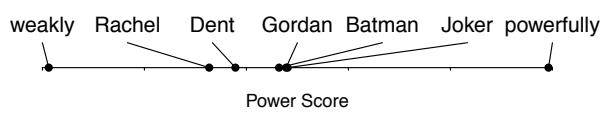
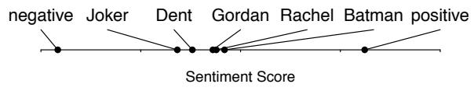
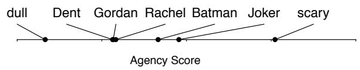
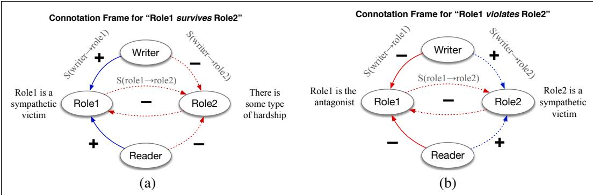
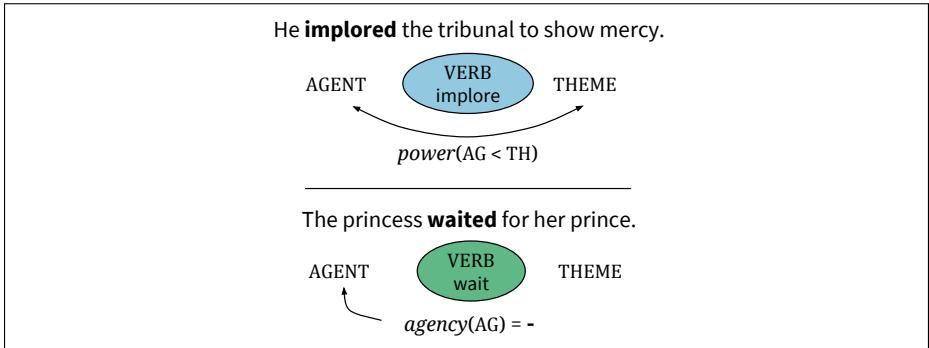

## 23.9 Connotation Frames

The lexicons we’ve described so far define a word as a point in affective space. A connotation frame, by contrast, is a lexicon that incorporates a richer kind of grammatical structure, by combining affective lexicons with the frame semantic lexicons of Chapter 22. The basic insight of connotation frame lexicons is that a predicate like a verb expresses connotations about the verb’s arguments (Rashkin et al. 2016, Rashkin et al. 2017).

Consider sentences like:

(23.15) Country A violated the sovereignty of Country B

  
Figure 2:Figure 23.13 Power (dominance), sentiment (valence) and agency (arousal) for characters acters inin the movie The Dark Knight computed from embeddings trained on the NRC VAD Lexicon. acters in The Dark Night as learned through the regres-Note the protagonist (Batman) and the antagonist (the Joker) have high power and agency sion model with ELMo embeddings. Scores generallyscores but differ in sentiment, while the love interest Rachel has low power and agency but high sentiment.

## (23.16) the teenager ... survived the Boston Marathon bombing”

vey DeBy using the verb violate in (23.15), the author is expressing their sympathies with RachelCountry B, portraying Country B as a victim, and expressing antagonism toward the agent Country A. By contrast, in using the verb survive, the author of (23.16) is expressing that the bombing is a negative experience, and the subject of the sentence, erful, we can speculate that the corpora used tothe teenager, is a sympathetic character. These aspects of connotation are inherent train ELMo and BERT portray them as powerful.in the meaning of the verbs violate and survive, as shown in Fig. 23.14.

  
Figure 23.14 Connotation frames for survive and violate. (a) For survive, the writer and reader have positive in one setting. Nevertheless, they do not outper- sentiment toward Role1, the subject, and negative sentiment toward Role2, the direct object. (b) For violate, the form Field et al. (2019), likely becauswriter and reader have positive sentiment instead toward Role2, the direct object.

est ageThe connotation frame lexicons of Rashkin et al. (2016) and Rashkin et al. (2017) also express other connotative aspects of the predicate toward each argument, including the effect (something bad happened to x) value: (x is valuable), and mental state: (x is distressed by the event). Connotation frames can also mark the Finally, we qualitatively analyze how well our power differential between the arguments (using the verb implore means that the method captures affect dimensions by analyzing theme argument has greater power than the agent), and the agency of each argument low-(waited is low agency). Fig. 23.15 shows a visualization from Sap et al. (2017).

driver. IConnotation frames can be built by hand (Sap et al., 2017), or they can be learned betweenby supervised learning (Rashkin et al., 2016), for example using hand-labeled train-a position of less power than the theme (“the tri- Figure 3: Samping data to supervise classifiers for each of the individual relations, e.g., whether bunal”). In contrast, “He demanded the tribunal with high annotS(writer  Role1) is + or -, and then improving accuracy via global constraints across all relations.

  
Figure 23.15 The connotation frames of Sap et al. (2017), showing that the verb implore Figure 2: The formal notation of the connotationimplies the agent has lower power than the theme (in contrast, say, with a verb like demanded), frames of power and agency. The first exampleand showing the low level of agency of the subject of waited. Figure from Sap et al. (2017).
