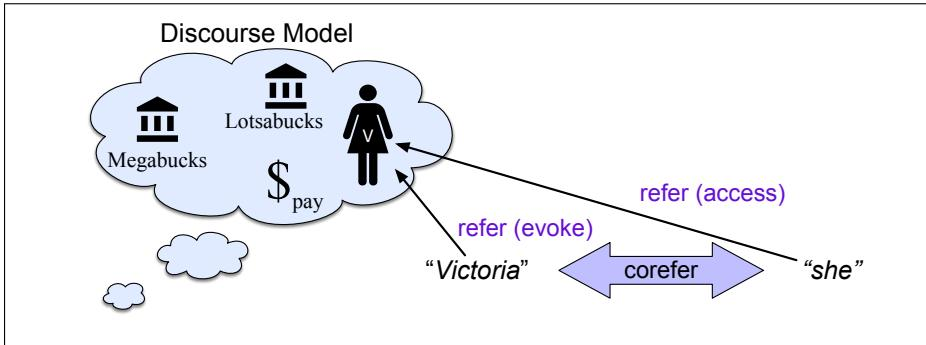

CHAPTER

24

# Coreference Resolution and Entity Linking

and even Stigand, the patriotic archbishop ofCanterbury,found it advisable–”’ ‘Found WHAT?’ said the Duck.

‘Found IT,’ the Mouse replied rather crossly: ‘ofcourse you know what “it”means.’ ‘I know what “it”means well enough, when I find a thing,’ said the Duck: ‘it’s generally afrog or a worm. The question is, what did the archbishopfind?’

Lewis Carroll, Alice in Wonderland

An important component of language processing is knowing who is being talked about in a text. Consider the following passage:

(24.1) Victoria Chen, CFO of Megabucks Banking, saw her pay jump to \$2.3 million, as the 38-year-old became the company’s president. It is widely known that she came to Megabucks from rival Lotsabucks.

Each of the underlined phrases in this passage is used by the writer to refer to a person named Victoria Chen. We call linguistic expressions like her or Victoria Chen mentions or referring expressions, and the discourse entity that is referred to (Victoria Chen) the referent. (To distinguish between referring expressions and their referents, we italicize the former.)1 Two or more referring expressions that are used to refer to the same discourse entity are said to corefer; thus, Victoria Chen and she corefer in (24.1).

Coreference is an important component of natural language processing. A dialogue system that has just told the user “There is a 2pmflight on United and a 4pm one on Cathay Pacific” must know which flight the user means by “I’ll take the second one”. A question answering system that uses Wikipedia to answer a question about Marie Curie must know who she was in the sentence “She was born in Warsaw”. And a machine translation system translating from a language like Spanish, in which pronouns can be dropped, must use coreference from the previous sentence to decide whether the Spanish sentence ‘“Me encanta el conocimiento”, dice.’ should be translated as ‘“I love knowledge”, he says’, or ‘“I love knowledge”, she says’. Indeed, this example comes from an actual news article in El Pa´ıs about a female professor and was mistranslated as “he” in machine translation because of inaccurate coreference resolution (Schiebinger, 2013).

Natural language processing systems (and humans) interpret linguistic expressions with respect to a discourse model (Karttunen, 1969). A discourse model (Fig. 24.1) is a mental model that the understander builds incrementally when interpreting a text, containing representations of the entities referred to in the text, as well as properties of the entities and relations among them. When a referent is first mentioned in a discourse, we say that a representation for it is evoked into the model. Upon subsequent mention, this representation is accessed from the model.

  
Figure 24.1 How mentions evoke and access discourse entities in a discourse model.

Reference in a text to an entity that has been previously introduced into the discourse is called anaphora, and the referring expression used is said to be an anaphor, or anaphoric.2 In passage (24.1), the pronouns she and her and the definite NP the 38-year-old are therefore anaphoric. The anaphor corefers with a prior mention (in this case Victoria Chen) that is called the antecedent. Not every referring expression is an antecedent. An entity that has only a single mention in a text (like Lotsabucks in (24.1)) is called a singleton.

In this chapter we focus on the task of coreference resolution. Coreference resolution is the task of determining whether two mentions corefer, by which we mean they refer to the same entity in the discourse model (the same discourse entity). The set of coreferring expressions is often called a coreference chain or a cluster. For example, in processing (24.1), a coreference resolution algorithm would need to find at least four coreference chains, corresponding to the four entities in the discourse model in Fig. 24.1.

1. Victoria Chen, her, the 38-year-old, She

2. Megabucks Banking, the company, Megabucks

3. {her pay}

4. Lotsabucks

Note that mentions can be nested; for example the mention her is syntactically part of another mention, her pay, referring to a completely different discourse entity.

Coreference resolution thus comprises two tasks (although they are often performed jointly): (1) identifying the mentions, and (2) clustering them into coreference chains/discourse entities.

We said that two mentions corefered if they are associated with the same discourse entity. But often we’d like to go further, deciding which real world entity is associated with this discourse entity. For example, the mention Washington might refer to the US state, or the capital city, or the person George Washington; the interpretation of the sentence will of course be very different for each of these. The task of entity linking (Ji and Grishman, 2011) or entity resolution is the task of mapping a discourse entity to some real-world individual.3 We usually operationalize entity linking or resolution by mapping to an ontology: a list of entities in the world, like a gazeteer (Appendix H). Perhaps the most common ontology used for this task is Wikipedia; each Wikipedia page acts as the unique id for a particular entity. Thus the entity linking task of wikification (Mihalcea and Csomai, 2007) is the task of deciding which Wikipedia page corresponding to an individual is being referred to by a mention. But entity linking can be done with any ontology; for example if we have an ontology of genes, we can link mentions of genes in text to the disambiguated gene name in the ontology.

In the next sections we introduce the task of coreference resolution in more detail, and survey a variety of architectures for resolution. We also introduce two architectures for the task of entity linking.

Before turning to algorithms, however, we mention some important tasks we will only touch on briefly at the end of this chapter. First are the famous Winograd Schema problems (so-called because they were first pointed out by Terry Winograd in his dissertation). These entity coreference resolution problems are designed to be too difficult to be solved by the resolution methods we describe in this chapter, and the kind of real-world knowledge they require has made them a kind of challenge task for natural language processing. For example, consider the task of determining the correct antecedent of the pronoun they in the following example:

(24.2) The city council denied the demonstrators a permit because

a. they feared violence.

b. they advocated violence.

Determining the correct antecedent for the pronoun they requires understanding that the second clause is intended as an explanation of the first clause, and also that city councils are perhaps more likely than demonstrators to fear violence and that demonstrators might be more likely to advocate violence. Solving Winograd Schema problems requires finding way to represent or discover the necessary real world knowledge.

A problem we won’t discuss in this chapter is the related task of event coreference, deciding whether two event mentions (such as the buy and the acquisition in these two sentences from the ECB+ corpus) refer to the same event:

(24.3) AMD agreed to [buy] Markham, Ontario-based ATI for around \$5.4 billion in cash and stock, the companies announced Monday.

(24.4) The [acquisition] would turn AMD into one of the world’s largest providers of graphics chips.

Event mentions are much harder to detect than entity mentions, since they can be verbal as well as nominal. Once detected, the same mention-pair and mention-ranking models used for entities are often applied to events.

An even more complex kind of coreference is discourse deixis (Webber, 1988), in which an anaphor refers back to a discourse segment, which can be quite hard to delimit or categorize, like the examples in (24.5) adapted from Webber (1991):

(24.5) According to Soleil, Beau just opened a restaurant

a. But that turned out to be a lie.

b. But that was false.

c. That struck me as a funny way to describe the situation.

The referent of that is a speech act (see Chapter 26) in (24.5a), a proposition in (24.5b), and a manner of description in (24.5c). We don’t give algorithms in this chapter for these difficult types of non-nominal antecedents, but see Kolhatkar et al. (2018) for a survey.
