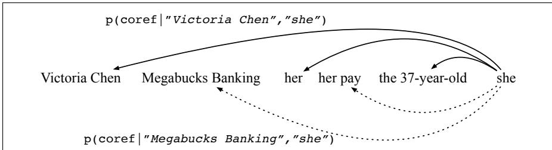
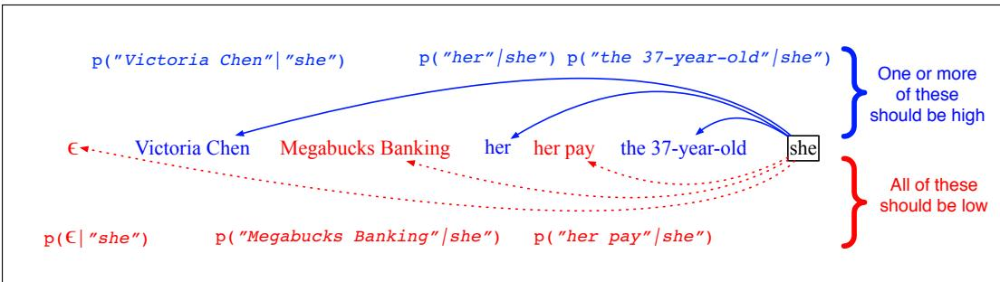

## 24.4 Architectures for Coreference Algorithms

Modern systems for coreference are based on supervised neural machine learning, supervised from hand-labeled datasets like OntoNotes. In this section we overview the various architecture of modern systems, using the categorization of Ng (2010), which distinguishes algorithms based on whether they make each coreference decision in a way that is entity-based—representing each entity in the discourse model— or only mention-based—considering each mention independently, and whether they use ranking models to directly compare potential antecedents. Afterwards, we go into more detail on one state-of-the-art algorithm in Section 24.6.

## 24.4.1 The Mention-Pair Architecture

We begin with the mention-pair architecture, the simplest and most influential coreference architecture, which introduces many of the features of more complex algorithms, even though other architectures perform better. The mention-pair architecture is based around a classifier that— as its name suggests—is given a pair of mentions, a candidate anaphor and a candidate antecedent, and makes a binary classification decision: coreferring or not.

Let’s consider the task of this classifier for the pronoun she in our example, and assume the slightly simplified set of potential antecedents in Fig. 24.2.

  
Figure 24.2 For each pair of a mention (like she), and a potential antecedent mention (like Victoria Chen or her), the mention-pair classifier assigns a probability of a coreference link.

For each prior mention (Victoria Chen, Megabucks Banking, her, etc.), the binary classifier computes a probability: whether or not the mention is the antecedent of she. We want this probability to be high for actual antecedents (Victoria Chen, her, the 38-year-old) and low for non-antecedents (Megabucks Banking, her pay).

Early classifiers used hand-built features (Section 24.5); more recent classifiers use neural representation learning (Section 24.6)

For training, we need a heuristic for selecting training samples; since most pairs of mentions in a document are not coreferent, selecting every pair would lead to a massive overabundance of negative samples. The most common heuristic, from (Soon et al., 2001), is to choose the closest antecedent as a positive example, and all pairs in between as the negative examples. More formally, for each anaphor mention mi we create

• one positive instance $( m _ { i } , m _ { j } )$ where $m _ { j }$ is the closest antecedent to $m _ { i }$ , and

• a negative instance $( m _ { i } , m _ { k } )$ for each $m _ { k }$ between $m _ { j }$ and mi

Thus for the anaphor she, we would choose (she, her) as the positive example and no negative examples. Similarly, for the anaphor the company we would choose (the company, Megabucks) as the positive example and (the company, she) (the company, the 38-year-old) (the company, her pay) and (the company, her) as negative examples.

Once the classifier is trained, it is applied to each test sentence in a clustering step. For each mention i in a document, the classifier considers each of the prior i 1 mentions. In closest-first clustering (Soon et al., 2001), the classifier is run right to left (from mention i 1 down to mention 1) and the first antecedent with probability $> . 5$ is linked to i. If no antecedent has probably $> 0 . 5$ , no antecedent is selected for i. In best-first clustering, the classifier is run on all i 1 antecedents and the most probable preceding mention is chosen as the antecedent for i. The transitive closure of the pairwise relation is taken as the cluster.

While the mention-pair model has the advantage of simplicity, it has two main problems. First, the classifier doesn’t directly compare candidate antecedents to each other, so it’s not trained to decide, between two likely antecedents, which one is in fact better. Second, it ignores the discourse model, looking only at mentions, not entities. Each classifier decision is made completely locally to the pair, without being able to take into account other mentions of the same entity. The next two models each address one of these two flaws.

## 24.4.2 The Mention-Rank Architecture

The mention ranking model directly compares candidate antecedents to each other, choosing the highest-scoring antecedent for each anaphor.

In early formulations, for mention i, the classifier decides which of the $\{ 1 , . . . , i -$ 1 prior mentions is the antecedent (Denis and Baldridge, 2008). But suppose i is in fact not anaphoric, and none of the antecedents should be chosen? Such a model would need to run a separate anaphoricity classifier on i. Instead, it turns out to be better to jointly learn anaphoricity detection and coreference together with a single loss (Rahman and Ng, 2009).

So in modern mention-ranking systems, for the ith mention (anaphor), we have an associated random variable $y _ { i }$ ranging over the values $Y ( i ) = \{ 1 , . . . , i - 1 , \epsilon \}$ . The value ϵ is a special dummy mention meaning that i does not have an antecedent (i.e., is either discourse-new and starts a new coref chain, or is non-anaphoric).

  
Figure 24.3 For each candidate anaphoric mention (like she), the mention-ranking system assigns a probability distribution over all previous mentions plus the special dummy mention ϵ.

At test time, for a given mention i the model computes one softmax over all the antecedents (plus ϵ) giving a probability for each candidate antecedent (or none).

Fig. 24.3 shows an example of the computation for the single candidate anaphor she.

Once the antecedent is classified for each anaphor, transitive closure can be run over the pairwise decisions to get a complete clustering.

Training is trickier in the mention-ranking model than the mention-pair model, because for each anaphor we don’t know which of all the possible gold antecedents to use for training. Instead, the best antecedent for each mention is latent; that is, for each mention we have a whole cluster of legal gold antecedents to choose from. Early work used heuristics to choose an antecedent, for example choosing the closest antecedent as the gold antecedent and all non-antecedents in a window of two sentences as the negative examples (Denis and Baldridge, 2008). Various kinds of ways to model latent antecedents exist (Fernandes et al. 2012, Chang et al. 2013, Durrett and Klein 2013). The simplest way is to give credit to any legal antecedent by summing over all of them, with a loss function that optimizes the likelihood of all correct antecedents from the gold clustering (Lee et al., 2017b). We’ll see the details in Section 24.6.

Mention-ranking models can be implemented with hand-build features or with neural representation learning (which might also incorporate some hand-built features). we’ll explore both directions in Section 24.5 and Section 24.6.

## 24.4.3 Entity-based Models

Both the mention-pair and mention-ranking models make their decisions about mentions. By contrast, entity-based models link each mention not to a previous mention but to a previous discourse entity (cluster of mentions).

A mention-ranking model can be turned into an entity-ranking model simply by having the classifier make its decisions over clusters of mentions rather than individual mentions (Rahman and Ng, 2009).

For traditional feature-based models, this can be done by extracting features over clusters. The size of a cluster is a useful feature, as is its ‘shape’, which is the list of types of the mentions in the cluster i.e., sequences of the tokens (P)roper, (D)efinite, (I)ndefinite, (Pr)onoun, so that a cluster composed of Victoria, her, the 38-year-old would have the shape P-Pr-D (Bjorkelund and Kuhn¨ , 2014). An entitybased model that includes a mention-pair classifier can use as features aggregates of mention-pair probabilities, for example computing the average probability of coreference over all mention-pairs in the two clusters (Clark and Manning 2015).

Neural models can learn representations of clusters automatically, for example by using an RNN over the sequence of cluster mentions to encode a state corresponding to a cluster representation (Wiseman et al., 2016), or by learning distributed representations for pairs of clusters by pooling over learned representations of mention pairs (Clark and Manning, 2016b).

However, although entity-based models are more expressive, the use of clusterlevel information in practice has not led to large gains in performance, so mentionranking models are still more commonly used.
