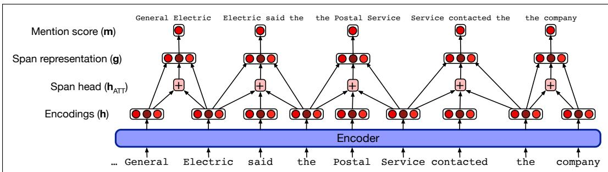
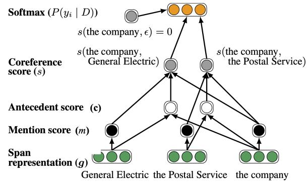

## 24.6 A neural mention-ranking algorithm

In this section we describe the neural e2e-coref algorithms of Lee et al. (2017b) (simplified and extended a bit, drawing on Joshi et al. (2019) and others). This is a mention-ranking algorithm that considers all possible spans of text in the document, assigns a mention-score to each span, prunes the mentions based on this score, then assigns coreference links to the remaining mentions.

More formally, given a document D with T words, the model considers all of the $\frac { T ( T + 1 ) } { 2 }$ text spans in $D$ (unigrams, bigrams, trigrams, 4-grams, etc; in practice we only consider spans up a maximum length around 10). The task is to assign to each span i an antecedent $y _ { i } ,$ a random variable ranging over the values $Y ( i ) =$ $\{ 1 , . . . , i - 1 , \epsilon \}$ ; each previous span and a special dummy token ϵ. Choosing the dummy token means that i does not have an antecedent, either because i is discoursenew and starts a new coreference chain, or because i is non-anaphoric.

For each pair of spans i and $j ,$ the system assigns a score $s ( i , j )$ for the coreference link between span i and span j. The system then learns a distribution $P ( y _ { i } )$ over the antecedents for span i:

$$
P (y _ {i}) = \frac {\exp (s (i , y _ {i}))}{\sum_ {y ^ {\prime} \in Y (i)} \exp (s (i , y ^ {\prime}))}\tag{24.48}
$$

This score $s ( i , j )$ includes three factors that we’ll define below: $m ( i )$ ; whether span i is a mention; $m ( j )$ ; whether span $j$ is a mention; and $c ( i , j ) ;$ ; whether $j$ is the antecedent of i:

$$
s (i, j) = m (i) + m (j) + c (i, j)\tag{24.49}
$$

For the dummy antecedent ϵ, the score $s ( i , \epsilon )$ is fixed to 0. This way if any nondummy scores are positive, the model predicts the highest-scoring antecedent, but if all the scores are negative it abstains.

## 24.6.1 Computing span representations

To compute the two functions $m ( i )$ and $c ( i , j )$ which score a span i or a pair of spans $( i , j )$ , we’ll need a way to represent a span. The e2e-coref family of algorithms represents each span by trying to capture 3 words/tokens: the first word, the last word, and the most important word. We first run each paragraph or subdocument through an encoder (like BERT) to generate embeddings $h _ { i }$ for each token i. The span i is then represented by a vector ${ \bf g } _ { i }$ that is a concatenation of the encoder output embedding for the first (start) token of the span, the encoder output for the last (end) token of the span, and a third vector which is an attention-based representation:

$$
\mathbf {g} _ {i} = \left[ \mathbf {h} _ {\text { START } (i)}, \mathbf {h} _ {\text { END } (i)}, \mathbf {h} _ {\text { ATT } (i)} \right]\tag{24.50}
$$

The goal of the attention vector is to represent which word/token is the likely syntactic head-word of the span; we saw in the prior section that head-words are a useful feature; a matching head-word is a good indicator of coreference. The attention representation is computed as usual; the system learns a weight vector ${ \pmb w } _ { \alpha }$ and computes its dot product with the hidden state h<sub>t</sub> transformed by a FFN:

$$
\boldsymbol {\alpha} _ {t} = \mathbf {w} _ {\alpha} \cdot \mathrm{FFN} _ {\alpha} (\mathbf {h} _ {t})\tag{24.51}
$$

The attention score is normalized into a distribution via a softmax:

$$
a _ {i, t} = \frac {\exp (\alpha_ {t})}{\sum_ {k = \mathrm{START} (i)} ^ {\mathrm{END} (i)} \exp (\alpha_ {k})}\tag{24.52}
$$

And then the attention distribution is used to create a vector $\mathbf { h } _ { \mathrm { A T T } ( i ) }$ which is an attention-weighted sum of the embeddings $\mathbf { e } _ { t }$ of each of the words in span i:

$$
\mathbf {h} _ {\mathrm{ATT} (i)} = \sum_ {t = \mathrm{START} (i)} ^ {\mathrm{END} (i)} a _ {i, t} \cdot \mathbf {e} _ {t}\tag{24.53}
$$

Fig. 24.5 shows the computation of the span representation and the mention score.

  
Figure 24.5 Computation of the span representation g (and the mention score m) in a BERT version of the e2e-coref model (Lee et al. 2017b, Joshi et al. 2019). The model considers all spans up to a maximum width of say 10; the figure shows a small subset of the bigram and trigram spans.

## 24.6.2 Computing the mention and antecedent scores m and c

Now that we know how to compute the vector g<sub>i</sub> for representing span i, we can see the details of the two scoring functions $m ( i )$ and $c ( i , j )$ . Both are computed by feedforward networks:

$$
m (i) = w _ {m} \cdot \mathrm{FFN} _ {m} (\mathbf {g} _ {i})\tag{24.54}
$$

$$
c (i, j) = w _ {c} \cdot \mathrm{FFN} _ {c} ([ \mathbf {g} _ {i}, \mathbf {g} _ {j}, \mathbf {g} _ {i} \circ \mathbf {g} _ {j}, ])\tag{24.55}
$$

At inference time, this mention score m is used as a filter to keep only the best few mentions.

We then compute the antecedent score for high-scoring mentions. The antecedent score $c ( i , j )$ takes as input a representation of the spans i and $j ,$ but also the elementwise similarity of the two spans to each other $\mathbf { g } _ { i } \circ \mathbf { g } _ { j }$ (here  is element-wise multiplication). Fig. 24.6 shows the computation of the score s for the three possible antecedents of the company in the example sentence from Fig. 24.5.

  
Figure 24.6 The computation of the score s for the three possible antecedents of the company in the example sentence from Fig. 24.5. Figure after Lee et al. (2017b).

Given the set of mentions, the joint distribution of antecedents for each document is computed in a forward pass, and we can then do transitive closure on the antecedents to create a final clustering for the document.

Fig. 24.7 shows example predictions from the model, showing the attention weights, which Lee et al. (2017b) find correlate with traditional semantic heads. Note that the model gets the second example wrong, presumably because attendants and pilot likely have nearby word embeddings.

```txt
We are looking for (a region of central Italy bordering the Adriatic Sea). (The area) is mostly mountainous and includes Mt. Corno, the highest peak of the Apennines. (It) also includes a lot of sheep, good clean-living, healthy sheep, and an Italian entrepreneur has an idea about how to make a little money of them.

(The flight attendants) have until 6:00 today to ratify labor concessions. (The pilots') union and ground crew did so yesterday.
```

Figure 24.7 Sample predictions from the Lee et al. (2017b) model, with one cluster per example, showing one correct example and one mistake. Bold, parenthesized spans are mentions in the predicted cluster. The amount of red color on a word indicates the head-finding attention weight $a _ { i , t }$ in Eq. 24.52. Figure adapted from Lee et al. (2017b).

## 24.6.3 Learning

For training, we don’t have a single gold antecedent for each mention; instead the coreference labeling only gives us each entire cluster of coreferent mentions; so a mention only has a latent antecedent. We therefore use a loss function that maximizes the sum of the coreference probability of any of the legal antecedents. For a given mention i with possible antecedents $Y ( i )$ , let GOLD(i) be the set of mentions in the gold cluster containing i. Since the set of mentions occurring before i is $Y ( i )$ the set of mentions in that gold cluster that also occur before i is $Y ( i )$ GOLD(i). We

therefore want to maximize:

$$
\sum_ {\hat {y} \in Y (i) \cap \operatorname{GOLD} (i)} P (\hat {y})\tag{24.56}
$$

If a mention i is not in a gold cluster $\mathrm { \ G O L D } ( i ) = \epsilon$

To turn this probability into a loss function, we’ll use the cross-entropy loss function we defined in Eq. 4.19 in Chapter 4, by taking the log of the probability. If we then sum over all mentions, we get the final loss function for training:

$$
L = \sum_ {i = 2} ^ {N} - \log \sum_ {\hat {y} \in Y (i) \cap \mathrm{GOLD} (i)} P (\hat {y})\tag{24.57}
$$
