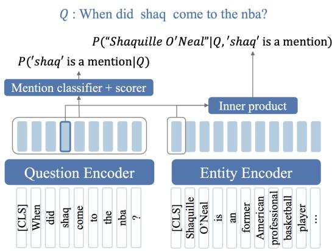

## 24.7 Entity Linking

Entity linking is the task of associating a mention in text with the representation of some real-world entity in an ontology or knowledge base (Ji and Grishman, 2011). It is the natural follow-on to coreference resolution; coreference resolution is the task of associating textual mentions that corefer to the same entity. Entity linking takes the further step of identifying who that entity is. It is especially important for any NLP task that links to a knowledge base.

While there are all sorts of potential knowledge-bases, we’ll focus in this section on Wikipedia, since it’s widely used as an ontology for NLP tasks. In this usage, each unique Wikipedia page acts as the unique id for a particular entity. This task of deciding which Wikipedia page corresponding to an individual is being referred to by a text mention has its own name: wikification (Mihalcea and Csomai, 2007).

Since the earliest systems (Mihalcea and Csomai 2007, Cucerzan 2007, Milne and Witten 2008), entity linking is done in (roughly) two stages: mention detection and mention disambiguation. We’ll give two algorithms, one simple classic baseline that uses anchor dictionaries and information from the Wikipedia graph structure (Ferragina and Scaiella, 2011) and one modern neural algorithm (Li et al., 2020). We’ll focus here mainly on the application of entity linking to questions, since a lot of the literature has been in that context.

## 24.7.1 Linking based on Anchor Dictionaries and Web Graph

As a simple baseline we introduce the TAGME linker (Ferragina and Scaiella, 2011) for Wikipedia, which itself draws on earlier algorithms (Mihalcea and Csomai 2007, Cucerzan 2007, Milne and Witten 2008). Wikification algorithms define the set of entities as the set of Wikipedia pages, so we’ll refer to each Wikipedia page as a unique entity e. TAGME first creates a catalog of all entities (i.e. all Wikipedia pages, removing some disambiguation and other meta-pages) and indexes them in a standard IR engine like Lucene. For each page e, the algorithm computes an in-link count in(e): the total number of in-links from other Wikipedia pages that point to e. These counts can be derived from Wikipedia dumps.

Finally, the algorithm requires an anchor dictionary. An anchor dictionary lists for each Wikipedia page, its anchor texts: the hyperlinked spans of text on other pages that point to it. For example, the web page for Stanford University, http://www.stanford.edu, might be pointed to from another page using anchor texts like Stanford or Stanford University:

## <a href="http://www.stanford.edu">Stanford University</a>

We compute a Wikipedia anchor dictionary by including, for each Wikipedia page $e , e \mathrm { ^ { \circ } s }$ title as well as all the anchor texts from all Wikipedia pages that point to e. For each anchor string a we’ll also compute its total frequency freq(a) in Wikipedia (including non-anchor uses), the number of times a occurs as a link (which we’ll call $l i n k ( a ) )$ ), and its link probability $\operatorname* { l i n k p r o b } ( a ) = \operatorname* { l i n k } ( a ) / \operatorname* { f r e q } ( a )$ . Some cleanup of the final anchor dictionary is required, for example removing anchor strings composed only of numbers or single characters, that are very rare, or that are very unlikely to be useful entities because they have a very low linkprob.

Mention Detection Given a question (or other text we are trying to link), TAGME detects mentions by querying the anchor dictionary for each token sequence up to 6 words. This large set of sequences is pruned with some simple heuristics (for example pruning substrings if they have small linkprobs). The question:

## When was Ada Lovelace born?

might give rise to the anchor Ada Lovelace and possibly Ada, but substrings spans like Lovelace might be pruned as having too low a linkprob, and but spans like born have such a low linkprob that they would not be in the anchor dictionary at all.

Mention Disambiguation If a mention span is unambiguous (points to only one entity/Wikipedia page), we are done with entity linking! However, many spans are ambiguous, matching anchors for multiple Wikipedia entities/pages. The TAGME algorithm uses two factors for disambiguating ambiguous spans, which have been referred to as prior probability and relatedness/coherence. The first factor is $p ( e | a )$ the probability with which the span refers to a particular entity. For each page $e \in$ $\mathcal E ( a )$ , the probability $p ( e | a )$ that anchor a points to $e ,$ is the ratio of the number of links into e with anchor text a to the total number of occurrences of a as an anchor:

$$
\operatorname{prior} (a \rightarrow e) = p (e | a) = \frac {\operatorname{count} (a \rightarrow e)}{\operatorname{link} (a)}\tag{24.58}
$$

Let’s see how that factor works in linking entities in the following question:

## What Chinese Dynasty came before the Yuan?

The most common association for the span Yuan in the anchor dictionary is the name of the Chinese currency, i.e., the probability $p ( \mathtt { Y u a n }$ currency yuan) is very high. Rarer Wikipedia associations for Yuan include the common Chinese last name, a language spoken in Thailand, and the correct entity in this case, the name of the Chinese dynasty. So if we chose based only on $p ( e | a )$ , we would make the wrong disambiguation and miss the correct link, Yuan dynasty.

To help in just this sort of case, TAGME uses a second factor, the relatedness of this entity to other entities in the input question. In our example, the fact that the question also contains the span Chinese Dynasty, which has a high probability link to the page Dynasties in Chinese history, ought to help match Yuan dynasty.

Let’s see how this works. Given a question $q ,$ for each candidate anchors span a detected in $q ,$ we assign a relatedness score to each possible entity $e \in \mathcal { E } ( a )$ of $^ { a . }$ The relatedness score of the link $a \to e$ is the weighted average relatedness between e and all other entities in $q .$ Two entities are considered related to the extent their Wikipedia pages share many in-links. More formally, the relatedness between two entities A and B is computed as

$$
\operatorname{rel} (A, B) = \frac {\log (\max (| \operatorname{in} (A) | , | \operatorname{in} (B) |)) - \log (| \operatorname{in} (A) \cap \operatorname{in} (B) |)}{\log (| W |) - \log (\min (| \operatorname{in} (A) | , | \operatorname{in} (B) |))}\tag{24.59}
$$

where $\mathrm { i n } ( x )$ is the set of Wikipedia pages pointing to x and W is the set of all Wikipedia pages in the collection.

The vote given by anchor $^ b$ to the candidate annotation $a \to X$ is the average, over all the possible entities of b, of their relatedness to $X ,$ , weighted by their prior probability:

$$
\operatorname{vote} (b, X) = \frac {1}{| \mathcal {E} (b) |} \sum_ {Y \in \mathcal {E} (b)} \operatorname{rel} (X, Y) p (Y | b)\tag{24.60}
$$

The total relatedness score for $a \to X$ is the sum of the votes of all the other anchors detected in $q \mathrm { : }$

$$
\text { relatedness } (a \rightarrow X) = \sum_ {b \in \mathcal {X} _ {q} \backslash a} \operatorname{vote} (b, X)\tag{24.61}
$$

To score $a \to X$ , we combine relatedness and prior by choosing the entity X that has the highest relatedness $( a \to X )$ , finding other entities within a small ϵ of this value, and from this set, choosing the entity with the highest prior $P ( X | a )$ . The result of this step is a single entity assigned to each span in $q .$

The TAGME algorithm has one further step of pruning spurious anchor/entity pairs, assigning a score averaging link probability with the coherence.

$$
\begin{array}{c}\text { coherence } (a \rightarrow X) = \frac {1}{| S | - 1} \sum_ {B \in \mathcal {S} \backslash X} \operatorname{rel} (B, X)\\\text { score } (a \rightarrow X) = \frac {\text { coherence } (a \rightarrow X) + \text { linkprob } (a)}{2}\end{array}\tag{24.62}
$$

Finally, pairs are pruned if score $( a  X ) < \lambda$ , where the threshold $\lambda$ is set on a held-out set.

## 24.7.2 Neural Graph-based linking

More recent entity linking models are based on bi-encoders, encoding a candidate mention span, encoding an entity, and computing the dot product between the encodings. This allows embeddings for all the entities in the knowledge base to be precomputed and cached (Wu et al., 2020). Let’s sketch the ELQ linking algorithm of Li et al. (2020), which is given a question q and a set of candidate entities from Wikipedia with associated Wikipedia text, and outputs tuples $\left( e , m _ { s } , m _ { e } \right)$ of entity id, mention start, and mention end. As Fig. 24.8 shows, it does this by encoding each Wikipedia entity using text from Wikipedia, encoding each mention span using text from the question, and computing their similarity, as we describe below.

Entity Mention Detection To get an h-dimensional embedding for each question token, the algorithm runs the question through BERT in the normal way:

$$
[ \mathbf {q} _ {1} \dots \mathbf {q} _ {n} ] = \operatorname{BERT} ([ \mathrm{CLS} ] q _ {1} \dots q _ {n} [ \mathrm{SEP} ])\tag{24.63}
$$

It then computes the likelihood of each span $[ i , j ]$ in $q$ being an entity mention, in a way similar to the span-based algorithm we saw for the reader above. First we compute the score for $i / j$ being the start/end of a mention:

$$
s _ {\text { start }} (i) = \mathbf {w} _ {\text { start }} \cdot \mathbf {q} _ {i}, \quad s _ {\text { end }} (j) = \mathbf {w} _ {\text { end }} \cdot \mathbf {q} _ {j},\tag{24.64}
$$

  
Figure 24.8 A sketch of the inference process in the ELQ algorithm for entity linking in questions (Li et al., 2020). Each candidate question mention span and candidate entity are separately encoded, and then scored by the entity/span dot product.

where ${ \pmb w } _ { \mathrm { s t a r t } }$ and $\boldsymbol { \mathsf { w } } _ { \mathrm { e n d } }$ are vectors learned during training. Next, another trainable embedding, $\pmb { \mathsf { w } } _ { \mathrm { m e n t i o n } }$ is used to compute a score for each token being part of a mention:

$$
s _ {\mathrm{mention}} (t) = \mathbf {w} _ {\mathrm{mention}} \cdot \mathbf {q} _ {t}\tag{24.65}
$$

Mention probabilities are then computed by combining these three scores:

$$
p ([ i, j ]) = \sigma \left(s _ {\text { start }} (i) + s _ {\text { end }} (j) + \sum_ {t = i} ^ {j} s _ {\text { mention }} (t)\right)\tag{24.66}
$$

Entity Linking To link mentions to entities, we next compute embeddings for each entity in the set $\mathcal { E } = e _ { 1 } , \cdots , e _ { i } , \cdots , e _ { w }$ of all Wikipedia entities. For each entity $e _ { i }$ we’ll get text from the entity’s Wikipedia page, the title $t ( e _ { i } )$ and the first 128 tokens of the Wikipedia page which we’ll call the description $d ( e _ { i } )$ . This is again run through BERT, taking the output of the CLS token $\mathtt { B E R T } _ { \mathrm { I C L S } ] }$ as the entity representation:

$$
\mathbf {x} _ {e _ {i}} = \operatorname{BERT} _ {[ \mathrm{CLS} ]} ([ \mathrm{CLS} ] t (e _ {i}) [ \mathrm{ENT} ] d (e _ {i}) [ \mathrm{SEP} ])\tag{24.67}
$$

Mention spans can be linked to entities by computing, for each entity e and span $[ i , j ]$ , the dot product similarity between the span encoding (the average of the token embeddings) and the entity encoding.

$$
\begin{array}{c} \mathbf {y} _ {i, j} = \frac {1}{(j - i + 1)} \sum_ {t = i} ^ {j} \mathbf {q} _ {t} \\ s (e, [ i, j ]) = \mathbf {x} _ {e} ^ {\cdot} \mathbf {y} _ {i, j} \end{array}\tag{24.68}
$$

Finally, we take a softmax to get a distribution over entities for each span:

$$
p (e | [ i, j ]) = \frac {\exp (s (e , [ i , j ]))}{\sum_ {e ^ {\prime} \in \mathcal {E}} \exp (s (e ^ {\prime} , [ i , j ]))}\tag{24.69}
$$

Training The ELQ mention detection and entity linking algorithm is fully supervised. This means, unlike the anchor dictionary algorithms from Section 24.7.1, it requires datasets with entity boundaries marked and linked. Two such labeled datasets are WebQuestionsSP (Yih et al., 2016), an extension of the WebQuestions (Berant et al., 2013) dataset derived from Google search questions, and GraphQuestions (Su et al., 2016). Both have had entity spans in the questions marked and linked (Sorokin and Gurevych 2018, Li et al. 2020) resulting in entity-labeled versions WebQSPEL and GraphQEL (Li et al., 2020).

Given a training set, the ELQ mention detection and entity linking phases are trained jointly, optimizing the sum of their losses. The mention detection loss is a binary cross-entropy loss, with L the length of the passage and N the number of candidates:

$$
\mathcal {L} _ {\mathrm{MD}} = - \frac {1}{N} \sum_ {1 \leq i \leq j \leq \min (i + L - 1, n)} \left(y _ {[ i, j ]} \log p ([ i, j ]) + (1 - y _ {[ i, j ]}) \log (1 - p ([ i, j ]))\right)\tag{24.70}
$$

with $y _ { [ i , j ] } = 1 \mathrm { i f } [ i , j ]$ is a gold mention span, else 0. The entity linking loss is:

$$
\mathcal {L} _ {\mathrm{ED}} = - l o g p (e _ {g} | [ i, j ])\tag{24.71}
$$

where $e _ { g }$ is the gold entity for mention $[ i , j ]$
