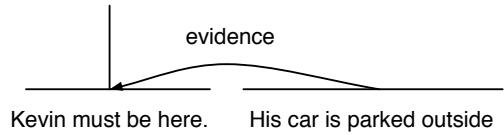
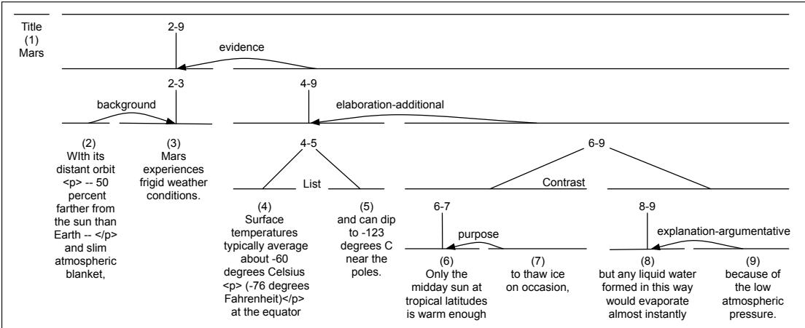
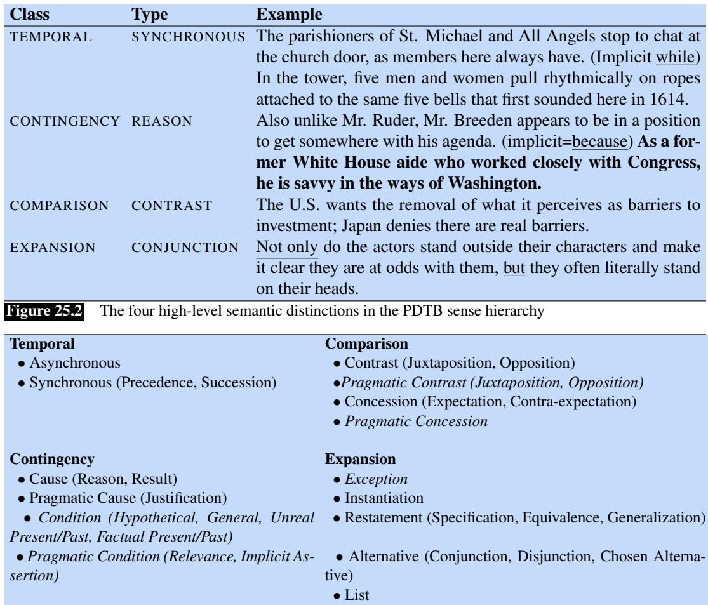
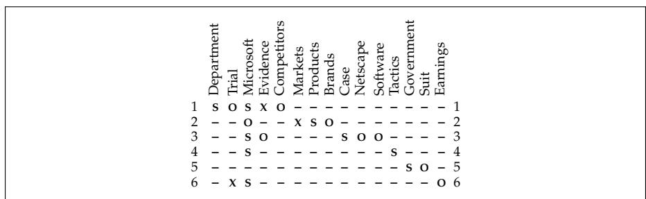
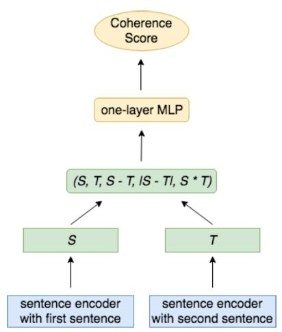
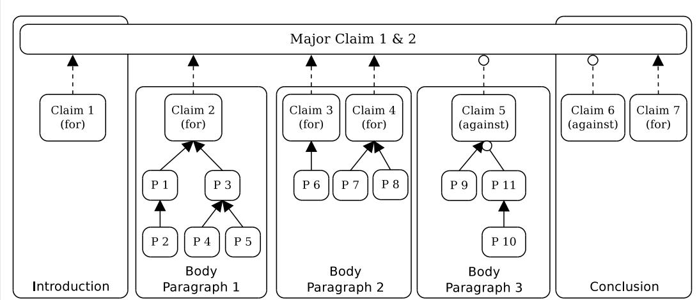

# Discourse Coherence

And even in our wildest and most wandering reveries, nay in our very dreams, we shall find, if we reflect, that the imagination ran not altogether at adventures, but that there was still a connection upheld among the different ideas, which succeeded each other. Were the loosest and freest conversation to be transcribed, there would immediately be transcribed, there would immediately be observed something which connected it in all its transitions.

David Hume, An enquiry concerning human understanding, 1748

Orson Welles’ movie Citizen Kane was groundbreaking in many ways, perhaps most notably in its structure. The story of the life of fictional media magnate Charles Foster Kane, the movie does not proceed in chronological order through Kane’s life. Instead, the film begins with Kane’s death (famously murmuring “Rosebud”) and is structured around flashbacks to his life inserted among scenes of a reporter investigating his death. The novel idea that the structure of a movie does not have to linearly follow the structure of the real timeline made apparent for 20th century cinematography the infinite possibilities and impact of different kinds of coherent narrative structures.

But coherent structure is not just a fact about movies or works of art. Like movies, language does not normally consist of isolated, unrelated sentences, but instead of collocated, structured, coherent groups of sentences. We refer to such a coherent structured group of sentences as a discourse, and we use the word coherence to refer to the relationship between sentences that makes real discourses different than just random assemblages of sentences. The chapter you are now reading is an example of a discourse, as is a news article, a conversation, a thread on social media, a Wikipedia page, and your favorite novel.

What makes a discourse coherent? If you created a text by taking random sentences each from many different sources and pasted them together, would that be a coherent discourse? Almost certainly not. Real discourses exhibit both local coherence and global coherence. Let’s consider three ways in which real discourses are locally coherent;

First, sentences or clauses in real discourses are related to nearby sentences in systematic ways. Consider this example from Hobbs (1979):

(25.1) John took a train from Paris to Istanbul. He likes spinach.

This sequence is incoherent because it is unclear to a reader why the second sentence follows the first; what does liking spinach have to do with train trips? In fact, a reader might go to some effort to try to figure out how the discourse could be coherent; perhaps there is a French spinach shortage? The very fact that hearers try to identify such connections suggests that human discourse comprehension involves the need to establish this kind of coherence.

By contrast, in the following coherent example:

(25.2) Jane took a train from Paris to Istanbul. She had to attend a conference.

the second sentence gives a REASON for Jane’s action in the first sentence. Structured relationships like REASON that hold between text units are called coherence relations, and coherent discourses are structured by many such coherence relations. Coherence relations are introduced in Section 25.1.

A second way a discourse can be locally coherent is by virtue of being “about” someone or something. In a coherent discourse some entities are salient, and the discourse focuses on them and doesn’t go back and forth between multiple entities. This is called entity-based coherence. Consider the following incoherent passage, in which the salient entity seems to wildly swing from John to Jenny to the piano store to the living room, back to Jenny, then the piano again:

(25.3) John wanted to buy a piano for his living room.

Jenny also wanted to buy a piano.

He went to the piano store.

It was nearby.

The living room was on the second floor.

She didn’t find anything she liked.

The piano he bought was hard to get up to that floor.

Entity-based coherence models measure this kind of coherence by tracking salient entities across a discourse. For example Centering Theory (Grosz et al., 1995), the most influential theory of entity-based coherence, keeps track of which entities in the discourse model are salient at any point (salient entities are more likely to be pronominalized or to appear in prominent syntactic positions like subject or object). In Centering Theory, transitions between sentences that maintain the same salient entity are considered more coherent than ones that repeatedly shift between entities. The entity grid model of coherence (Barzilay and Lapata, 2008) is a commonly used model that realizes some of the intuitions of the Centering Theory framework. Entity-based coherence is introduced in Section 25.3.

Finally, discourses can be locally coherent by being topically coherent: nearby sentences are generally about the same topic and use the same or similar vocabulary to discuss these topics. Because topically coherent discourses draw from a single semantic field or topic, they tend to exhibit the surface property known as lexical cohesion (Halliday and Hasan, 1976): the sharing of identical or semantically related words in nearby sentences. For example, the fact that the words house, chimney, garret, closet, and window— all of which belong to the same semantic field— appear in the two sentences in (25.4), or that they share the identical word shingled, is a cue that the two are tied together as a discourse:

(25.4) Before winter I built a chimney, and shingled the sides of my house... I have thus a tight shingled and plastered house... with a garret and a closet, a large window on each side....

In addition to the local coherence between adjacent or nearby sentences, discourses also exhibit global coherence. Many genres of text are associated with particular conventional discourse structures. Academic articles might have sections describing the Methodology or Results. Stories might follow conventional plotlines or motifs. Persuasive essays have a particular claim they are trying to argue for, and an essay might express this claim together with a structured set of premises that support the argument and demolish potential counterarguments. We’ll introduce versions of each of these kinds of global coherence.

Why do we care about the local or global coherence of a discourse? Since coherence is a property of a well-written text, coherence detection plays a part in any task that requires measuring the quality of a text. For example coherence can help in pedagogical tasks like essay grading or essay quality measurement that are trying to grade how well-written a human essay is (Somasundaran et al. 2014, Feng et al. 2014, Lai and Tetreault 2018). Coherence can also help for summarization; knowing the coherence relationship between sentences can help know how to select information from them. Finally, detecting incoherent text may even play a role in mental health tasks like measuring symptoms of schizophrenia or other kinds of disordered language (Ditman and Kuperberg 2010, Elvevag et al.˚ 2007, Bedi et al. 2015, Iter et al. 2018).

## 25.1 Coherence Relations

Recall from the introduction the difference between passages (25.5) and (25.6).

(25.5) Jane took a train from Paris to Istanbul. She likes spinach.

(25.6) Jane took a train from Paris to Istanbul. She had to attend a conference.

The reason (25.6) is more coherent is that the reader can form a connection between the two sentences, in which the second sentence provides a potential REASON for the first sentences. This link is harder to form for (25.5). These connections between text spans in a discourse can be specified as a set of coherence relations. The next two sections describe two commonly used models of coherence relations and associated corpora: Rhetorical Structure Theory (RST), and the Penn Discourse TreeBank (PDTB).

## 25.1.1 Rhetorical Structure Theory

The most commonly used model of discourse organization is Rhetorical Structure Theory (RST) (Mann and Thompson, 1987). In RST relations are defined between two spans of text, generally a nucleus and a satellite. The nucleus is the unit that is more central to the writer’s purpose and that is interpretable independently; the satellite is less central and generally is only interpretable with respect to the nucleus. Some symmetric relations, however, hold between two nuclei.

Below are a few examples of RST coherence relations, with definitions adapted from the RST Treebank Manual (Carlson and Marcu, 2001).

Reason: The nucleus is an action carried out by an animate agent and the satellite is the reason for the nucleus.

(25.7) [<sub>NUC</sub> Jane took a train from Paris to Istanbul.] [<sub>SAT</sub> She had to attend a conference.]

Elaboration: The satellite gives additional information or detail about the situation presented in the nucleus.

(25.8) [<sub>NUC</sub> Dorothy was from Kansas.] [<sub>SAT</sub> She lived in the midst of the great Kansas prairies.]

Evidence: The satellite gives additional information or detail about the situation presented in the nucleus. The information is presented with the goal of convince the reader to accept the information presented in the nucleus.

(25.9) [<sub>NUC</sub> Kevin must be here.] [<sub>SAT</sub> His car is parked outside.]

Attribution: The satellite gives the source of attribution for an instance of reported speech in the nucleus.

(25.10) [<sub>SAT</sub> Analysts estimated] [<sub>NUC</sub> that sales at U.S. stores declined in the quarter, too]

List: In this multinuclear relation, a series of nuclei is given, without contrast or explicit comparison:

(25.11) $[ _ { \mathrm { N U C } }$ Billy Bones was the mate; ] [<sub>NUC</sub> Long John, he was quartermaster]

RST relations are traditionally represented graphically; the asymmetric Nucleus-Satellite relation is represented with an arrow from the satellite to the nucleus:



We can also talk about the coherence of a larger text by considering the hierarchical structure between coherence relations. Figure 25.1 shows the rhetorical structure of a paragraph from Marcu (2000a) for the text in (25.12) from the Scientific American magazine.

(25.12) With its distant orbit–50 percent farther from the sun than Earth–and slim atmospheric blanket, Mars experiences frigid weather conditions. Surface temperatures typically average about -60 degrees Celsius (-76 degrees Fahrenheit) at the equator and can dip to -123 degrees C near the poles. Only the midday sun at tropical latitudes is warm enough to thaw ice on occasion, but any liquid water formed in this way would evaporate almost instantly because of the low atmospheric pressure.

  
Figure 25.1 A discourse tree for the Scientific American text in (25.12), from Marcu (2000a). Note that asymmetric relations are represented with a curved arrow from the satellite to the nucleus.

The leaves in the Fig. 25.1 tree correspond to text spans of a sentence, clause or EDU phrase that are called elementary discourse units or EDUs in RST; these units can also be referred to as discourse segments. Because these units may correspond to arbitrary spans of text, determining the boundaries of an EDU is an important task for extracting coherence relations. Roughly speaking, one can think of discourse segments as being analogous to constituents in sentence syntax, and indeed as we’ll see in Section 25.2 we generally draw on parsing algorithms to infer discourse structure.

There are corpora for many discourse coherence models; the RST Discourse TreeBank (Carlson et al., 2001) is the largest available discourse corpus. It consists of 385 English language documents selected from the Penn Treebank, with full RST parses for each one, using a large set of 78 distinct relations, grouped into 16 classes. RST treebanks exist also for Spanish, German, Basque, Dutch and Brazilian Portuguese (Braud et al., 2017).

Now that we’ve seen examples of coherence, we can see more clearly how a coherence relation can play a role in summarization or information extraction. For example, the nuclei of a text presumably express more important information than the satellites, which might be dropped in a summary.

## 25.1.2 Penn Discourse TreeBank (PDTB)

The Penn Discourse TreeBank (PDTB) is a second commonly used dataset that embodies another model of coherence relations (Miltsakaki et al. 2004, Prasad et al. 2008, Prasad et al. 2014). PDTB labeling is lexically grounded. Instead of asking annotators to directly tag the coherence relation between text spans, they were given a list of discourse connectives, words that signal discourse relations, like because, although, when, since, or as a result. In a part of a text where these words marked a coherence relation between two text spans, the connective and the spans were then annotated, as in Fig. 25.13, where the phrase as a result signals a causal relationship between what PDTB calls Arg1 (the first two sentences, here in italics) and Arg2 (the third sentence, here in bold).

(25.13) Jewelry displays in department stores were often cluttered and uninspired. And the merchandise was, well,fake. As a result, marketers of faux gems steadily lost space in department stores to more fashionable rivals—cosmetics makers.

(25.14) In July, the Environmental Protection Agency imposed a gradual ban on virtually all uses of asbestos. (implicit=as a result) By 1997, almost all remaining uses of cancer-causing asbestos will be outlawed.

Not all coherence relations are marked by an explicit discourse connective, and so the PDTB also annotates pairs of neighboring sentences with no explicit signal, like (25.14). The annotator first chooses the word or phrase that could have been its signal (in this case as a result), and then labels its sense. For example for the ambiguous discourse connective since annotators marked whether it is using a CAUSAL or a TEMPORAL sense.

The final dataset contains roughly 18,000 explicit relations and 16,000 implicit relations. Fig. 25.2 shows examples from each of the 4 major semantic classes, while Fig. 25.3 shows the full tagset.

Unlike the RST Discourse Treebank, which integrates these pairwise coherence relations into a global tree structure spanning an entire discourse, the PDTB does not annotate anything above the span-pair level, making no commitment with respect to higher-level discourse structure.

There are also treebanks using similar methods for other languages; (25.15) shows an example from the Chinese Discourse TreeBank (Zhou and Xue, 2015). Because Chinese has a smaller percentage of explicit discourse connectives than English (only 22% of all discourse relations are marked with explicit connectives, compared to 47% in English), annotators labeled this corpus by directly mapping pairs of sentences to 11 sense tags, without starting with a lexical discourse connector.

  
Figure 25.3 The PDTB sense hierarchy. There are four top-level classes, 16 types, and 23 subtypes (not all types have subtypes). 11 of the 16 types are commonly used for implicit argument classification; the 5 types in italics are too rare in implicit labeling to be used.

(25.15) [Conn 为] [Arg2 推动图们江地区开发] ，[Arg1 韩国捐款一百万美元设立了图们江发展基金]

“[In order to] [Arg2 promote the development of the Tumen River region], [Arg1 South Korea donated one million dollars to establish the Tumen River Development Fund].”

These discourse treebanks have been used for shared tasks on multilingual discourse parsing (Xue et al., 2016).

## 25.2 Discourse Structure Parsing

Given a sequence of sentences, how can we automatically determine the coherence discourse parsing relations between them? This task is often called discourse parsing (even though for PDTB we are only assigning labels to leaf spans and not building a full parse

tree as we do for RST).

## 25.2.1 EDU segmentation for RST parsing

RST parsing is generally done in two stages. The first stage, EDU segmentation, extracts the start and end of each EDU. The output of this stage would be a labeling like the following:

(25.16) [Mr. Rambo $\mathrm { s a y s l } _ { \mathrm { e 1 } }$ [that a 3.2-acre property $\mathrm { \Delta }$ [overlooking the San Fernando $\mathrm { V a l l e y } ] _ { \mathrm { e } 3 }$ [is priced at \$4 million $\mathrm { l e } 4$ [because the late actor Erroll Flynn once lived there. $\mathrm { . } \mathrm { l e } 5$

Since EDUs roughly correspond to clauses, early models of EDU segmentation first ran a syntactic parser, and then post-processed the output. Modern systems generally use neural sequence models supervised by the gold EDU segmentation in datasets like the RST Discourse Treebank. Fig. 25.4 shows an example architecture simplified from the algorithm of Lukasik et al. (2020) that predicts for each token whether or not it is a break. Here the input sentence is passed through an encoder and then passed through a linear layer and a softmax to produce a sequence of 0s and 1, where 1 indicates the start of an EDU.

  
Figure 25.4 Predicting EDU segment beginnings from encoded text.

## 25.2.2 RST parsing

Tools for building RST coherence structure for a discourse have long been based on syntactic parsing algorithms like shift-reduce parsing (Marcu, 1999). Many modern RST parsers since Ji and Eisenstein (2014) draw on the neural syntactic parsers we saw in Chapter 20, using representation learning to build representations for each span, and training a parser to choose the correct shift and reduce actions based on the gold parses in the training set.

We’ll describe the shift-reduce parser of Yu et al. (2018). The parser state consists of a stack and a queue, and produces this structure by taking a series of actions on the states. Actions include:

• shift: pushes the first EDU in the queue onto the stack creating a single-node subtree.

• reduce(l,d): merges the top two subtrees on the stack, where l is the coherence relation label, and d is the nuclearity direction, $d \in \{ N N , N S , S N \}$

As well as the pop root operation, to remove the final tree from the stack.

Fig. 25.6 shows the actions the parser takes to build the structure in Fig. 25.5.


$$
e _ {2}:
$$

$$
e _ {4}:
$$

<sub>ure 1: An e</sub>Figure 25.5 Example RST discourse tree, showing four EDUs. Figure from Yu et al. (2018).

<table><tr><td>Step</td><td>Stack</td><td>Queue</td><td>Action</td><td>Relation</td></tr><tr><td>1</td><td> $\emptyset$ </td><td> $e_1, e_2, e_3, e_4$ </td><td>SH</td><td> $\emptyset$ </td></tr><tr><td>2</td><td> $e_1$ </td><td> $e_2, e_3, e_4$ </td><td>SH</td><td> $\emptyset$ </td></tr><tr><td>3</td><td> $e_1, e_2$ </td><td> $e_3, e_4$ </td><td>RD (attr, SN)</td><td> $\emptyset$ </td></tr><tr><td>4</td><td> $e_{1:2}$ </td><td> $e_3, e_4$ </td><td>SH</td><td> $\widehat{e_1\mathbf{e}_2}$ </td></tr><tr><td>5</td><td> $e_{1:2}, e_3$ </td><td> $e_4$ </td><td>SH</td><td> $\widehat{e_1\mathbf{e}_2}$ </td></tr><tr><td>6</td><td> $e_{1:2}, e_3, e_4$ </td><td> $\emptyset$ </td><td>RD (elab, NS)</td><td> $\widehat{e_1\mathbf{e}_2}$ </td></tr><tr><td>7</td><td> $e_{1:2}, e_{3:4}$ </td><td> $\emptyset$ </td><td>RD (elab, SN)</td><td> $\widehat{e_1\mathbf{e}_2, \widehat{\mathbf{e}_3e_4}}$ </td></tr><tr><td>8</td><td> $e_{1:4}$ </td><td> $\emptyset$ </td><td>PR</td><td> $\widehat{e_1\mathbf{e}_2, \widehat{\mathbf{e}_3e_4}, e_{1:2}\mathbf{e}_{3:4}}$ </td></tr></table>

Figure 25.6 Parsing the example of Fig. 25.5 using a shift-reduce parser. Figure from Yu et al. (2018).

estigate the implicit syntax feature extraction approach for RST parsing. In aThe Yu et al. (2018) uses an encoder-decoder architecture, where the encoder <sub>a transition-based neural model for this task, which is able to incorporate vario</sub> is an empty state, and the final state represents a full result. There arepresents the input span of words and EDUs using a hierarchical biLSTM. The e exploit hierarchical bi-directional LSTMs (Bi-LSTMs) to encode texts, and furtnsition system:first biLSTM layer represents the words inside an EDU, and the second represents <sub>on-based model with dynamic oracle. Bas</sub>the EDU sequence. Given an input sentence $w _ { 1 } , w _ { 2 } , . . . , w _ { m }$ <sub>osed model, we study t</sub>, the words can be repreproposed implicit syntax features. We conduct experiments on a standard RST dwhich removes the first EDU in the queue onto the stack, forming a sinsented as usual (by static embeddings, combinations with character embeddings or tags, or contextual embeddings) resulting in an input word representation sequence $\pmb { \times } _ { 1 } ^ { w } , \pmb { \times } _ { 2 } ^ { w } , . . . , \pmb { \times } _ { m } ^ { w }$ ich merges the top two subtrees on the stack, whe<sub>.</sub> <sub>The</sub> <sub>result</sub> <sub>of</sub> <sub>the</sub> <sub>word-level</sub> <sub>biLSTM</sub> <sub>is</sub> <sub>then</sub> <sub>a</sub> <sub>sequence</sub> <sub>of</sub> $\mathbf { h } ^ { \boldsymbol { w } }$ l is a d<sub>values:</sub>

$$
\mathbf {h} _ {1} ^ {w}, \mathbf {h} _ {2} ^ {w},..., \mathbf {h} _ {m} ^ {w} = \text { biLSTM } (\mathbf {x} _ {1} ^ {w}, \mathbf {x} _ {2} ^ {w},..., \mathbf {x} _ {m} ^ {w})\tag{25.17}
$$

An EDU of span $w _ { s } , w _ { s + 1 } , . . . , w _ { t }$ then has biLSTM output representation $\mathbf { h } _ { s } ^ { w } , \mathbf { h } _ { s + 1 } ^ { w } , . . . , \mathbf { h } _ { t } ^ { w }$ and is represented by average pooling:

$$
\mathbf {x} ^ {e} = \frac {1}{t - s + 1} \sum_ {k = s} ^ {t} \mathbf {h} _ {k} ^ {w}\tag{25.18}
$$

ls including the transition-based neural model, the dynamic oracle strategy and t           The second layer uses this input to compute a final representation of the sequence of <sub>ure extraction approa</sub>s, where each lineEDU representations $\mathbf { h } ^ { e }$ c:

$$
\mathbf {h} _ {1} ^ {e}, \mathbf {h} _ {2} ^ {e}, \dots , \mathbf {h} _ {n} ^ {e} = \operatorname{biLSTM} (\mathbf {x} _ {1} ^ {e}, \mathbf {x} _ {2} ^ {e}, \dots , \mathbf {x} _ {n} ^ {e})\tag{25.19}
$$

sed Discourse ParsingThe decoder is then a feedforward network W that outputs an action o based on a concatenation of the top three subtrees on the stack $( s _ { o } , s _ { 1 } , s _ { 2 } )$ plus the first EDU in the queue $\left( q _ { 0 } \right)$

$$
\mathbf {o} = \mathbf {W} (\mathbf {h} _ {\mathrm{s0}} ^ {\mathrm{t}}, \mathbf {h} _ {\mathrm{s1}} ^ {\mathrm{t}}, \mathbf {h} _ {\mathrm{s2}} ^ {\mathrm{t}}, \mathbf {h} _ {\mathrm{q0}} ^ {\mathrm{e}})\tag{25.20}
$$

.., h<sub>n</sub> , and the decoder predicts next step acwhere the representation of the EDU on the queue ${ \bf h } _ { \mathrm { q 0 } } ^ { \mathrm { e } }$ s conditioned on the comes directly from the encoder, and the three hidden vectors representing partial trees are computed by average pooling over the encoder output for the EDUs in those trees:

$$
\mathbf {h} _ {\mathrm{s}} ^ {\mathrm{t}} = \frac {1}{j - i + 1} \sum_ {k = i} ^ {j} \mathbf {h} _ {k} ^ {e}\tag{25.21}
$$

Training first maps each RST gold parse tree into a sequence of oracle actions, and then uses the standard cross-entropy loss (with $l _ { 2 }$ regularization) to train the system to take such actions. Give a state $s$ and oracle action $^ { a , }$ we first compute the decoder output using Eq. 25.20, apply a softmax to get probabilities:

$$
p _ {a} = \frac {\exp (\mathbf {o} _ {a})}{\sum_ {a ^ {\prime} \in A} \exp (\mathbf {o} _ {a ^ {\prime}})}\tag{25.22}
$$

and then computing the cross-entropy loss:

$$
L _ {C E} () = - \log (p _ {a}) + \frac {\lambda}{2} | | \Theta | | ^ {2}\tag{25.23}
$$

RST discourse parsers are evaluated on the test section of the RST Discourse Treebank, either with gold EDUs or end-to-end, using the RST-Pareval metrics (Marcu, 2000b). It is standard to first transform the gold RST trees into right-branching binary trees, and to report four metrics: trees with no labels (S for Span), labeled with nuclei (N), with relations (R), or both (F for Full), for each metric computing micro-averaged $\mathrm { F } _ { 1 }$ over all spans from all documents (Marcu 2000b, Morey et al. 2017).

## 25.2.3 PDTB discourse parsing

PDTB discourse parsing, the task of detecting PDTB coherence relations between spans, is sometimes called shallow discourse parsing because the task just involves flat relationships between text spans, rather than the full trees of RST parsing.

The set of four subtasks for PDTB discourse parsing was laid out by Lin et al. (2014) in the first complete system, with separate tasks for explicit (tasks 1-3) and implicit (task 4) connectives:

1. Find the discourse connectives (disambiguating them from non-discourse uses)

2. Find the two spans for each connective

3. Label the relationship between these spans

4. Assign a relation between every adjacent pair of sentences

Many systems have been proposed for Task 4: taking a pair of adjacent sentences as input and assign a coherence relation sense label as output. The setup often follows Lin et al. (2009) in assuming gold sentence span boundaries and assigning each adjacent span one of the 11 second-level PDTB tags or none (removing the 5 very rare tags of the 16 shown in italics in Fig. 25.3).

A simple but very strong algorithm for Task 4 is to represent each of the two spans by BERT embeddings and take the last layer hidden state corresponding to the position of the [CLS] token, pass this through a single layer tanh feedforward network and then a softmax for sense classification (Nie et al., 2019).

Each of the other tasks also have been addressed. Task 1 is to disambiguating discourse connectives from their non-discourse use. For example as Pitler and Nenkova (2009) point out, the word and is a discourse connective linking the two clauses by an elaboration/expansion relation in (25.24) while it’s a non-discourse NP conjunction in (25.25):

(25.24) Selling picked up as previous buyers bailed out of their positions and aggressive short sellers—anticipating further declines—moved in.

(25.25) My favorite colors are blue and green.

Similarly, once is a discourse connective indicating a temporal relation in (25.26), but simply a non-discourse adverb meaning ‘formerly’ and modifying used in (25.27):

(25.26) The asbestos fiber, crocidolite, is unusually resilient once it enters the lungs, with even brief exposures to it causing symptoms that show up decades later, researchers said.

(25.27) A form of asbestos once used to make Kent cigarette filters has caused a high percentage of cancer deaths among a group of workers exposed to it more than 30 years ago, researchers reported.

Determining whether a word is a discourse connective is thus a special case of word sense disambiguation. Early work on disambiguation showed that the 4 PDTB high-level sense classes could be disambiguated with high (94%) accuracy used syntactic features from gold parse trees (Pitler and Nenkova, 2009). Recent work performs the task end-to-end from word inputs using a biLSTM-CRF with BIO outputs (B-CONN, I-CONN, O) (Yu et al., 2019).

For task 2, PDTB spans can be identified with the same sequence models used to find RST EDUs: a biLSTM sequence model with pretrained contextual embedding (BERT) inputs (Muller et al., 2019). Simple heuristics also do pretty well as a baseline at finding spans, since 93% of relations are either completely within a single sentence or span two adjacent sentences, with one argument in each sentence (Biran and McKeown, 2015).

## 25.3 Centering and Entity-Based Coherence

A second way a discourse can be coherent is by virtue of being “about” some entity. This idea that at each point in the discourse some entity is salient, and a discourse is coherent by continuing to discuss the same entity, appears early in functional linguistics and the psychology of discourse (Chafe 1976, Kintsch and Van Dijk 1978), and soon made its way to computational models. In this section we introduce two models of this kind of entity-based coherence: Centering Theory (Grosz et al., 1995), and the entity grid model of Barzilay and Lapata (2008).

## 25.3.1 Centering

Centering Theory (Grosz et al., 1995) is a theory of both discourse salience and discourse coherence. As a model of discourse salience, Centering proposes that at any given point in the discourse one of the entities in the discourse model is salient: it is being “centered” on. As a model of discourse coherence, Centering proposes that discourses in which adjacent sentences CONTINUE to maintain the same salient entity are more coherent than those which SHIFT back and forth between multiple entities (we will see that CONTINUE and SHIFT are technical terms in the theory).

The following two texts from Grosz et al. (1995) which have exactly the same propositional content but different saliences, can help in understanding the main Centering intuition.

(25.28) a. John went to his favorite music store to buy a piano.

b. He had frequented the store for many years.

c. He was excited that he could finally buy a piano.

d. He arrived just as the store was closing for the day.

(25.29) a. John went to his favorite music store to buy a piano.

b. It was a store John had frequented for many years.

c. He was excited that he could finally buy a piano.

d. It was closing just as John arrived.

While these two texts differ only in how the two entities (John and the store) are realized in the sentences, the discourse in (25.28) is intuitively more coherent than the one in (25.29). As Grosz et al. (1995) point out, this is because the discourse in (25.28) is clearly about one individual, John, describing his actions and feelings. The discourse in (25.29), by contrast, focuses first on John, then the store, then back to John, then to the store again. It lacks the “aboutness” of the first discourse.

Centering Theory realizes this intuition by maintaining two representations for each utterance $U _ { n }$ . The backward-looking center of $U _ { n }$ , denoted as $C _ { b } ( U _ { n } )$ , represents the current salient entity, the one being focused on in the discourse after $U _ { n }$ is interpreted. The forward-looking centers of $U _ { n } ,$ denoted as $C _ { f } ( U _ { n } )$ , are a set of potential future salient entities, the discourse entities evoked by $U _ { n }$ any of which could serve as $C _ { b }$ (the salient entity) of the following utterance, i.e. $C _ { b } ( U _ { n + 1 } )$

The set of forward-looking centers $C _ { f } ( U _ { n } )$ are ranked according to factors like discourse salience and grammatical role (for example subjects are higher ranked than objects, which are higher ranked than all other grammatical roles). We call the highest-ranked forward-looking center $C _ { p }$ (for “preferred center”). $C _ { p }$ is a kind of prediction about what entity will be talked about next. Sometimes the next utterance indeed talks about this entity, but sometimes another entity becomes salient instead.

We’ll use here the algorithm for centering presented in Brennan et al. (1987), which defines four intersentential relationships between a pair of utterances $U _ { n }$ and $U _ { n + 1 }$ that depend on the relationship between $C _ { b } ( U _ { n + 1 } ) , C _ { b } ( U _ { n } )$ , and $C _ { p } ( U _ { n + 1 } ) ;$ these are shown in Fig. 25.7.

<table><tr><td></td><td> $C_b(U_{n+1}) = C_b(U_n)$ or undefined  $C_b(U_n)$ </td><td> $C_b(U_{n+1}) \neq C_b(U_n)$ </td></tr><tr><td> $C_b(U_{n+1}) = C_p(U_{n+1})$ </td><td>Continue</td><td>Smooth-Shift</td></tr><tr><td> $C_b(U_{n+1}) \neq C_p(U_{n+1})$ </td><td>Retain</td><td>Rough-Shift</td></tr></table>

Figure 25.7 Centering Transitions for Rule 2 from Brennan et al. (1987).

The following rules are used by the algorithm:

<table><tr><td>Rule 1:</td><td>If any element of  $C_f(U_n)$  is realized by a pronoun in utterance  $U_{n+1}$ , then  $C_b(U_{n+1})$  must be realized as a pronoun also.</td></tr><tr><td>Rule 2:</td><td>Transition states are ordered. Continue is preferred to Retain is preferred to Smooth-Shift is preferred to Rough-Shift.</td></tr></table>

Rule 1 captures the intuition that pronominalization (including zero-anaphora) is a common way to mark discourse salience. If there are multiple pronouns in an utterance realizing entities from the previous utterance, one of these pronouns must realize the backward center $C _ { b } ;$ if there is only one pronoun, it must be $C _ { b }$

Rule 2 captures the intuition that discourses that continue to center the same entity are more coherent than ones that repeatedly shift to other centers. The transition table is based on two factors: whether the backward-looking center $C _ { b }$ is the same from $U _ { n } \mathrm { t o } U _ { n + 1 }$ and whether this discourse entity is the one that is preferred $( C _ { p } )$ in the new utterance $U _ { n + 1 }$ . If both of these hold, a CONTINUE relation, the speaker has been talking about the same entity and is going to continue talking about that entity. In a RETAIN relation, the speaker intends to SHIFT to a new entity in a future utterance and meanwhile places the current entity in a lower rank $C _ { f }$ . In a SHIFT relation, the speaker is shifting to a new salient entity.

Let’s walk though the start of (25.28) again, repeated as (25.30), showing the representations after each utterance is processed.

(25.30) John went to his favorite music store to buy a piano. $( U _ { 1 } )$

He was excited that he could finally buy a piano. $( U _ { 2 } )$

He arrived just as the store was closing for the day. $( U _ { 3 } )$

It was closing just as John arrived $( U _ { 4 } )$

Using the grammatical role hierarchy to order the $\mathrm { C } _ { f } .$ , for sentence $U _ { 1 }$ we get:

$C _ { f } ( U _ { 1 } ) { : }$ : John, music store, piano

$C _ { p } ( U _ { 1 } ) { \mathrm { : } }$ : John

$C _ { b } ( U _ { 1 } )$ : undefined

and then for sentence $U _ { 2 }$ :

$C _ { f } ( U _ { 2 } )$ <sup>:</sup> {<sup>John,</sup> <sup>piano</sup>}

$C _ { p } ( U _ { 2 } )$ : John

$C _ { b } ( U _ { 2 } )$ : John

Result: Continue $( C _ { p } ( U _ { 2 } ) { = } C _ { b } ( U _ { 2 } ) ; C _ { b } ( U _ { 1 } )$ undefined)

The transition from $U _ { 1 }$ to $U _ { 2 }$ is thus a CONTINUE. Completing this example is left as exercise (1) for the reader

## 25.3.2 Entity Grid model

Centering embodies a particular theory of how entity mentioning leads to coherence: that salient entities appear in subject position or are pronominalized, and that discourses are salient by means of continuing to mention the same entity in such ways.

The entity grid model of Barzilay and Lapata (2008) is an alternative way to capture entity-based coherence: instead of having a top-down theory, the entity-grid model using machine learning to induce the patterns of entity mentioning that make a discourse more coherent.

The model is based around an entity grid, a two-dimensional array that represents the distribution of entity mentions across sentences. The rows represent sentences, and the columns represent discourse entities (most versions of the entity grid model focus just on nominal mentions). Each cell represents the possible appearance of an entity in a sentence, and the values represent whether the entity appears and its grammatical role. Grammatical roles are subject (S), object (O), neither (X), or absent (–); in the implementation of Barzilay and Lapata (2008), subjects of passives are represented with O, leading to a representation with some of the characteristics of thematic roles.

Fig. 25.8 from Barzilay and Lapata (2008) shows a grid for the text shown in Fig. 25.9. There is one row for each of the six sentences. The second column, for the entity ‘trial’, is $0 -- { } \mathrm { ~ - ~ } \mathrm { ~ X ~ }$ , showing that the trial appears in the first sentence as direct object, in the last sentence as an oblique, and does not appear in the middle sentences. The third column, for the entity Microsoft, shows that it appears as subject in sentence 1 (it also appears as the object of the preposition against, but entities that appear multiple times are recorded with their highest-ranked grammatical function). Computing the entity grids requires extracting entities and doing coreference <sup>ranked</sup> <sup>higher</sup> <sup>than</sup> <sup>objects,</sup> <sup>which</sup> <sup>in</sup> <sup>turn</sup> <sup>are</sup> <sup>ranked</sup> <sup>higher</sup> <sup>than</sup> <sup>the</sup> <sup>rest.</sup> <sup>For</sup> <sup>exam</sup>resolution to cluster them into discourse entities (Chapter 24) as well as parsing theet al. 2004; Poesio et al. 2004), but this is not an option for our model. An obvi sentences to get grammatical roles.<sup>solution</sup> <sup>for</sup> <sup>identifying</sup> <sup>entity</sup> <sup>cla</sup>



Figure 25.8 Part of the entity grid for the text in Fig. 25.9. Entities are listed by their head<sup>forts</sup> <sup>(Poesio</sup> <sup>et</sup> <sup>al.</sup> <sup>2004)</sup> <sup>that</sup> <sup>focus</sup> <sup>on</sup> <sup>linguistic</sup> <sup>aspects</sup> <sup>of</sup> <sup>parameterization.</sup> <sup>Because</sup> 6noun; each cell represents whether an entity appears as subject (S), object (O), neither (X), or is absent (–). Figure from Barzilay and Lapata (2008).Table 2  
```txt
1 [The Justice Department]s is conducting an [anti-trust trial]o against [Microsoft Corp.]x with [evidence]x that [the company]s is increasingly attempting to crush [competitors]o.
2 [Microsoft]o is accused of trying to forcefully buy into [markets]x where [its own products]s are not competitive enough to unseat [established brands]o.
3 [The case]s revolves around [evidence]o of [Microsoft]s aggressively pressuring [Netscape]o into merging [browser software]o.
4 [Microsoft]s claims [its tactics]s are commonplace and good economically.
5 [The government]s may file [a civil suit]o ruling that [conspiracy]s to curb [competition]o through [collusion]x is [a violation of the Sherman Act]o.
6 [Microsoft]s continues to show [increased earnings]o despite [the trial]x.
```  
Figure 25.9 A discourse with the entities marked and annotated with grammatical func-When a noun is attested more thantions. Figure from Barzilay and Lapata (2008).

In the resulting grid, columns that are dense (like the column for Microsoft) in-<sup>ol</sup> <sup>that</sup> <sup>determines</sup> <sup>which</sup> <sup>noun</sup> <sup>phrases</sup> <sup>refer</sup> <sup>to</sup> <sup>the</sup> <sup>same</sup> <sup>entity</sup> <sup>in</sup> <sup>a</sup> <sup>document.</sup> dicate entities that are mentioned often in the texts; sparse columns (like the column for earnings) indicate entities that are mentioned rarely.

In the entity grid model, coherence is measured by patterns of local entity transition. For example, Department is a subject in sentence 1, and then not men-our experiments, we employ Ng and Cardie’s (2002) coreference resolution syst <sub>in coherent texts exhibits certain regularities reflected in grid topology. Some of th</sub>tioned in sentence 2; this is the transition [S –]. The transitions are thus sequencesThe system decides whether two NPs are coreferent by exploiting a wealth of lexi $\{ \mathbf { s } , 0 ~ \mathrm { X } , - \} ^ { n }$ are formalized in Centering Theory as constraints on transitions ofwhich can be extracted as continuous cells from each column. Eachal, semantic, and positional features. It is trained on the MUC (6–7) data local focus in adjacent sentences. Grids of coherent texts are likely to have some detransition has a probability; the probability of [S –] in the grid from Fig. 25.8 is 0.08<sup>and</sup> <sup>yields</sup> <sup>state-of-the-art</sup> <sup>performance</sup> <sup>(70.4</sup> <sup>F-measure</sup> <sup>on</sup> <sup>MUC-6</sup> <sup>and</sup> <sup>63.4</sup> <sup>on</sup> <sup>MUC</sup> columns (i.e., columns with just a few gaps, such as Microsoft in Table 1) and m(it occurs 6 times out of the 75 total transitions of length two). Fig. 25.10 shows the distribution over transitions of length 2 for the text of Fig. 25.9 (shown as the first rowTa $d _ { 1 } )$ , and 2 other documents.3

<table><tr><td></td><td>S S</td><td>S O</td><td>S X</td><td>S -</td><td>O S</td><td>O O</td><td>O X</td><td>O -</td><td>X S</td><td>X O</td><td>X X</td><td>X -</td><td>- S</td><td>- O</td><td>- X</td><td>--</td></tr><tr><td> $d_1$ </td><td>.01</td><td>.01</td><td>0</td><td>.08</td><td>.01</td><td>0</td><td>0</td><td>.09</td><td>0</td><td>0</td><td>0</td><td>.03</td><td>.05</td><td>.07</td><td>.03</td><td>.59</td></tr><tr><td> $d_2$ </td><td>.02</td><td>.01</td><td>.01</td><td>.02</td><td>0</td><td>.07</td><td>0</td><td>.02</td><td>.14</td><td>.14</td><td>.06</td><td>.04</td><td>.03</td><td>.07</td><td>0.1</td><td>.36</td></tr><tr><td> $d_3$ </td><td>.02</td><td>0</td><td>0</td><td>.03</td><td>.09</td><td>0</td><td>.09</td><td>.06</td><td>0</td><td>0</td><td>0</td><td>.05</td><td>.03</td><td>.07</td><td>.17</td><td>.39</td></tr></table>

[i.e., six] divided by the total number of transitions of length two [i.e., 75]). Each Figure 25.10 A feature vector for representing documents using all transitions of length 2. can thusDocument $d _ { 1 }$ e viewed as a distribution defined over transition types.is the text in Fig. 25.9. Figure from Barzilay and Lapata (2008).

The transitions and their probabilities can then be used as features for a machine learning model. This model can be a text classifier trained to produce human-labeled coherence scores (for example from humans labeling each text as coherent or inco-<sub>algorithms (see our experiments in Sections 4–6). Furthermore, it allows the cons</sub>herent). But such data is expensive to gather. Barzilay and Lapata (2005) introduced eration of large numbers of transitions which could potentially uncover novel ena simplifying innovation: coherence models can be trained by self-supervision: distribution patterns relevant for coherence assessment or other coherence-related tastrained to distinguish the natural original order of sentences in a discourse from a modified order (such as a randomized order). We turn to these evaluations in the next section.

## 25.3.3 Evaluating Neural and Entity-based coherence

Entity-based coherence models, as well as the neural models we introduce in the next section, are generally evaluated in one of two ways.

First, we can have humans rate the coherence of a document and train a classifier to predict these human ratings, which can be categorial (high/low, or high/mid/low) or continuous. This is the best evaluation to use if we have some end task in mind, like essay grading, where human raters are the correct definition of the final label.

Alternatively, since it’s very expensive to get human labels, and we might not yet have an end-task in mind, we can use natural texts to do self-supervision. In self-supervision we pair up a natural discourse with a pseudo-document created by changing the ordering. Since naturally-ordered discourses are more coherent than random permutation (Lin et al., 2011), a successful coherence algorithm should prefer the original ordering.

Self-supervision has been implemented in 3 ways. In the sentence order discrimination task (Barzilay and Lapata, 2005), we compare a document to a random permutation of its sentences. A model is considered correct for an (original, permuted) test pair if it ranks the original document higher. Given k documents, we can compute n permutations, resulting in kn pairs each with one original document and one permutation, to use in training and testing.

In the sentence insertion task (Chen et al., 2007) we take a document, remove one of the n sentences s, and create n 1 copies of the document with s inserted into each position. The task is to decide which of the n documents is the one with the original ordering, distinguishing the original position for s from all other positions. Insertion is harder than discrimination since we are comparing documents that differ by only one sentence.

Finally, in the sentence order reconstruction task (Lapata, 2003), we take a document, randomize the sentences, and train the model to put them back in the correct order. Again given k documents, we can compute n permutations, resulting in kn pairs each with one original document and one permutation, to use in training and testing. Reordering is of course a much harder task than simple classification.

## 25.4 Representation learning models for local coherence

The third kind of local coherence is topical or semantic field coherence. Discourses cohere by talking about the same topics and subtopics, and drawing on the same semantic fields in doing so.

The field was pioneered by a series of unsupervised models in the 1990s of this kind of coherence that made use of lexical cohesion (Halliday and Hasan, 1976): the sharing of identical or semantically related words in nearby sentences. Morris and Hirst (1991) computed lexical chains of words (like pine, bush trees, trunk) that occurred through a discourse and that were related in Roget’s Thesaurus (by being in the same category, or linked categories). They showed that the number and density of chain correlated with the topic structure. The TextTiling algorithm of Hearst (1997) computed the cosine between neighboring text spans (the normalized dot product of vectors of raw word counts), again showing that sentences or paragraph in a subtopic have high cosine with each other, but not with sentences in a neighboring subtopic.

A third early model, the LSA Coherence method of Foltz et al. (1998) was the first to use embeddings, modeling the coherence between two sentences as the cosine between their LSA sentence embedding vectors<sup>1</sup>, computing embeddings for a sentence s by summing the embeddings of its words w:

$$
\begin{array}{r c l} \operatorname{sim} (s, t) & = & \cos (\mathbf {s}, \mathbf {t}) \\ & = & \cos (\sum_ {w \in s} \mathbf {w}, \sum_ {w \in t} \mathbf {w}) \end{array}\tag{25.31}
$$

and defining the overall coherence of a text as the average similarity over all pairs of adjacent sentences s<sub>i</sub> and $s _ { i + 1 }$ :

$$
\operatorname{coherence} (T) = \frac {1}{n - 1} \sum_ {i = 1} ^ {n - 1} \cos \left(s _ {i}, s _ {i + 1}\right)\tag{25.32}
$$

Modern neural representation-learning coherence models, beginning with Li et al. (2014), draw on the intuitions of these early unsupervised models for learning sentence representations and measuring how they change between neighboring sentences. But the new models also draw on the idea pioneered by Barzilay and Lapata (2005) of self-supervision. That is, unlike say coherence relation models, which train on hand-labeled representations for RST or PDTB, these models are trained to distinguish natural discourses from unnatural discourses formed by scrambling the order of sentences, thus using representation learning to discover the features that matter for at least the ordering aspect of coherence.

Here we present one such model, the local coherence discriminator (LCD) (Xu et al., 2019). Like early models, LCD computes the coherence of a text as the average of coherence scores between consecutive pairs of sentences. But unlike the early unsupervised models, LCD is a self-supervised model trained to discriminate consecutive sentence pairs $\left( { { s _ { i } } , { s _ { i + 1 } } } \right)$ in the training documents (assumed to be coherent) from (constructed) incoherent pairs $\left( s _ { i } , s ^ { \prime } \right)$ ). All consecutive pairs are positive examples, and the negative (incoherent) partner for a sentence $s _ { i }$ is another sentence uniformly sampled from the same document as $s _ { i } .$

Fig. 25.11 describes the architecture of the model $f _ { \theta }$ , which takes a sentence pair and returns a score, higher scores for more coherent pairs. Given an input sentence pair s and t, the model computes sentence embeddings s and t (using any sentence embeddings algorithm), and then concatenates four features of the pair: (1) the concatenation of the two vectors (2) their difference s t; (3) the absolute value of their difference $\vert \mathsf { \pmb { s } } - \mathsf { \pmb { t } } \vert ; ( 4 )$ their element-wise product s  t. These are passed through a one-layer feedforward network to output the coherence score.

The model is trained to make this coherence score higher for real pairs than for negative pairs. More formally, the training objective for a corpus C of documents $d ,$ each of which consists of a list of sentences $s _ { i } ,$ is:

$$
L _ {\theta} = \sum_ {d \in C} \sum_ {s _ {i} \in d} \underset {p (s ^ {\prime} | s _ {i})} {\mathbb {E}} \left[ L \left(f _ {\theta} \left(s _ {i}, s _ {i + 1}\right), f _ {\theta} \left(s _ {i}, s ^ {\prime}\right)\right) \right]\tag{25.33}
$$

$\mathbb { E } _ { p ( s ^ { \prime } \mid s _ { i } ) }$ is the expectation with respect to the negative sampling distribution conditioned on $s _ { i } \mathbf { \cdot }$ given a sentence $s _ { i }$ the algorithms samples a negative sentence $s ^ { \prime }$ uniformly over the other sentences in the same document. L is a loss function that takes two scores, one for a positive pair and one for a negative pair, with the goal of encouraging $f ^ { + } = f _ { \theta } ( s _ { i } , s _ { i + 1 } )$ to be high and $f ^ { - } = f _ { \theta } ( s _ { i } , s ^ { \prime } ) )$ ) to be low. Fig. 25.11 use the margin loss $l ( f ^ { + } , f ^ { - } ) = \operatorname* { m a x } ( 0 , \eta - f ^ { + } + f ^ { - } )$ where <sub>η</sub> is the margin hyperparameter.

  
Figure 25.11 The architecture of the LCD model of document coherence, showing the computation of the score for a pair of sentences s and t. Figure from Xu et al. (2019).

Xu et al. (2019) also give a useful baseline algorithm that itself has quite high performance in measuring perplexity: train an RNN language model on the data, and compute the log likelihood of sentence $s _ { i }$ in two ways, once given the preceding context (conditional log likelihood) and once with no context (marginal log likelihood). The difference between these values tells us how much the preceding context improved the predictability of $s _ { i } ,$ a predictability measure of coherence.

Training models to predict longer contexts than just consecutive pairs of sentences can result in even stronger discourse representations. For example a Transformer language model trained with a contrastive sentence objective to predict text up to a distance of 2 sentences improves performance on various discourse coherence tasks (Iter et al., 2020).

Language-model style models are generally evaluated by the methods of Section 25.3.3, although they can also be evaluated on the RST and PDTB coherence relation tasks.

## 25.5 Global Coherence

A discourse must also cohere globally rather than just at the level of pairs of sentences. Consider stories, for example. The narrative structure of stories is one of the oldest kinds of global coherence to be studied. In his influential Morphology of the Folktale, Propp (1968) models the discourse structure of Russian folktales via a kind of plot grammar. His model includes a set of character categories he called dramatis personae, like Hero, Villain, Donor, or Helper, and a set of events he called functions (like “Villain commits kidnapping”, “Donor tests Hero”, or “Hero is pursued”) that have to occur in particular order, along with other components. Propp shows that the plots of each of the fairy tales he studies can be represented as a sequence of these functions, different tales choosing different subsets of functions, but always in the same order. Indeed Lakoff (1972) showed that Propp’s model amounted to a discourse grammar of stories, and in recent computational work Finlayson (2016) demonstrates that some of these Proppian functions could be induced from corpora of folktale texts by detecting events that have similar actions across stories. Bamman et al. (2013) showed that generalizations over dramatis personae could be induced from movie plot summaries on Wikipedia. Their model induced latent personae from features like the actions the character takes (e.g., Villains strangle), the actions done to them (e.g., Villains are foiled and arrested) or the descriptive words used of them (Villains are evil).

In this section we introduce two kinds of such global discourse structure that have been widely studied computationally. The first is the structure of arguments: the way people attempt to convince each other in persuasive essays by offering claims and supporting premises. The second is somewhat related: the structure of scientific papers, and the way authors present their goals, results, and relationship to prior work in their papers.

## 25.5.1 Argumentation Structure

The first type of global discourse structure is the structure of arguments. Analyzing people’s argumentation computationally is often called argumentation mining.

The study of arguments dates back to Aristotle, who in his Rhetorics described three components of a good argument: pathos (appealing to the emotions of the listener), ethos (appealing to the speaker’s personal character), and logos (the logical structure of the argument).

Most of the discourse structure studies of argumentation have focused on logos, particularly via building and training on annotated datasets of persuasive essays or other arguments (Reed et al. 2008, Stab and Gurevych 2014a, Peldszus and Stede 2016, Habernal and Gurevych 2017, Musi et al. 2018). Such corpora, for example, often include annotations of argumentative components like claims (the central component of the argument that is controversial and needs support) and premises (the reasons given by the author to persuade the reader by supporting or attacking the claim or other premises), as well as the argumentative relations between them like SUPPORT and ATTACK.

Consider the following example of a persuasive essay from Stab and Gurevych (2014b). The first sentence (1) presents a claim (in bold). (2) and (3) present two premises supporting the claim. (4) gives a premise supporting premise (3).

“(1) Museums and art galleries provide a better understanding about arts than Internet. (2) In most museums and art galleries, detailed descriptions in terms of the background, history and author are provided. (3) Seeing an artwork online is not the same as watching it with our own eyes, as (4) the picture online does not show the texture or three-dimensional structure of the art, which is important to study.”

Thus this example has three argumentative relations: SUPPORT(2,1), SUPPORT(3,1) and SUPPORT(4,3). Fig. 25.12 shows the structure of a much more complex argument.

While argumentation mining is clearly related to rhetorical structure and other kinds of coherence relations, arguments tend to be much less local; often a persua-

  
Figure 25.12 Argumentation structure of a persuasive essay. Arrows indicate argumentation relations, either of SUPPORT (with arrowheads) or ATTACK (with circleheads); P denotes premises. Figure from Stab and Gurevych (2017).

629sive essay will have only a single main claim, with premises spread throughout the text, without the local coherence we see in coherence relations.

Algorithms for detecting argumentation structure often include classifiers for distinguishing claims, premises, or non-argumentation, together with relation classifiers for deciding if two spans have the SUPPORT, ATTACK, or neither relation (Peldszus and Stede, 2013). While these are the main focus of much computational work, there is also preliminary efforts on annotating and detecting richer semantic relationships (Park and Cardie 2014, Hidey et al. 2017) such as detecting argumentation schemes, larger-scale structures for argument like argument from example, or argument from cause to effect, or argument from consequences (Feng and Hirst, 2011).

Another important line of research is studying how these argument structure (or other features) are associated with the success or persuasiveness of an argument (Habernal and Gurevych 2016, Tan et al. 2016, Hidey et al. 2017. Indeed, while it is Aristotle’s logos that is most related to discourse structure, Aristotle’s ethos and pathos techniques are particularly relevant in the detection of mechanisms of this sort of persuasion. For example scholars have investigated the linguistic realization of features studied by social scientists like reciprocity (people return favors), social proof (people follow others’ choices), authority (people are influenced by those with power), and scarcity (people value things that are scarce), all of which can be brought up in a persuasive argument (Cialdini, 1984). Rosenthal and McKeown (2017) showed that these features could be combined with argumentation structure to predict who influences whom on social media, Althoff et al. (2014) found that linguistic models of reciprocity and authority predicted success in online requests, while the semisupervised model of Yang et al. (2019) detected mentions of scarcity, commitment, and social identity to predict the success of peer-to-peer lending platforms.

See Stede and Schneider (2018) for a comprehensive survey of argument mining.

## 25.5.2 The structure of scientific discourse

Scientific papers have a very specific global structure: somewhere in the course of the paper the authors must indicate a scientific goal, develop a method for a solution, provide evidence for the solution, and compare to prior work. One popular annotation scheme for modeling these rhetorical goals is the argumentative zoning model of Teufel et al. (1999) and Teufel et al. (2009), which is informed by the idea that each scientific paper tries to make a knowledge claim about a new piece of knowledge being added to the repository of the field (Myers, 1992). Sentences in a scientific paper can be assigned one of 15 tags; Fig. 25.13 shows 7 (shortened) examples of labeled sentences.

<table><tr><td>Category</td><td>Description</td><td>Example</td></tr><tr><td>AIM</td><td>Statement of specific research goal, or hypothesis of current paper</td><td>“The aim of this process is to examine the role that training plays in the tagging process”</td></tr><tr><td>OWN_METHOD</td><td>New Knowledge claim, own work: methods</td><td>“In order for it to be useful for our purposes, the following extensions must be made:”</td></tr><tr><td>OWN_RESULTS</td><td>Measurable/objective outcome of own work</td><td>“All the curves have a generally upward trend but always lie far below backoff (51% error rate)”</td></tr><tr><td>USE</td><td>Other work is used in own work</td><td>“We use the framework for the allocation and transfer of control of Whittaker....”</td></tr><tr><td>GAP_WEAK</td><td>Lack of solution in field, problem with other solutions</td><td>“Here, we will produce experimental evidence suggesting that this simple model leads to serious overestimates”</td></tr><tr><td>SUPPORT</td><td>Other work supports current work or is supported by current work</td><td>“Work similar to that described here has been carried out by Merialdo (1994), with broadly similar conclusions.”</td></tr><tr><td>ANTISUPPORT</td><td>Clash with other&#x27;s results or theory; superiority of own work</td><td>“This result challenges the claims of...”</td></tr></table>

Teufel et al. (1999) and Teufel et al. (2009) develop labeled corpora of scientific articles from computational linguistics and chemistry, which can be used as supervision for training standard sentence-classification architecture to assign the 15 labels.

## 25.6 Summary

In this chapter we introduced local and global models for discourse coherence.

• Discourses are not arbitrary collections of sentences; they must be coherent. Among the factors that make a discourse coherent are coherence relations between the sentences, entity-based coherence, and topical coherence.

• Various sets of coherence relations and rhetorical relations have been proposed. The relations in Rhetorical Structure Theory (RST) hold between spans of text and are structured into a tree. Because of this, shift-reduce and other parsing algorithms are generally used to assign these structures. The Penn Discourse Treebank (PDTB) labels only relations between pairs of spans, and the labels are generally assigned by sequence models.

• Entity-based coherence captures the intuition that discourses are about an entity, and continue mentioning the entity from sentence to sentence. Centering Theory is a family of models describing how salience is modeled for discourse entities, and hence how coherence is achieved by virtue of keeping the same discourse entities salient over the discourse. The entity grid model gives a more bottom-up way to compute which entity realization transitions lead to coherence.

• Many different genres have different types of global coherence. Persuasive essays have claims and premises that are extracted in the field of argument mining, scientific articles have structure related to aims, methods, results, and comparisons.

## Historical Notes

Coherence relations arose from the independent development of a number of scholars, including Hobbs (1979) idea that coherence relations play an inferential role for the hearer, and the investigations by Mann and Thompson (1987) of the discourse structure of large texts. Other approaches to coherence relations and their extraction include Segmented Discourse Representation Theory (SDRT) (Asher and Lascarides 2003, Baldridge et al. 2007) and the Linguistic Discourse Model (Polanyi 1988, Scha and Polanyi 1988, Polanyi et al. 2004). Wolf and Gibson (2005) argue that coherence structure includes crossed bracketings, which make it impossible to represent as a tree, and propose a graph representation instead. A compendium of over 350 relations that have been proposed in the literature can be found in Hovy (1990).

RST parsing was first proposed by Marcu (1997), and early work was rule-based, focused on discourse markers (Marcu, 2000a). The creation of the RST Discourse TreeBank (Carlson et al. 2001, Carlson and Marcu 2001) enabled a wide variety of machine learning algorithms, beginning with the shift-reduce parser of Marcu (1999) that used decision trees to choose actions, and continuing with a wide variety of machine learned parsing methods (Soricut and Marcu 2003, Sagae 2009, Hernault et al. 2010, Feng and Hirst 2014, Surdeanu et al. 2015, Joty et al. 2015) and chunkers (Sporleder and Lapata, 2005). Subba and Di Eugenio (2009) integrated sophisticated semantic information into RST parsing. Ji and Eisenstein (2014) first applied neural models to RST parsing neural models, leading to the modern set of neural RST models (Li et al. 2014, Li et al. 2016, Braud et al. 2017, Yu et al. 2018, inter alia) as well as neural segmenters (Wang et al. 2018b). and neural PDTB parsing models (Ji and Eisenstein 2015, Qin et al. 2016, Qin et al. 2017).

Barzilay and Lapata (2005) pioneered the idea of self-supervision for coherence: training a coherence model to distinguish true orderings of sentences from random permutations. Li et al. (2014) first applied this paradigm to neural sentencerepresentation, and many neural self-supervised models followed (Li and Jurafsky 2017, Logeswaran et al. 2018, Lai and Tetreault 2018, Xu et al. 2019, Iter et al. 2020)

Another aspect of global coherence is the global topic structure of a text, the way the topics shift over the course of the document. Barzilay and Lee (2004) introduced an HMM model for capturing topics for coherence, and later work expanded this intuition (Soricut and Marcu 2006, Elsner et al. 2007, Louis and Nenkova 2012, Li and Jurafsky 2017).

The relationship between explicit and implicit discourse connectives has been a fruitful one for research. Marcu and Echihabi (2002) first proposed to use sentences with explicit relations to help provide training data for implicit relations, by removing the explicit relations and trying to re-predict them as a way of improving performance on implicit connectives; this idea was refined by Sporleder and Lascarides (2005), (Pitler et al., 2009), and Rutherford and Xue (2015). This relationship can also be used as a way to create discourse-aware representations. The DisSent algorithm (Nie et al., 2019) creates the task of predicting explicit discourse markers between two sentences. They show that representations learned to be good at this task also function as powerful sentence representations for other discourse tasks.

The idea of entity-based coherence seems to have arisen in multiple fields in the mid-1970s, in functional linguistics (Chafe, 1976), in the psychology of discourse processing (Kintsch and Van Dijk, 1978), and in the roughly contemporaneous work of Grosz, Sidner, Joshi, and their colleagues. Grosz (1977a) addressed the focus of attention that conversational participants maintain as the discourse unfolds. She defined two levels of focus; entities relevant to the entire discourse were said to be in global focus, whereas entities that are locally in focus (i.e., most central to a particular utterance) were said to be in immediate focus. Sidner 1979; 1983 described a method for tracking (immediate) discourse foci and their use in resolving pronouns and demonstrative noun phrases. She made a distinction between the current discourse focus and potential foci, which are the predecessors to the backwardand forward-looking centers of Centering theory, respectively. The name and further roots of the centering approach lie in papers by Joshi and Kuhn (1979) and Joshi and Weinstein (1981), who addressed the relationship between immediate focus and the inferences required to integrate the current utterance into the discourse model. Grosz et al. (1983) integrated this work with the prior work of Sidner and Grosz. This led to a manuscript on centering which, while widely circulated since 1986, remained unpublished until Grosz et al. (1995). A collection of centering papers appears in Walker et al. (1998). See Karamanis et al. (2004) and Poesio et al. (2004) for a deeper exploration of centering and its parameterizations, and the History section of Chapter 24 for more on the use of centering on coreference.

The grid model of entity-based coherence was first proposed by Barzilay and Lapata (2005) drawing on earlier work by Lapata (2003) and Barzilay, and then extended by them Barzilay and Lapata (2008) and others with additional features (Elsner and Charniak 2008, 2011, Feng et al. 2014, Lin et al. 2011) a model that projects entities into a global graph for the discourse (Guinaudeau and Strube 2013, Mesgar and Strube 2016), and a convolutional model to capture longer-range entity dependencies (Nguyen and Joty, 2017).

Theories of discourse coherence have also been used in algorithms for interpreting discourse-level linguistic phenomena, including verb phrase ellipsis and gapping (Asher 1993, Kehler 1993), and tense interpretation (Lascarides and Asher 1993, Kehler 1994, Kehler 2000). An extensive investigation into the relationship between coherence relations and discourse connectives can be found in Knott and Dale (1994).

Useful surveys of discourse processing and structure include Stede (2011) and Webber et al. (2012).

Andy Kehler wrote the Discourse chapter for the 2000 first edition of this textbook, which we used as the starting point for the second-edition chapter, and there are some remnants of Andy’s lovely prose still in this third-edition coherence chapter.

## Exercises

25.1 Finish the Centering Theory processing of the last two utterances of (25.30), and show how (25.29) would be processed. Does the algorithm indeed mark (25.29) as less coherent?

25.2 Select an editorial column from your favorite newspaper, and determine the discourse structure for a 10–20 sentence portion. What problems did you encounter? Were you helped by superficial cues the speaker included (e.g., discourse connectives) in any places?