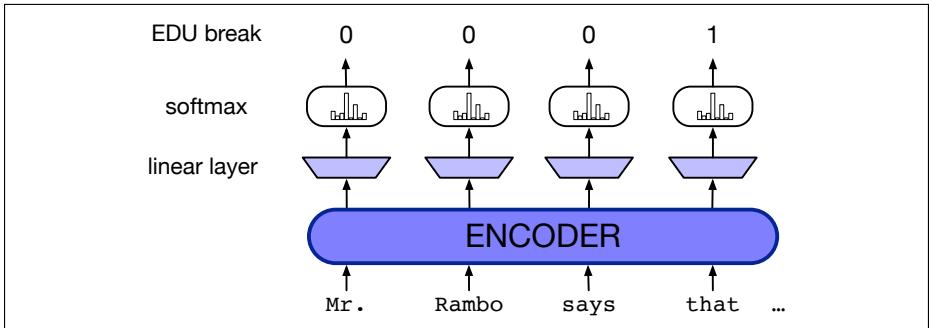
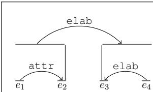

## 25.2 Discourse Structure Parsing

Given a sequence of sentences, how can we automatically determine the coherence discourse parsing relations between them? This task is often called discourse parsing (even though for PDTB we are only assigning labels to leaf spans and not building a full parse

tree as we do for RST).

## 25.2.1 EDU segmentation for RST parsing

RST parsing is generally done in two stages. The first stage, EDU segmentation, extracts the start and end of each EDU. The output of this stage would be a labeling like the following:

(25.16) [Mr. Rambo $\mathrm { s a y s l } _ { \mathrm { e 1 } }$ [that a 3.2-acre property $\mathrm { \Delta }$ [overlooking the San Fernando $\mathrm { V a l l e y } ] _ { \mathrm { e } 3 }$ [is priced at \$4 million $\mathrm { l e } 4$ [because the late actor Erroll Flynn once lived there. $\mathrm { . } \mathrm { l e } 5$

Since EDUs roughly correspond to clauses, early models of EDU segmentation first ran a syntactic parser, and then post-processed the output. Modern systems generally use neural sequence models supervised by the gold EDU segmentation in datasets like the RST Discourse Treebank. Fig. 25.4 shows an example architecture simplified from the algorithm of Lukasik et al. (2020) that predicts for each token whether or not it is a break. Here the input sentence is passed through an encoder and then passed through a linear layer and a softmax to produce a sequence of 0s and 1, where 1 indicates the start of an EDU.

  
Figure 25.4 Predicting EDU segment beginnings from encoded text.

## 25.2.2 RST parsing

Tools for building RST coherence structure for a discourse have long been based on syntactic parsing algorithms like shift-reduce parsing (Marcu, 1999). Many modern RST parsers since Ji and Eisenstein (2014) draw on the neural syntactic parsers we saw in Chapter 20, using representation learning to build representations for each span, and training a parser to choose the correct shift and reduce actions based on the gold parses in the training set.

We’ll describe the shift-reduce parser of Yu et al. (2018). The parser state consists of a stack and a queue, and produces this structure by taking a series of actions on the states. Actions include:

• shift: pushes the first EDU in the queue onto the stack creating a single-node subtree.

• reduce(l,d): merges the top two subtrees on the stack, where l is the coherence relation label, and d is the nuclearity direction, $d \in \{ N N , N S , S N \}$

As well as the pop root operation, to remove the final tree from the stack.

Fig. 25.6 shows the actions the parser takes to build the structure in Fig. 25.5.

$$
e _ {2}:
$$

$$
e _ {4}:
$$

ure 1: An eFigure 25.5 Example RST discourse tree, showing four EDUs. Figure from Yu et al. (2018).

<table><tr><td>Step</td><td>Stack</td><td>Queue</td><td>Action</td><td>Relation</td></tr><tr><td>1</td><td> $\emptyset$ </td><td> $e_1, e_2, e_3, e_4$ </td><td>SH</td><td> $\emptyset$ </td></tr><tr><td>2</td><td> $e_1$ </td><td> $e_2, e_3, e_4$ </td><td>SH</td><td> $\emptyset$ </td></tr><tr><td>3</td><td> $e_1, e_2$ </td><td> $e_3, e_4$ </td><td>RD (attr, SN)</td><td> $\emptyset$ </td></tr><tr><td>4</td><td> $e_{1:2}$ </td><td> $e_3, e_4$ </td><td>SH</td><td> $\widehat{e_1\mathbf{e}_2}$ </td></tr><tr><td>5</td><td> $e_{1:2}, e_3$ </td><td> $e_4$ </td><td>SH</td><td> $\widehat{e_1\mathbf{e}_2}$ </td></tr><tr><td>6</td><td> $e_{1:2}, e_3, e_4$ </td><td> $\emptyset$ </td><td>RD (elab, NS)</td><td> $\widehat{e_1\mathbf{e}_2}$ </td></tr><tr><td>7</td><td> $e_{1:2}, e_{3:4}$ </td><td> $\emptyset$ </td><td>RD (elab, SN)</td><td> $\widehat{e_1\mathbf{e}_2, \widehat{\mathbf{e}_3e_4}}$ </td></tr><tr><td>8</td><td> $e_{1:4}$ </td><td> $\emptyset$ </td><td>PR</td><td> $\widehat{e_1\mathbf{e}_2, \widehat{\mathbf{e}_3e_4}, e_{1:2}\mathbf{e}_{3:4}}$ </td></tr></table>

Figure 25.6 Parsing the example of Fig. 25.5 using a shift-reduce parser. Figure from Yu et al. (2018).

estigate the implicit syntax feature extraction approach for RST parsing. In aThe Yu et al. (2018) uses an encoder-decoder architecture, where the encoder a transition-based neural model for this task, which is able to incorporate vario is an empty state, and the final state represents a full result. There arepresents the input span of words and EDUs using a hierarchical biLSTM. The e exploit hierarchical bi-directional LSTMs (Bi-LSTMs) to encode texts, and furtnsition system:first biLSTM layer represents the words inside an EDU, and the second represents on-based model with dynamic oracle. Basthe EDU sequence. Given an input sentence $w _ { 1 } , w _ { 2 } , . . . , w _ { m }$ osed model, we study t, the words can be repreproposed implicit syntax features. We conduct experiments on a standard RST dwhich removes the first EDU in the queue onto the stack, forming a sinsented as usual (by static embeddings, combinations with character embeddings or tags, or contextual embeddings) resulting in an input word representation sequence $\pmb { \times } _ { 1 } ^ { w } , \pmb { \times } _ { 2 } ^ { w } , . . . , \pmb { \times } _ { m } ^ { w }$ ich merges the top two subtrees on the stack, whe. The result of the word-level biLSTM is then a sequence of $\mathbf { h } ^ { \boldsymbol { w } }$ l is a dvalues:

$$
\mathbf {h} _ {1} ^ {w}, \mathbf {h} _ {2} ^ {w},..., \mathbf {h} _ {m} ^ {w} = \text { biLSTM } (\mathbf {x} _ {1} ^ {w}, \mathbf {x} _ {2} ^ {w},..., \mathbf {x} _ {m} ^ {w})\tag{25.17}
$$

An EDU of span $w _ { s } , w _ { s + 1 } , . . . , w _ { t }$ then has biLSTM output representation $\mathbf { h } _ { s } ^ { w } , \mathbf { h } _ { s + 1 } ^ { w } , . . . , \mathbf { h } _ { t } ^ { w }$ and is represented by average pooling:

$$
\mathbf {x} ^ {e} = \frac {1}{t - s + 1} \sum_ {k = s} ^ {t} \mathbf {h} _ {k} ^ {w}\tag{25.18}
$$

ls including the transition-based neural model, the dynamic oracle strategy and t           The second layer uses this input to compute a final representation of the sequence of ure extraction approas, where each lineEDU representations $\mathbf { h } ^ { e }$ c:

$$
\mathbf {h} _ {1} ^ {e}, \mathbf {h} _ {2} ^ {e}, \dots , \mathbf {h} _ {n} ^ {e} = \operatorname{biLSTM} (\mathbf {x} _ {1} ^ {e}, \mathbf {x} _ {2} ^ {e}, \dots , \mathbf {x} _ {n} ^ {e})\tag{25.19}
$$

sed Discourse ParsingThe decoder is then a feedforward network W that outputs an action o based on a concatenation of the top three subtrees on the stack $( s _ { o } , s _ { 1 } , s _ { 2 } )$ plus the first EDU in the queue $\left( q _ { 0 } \right)$

$$
\mathbf {o} = \mathbf {W} (\mathbf {h} _ {\mathrm{s0}} ^ {\mathrm{t}}, \mathbf {h} _ {\mathrm{s1}} ^ {\mathrm{t}}, \mathbf {h} _ {\mathrm{s2}} ^ {\mathrm{t}}, \mathbf {h} _ {\mathrm{q0}} ^ {\mathrm{e}})\tag{25.20}
$$

.., hn , and the decoder predicts next step acwhere the representation of the EDU on the queue ${ \bf h } _ { \mathrm { q 0 } } ^ { \mathrm { e } }$ s conditioned on the comes directly from the encoder, and the three hidden vectors representing partial trees are computed by average pooling over the encoder output for the EDUs in those trees:

$$
\mathbf {h} _ {\mathrm{s}} ^ {\mathrm{t}} = \frac {1}{j - i + 1} \sum_ {k = i} ^ {j} \mathbf {h} _ {k} ^ {e}\tag{25.21}
$$

Training first maps each RST gold parse tree into a sequence of oracle actions, and then uses the standard cross-entropy loss (with $l _ { 2 }$ regularization) to train the system to take such actions. Give a state $s$ and oracle action $^ { a , }$ we first compute the decoder output using Eq. 25.20, apply a softmax to get probabilities:

$$
p _ {a} = \frac {\exp (\mathbf {o} _ {a})}{\sum_ {a ^ {\prime} \in A} \exp (\mathbf {o} _ {a ^ {\prime}})}\tag{25.22}
$$

and then computing the cross-entropy loss:

$$
L _ {C E} () = - \log (p _ {a}) + \frac {\lambda}{2} | | \Theta | | ^ {2}\tag{25.23}
$$

RST discourse parsers are evaluated on the test section of the RST Discourse Treebank, either with gold EDUs or end-to-end, using the RST-Pareval metrics (Marcu, 2000b). It is standard to first transform the gold RST trees into right-branching binary trees, and to report four metrics: trees with no labels (S for Span), labeled with nuclei (N), with relations (R), or both (F for Full), for each metric computing micro-averaged $\mathrm { F } _ { 1 }$ over all spans from all documents (Marcu 2000b, Morey et al. 2017).

## 25.2.3 PDTB discourse parsing

PDTB discourse parsing, the task of detecting PDTB coherence relations between spans, is sometimes called shallow discourse parsing because the task just involves flat relationships between text spans, rather than the full trees of RST parsing.

The set of four subtasks for PDTB discourse parsing was laid out by Lin et al. (2014) in the first complete system, with separate tasks for explicit (tasks 1-3) and implicit (task 4) connectives:

1. Find the discourse connectives (disambiguating them from non-discourse uses)

2. Find the two spans for each connective

3. Label the relationship between these spans

4. Assign a relation between every adjacent pair of sentences

Many systems have been proposed for Task 4: taking a pair of adjacent sentences as input and assign a coherence relation sense label as output. The setup often follows Lin et al. (2009) in assuming gold sentence span boundaries and assigning each adjacent span one of the 11 second-level PDTB tags or none (removing the 5 very rare tags of the 16 shown in italics in Fig. 25.3).

A simple but very strong algorithm for Task 4 is to represent each of the two spans by BERT embeddings and take the last layer hidden state corresponding to the position of the [CLS] token, pass this through a single layer tanh feedforward network and then a softmax for sense classification (Nie et al., 2019).

Each of the other tasks also have been addressed. Task 1 is to disambiguating discourse connectives from their non-discourse use. For example as Pitler and Nenkova (2009) point out, the word and is a discourse connective linking the two clauses by an elaboration/expansion relation in (25.24) while it’s a non-discourse NP conjunction in (25.25):

(25.24) Selling picked up as previous buyers bailed out of their positions and aggressive short sellers—anticipating further declines—moved in.

(25.25) My favorite colors are blue and green.

Similarly, once is a discourse connective indicating a temporal relation in (25.26), but simply a non-discourse adverb meaning ‘formerly’ and modifying used in (25.27):

(25.26) The asbestos fiber, crocidolite, is unusually resilient once it enters the lungs, with even brief exposures to it causing symptoms that show up decades later, researchers said.

(25.27) A form of asbestos once used to make Kent cigarette filters has caused a high percentage of cancer deaths among a group of workers exposed to it more than 30 years ago, researchers reported.

Determining whether a word is a discourse connective is thus a special case of word sense disambiguation. Early work on disambiguation showed that the 4 PDTB high-level sense classes could be disambiguated with high (94%) accuracy used syntactic features from gold parse trees (Pitler and Nenkova, 2009). Recent work performs the task end-to-end from word inputs using a biLSTM-CRF with BIO outputs (B-CONN, I-CONN, O) (Yu et al., 2019).

For task 2, PDTB spans can be identified with the same sequence models used to find RST EDUs: a biLSTM sequence model with pretrained contextual embedding (BERT) inputs (Muller et al., 2019). Simple heuristics also do pretty well as a baseline at finding spans, since 93% of relations are either completely within a single sentence or span two adjacent sentences, with one argument in each sentence (Biran and McKeown, 2015).
