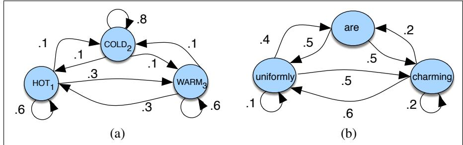
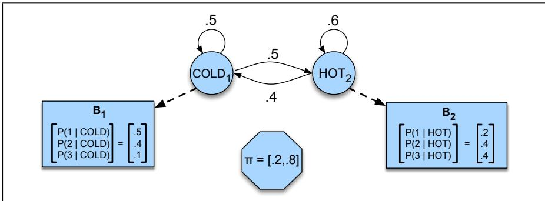
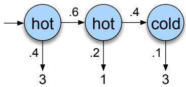
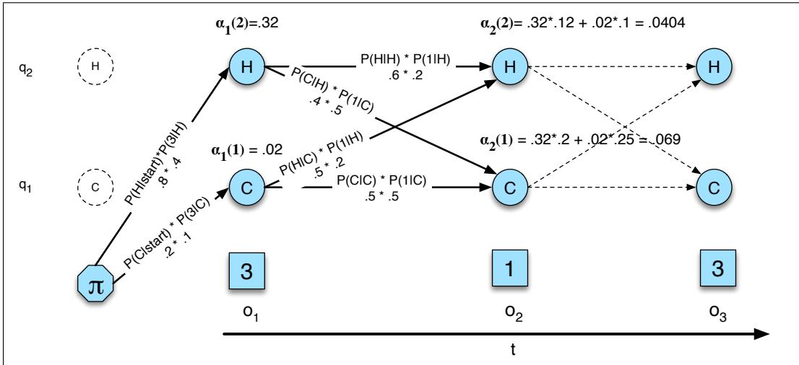
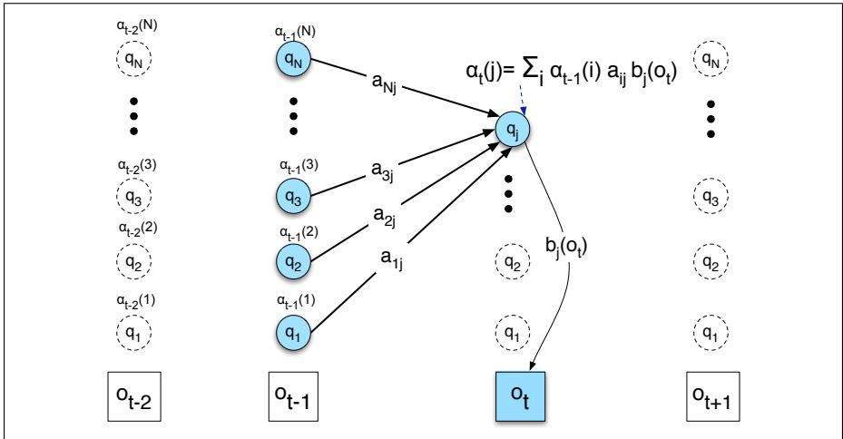
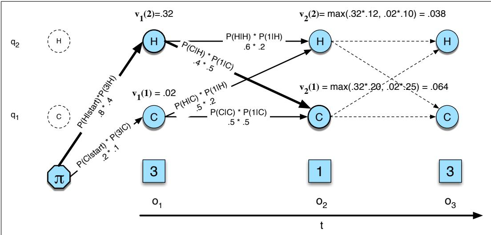
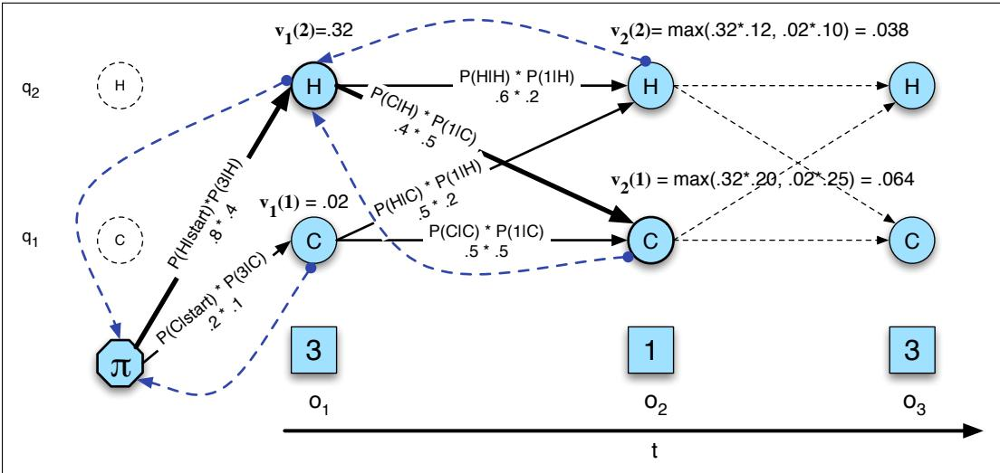
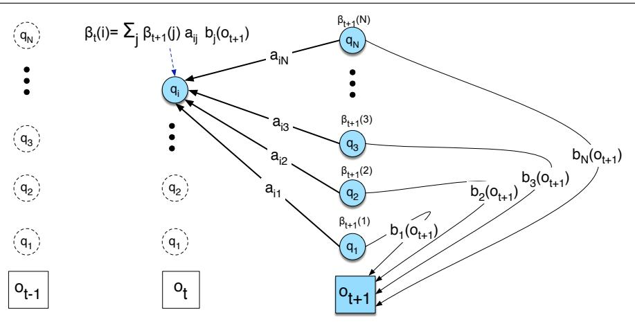

  
Figure A.1 A Markov chain for weather (a) and one for words (b), showing states and transitions. A start distribution π is required; setting $\pi = [ 0 . 1 , 0 . 7 , 0 . 2 ]$ for (a) would mean a probability 0.7 of starting in state 2 (cold), probability 0.1 of starting in state 1 (hot), etc.

CHAPTER

# Hidden Markov Models

Chapter 18 introduced the Hidden Markov Model and applied it to part of speech tagging. Part of speech tagging is a fully-supervised learning task, because we have a corpus of words labeled with the correct part-of-speech tag. But many applications don’t have labeled data. So in this chapter, we introduce the full set of algorithms for HMMs, including the key unsupervised learning algorithm for HMM, the Forward-Backward algorithm. We’ll repeat some of the text from Chapter 18 for readers who want the whole story laid out in a single chapter.

## A.1 Markov Chains

The HMM is based on augmenting the Markov chain. A Markov chain is a model that tells us something about the probabilities of sequences of random variables, states, each of which can take on values from some set. These sets can be words, or tags, or symbols representing anything, like the weather. A Markov chain makes a very strong assumption that if we want to predict the future in the sequence, all that matters is the current state. The states before the current state have no impact on the future except via the current state. It’s as if to predict tomorrow’s weather you could examine today’s weather but you weren’t allowed to look at yesterday’s weather.

More formally, consider a sequence of state variables $q _ { 1 } , q _ { 2 } , . . . , q _ { i }$ . A Markov model embodies the Markov assumption on the probabilities of this sequence: that when predicting the future, the past doesn’t matter, only the present.

Markov Assumption:

$$
P ( q _ { i } = a | q _ { 1 } . . . q _ { i - 1 } ) = P ( q _ { i } = a | q _ { i - 1 } )\tag{A.1}
$$

Markov chain

Figure A.1a shows a Markov chain for assigning a probability to a sequence of weather events, for which the vocabulary consists of HOT, COLD, and WARM. The states are represented as nodes in the graph, and the transitions, with their probabilities, as edges. The transitions are probabilities: the values of arcs leaving a given state must sum to 1. Figure A.1b shows a Markov chain for assigning a probability to a sequence of words $w _ { 1 } . . . w _ { n }$ . This Markov chain should be familiar; in fact, it represents a bigram language model, with each edge expressing the probability $p ( w _ { i } | w _ { j } ) !$ Given the two models in Fig. A.1, we can assign a probability to any sequence from our vocabulary.

Formally, a Markov chain is specified by the following components:

<table><tr><td> $Q = q _ { 1 } q _ { 2 } \ldots q _ { N }$ </td><td>a set of N states</td></tr><tr><td> $A = a _ { 1 1 } a _ { 1 2 } \dots a _ { N 1 } \dots a _ { N N }$ </td><td>a transition probability matrix A, each  $a _ { i j }$  represent- ing the probability of moving from state i to state  $j , \ s . \ t .$   $\begin{array} { r } { \sum _ { j = 1 } ^ { \bar { n } } a _ { i j } = 1 } \end{array}$  ∀i</td></tr><tr><td rowspan="2"> $\pi = \pi _ { 1 } , \pi _ { 2 } , . . . , \pi _ { N }$ </td><td>an initial probability distribution over states. π is the probability that the Markov chain will start in state  $i .$ </td></tr><tr><td>Some states j may have  $\pi _ { j } = 0$  , meaning that they cannot be initial states. Also,  $\begin{array} { r } { \sum _ { i = 1 } ^ { N } \pi _ { i } = 1 } \end{array}$ </td></tr></table>

Before you go on, use the sample probabilities in Fig. A.1a (with $\pi = [ . 1 , . 7 . , 2 ] )$ to compute the probability of each of the following sequences:

## (A.2) hot hot hot hot

(A.3) cold hot cold hot

What does the difference in these probabilities tell you about a real-world weather fact encoded in Fig. A.1a?

## A.2 The Hidden Markov Model

A Markov chain is useful when we need to compute a probability for a sequence of observable events. In many cases, however, the events we are interested in are hidden: we don’t observe them directly. For example we don’t normally observe part-of-speech tags in a text. Rather, we see words, and must infer the tags from the word sequence. We call the tags hidden because they are not observed.

A hidden Markov model (HMM) allows us to talk about both observed events (like words that we see in the input) and hidden events (like part-of-speech tags) that we think of as causal factors in our probabilistic model. An HMM is specified by the following components:

<table><tr><td> $Q = q _ { 1 } q _ { 2 } \ldots q _ { N }$ </td><td>a set of N states</td></tr><tr><td> $A = a _ { 1 1 } \ldots a _ { i j } \ldots a _ { N N }$ </td><td>a transition probability matrix A, each  $a _ { i j }$  representing the probability of moving from state i to state  $\begin{array} { r } { j , { \mathrm { s . t . } } \sum _ { j = 1 } ^ { N } a _ { i j } = 1 } \end{array}$  ∀i</td></tr><tr><td> $B = b _ { i } ( o _ { t } )$ </td><td>a sequence of observation likelihoods, also called emission probabili- ties, each expressing the probability of an observation  $o _ { t }$  (drawn from a</td></tr><tr><td> $\pi = \pi _ { 1 } , \pi _ { 2 } , . . . , \pi _ { N }$ </td><td>vocabulary  $V = \nu _ { 1 } , \nu _ { 2 } , . . . , \nu _ { V } )$  being generated from a state qi an initial probability distribution over states.  $\pi _ { i }$  is the probability that the Markov chain will start in state i. Some states j may have  $\pi _ { j } = 0$  meaning that they cannot be initial states. Also,  $\textstyle \sum _ { i = 1 } ^ { n } \pi _ { i } = 1$ </td></tr></table>

The HMM is given as input ${ \cal O } = o _ { 1 } o _ { 2 } \dots o _ { T } ;$ a sequence of T observations, each one drawn from the vocabulary V.

A first-order hidden Markov model instantiates two simplifying assumptions. First, as with a first-order Markov chain, the probability of a particular state depends

only on the previous state:

Markov Assumption:

$$
P ( q _ { i } | q _ { 1 } . . . q _ { i - 1 } ) = P ( q _ { i } | q _ { i - 1 } )\tag{A.4}
$$

Second, the probability of an output observation $o _ { i }$ depends only on the state that produced the observation $q _ { i }$ and not on any other states or any other observations:

Output Independence:

$$
P ( o _ { i } | q _ { 1 } \dots q _ { i } , \dots , q _ { T } , o _ { 1 } , \dots , o _ { i } , \dots , o _ { T } ) = P ( o _ { i } | q _ { i } )\tag{A.5}
$$

To exemplify these models, we’ll use a task invented by Jason Eisner (2002). Imagine that you are a climatologist in the year 2799 studying the history of global warming. You cannot find any records of the weather in Baltimore, Maryland, for the summer of 2020, but you do find Jason Eisner’s diary, which lists how many ice creams Jason ate every day that summer. Our goal is to use these observations to estimate the temperature every day. We’ll simplify this weather task by assuming there are only two kinds of days: cold (C) and hot (H). So the Eisner task is as follows:

Given a sequence of observations O (each an integer representing the number of ice creams eaten on a given day) find the ‘hidden’ sequence Q of weather states (H or C) which caused Jason to eat the ice cream.

Figure A.2 shows a sample HMM for the ice cream task. The two hidden states (H and C) correspond to hot and cold weather, and the observations (drawn from the alphabet $O = \{ 1 , 2 , 3 \} ,$ ) correspond to the number of ice creams eaten by Jason on a given day.

  
Figure A.2 A hidden Markov model for relating numbers of ice creams eaten by Jason (the observations) to the weather (H or C, the hidden variables).

An influential tutorial by Rabiner (1989), based on tutorials by Jack Ferguson in the 1960s, introduced the idea that hidden Markov models should be characterized by three fundamental problems:

Problem 1 (Likelihood): Given an HMM $\lambda = ( A , B )$ and an observation sequence $O ,$ determine the likelihood $P ( O | \lambda )$   
Problem 2 (Decoding): Given an observation sequence O and an HMM λ = $( A , B )$ , discover the best hidden state sequence Q.   
Problem 3 (Learning): Given an observation sequence O and the set of states in the HMM, learn the HMM parameters A and B.

We already saw an example of Problem 2 in Chapter 18. In the next two sections we introduce the Forward and Forward-Backward algorithms to solve Problems 1 and 3 and give more information on Problem 2

## A.3 Likelihood Computation: The Forward Algorithm

Our first problem is to compute the likelihood of a particular observation sequence. For example, given the ice-cream eating HMM in Fig. A.2, what is the probability of the sequence 3 1 3? More formally:

Computing Likelihood: Given an HMM $\lambda = ( A , B )$ and an observation sequence O, determine the likelihood $P ( O | \lambda )$

For a Markov chain, where the surface observations are the same as the hidden events, we could compute the probability of 3 1 3 just by following the states labeled 3 1 3 and multiplying the probabilities along the arcs. For a hidden Markov model, things are not so simple. We want to determine the probability of an ice-cream observation sequence like 3 1 3, but we don’t know what the hidden state sequence is!

Let’s start with a slightly simpler situation. Suppose we already knew the weather and wanted to predict how much ice cream Jason would eat. This is a useful part of many HMM tasks. For a given hidden state sequence (e.g., hot hot cold), we can easily compute the output likelihood of 3 1 3.

Let’s see how. First, recall that for hidden Markov models, each hidden state produces only a single observation. Thus, the sequence of hidden states and the sequence of observations have the same length. 1

Given this one-to-one mapping and the Markov assumptions expressed in Eq. A.4, for a particular hidden state sequence $Q = q _ { 1 } , q _ { 2 } , . . . , q _ { T }$ and an observation sequence $O = o _ { 1 } , o _ { 2 } , . . . , o _ { T }$ , the likelihood of the observation sequence is

$$
P ( O | Q ) \ = \ \prod _ { i = 1 } ^ { T } P ( o _ { i } | q _ { i } )\tag{A.6}
$$

The computation of the forward probability for our ice-cream observation 3 1 3 from one possible hidden state sequence hot hot cold is shown in Eq. A.7. Figure A.3 shows a graphic representation of this computation.

$$
P ( 3 \ 1 \ 3 | \mathrm { h o t ~ h o t ~ c o l d } ) \ = \ P ( 3 | \mathrm { h o t } ) \times P ( 1 | \mathrm { h o t } ) \times P ( 3 | \mathrm { c o l d } )\tag{A.7}
$$

  
Figure A.3 The computation of the observation likelihood for the ice-cream events 3 1 3 given the hidden state sequence hot hot cold.

But of course, we don’t actually know what the hidden state (weather) sequence was. We’ll need to compute the probability of ice-cream events 3 1 3 instead by

summing over all possible weather sequences, weighted by their probability. First, let’s compute the joint probability of being in a particular weather sequence $Q$ and generating a particular sequence O of ice-cream events. In general, this is

$$
P ( O , Q ) = P ( O | Q ) \times P ( Q ) = \prod _ { i = 1 } ^ { T } P ( o _ { i } | q _ { i } ) \times \prod _ { i = 1 } ^ { T } P ( q _ { i } | q _ { i - 1 } )\tag{A.8}
$$

The computation of the joint probability of our ice-cream observation 3 1 3 and one possible hidden state sequence hot hot cold is shown in Eq. A.9. Figure A.4 shows a graphic representation of this computation.

$$
\begin{array} { r } { P ( \mathrm { 3 ~ 1 ~ 3 } , \mathrm { h o t ~ h o t ~ c o l d } ) \ = \ P ( \mathrm { h o t } | \mathrm { s t a r t } ) \times P ( \mathrm { h o t } | \mathrm { h o t } ) \times P ( \mathrm { c o l d } | \mathrm { h o t } ) } \\ { \times P ( \mathrm { 3 } | \mathrm { h o t } ) \times P ( \mathrm { 1 } | \mathrm { h o t } ) \times P ( \mathrm { 3 } | \mathrm { c o l d } ) \quad } \end{array}\tag{A.9}
$$

  
Figure A.4 The computation of the joint probability of the ice-cream events 3 1 3 and the hidden state sequence hot hot cold.

Now that we know how to compute the joint probability of the observations with a particular hidden state sequence, we can compute the total probability of the observations just by summing over all possible hidden state sequences:

$$
P ( O ) = \sum _ { Q } P ( O , Q ) = \sum _ { Q } P ( O | Q ) P ( Q )\tag{A.10}
$$

For our particular case, we would sum over the eight 3-event sequences cold cold cold, cold cold hot, that is,

$$
P ( 3 \ 1 \ 3 ) = P ( 3 \ 1 \ 3 , \mathrm { c o l d \ c o l d \ c o l d } ) + P ( 3 \ 1 \ 3 , \mathrm { c o l d \ c o l d \ h o t } ) + P ( 3 \ 1 \ 3 , \mathrm { h o t \ h o t \ c o l d } ) + . . .
$$

For an HMM with N hidden states and an observation sequence of T observations, there are $N ^ { T }$ possible hidden sequences. For real tasks, where N and T are both large, $N ^ { T }$ is a very large number, so we cannot compute the total observation likelihood by computing a separate observation likelihood for each hidden state sequence and then summing them.

Instead of using such an extremely exponential algorithm, we use an efficient $O ( N ^ { 2 } T )$ algorithm called the forward algorithm. The forward algorithm is a kind of dynamic programming algorithm, that is, an algorithm that uses a table to store intermediate values as it builds up the probability of the observation sequence. The forward algorithm computes the observation probability by summing over the probabilities of all possible hidden state paths that could generate the observation sequence, but it does so efficiently by implicitly folding each of these paths into a single forward trellis.

Figure A.5 shows an example of the forward trellis for computing the likelihood of 3 1 3 given the hidden state sequence hot hot cold.

  
Figure A.5 The forward trellis for computing the total observation likelihood for the ice-cream events 3 1 3. Hidden states are in circles, observations in squares. The figure shows the computation of $\alpha _ { t } ( j )$ for two states at two time steps. The computation in each cell follows Eq. A.12: $\begin{array} { r } { \alpha _ { t } ( j ) = \sum _ { i = 1 } ^ { N ^ { - } } \alpha _ { t - 1 } ( i ) a _ { i j } b _ { j } ( o _ { t } ) } \end{array}$ . The resulting probability expressed in each cell is Eq. A.11: $\alpha _ { t } ( j ) = P ( o _ { 1 } , o _ { 2 } \ldots o _ { t } , q _ { t } = j | \lambda )$

Each cell of the forward algorithm trellis $\alpha _ { t } ( j )$ represents the probability of being in state j after seeing the first t observations, given the automaton $\lambda$ . The value of each cell $\alpha _ { t } ( j )$ is computed by summing over the probabilities of every path that could lead us to this cell. Formally, each cell expresses the following probability:

$$
\alpha _ { t } ( j ) = P ( o _ { 1 } , o _ { 2 } \ldots o _ { t } , q _ { t } = j | \lambda )\tag{A.11}
$$

Here, $q _ { t } = j$ means “the $t ^ { \mathrm { t h } }$ state in the sequence of states is state $j ^ { \ast }$ . We compute this probability $\alpha _ { t } ( j )$ by summing over the extensions of all the paths that lead to the current cell. For a given state $q _ { j }$ at time t, the value $\alpha _ { t } ( j )$ is computed as

$$
\alpha _ { t } ( j ) = \sum _ { i = 1 } ^ { N } \alpha _ { t - 1 } ( i ) a _ { i j } b _ { j } ( o _ { t } )\tag{A.12}
$$

The three factors that are multiplied in Eq. A.12 in extending the previous paths to compute the forward probability at time t are

$\alpha _ { t - 1 } ( i )$ the previous forward path probability from the previous time step $a _ { i j }$ the transition probability from previous state $q _ { i }$ to current state $q _ { j }$ $b _ { j } ( o _ { t } )$ the state observation likelihood of the observation symbol $o _ { t }$ given the current state j

Consider the computation in Fig. A.5 of $\alpha _ { 2 } ( 2 )$ , the forward probability of being at time step 2 in state 2 having generated the partial observation 3 1. We compute by extending the α probabilities from time step 1, via two paths, each extension consisting of the three factors above: $\alpha _ { 1 } ( 1 ) \times P ( H | C ) \times P ( 1 | H )$ and $\alpha _ { 1 } ( 2 ) \times P ( H | H ) \times$ P(1|H).

Figure A.6 shows another visualization of this induction step for computing the value in one new cell of the trellis.

We give two formal definitions of the forward algorithm: the pseudocode in Fig. A.7 and a statement of the definitional recursion here.

  
Figure A.6 Visualizing the computation of a single element $\alpha _ { t } ( i )$ in the trellis by summing all the previous values $\alpha _ { t - 1 } .$ weighted by their transition probabilities $^ { a , }$ and multiplying by the observation probability $b _ { i } ( o _ { t } )$ . For many applications of HMMs, many of the transition probabilities are $0 ,$ so not all previous states will contribute to the forward probability of the current state. Hidden states are in circles, observations in squares. Shaded nodes are included in the probability computation for $\alpha _ { t } ( i )$

function FORWARD(observations of len T, state-graph of len N) returnsforward-prob   
create a probability matrix forward[N,T]   
for each state s from 1 to N do ; initialization step   
$f o r w a r d [ s , 1 ] \gets \pi _ { s } * b _ { s } ( o _ { 1 } )$   
for each time step t from 2 to T do ; recursion step   
for each state s from 1 to N do   
forward[s $, t ]  \sum _ { s ^ { \prime } = 1 } ^ { N } f o r w a r d [ s ^ { \prime } , t - 1 ] * a _ { s ^ { \prime } , s } * b _ { s } ( o _ { t } )$   
N   
forwardprob←X forward[s,T] ; termination step   
s=1   
return forwardprob  
Figure A.7 The forward algorithm, where forward $\left[ s , t \right]$ represents $\alpha _ { t } ( s )$

1. Initialization:

$$
\alpha _ { 1 } ( j ) ~ = ~ \pi _ { j } b _ { j } ( o _ { 1 } ) ~ 1 \le j \le N
$$

2. Recursion:

$$
\alpha _ { t } ( j ) = \sum _ { i = 1 } ^ { N } \alpha _ { t - 1 } ( i ) a _ { i j } b _ { j } ( o _ { t } ) ; ~ 1 \leq j \leq N , 1 < t \leq T
$$

3. Termination:

$$
P ( O | \lambda ) = \sum _ { i = 1 } ^ { N } \alpha _ { T } ( i )
$$

## A.4 Decoding: The Viterbi Algorithm

For any model, such as an HMM, that contains hidden variables, the task of determining which sequence of variables is the underlying source of some sequence of observations is called the decoding task. In the ice-cream domain, given a sequence of ice-cream observations 3 1 3 and an HMM, the task of the decoder is to find the best hidden weather sequence (H H H). More formally,

Decoding: Given as input an HMM $\lambda = ( A , B )$ and a sequence of observations $O = o _ { 1 } , o _ { 2 } , . . . , o _ { T }$ , find the most probable sequence of states $Q = q _ { 1 } q _ { 2 } q _ { 3 } \ldots q _ { T } .$

We might propose to find the best sequence as follows: For each possible hidden state sequence (HHH, HHC, HCH, etc.), we could run the forward algorithm and compute the likelihood of the observation sequence given that hidden state sequence. Then we could choose the hidden state sequence with the maximum observation likelihood. It should be clear from the previous section that we cannot do this because there are an exponentially large number of state sequences.

Instead, the most common decoding algorithms for HMMs is the Viterbi algorithm. Like the forward algorithm, Viterbi is a kind of dynamic programming that makes uses of a dynamic programming trellis. Viterbi also strongly resembles another dynamic programming variant, the minimum edit distance algorithm of Chapter 2.

  
Figure A.8 The Viterbi trellis for computing the best path through the hidden state space for the ice-cream eating events 3 1 3. Hidden states are in circles, observations in squares. White (unfilled) circles indicate illegal transitions. The figure shows the computation of $\nu _ { t } ( j )$ for two states at two time steps. The computation in each cell follows Eq. A.14: $\begin{array} { r } { \nu _ { t } \left( j \right) = \operatorname* { m a x } _ { 1 \leq i \leq N - 1 } \nu _ { t - 1 } ( i ) a _ { i j } b _ { j } ( o _ { t } ) } \end{array}$ . The resulting probability expressed in each cell is Eq. A.13: $\nu _ { t } ( j ) = P ( q _ { 0 } , q _ { 1 } , \dots , q _ { t - 1 } , o _ { 1 } , o _ { 2 } , \dots , o _ { t } , q _ { t } = j | \lambda )$ ).

Figure A.8 shows an example of the Viterbi trellis for computing the best hidden state sequence for the observation sequence 3 1 3. The idea is to process the observation sequence left to right, filling out the trellis. Each cell of the trellis, $\nu _ { t } ( j )$ represents the probability that the HMM is in state $j$ after seeing the first t observations and passing through the most probable state sequence $q _ { 1 } , . . . , q _ { t - 1 }$ , given the automaton λ. The value of each cell $\nu _ { t } ( j )$ is computed by recursively taking the most probable path that could lead us to this cell. Formally, each cell expresses the probability

$$
\nu _ { t } ( j ) = \operatorname* { m a x } _ { q _ { 1 } , \dots , q _ { t - 1 } } P ( q _ { 1 } \dots q _ { t - 1 } , o _ { 1 } , o _ { 2 } \dots o _ { t } , q _ { t } = j | \lambda )\tag{A.13}
$$

Note that we represent the most probable path by taking the maximum over all possible previous state sequences max . Like other dynamic programming algo-$q _ { 1 } , . . . , q _ { t - 1 }$ rithms, Viterbi fills each cell recursively. Given that we had already computed the probability of being in every state at time $t - 1$ , we compute the Viterbi probability by taking the most probable of the extensions of the paths that lead to the current cell. For a given state $q _ { j }$ at time t, the value $\nu _ { t } ( j )$ is computed as

$$
\nu _ { t } ( j ) ~ = ~ \operatorname* { m a x } _ { i = 1 } ^ { N } \nu _ { t - 1 } ( i ) a _ { i j } b _ { j } ( o _ { t } )\tag{A.14}
$$

The three factors that are multiplied in Eq. A.14 for extending the previous paths to compute the Viterbi probability at time t are

$\nu _ { t - 1 } ( i )$ the previous Viterbi path probability from the previous time step   
$a _ { i j }$ the transition probability from previous state $q _ { i }$ to current state $q _ { j }$   
$b _ { j } ( o _ { t } )$ the state observation likelihood of the observation symbol $o _ { t }$ given   
the current state j

function VITERBI(observations of len T,state-graph of len N) returns best-path, path-prob   
create a path probability matrix viterbi[N,T]   
for each state s from 1 to N do ; initialization step   
viterbi[s,1] ← πs ∗ bs(o1)   
backpointer[s,1]←0   
for each time step t from 2 to T do ; recursion step   
for each state s from 1 to N do   
N   
viterbi[s,t] ← max viterbi[s′, t − 1] ∗ as′,s ∗ bs(ot )   
s′=1   
N   
backpointer[s,t] ← argmax viterbi $[ s ^ { \prime } , t - 1 ] * a _ { s ^ { \prime } , s } * b _ { s } ( o _ { t } )$   
s′=1   
N   
bestpathprob← max viterbi[s,T] ; termination step   
s=1   
N   
bestpathpointer← argmax viterbi[s,T] ; termination step   
s=1   
bestpath ← the path starting at state bestpathpointer, that follows backpointer[] to states back in time   
return bestpath, bestpathprob  
Figure A.9 Viterbi algorithm for finding optimal sequence of hidden states. Given an observation sequence and an HMM $\lambda = ( A , B )$ , the algorithm returns the state path through the HMM that assigns maximum likelihood to the observation sequence.

Figure A.9 shows pseudocode for the Viterbi algorithm. Note that the Viterbi algorithm is identical to the forward algorithm except that it takes the max over the previous path probabilities whereas the forward algorithm takes the sum. Note also that the Viterbi algorithm has one component that the forward algorithm doesn’t have: backpointers. The reason is that while the forward algorithm needs to produce an observation likelihood, the Viterbi algorithm must produce a probability and also the most likely state sequence. We compute this best state sequence by keeping track of the path of hidden states that led to each state, as suggested in Fig. A.10, and then at the end backtracing the best path to the beginning (the Viterbi backtrace).

  
Figure A.10 The Viterbi backtrace. As we extend each path to a new state account for the next observation, we keep a backpointer (shown with broken lines) to the best path that led us to this state.

Finally, we can give a formal definition of the Viterbi recursion as follows:

## 1. Initialization:

$$
\begin{array} { l l } { { \nu _ { 1 } ( j ) ~ = ~ \pi _ { j } b _ { j } ( o _ { 1 } ) } } & { { ~ 1 \leq j \leq N } } \\ { { b t _ { 1 } ( j ) ~ = ~ 0 } } & { { ~ 1 \leq j \leq N } } \end{array}
$$

## 2. Recursion

$$
\nu _ { t } ( j ) ~ = ~ \operatorname* { m a x } _ { i = 1 } ^ { N } \nu _ { t - 1 } ( i ) a _ { i j } b _ { j } ( o _ { t } ) ; ~ 1 \leq j \leq N , 1 < t \leq T
$$

$$
b t _ { t } ( j ) ~ = ~ \underset { i = 1 } { \overset { N } { \operatorname { a r g m a x } } } \nu _ { t - 1 } ( i ) a _ { i j } b _ { j } ( o _ { t } ) ; ~ 1 \leq j \leq N , 1 < t \leq T
$$

## 3. Termination:

The best score:

$$
P * \ = \ \operatorname* { m a x } _ { i = 1 } ^ { N } \nu _ { T } ( i )
$$

The start of backtrace:

$$
q _ { T ^ { * } } = \underset { i = 1 } { \mathrm { a r g m a x } } \ \nu _ { T } ( i )
$$

## A.5 HMM Training: The Forward-Backward Algorithm

We turn to the third problem for HMMs: learning the parameters of an HMM, that is, the A and B matrices. Formally,

Learning: Given an observation sequence O and the set of possible states in the HMM, learn the HMM parameters A and B.

The input to such a learning algorithm would be an unlabeled sequence of observations O and a vocabulary of potential hidden states Q. Thus, for the ice cream task, we would start with a sequence of observations $O = \{ 1 , 3 , 2 , . . . , \}$ and the set of hidden states H and C.

The standard algorithm for HMM training is the forward-backward, or Baum-Welch algorithm (Baum, 1972), a special case of the Expectation-Maximization or EM algorithm (Dempster et al., 1977). The algorithm will let us train both the transition probabilities A and the emission probabilities B of the HMM. EM is an iterative algorithm, computing an initial estimate for the probabilities, then using those estimates to compute a better estimate, and so on, iteratively improving the probabilities that it learns.

Let us begin by considering the much simpler case of training a fully visible Markov model, where we know both the temperature and the ice cream count for every day. That is, imagine we see the following set of input observations and magically knew the aligned hidden state sequences:

$$
\begin{array} { l l l l l l l } { { 3 } } & { { 3 } } & { { 2 } } & { { \qquad } } & { { 1 } } & { { 1 } } & { { 2 } } & { { \qquad } } & { { 1 } } & { { 2 \quad 3 } } \\ { { \mathrm { h o t } } } & { { \mathrm { h o t } \mathrm { c o l d } } } & { { \qquad } } & { { \mathrm { c o l d } } } & { { \mathrm { c o l d } \mathrm { c o l d } \mathrm { c o l d } } } & { { \qquad } } & { { \mathrm { c o l d } \mathrm { h o t } \mathrm { h o t } } } & { { } } & { { } } \end{array}
$$

This would easily allow us to compute the HMM parameters just by maximum likelihood estimation from the training data. First, we can compute π from the count of the 3 initial hidden states:

$$
\pi _ { h } = 1 / 3 ~ \pi _ { c } = 2 / 3
$$

Next we can directly compute the A matrix from the transitions, ignoring the final hidden states:

$$
\begin{array} { r l } { p ( h o t | h o t ) = 2 / 3 } & { { } \ p ( c o l d | h o t ) = 1 / 3 } \\ { p ( c o l d | c o l d ) = 2 / 3 } & { { } \ p ( h o t | c o l d ) = 1 / 3 } \end{array}
$$

and the B matrix:

$$
\begin{array} { r l } { P ( 1 | h o t ) = 0 / 4 = 0 } & { { } p ( 1 | c o l d ) = 3 / 5 = . 6 } \\ { P ( 2 | h o t ) = 1 / 4 = . 2 5 } & { { } p ( 2 | c o l d = 2 / 5 = . 4 } \\ { P ( 3 | h o t ) = 3 / 4 = . 7 5 } & { { } p ( 3 | c o l d ) = 0 } \end{array}
$$

For a real HMM, we cannot compute these counts directly from an observation sequence since we don’t know which path of states was taken through the machine for a given input. For example, suppose I didn’t tell you the temperature on day 2, and you had to guess it, but you (magically) had the above probabilities, and the temperatures on the other days. You could do some Bayesian arithmetic with all the other probabilities to get estimates of the likely temperature on that missing day, and use those to get expected counts for the temperatures for day 2.

But the real problem is even harder: we don’t know the counts of being in any of the hidden states!! The Baum-Welch algorithm solves this by iteratively estimating the counts. We will start with an estimate for the transition and observation probabilities and then use these estimated probabilities to derive better and better probabilities. And we’re going to do this by computing the forward probability for an observation and then dividing that probability mass among all the different paths that contributed to this forward probability.

To understand the algorithm, we need to define a useful probability related to the forward probability and called the backward probability. The backward probability $\beta$ is the probability of seeing the observations from time $t + 1$ to the end, given that we are in state i at time t (and given the automaton λ):

$$
\beta _ { t } ( i ) = P ( o _ { t + 1 } , o _ { t + 2 } \dots o _ { T } | q _ { t } = i , \lambda )\tag{A.15}
$$

It is computed inductively in a similar manner to the forward algorithm.

## 1. Initialization:

$$
\beta _ { T } ( i ) ~ = ~ 1 , ~ 1 \leq i \leq N
$$

## 2. Recursion

$$
\beta _ { t } ( i ) = \sum _ { j = 1 } ^ { N } a _ { i j } b _ { j } ( o _ { t + 1 } ) \beta _ { t + 1 } ( j ) , 1 \le i \le N , 1 \le t < T
$$

## 3. Termination:

$$
P ( O | \lambda ) = \sum _ { j = 1 } ^ { N } \pi _ { j } b _ { j } ( o _ { 1 } ) \beta _ { 1 } ( j )
$$

Figure A.11 illustrates the backward induction step.

  
Figure A.11 The computation of $\beta _ { t } ( i )$ by summing all the successive values $\beta _ { t + 1 } ( j )$ weighted by their transition probabilities $a _ { i j }$ and their observation probabilities $b _ { j } ( o _ { t + 1 } )$

We are now ready to see how the forward and backward probabilities can help compute the transition probability $a _ { i j }$ and observation probability $b _ { i } ( o _ { t } )$ from an observation sequence, even though the actual path taken through the model is hidden.

Let’s begin by seeing how to estimate $\hat { a } _ { i j }$ by a variant of simple maximum likelihood estimation:

$$
\hat { a } _ { i j } = \frac { \mathrm { e x p e c t e d ~ n u m b e r ~ o f ~ t r a n s i t i o n s ~ f r o m ~ s t a t e ~ } i \mathrm { ~ t o ~ s t a t e ~ } j } { \mathrm { e x p e c t e d ~ n u m b e r ~ o f ~ t r a n s i t i o n s ~ f r o m ~ s t a t e ~ } i }\tag{A.16}
$$

How do we compute the numerator? Here’s the intuition. Assume we had some estimate of the probability that a given transition $i  j$ was taken at a particular point in time t in the observation sequence. If we knew this probability for each particular time t, we could sum over all times t to estimate the total count for the transition $i  j .$

More formally, let’s define the probability $\xi _ { t }$ as the probability of being in state i at time t and state $j$ at time $t + 1$ , given the observation sequence and of course the model:

$$
\xi _ { t } ( i , j ) = P ( q _ { t } = i , q _ { t + 1 } = j | O , \lambda )\tag{A.17}
$$

To compute $\xi _ { t }$ , we first compute a probability which is similar to $\xi _ { t }$ , but differs in including the probability of the observation; note the different conditioning of O from Eq. A.17:

$$
\mathrm { n o t \mathrm { - } q u i t e - } \xi _ { t } ( i , j ) = P ( q _ { t } = i , q _ { t + 1 } = j , O | \lambda )\tag{A.18}
$$

  
Figure A.12 Computation of the joint probability of being in state i at time t and state j at time t + 1. The figure shows the various probabilities that need to be combined to produce $P ( q _ { t } = i , q _ { t + 1 } = j , O | \lambda )$ : the α and $\beta$ probabilities, the transition probability $a _ { i j }$ and the observation probability $b _ { j } ( o _ { t + 1 } )$ . After Rabiner (1989) which is ©1989 IEEE.

Figure A.12 shows the various probabilities that go into computing not-quite- $\cdot \xi _ { t }$ : the transition probability for the arc in question, the α probability before the arc, the $\beta$ probability after the arc, and the observation probability for the symbol just after the arc. These four are multiplied together to produce not-quite-ξ as follows:

$$
\mathrm { n o t - q u i t e - } \xi _ { t } ( i , j ) = \alpha _ { t } ( i ) a _ { i j } b _ { j } ( o _ { t + 1 } ) \beta _ { t + 1 } ( j )\tag{A.19}
$$

To compute $\xi _ { t }$ from not-quite $\cdot \xi _ { t }$ , we follow the laws of probability and divide by $P ( O | \lambda )$ , since

$$
P ( X | Y , Z ) = { \frac { P ( X , Y | Z ) } { P ( Y | Z ) } }\tag{A.20}
$$

The probability of the observation given the model is simply the forward probability of the whole utterance (or alternatively, the backward probability of the whole utterance):

$$
P ( O | \lambda ) = \sum _ { j = 1 } ^ { N } \alpha _ { t } ( j ) \beta _ { t } ( j )\tag{A.21}
$$

So, the final equation for $\xi _ { t }$ is

$$
\xi _ { t } ( i , j ) = \frac { \alpha _ { t } ( i ) a _ { i j } b _ { j } ( o _ { t + 1 } ) \beta _ { t + 1 } ( j ) } { \sum _ { j = 1 } ^ { N } \alpha _ { t } ( j ) \beta _ { t } ( j ) }\tag{A.22}
$$

The expected number of transitions from state i to state $j$ is then the sum over all t of $\xi$ . For our estimate of $a _ { i j }$ in Eq. A.16, we just need one more thing: the total expected number of transitions from state i. We can get this by summing over all transitions out of state i. Here’s the final formula for $\hat { a } _ { i j } { \mathrm { : } }$

$$
\hat { a } _ { i j } = \frac { \sum _ { t = 1 } ^ { T - 1 } \xi _ { t } ( i , j ) } { \sum _ { t = 1 } ^ { T - 1 } \sum _ { k = 1 } ^ { N } \xi _ { t } ( i , k ) }\tag{A.23}
$$

We also need a formula for recomputing the observation probability. This is the probability of a given symbol $\nu _ { k }$ from the observation vocabulary V, given a state $j \colon$ $\hat { b } _ { j } ( \nu _ { k } )$ ). We will do this by trying to compute

$$
\hat { b } _ { j } ( \nu _ { k } ) = \frac { \mathrm { e x p e c t e d n u m b e r ~ o f ~ t i m e s ~ i n ~ s t a t e ~ } j \mathrm { ~ a n d ~ o b s e r v i n g ~ s y m b o l ~ } \nu _ { k } } { \mathrm { e x p e c t e d n u m b e r ~ o f ~ t i m e s ~ i n ~ s t a t e ~ } j }\tag{A.24}
$$

For this, we will need to know the probability of being in state j at time t, which we will call $\gamma _ { t } ( j ) \colon$

$$
\begin{array} { r } { \gamma _ { t } ( j ) = P ( q _ { t } = j | O , \lambda ) } \end{array}\tag{A.25}
$$

Once again, we will compute this by including the observation sequence in the probability:

$$
\gamma _ { t } ( j ) = \frac { P ( q _ { t } = j , O | \lambda ) } { P ( O | \lambda ) }\tag{A.26}
$$

  
Figure A.13 The computation of $\gamma _ { t } ( j )$ , the probability of being in state j at time t. Note that γ is really a degenerate case of $\xi$ and hence this figure is like a version of Fig. A.12 with state i collapsed with state $j .$ After Rabiner (1989) which is ©1989 IEEE.

As Fig. A.13 shows, the numerator of Eq. A.26 is just the product of the forward probability and the backward probability:

$$
\gamma _ { t } ( j ) = \frac { \alpha _ { t } ( j ) \beta _ { t } ( j ) } { P ( O | { \lambda } ) }\tag{A.27}
$$

We are ready to compute b. For the numerator, we sum $\gamma _ { t } ( j )$ for all time steps t in which the observation $o _ { t }$ is the symbol $\nu _ { k }$ that we are interested in. For the denominator, we sum $\gamma _ { t } ( j )$ over all time steps t. The result is the percentage of the times that we were in state j and saw symbol $\nu _ { k }$ (the notation $\scriptstyle \sum _ { t = 1 } ^ { \hat { T } } _ { s . t . O _ { t } = \nu _ { k } }$ means “sum over all t for which the observation at time t was $\nu _ { k } \vec { \mathbf { \Omega } } )$ :

$$
\hat { b } _ { j } ( \nu _ { k } ) = \frac { \sum _ { t = 1 } ^ { T } \rvert _ { s . t . O _ { t } = \nu _ { k } } \gamma _ { t } ( j ) } { \sum _ { t = 1 } ^ { T } \gamma _ { t } ( j ) }\tag{A.28}
$$

We now have ways in Eq. A.23 and Eq. A.28 to re-estimate the transition A and observation B probabilities from an observation sequence $O ,$ assuming that we already have a previous estimate of A and B.

These re-estimations form the core of the iterative forward-backward algorithm. The forward-backward algorithm $( \mathrm { F i g . } \mathrm { A . } 1 4 )$ starts with some initial estimate of the HMM parameters $\lambda = ( A , B )$ . We then iteratively run two steps. Like other cases of the EM (expectation-maximization) algorithm, the forward-backward algorithm has two steps: the expectation step, or E-step, and the maximization step, or M-step.

In the E-step, we compute the expected state occupancy count γ and the expected state transition count $\xi$ from the earlier A and B probabilities. In the M-step, we use $\gamma$ and $\xi$ to recompute new A and B probabilities.

function FORWARD-BACKWARD(observations of len $T ,$ output vocabulary V, hidden   
state set Q) returns HMM=(A,B)   
initialize A and B   
iterate until convergence   
E-step   
γt(j) = αt(j)βt(j)P(O|λ ) ∀tand j   
$\xi _ { t } ( i , j ) = \frac { \alpha _ { t } ( i ) a _ { i j } b _ { j } ( o _ { t + 1 } ) \beta _ { t + 1 } ( j ) } { P ( O | \lambda ) } \ \forall t , i , \mathrm { a n d } j$   
M-step   
T−1   
X ξt(i, j)   
aˆi j = T−1 N t=1   
X X ξt(i, k)   
t=1 k=1   
T   
X γt(j)   
bˆ j(vk) = t=1s.t.Ot =vk   
X γt(j)   
t=1   
return A, B

Figure A.14 The forward-backward algorithm.

Although in principle the forward-backward algorithm can do completely unsupervised learning of the A and B parameters, in practice the initial conditions are very important. For this reason the algorithm is often given extra information. For example, for HMM-based speech recognition, the HMM structure is often set by hand, and only the emission (B) and (non-zero) A transition probabilities are trained from a set of observation sequences O.

## A.6 Summary

This chapter introduced the hidden Markov model for probabilistic sequence classification.

• Hidden Markov models (HMMs) are a way of relating a sequence of observations to a sequence of hidden classes or hidden states that explain the observations.

• The process of discovering the sequence of hidden states, given the sequence of observations, is known as decoding or inference. The Viterbi algorithm is commonly used for decoding.

• The parameters of an HMM are the A transition probability matrix and the B observation likelihood matrix. Both can be trained with the Baum-Welch or forward-backward algorithm.

## Historical Notes

As we discussed in Chapter 18, Markov chains were first used by Markov (1913) (translation Markov 2006), to predict whether an upcoming letter in Pushkin’s Eugene Onegin would be a vowel or a consonant. The hidden Markov model was developed by Baum and colleagues at the Institute for Defense Analyses in Princeton (Baum and Petrie 1966, Baum and Eagon 1967).

The Viterbi algorithm was first applied to speech and language processing in the context of speech recognition by Vintsyuk (1968) but has what Kruskal (1983) calls a “remarkable history of multiple independent discovery and publication”. Kruskal and others give at least the following independently-discovered variants of the algorithm published in four separate fields:

<table><tr><td>Citation</td><td>Field</td></tr><tr><td>Viterbi (1967)</td><td>information theory speech processing</td></tr><tr><td>Vintsyuk (1968) Needleman and Wunsch (1970)</td><td>molecular biology</td></tr><tr><td>Sakoe and Chiba (1971)</td><td>speech processing</td></tr><tr><td>Sankoff (1972)</td><td>molecular biology</td></tr><tr><td>Reichert et al. (1973)</td><td>molecular biology</td></tr><tr><td>Wagner and Fischer (1974)</td><td>computer science</td></tr></table>

The use of the term Viterbi is now standard for the application of dynamic programming to any kind of probabilistic maximization problem in speech and language processing. For non-probabilistic problems (such as for minimum edit distance), the plain term dynamic programming is often used. Forney, Jr. (1973) wrote an early survey paper that explores the origin of the Viterbi algorithm in the context of information and communications theory.

Our presentation of the idea that hidden Markov models should be characterized by three fundamental problems was modeled after an influential tutorial by Rabiner (1989), which was itself based on tutorials by Jack Ferguson of IDA in the 1960s. Jelinek (1997) and Rabiner and Juang (1993) give very complete descriptions of the forward-backward algorithm as applied to the speech recognition problem. Jelinek (1997) also shows the relationship between forward-backward and EM.

Baum, L. E. 1972. An inequality and associated maximization technique in statistical estimation for probabilistic functions of Markov processes. Inequalities III: Pro ceedings of the 3rd Symposium on Inequalities. Academic Press.

Baum, L. E. and J. A. Eagon. 1967. An inequality with appli cations to statistical estimation for probabilistic functions of Markov processes and to a model for ecology. Bulletin ofthe American Mathematical Society, 73(3):360–363.

Baum, L. E. and T. Petrie. 1966. Statistical inference for probabilistic functions of finite-state Markov chains. Annals of Mathematical Statistics, 37(6):1554–1563.

Dempster, A. P., N. M. Laird, and D. B. Rubin. 1977. Maximum likelihood from incomplete data via the EM algorithm. Journal of the Royal Statistical Society, 39(1):1– 21.

Eisner, J. 2002. An interactive spreadsheet for teaching the forward-backward algorithm. Proceedings of the ACL Workshop on Effective Tools and Methodologiesfor Teaching NLP and CL.

Forney, Jr., G. D. 1973. The Viterbi algorithm. Proceedings ofthe IEEE, 61(3):268–278.

Jelinek, F. 1997. Statistical Methods for Speech Recognition. MIT Press.

Kruskal, J. B. 1983. An overview of sequence comparison. In D. Sankoff and J. B. Kruskal, eds, Time Warps, String Edits, and Macromolecules: The Theory and Practice of Sequence Comparison, 1–44. Addison-Wesley.

Markov, A. A. 1913. Essai d’une recherche statistique sur le texte du roman “Eugene Onegin” illustrant la liaison des epreuve en chain (‘Example of a statistical investiga tion of the text of “Eugene Onegin” illustrating the de pendence between samples in chain’). Izvistia Impera torskoi Akademii Nauk (Bulletin de l’Academie Imp´ eriale´ des Sciences de St.-Petersbourg) ´ , 7:153–162.

Markov, A. A. 2006. Classical text in translation: A. A. Markov, an example of statistical investigation of the text Eugene Onegin concerning the connection of samples in chains. Science in Context, 19(4):591–600. Translated by David Link.

Needleman, S. B. and C. D. Wunsch. 1970. A general method applicable to the search for similarities in the amino-acid sequence of two proteins. Journal of Molec ular Biology, 48:443–453.

Rabiner, L. R. 1989. A tutorial on hidden Markov models and selected applications in speech recognition. Proceedings ofthe IEEE, 77(2):257–286.

Rabiner, L. R. and B. H. Juang. 1993. Fundamentals of Speech Recognition. Prentice Hall.

Reichert, T. A., D. N. Cohen, and A. K. C. Wong. 1973. An application of information theory to genetic mutations and the matching of polypeptide sequences. Journal of Theoretical Biology, 42:245–261.

Sakoe, H. and S. Chiba. 1971. A dynamic programming approach to continuous speech recognition. Proceedings of the Seventh International Congress on Acoustics, volume 3. Akademiai Kiad´ o.´

Sankoff, D. 1972. Matching sequences under deletioninsertion constraints. Proceedings of the National Academy of Sciences, 69:4–6.

Vintsyuk, T. K. 1968. Speech discrimination by dynamic programming. Cybernetics, 4(1):52–57. Original Russian: Kibernetika 4(1):81-88. 1968.

Viterbi, A. J. 1967. Error bounds for convolutional codes and an asymptotically optimum decoding algorithm. IEEE Transactions on Information Theory, IT-13(2):260–269.

Wagner, R. A. and M. J. Fischer. 1974. The string-to-string correction problem. Journal ofthe ACM, 21:168–173.