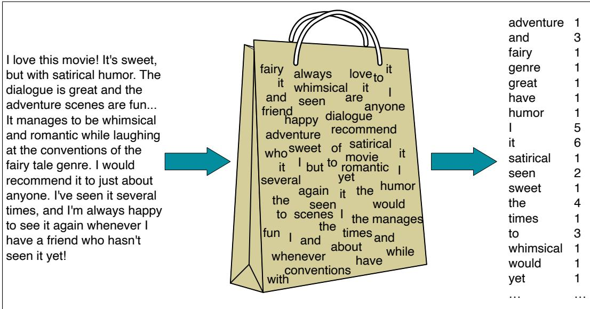
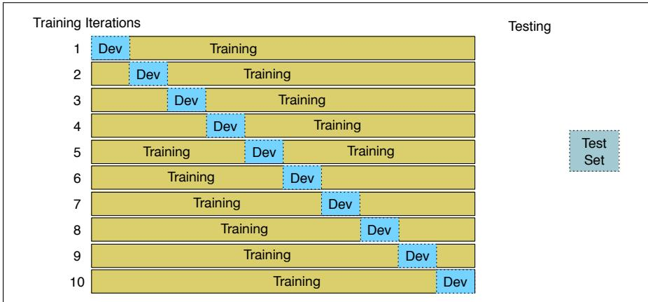

CHAPTER

B

# Naive Bayes, Text Classification, and Sentiment

Classification lies at the heart of both human and machine intelligence. Deciding what letter, word, or image has been presented to our senses, recognizing faces or voices, sorting mail, assigning grades to homeworks; these are all examples of assigning a category to an input. The potential challenges of this task are highlighted by the fabulist Jorge Luis Borges (1964), who imagined classifying animals into:

(a) those that belong to the Emperor, (b) embalmed ones, (c) those that are trained, (d) suckling pigs, (e) mermaids, (f) fabulous ones, (g) stray dogs, (h) those that are included in this classification, (i) those that tremble as if they were mad, (j) innumerable ones, (k) those drawn with a very fine camel’s hair brush, (l) others, (m) those that have just broken aflower vase, (n) those that resemblefliesfrom a distance.

Many language processing tasks involve classification, although luckily our classes are much easier to define than those of Borges. In this chapter we introduce the naive Bayes algorithm and apply it to text categorization, the task of assigning a label or category to an entire text or document.

We focus on one common text categorization task, sentiment analysis, the extraction of sentiment, the positive or negative orientation that a writer expresses toward some object. A review of a movie, book, or product on the web expresses the author’s sentiment toward the product, while an editorial or political text expresses sentiment toward a candidate or political action. Extracting consumer or public sentiment is thus relevant for fields from marketing to politics.

The simplest version of sentiment analysis is a binary classification task, and the words of the review provide excellent cues. Consider, for example, the following phrases extracted from positive and negative reviews of movies and restaurants. Words like great, richly, awesome, and pathetic, and awful and ridiculously are very informative cues:

\+ ...zany characters and richly applied satire, and some great plot twists

− It was pathetic. The worst part about it was the boxing scenes...

\+ ...awesome caramel sauce and sweet toasty almonds. I love this place!

− ...awful pizza and ridiculously overpriced...

Spam detection is another important commercial application, the binary classification task of assigning an email to one of the two classes spam or not-spam. Many lexical and other features can be used to perform this classification. For example you might quite reasonably be suspicious of an email containing phrases like “online pharmaceutical” or “WITHOUT ANY COST” or “Dear Winner”.

Another thing we might want to know about a text is the language it’s written in. Texts on social media, for example, can be in any number of languages and we’ll need to apply different processing. The task of language id is thus the first step in most language processing pipelines. Related text classification tasks like authorship attribution— determining a text’s author— are also relevant to the digital humanities, social sciences, and forensic linguistics.

naive Bayes classifier

Finally, one of the oldest tasks in text classification is assigning a library subject category or topic label to a text. Deciding whether a research paper concerns epidemiology or instead, perhaps, embryology, is an important component of information retrieval. Various sets of subject categories exist, such as the MeSH (Medical Subject Headings) thesaurus. In fact, as we will see, subject category classification is the task for which the naive Bayes algorithm was invented in 1961 (Maron, 1961).

Classification is essential for tasks below the level of the document as well. We’ve already seen period disambiguation (deciding if a period is the end of a sentence or part of a word), and word tokenization (deciding if a character should be a word boundary). Even language modeling can be viewed as classification: each word can be thought of as a class, and so predicting the next word is classifying the context-so-far into a class for each next word. A part-of-speech tagger (Chapter 18) classifies each occurrence of a word in a sentence as, e.g., a noun or a verb.

The goal of classification is to take a single observation, extract some useful features, and thereby classify the observation into one of a set of discrete classes. One method for classifying text is to use rules handwritten by humans. Handwritten rule-based classifiers can be components of state-of-the-art systems in language processing. But rules can be fragile, as situations or data change over time, and for some tasks humans aren’t necessarily good at coming up with the rules.

The most common way of doing text classification in language processing is instead via supervised machine learning, the subject of this chapter. In supervised learning, we have a dataset of input observations, each associated with some correct output (a ‘supervision signal’). The goal of the algorithm is to learn how to map from a new observation to a correct output.

Formally, the task of supervised classification is to take an input x and a fixed set of output classes $Y = \{ y _ { 1 } , y _ { 2 } , . . . , y _ { M } \}$ and return a predicted class $y \in Y$ . For text classification, we’ll sometimes talk about c (for “class”) instead of y as our output variable, and d (for “document”) instead of x as our input variable. In the supervised situation we have a training set of N documents that have each been handlabeled with a class: $\{ ( d _ { 1 } , c _ { 1 } ) , . . . . , ( d _ { N } , c _ { N } ) \}$ . Our goal is to learn a classifier that is capable of mapping from a new document d to its correct class $c \in C .$ where C is some set of useful document classes. A probabilistic classifier additionally will tell us the probability of the observation being in the class. This full distribution over the classes can be useful information for downstream decisions; avoiding making discrete decisions early on can be useful when combining systems.

Many kinds of machine learning algorithms are used to build classifiers. This chapter introduces naive Bayes; the following one introduces logistic regression. These exemplify two ways of doing classification. Generative classifiers like naive Bayes build a model of how a class could generate some input data. Given an observation, they return the class most likely to have generated the observation. Discriminative classifiers like logistic regression instead learn what features from the input are most useful to discriminate between the different possible classes. While discriminative systems are often more accurate and hence more commonly used, generative classifiers still have a role.

## B.1 Naive Bayes Classifiers

In this section we introduce the multinomial naive Bayes classifier, so called because it is a Bayesian classifier that makes a simplifying (naive) assumption about

how the features interact.

The intuition of the classifier is shown in Fig. B.1. We represent a text document as if it were a bag of words, that is, an unordered set of words with their position ignored, keeping only their frequency in the document. In the example in the figure, instead of representing the word order in all the phrases like “I love this movie” and “I would recommend $\mathrm { i t } ^ { \dag }$ , we simply note that the word I occurred 5 times in the entire excerpt, the word it 6 times, the words love, recommend, and movie once, and so on.

  
Figure B.1 Intuition of the multinomial naive Bayes classifier applied to a movie review. The position of the words is ignored (the bag-of-words assumption) and we make use of the frequency of each word.

Naive Bayes is a probabilistic classifier, meaning that for a document $d ,$ out of all classes $c \in C$ the classifier returns the class ˆc which has the maximum posterior probability given the document. In Eq. B.1 we use the hat notation ˆ to mean “our estimate of the correct class”, and we use argmax to mean an operation that selects the argument (in this case the class c) that maximizes a function (in this case the probability $P ( c | d ) )$ .

$$
{ \hat { c } } = \operatorname * { a r g m a x } _ { c \in C } P ( c | d )\tag{B.1}
$$

This idea of Bayesian inference has been known since the work of Bayes (1763), and was first applied to text classification by Mosteller and Wallace (1964). The intuition of Bayesian classification is to use Bayes’ rule to transform Eq. B.1 into other probabilities that have some useful properties. Bayes’ rule is presented in Eq. B.2; it gives us a way to break down any conditional probability $P ( x | y )$ into three other probabilities:

$$
P ( x | y ) = { \frac { P ( y | x ) P ( x ) } { P ( y ) } }\tag{B.2}
$$

We can then substitute Eq. B.2 into Eq. B.1 to get Eq. B.3:

$$
\hat { c } = \underset { c \in C } { \operatorname { a r g m a x } } P ( c | d ) = \underset { c \in C } { \operatorname { a r g m a x } } \frac { P ( d | c ) P ( c ) } { P ( d ) }\tag{B.3}
$$

We can conveniently simplify Eq. B.3 by dropping the denominator $P ( d )$ . This is possible because we will be computing $\frac { P ( \bar { d } | c ) P ( \bar { c } ) } { P ( d ) }$ for each possible class. But $P ( d )$ doesn’t change for each class; we are always asking about the most likely class for the same document d, which must have the same probability $P ( d )$ . Thus, we can choose the class that maximizes this simpler formula:

$$
\hat { c } = \underset { c \in C } { \operatorname { a r g m a x } } P ( c | d ) = \underset { c \in C } { \operatorname { a r g m a x } } P ( d | c ) P ( c )\tag{B.4}
$$

We call Naive Bayes a generative model because we can read Eq. B.4 as stating a kind of implicit assumption about how a document is generated: first a class is sampled from $P ( c )$ , and then the words are generated by sampling from $P ( d | c )$ . (In fact we could imagine generating artificial documents, or at least their word counts, by following this process). We’ll say more about this intuition of generative models in Chapter 4.

To return to classification: we compute the most probable class ˆc given some document d by choosing the class which has the highest product of two probabilities: the prior probability of the class $P ( c )$ and the likelihood of the document $P ( d | c )$

$$
\hat { c } = \underset { c \in C } { \mathrm { l i k e l i h o o d ~ p r i o r } } \overset { \mathrm { l i p r i o r } } { \overbrace { P ( d | c ) } } \overset { \mathrm { p r i o r } } { \overbrace { P ( c ) } }\tag{B.5}
$$

Without loss of generality, we can represent a document d as a set of features $f _ { 1 } , f _ { 2 } , . . . , f _ { n } ;$

$$
\hat { c } = \underset { c \in C } { \operatorname { a r g m a x } } \overbrace { P ( f _ { 1 } , f _ { 2 } , . . . . , f _ { n } | c ) } ^ { \mathrm { l i k e l i h o o d } } \overbrace { P ( c ) } ^ { \mathrm { p r i o r } }\tag{B.6}
$$

Unfortunately, Eq. B.6 is still too hard to compute directly: without some simplifying assumptions, estimating the probability of every possible combination of features (for example, every possible set of words and positions) would require huge numbers of parameters and impossibly large training sets. Naive Bayes classifiers therefore make two simplifying assumptions.

The first is the bag-of-words assumption discussed intuitively above: we assume position doesn’t matter, and that the word “love” has the same effect on classification whether it occurs as the 1st, 20th, or last word in the document. Thus we assume that the features $f _ { 1 } , f _ { 2 } , . . . , f _ { n }$ only encode word identity and not position.

The second is commonly called the naive Bayes assumption: this is the conditional independence assumption that the probabilities $P ( f _ { i } | c )$ are independent given the class c and hence can be ‘naively’ multiplied as follows:

$$
P ( f _ { 1 } , f _ { 2 } , . . . . , f _ { n } | c ) ~ = ~ P ( f _ { 1 } | c ) \cdot P ( f _ { 2 } | c ) \cdot . . . \cdot P ( f _ { n } | c )\tag{B.7}
$$

The final equation for the class chosen by a naive Bayes classifier is thus:

$$
c _ { N B } = \underset { c \in C } { \mathrm { a r g m a x } } P ( c ) \prod _ { f \in F } P ( f | c )\tag{B.8}
$$

To apply the naive Bayes classifier to text, we will use each word in the documents as a feature, as suggested above, and we consider each of the words in the document

by walking an index through every word position in the document:

$$
\mathrm { p o s i t i o n s ~  ~ a l l w o r d ~ p o s i t i o n s ~ i n ~ t e s t ~ d o c u m e n t }
$$

$$
c _ { N B } ~ = ~ \underset { c \in C } { \mathrm { a r g m a x } } P ( c ) \prod _ { i \in p o s i t i o n s } P ( w _ { i } | c )\tag{B.9}
$$

Naive Bayes calculations, like calculations for language modeling, are done in log space, to avoid underflow and increase speed. Thus Eq. B.9 is generally instead expressed1 as

$$
c _ { N B } ~ = ~ { \underset { c \in C } { \operatorname { a r g m a x } } } \log P ( c ) + \sum _ { i \in p o s i t i o n s } \log P ( w _ { i } | c )\tag{B.10}
$$

By considering features in log space, Eq. B.10 computes the predicted class as a linear function of input features. Classifiers that use a linear combination of the inputs to make a classification decision —like naive Bayes and also logistic regression— are called linear classifiers.

linear classifiers

## B.2 Training the Naive Bayes Classifier

How can we learn the probabilities $P ( c )$ and $P ( \ b { f } _ { i } | \boldsymbol { c } ) ?$ Let’s first consider the maximum likelihood estimate. We’ll simply use the frequencies in the data. For the class prior $P ( c )$ we ask what percentage of the documents in our training set are in each class $c .$ Let $N _ { c }$ be the number of documents in our training data with class c and $N _ { d o c }$ be the total number of documents. Then:

$$
\hat { P } ( c ) = \frac { N _ { c } } { N _ { d o c } }\tag{B.11}
$$

To learn the probability $P ( f _ { i } | c )$ , we’ll assume a feature is just the existence of a word in the document’s bag of words, and so we’ll want $P ( w _ { i } | c )$ , which we compute as the fraction of times the word $w _ { i }$ appears among all words in all documents of topic $c .$ We first concatenate all documents with category c into one big “category $c ^ { \prime \prime }$ text. Then we use the frequency of $w _ { i }$ in this concatenated document to give a maximum likelihood estimate of the probability:

$$
\hat { P } ( w _ { i } | { c } ) ~ = ~ \frac { c o u n t ( w _ { i } , c ) } { \sum _ { w \in V } c o u n t ( w , c ) }\tag{B.12}
$$

Here the vocabulary $V$ consists of the union of all the word types in all classes, not just the words in one class c.

There is a problem, however, with maximum likelihood training. Imagine we are trying to estimate the likelihood of the word “fantastic” given class positive, but suppose there are no training documents that both contain the word “fantastic” and are classified as positive. Perhaps the word “fantastic” happens to occur (sarcastically?) in the class negative. In such a case the probability for this feature will be zero:

$$
\hat { P } ( ^ { \mathrm { * } } \mathrm { f a n t a s t i c } ^ { \mathrm { , } } | \mathrm { p o s i t i v e } ) = \frac { c o u n t ( ^ { \mathrm { * } } \mathrm { f a n t a s t i c } ^ { \mathrm { , } } , \mathrm { p o s i t i v e } ) } { \sum _ { w \in V } c o u n t ( w , \mathrm { p o s i t i v e } ) } = 0\tag{B.13}
$$

But since naive Bayes naively multiplies all the feature likelihoods together, zero probabilities in the likelihood term for any class will cause the probability of the class to be zero, no matter the other evidence!

The simplest solution is the add-one (Laplace) smoothing introduced in Chapter 3. While Laplace smoothing is usually replaced by more sophisticated smoothing algorithms in language modeling, it is commonly used in naive Bayes text categorization:

$$
\hat { P } ( w _ { i } | c ) ~ = ~ \frac { c o u n t ( w _ { i } , c ) + 1 } { \sum _ { w \in V } \left( c o u n t ( w , c ) + 1 \right) } = \frac { c o u n t ( w _ { i } , c ) + 1 } { \left( \sum _ { w \in V } c o u n t ( w , c ) \right) + | V | }\tag{B.14}
$$

Note once again that it is crucial that the vocabulary V consists of the union of all the word types in all classes, not just the words in one class c (try to convince yourself why this must be true; see the exercise at the end of the chapter).

What do we do about words that occur in our test data but are not in our vocabulary at all because they did not occur in any training document in any class? The solution for such unknown words is to ignore them—remove them from the test document and not include any probability for them at all.

Finally, some systems choose to completely ignore another class of words: stop words, very frequent words like the and a. This can be done by sorting the vocabulary by frequency in the training set, and defining the top 10–100 vocabulary entries as stop words, or alternatively by using one of the many predefined stop word lists available online. Then each instance of these stop words is simply removed from both training and test documents as if it had never occurred. In most text classification applications, however, using a stop word list doesn’t improve performance, and so it is more common to make use of the entire vocabulary and not use a stop word list.

Fig. B.2 shows the final algorithm.

## B.3 Worked example

Let’s walk through an example of training and testing naive Bayes with add-one smoothing. We’ll use a sentiment analysis domain with the two classes positive (+) and negative (-), and take the following miniature training and test documents simplified from actual movie reviews.

<table><tr><td colspan="2">Cat Documents</td></tr><tr><td rowspan="6">Training</td><td>just plain boring</td></tr><tr><td>entirely predictable and lacks energy</td></tr><tr><td>no surprises and very few laughs</td></tr><tr><td>+ very powerful</td></tr><tr><td>+ the most fun film of the summer</td></tr><tr><td>? predictable with no fun</td></tr></table>

The prior $P ( c )$ for the two classes is computed via Eq. B.11 as $\frac { N _ { c } } { N _ { d o c } } ;$

$$
P ( - ) = \frac { 3 } { 5 } P ( + ) = \frac { 2 } { 5 }
$$

The word with doesn’t occur in the training set, so we drop it completely (as mentioned above, we don’t use unknown word models for naive Bayes). The likelihoods from the training set for the remaining three words “predictable”, “no”, and

function TRAIN NAIVE BAYES(D, C) returns V,log $P ( c )$ , log $P ( w | c )$   
for each class $c \in C$ # Calculate $P ( c )$ terms   
$\mathrm { N } _ { d o c }$ = number of documents in D   
$\mathrm { N } _ { c } =$ number of documents from D in class c   
logprior[c] ← log $\frac { N _ { c } } { N _ { d o c } }$   
V←vocabulary of D   
bigdoc[c]←append(d) for $\mathbf { d } \in \mathbf { D }$ with class c   
for each word w in V # Calculate $P ( w | c )$ terms   
count(w,c)←# of occurrences of w in bigdoc[c]   
count $( w , c ) + 1$   
loglikelihood[w,c]← log   
$\overline { { \sum _ { w ^ { \prime } i n V . } ( c o u n t ( w ^ { \prime } , c ) + 1 ) } }$   
return logprior, loglikelihood, V   
function TEST NAIVE BAYES(testdoc, logprior, loglikelihood, C, V) returns best c   
for each class $c \in C$   
sum[c] ← logprior[c]   
for each position i in testdoc   
word←testdoc[i]   
if word ∈ V   
sum[c]←sum[c]+ loglikelihood[word,c]   
return argmax sum[c]

Figure B.2 The naive Bayes algorithm, using add-1 smoothing. To use add-α smoothing instead, change the +1 to +α for loglikelihood counts in training.

“fun”, are as follows, from Eq. B.14 (computing the probabilities for the remainder of the words in the training set is left as an exercise for the reader):

$$
{ \begin{array} { r l } { P ( ^ { \mathrm { * } } { \mathrm { p r e d i c t a b l e } } ^ { \prime \prime } | - ) = { \frac { 1 + 1 } { 1 4 + 2 0 } } } & { P ( ^ { \mathrm { * } } { \mathrm { p r e d i c t a b l e } } ^ { \prime \prime } | + ) = { \frac { 0 + 1 } { 9 + 2 0 } } } \\ { P ( ^ { \mathrm { * } } { \mathrm { n o } } ^ { \prime \prime } | - ) = { \frac { 1 + 1 } { 1 4 + 2 0 } } } & { P ( ^ { \mathrm { * } } { \mathrm { n o } } ^ { \prime \prime } | + ) = { \frac { 0 + 1 } { 9 + 2 0 } } } \\ { P ( ^ { \mathrm { * } } { \mathrm { f u n } } ^ { \prime \prime } | - ) = { \frac { 0 + 1 } { 1 4 + 2 0 } } } & { P ( ^ { \mathrm { * } } { \mathrm { f u n } } ^ { \prime \prime } | + ) = { \frac { 1 + 1 } { 9 + 2 0 } } } \end{array} }
$$

For the test sentence $S = { } ^ { 6 6 }$ “predictable with no $\mathrm { f u n } ^ { \dag }$ , after removing the word ‘with’, the chosen class, via Eq. B.9, is therefore computed as follows:

$$
{ \begin{array} { r l } { P ( - ) P ( S | - ) } & { = { \begin{array} { l } { 3 } \\ { 5 } \end{array} } \times { \frac { 2 \times 2 \times 1 } { 3 4 ^ { 3 } } } = 6 . 1 \times 1 0 ^ { - 5 } } \\ { P ( + ) P ( S | + ) } & { = { \begin{array} { l } { 2 } \\ { 5 } \end{array} } \times { \frac { 1 \times 1 \times 2 } { 2 9 ^ { 3 } } } = 3 . 2 \times 1 0 ^ { - 5 } } \end{array} }
$$

The model thus predicts the class negative for the test sentence.

## B.4 Optimizing for Sentiment Analysis

While standard naive Bayes text classification can work well for sentiment analysis, some small changes are generally employed that improve performance.

First, for sentiment classification and a number of other text classification tasks, whether a word occurs or not seems to matter more than its frequency. Thus it often improves performance to clip the word counts in each document at 1 (see the end of the chapter for pointers to these results). This variant is called binary multinomial naive Bayes or binary naive Bayes. The variant uses the same algorithm as in Fig. B.2 except that for each document we remove all duplicate words before concatenating them into the single big document during training and we also remove duplicate words from test documents. Fig. B.3 shows an example in which a set of four documents (shortened and text-normalized for this example) are remapped to binary, with the modified counts shown in the table on the right. The example is worked without add-1 smoothing to make the differences clearer. Note that the results counts need not be 1; the word great has a count of 2 even for binary naive Bayes, because it appears in multiple documents.

<table><tr><td colspan="2">Four original documents:</td><td colspan="2">NB Counts</td><td colspan="2">Binary Counts</td></tr><tr><td rowspan="2">it was pathetic the worst part was the</td><td>and</td><td>十 2</td><td>0</td><td>+ 1</td><td>0</td></tr><tr><td>boxing</td><td>0</td><td></td><td>0</td><td></td></tr><tr><td>boxing scenes</td><td>film</td><td>1</td><td>0</td><td>1</td><td>0</td></tr><tr><td>一 no plot twists or great scenes</td><td>great</td><td>3</td><td>1</td><td>2</td><td></td></tr><tr><td>+ and satire and great plot twists</td><td>it</td><td>0</td><td></td><td>0</td><td></td></tr><tr><td>+ great scenes great film</td><td>no</td><td>0</td><td>1</td><td>0</td><td>1</td></tr><tr><td rowspan="2">After per-document binarization:</td><td>or</td><td>0 0</td><td>1</td><td>0</td><td>1</td></tr><tr><td>part pathetic</td><td>0</td><td></td><td>0 0</td><td>1</td></tr><tr><td rowspan="2">— it was pathetic the worst part boxing scenes</td><td>plot</td><td>1</td><td>1</td><td>1</td><td>1</td></tr><tr><td>satire</td><td>1</td><td>0</td><td>1</td><td>0</td></tr><tr><td>一 no plot twists or great scenes</td><td>scenes</td><td>1</td><td>2</td><td>1</td><td>2</td></tr><tr><td>+ and satire great plot twists</td><td>the</td><td>0</td><td>2</td><td>0</td><td></td></tr><tr><td rowspan="2">+ great scenes film</td><td>twists</td><td></td><td></td><td></td><td></td></tr><tr><td>was</td><td>0</td><td>2</td><td>0</td><td></td></tr><tr><td rowspan="2"></td><td></td><td></td><td></td><td></td><td></td></tr><tr><td>worst</td><td>0</td><td></td><td>0</td><td></td></tr></table>

Figure B.3 An example of binarization for the binary naive Bayes algorithm.

A second important addition commonly made when doing text classification for sentiment is to deal with negation. Consider the difference between I really like this movie (positive) and I didn’t like this movie (negative). The negation expressed by didn’t completely alters the inferences we draw from the predicate like. Similarly, negation can modify a negative word to produce a positive review (don’t dismiss this film, doesn’t let us get bored).

A very simple baseline that is commonly used in sentiment analysis to deal with negation is the following: during text normalization, prepend the prefix NOT to every word after a token of logical negation (n’t, not, no, never) until the next punctuation mark. Thus the phrase

didn’t like this movie , but I

becomes

## didn’t NOT\_like NOT\_this NOT\_movie , but I

Newly formed ‘words’ like NOT like, NOT recommend will thus occur more often in negative document and act as cues for negative sentiment, while words like NOT bored, NOT dismiss will acquire positive associations. Syntactic parsing (Chapter 19) can be used to deal more accurately with the scope relationship between these negation words and the predicates they modify, but this simple baseline works quite well in practice.

Finally, in some situations we might have insufficient labeled training data to train accurate naive Bayes classifiers using all words in the training set to estimate positive and negative sentiment. In such cases we can instead derive the positive and negative word features from sentiment lexicons, lists of words that are preannotated with positive or negative sentiment. Four popular lexicons are the General Inquirer (Stone et al., 1966), LIWC (Pennebaker et al., 2007), the opinion lexicon of Hu and Liu (2004) and the MPQA Subjectivity Lexicon (Wilson et al., 2005).

For example the MPQA subjectivity lexicon has 6885 words each marked for whether it is strongly or weakly biased positive or negative. Some examples:

\+ : admirable, beautiful, confident, dazzling, ecstatic, favor, glee, great

− : awful, bad, bias, catastrophe, cheat, deny, envious,foul, harsh, hate

A common way to use lexicons in a naive Bayes classifier is to add a feature that is counted whenever a word from that lexicon occurs. Thus we might add a feature called ‘this word occurs in the positive lexicon’, and treat all instances of words in the lexicon as counts for that one feature, instead of counting each word separately. Similarly, we might add as a second feature ‘this word occurs in the negative lexicon’ of words in the negative lexicon. If we have lots of training data, and if the test data matches the training data, using just two features won’t work as well as using all the words. But when training data is sparse or not representative of the test set, using dense lexicon features instead of sparse individual-word features may generalize better.

We’ll return to this use of lexicons in Chapter 23, showing how these lexicons can be learned automatically, and how they can be applied to many other tasks beyond sentiment classification.

## B.5 Naive Bayes for other text classification tasks

In the previous section we pointed out that naive Bayes doesn’t require that our classifier use all the words in the training data as features. In fact features in naive Bayes can express any property of the input text we want.

Consider the task of spam detection, deciding if a particular piece of email is an example of spam (unsolicited bulk email)—one of the first applications of naive Bayes to text classification (Sahami et al., 1998).

A common solution here, rather than using all the words as individual features, is to predefine likely sets of words or phrases as features, combined with features that are not purely linguistic. For example the open-source SpamAssassin tool2 predefines features like the phrase “one hundred percent guaranteed”, or the feature mentions millions ofdollars, which is a regular expression that matches suspiciously large sums of money. But it also includes features like HTML has a low ratio oftext to image area, that aren’t purely linguistic and might require some sophisticated computation, or totally non-linguistic features about, say, the path that the email took to arrive. More sample SpamAssassin features:

• Email subject line is all capital letters

• Contains phrases of urgency like “urgent reply”

• Email subject line contains “online pharmaceutical”

• HTML has unbalanced “head” tags

• Claims you can be removed from the list

For other tasks, like language id—determining what language a given piece of text is written in—the most effective naive Bayes features are not words at all, but character n-grams, 2-grams (‘zw’) 3-grams (‘nya’, ‘ Vo’), or 4-grams (‘ie z’, ‘thei’), or, even simpler byte n-grams, where instead of using the multibyte Unicode character representations called codepoints, we just pretend everything is a string of raw bytes. Because spaces count as a byte, byte n-grams can model statistics about the beginning or ending of words. A widely used naive Bayes system, langid.py (Lui and Baldwin, 2012) begins with all possible n-grams of lengths 1-4, using feature selection to winnow down to the most informative 7000 final features.

Language ID systems are trained on multilingual text, such as Wikipedia (Wikipedia text in 68 different languages was used by (Lui and Baldwin, 2011)), or newswire. To make sure that this multilingual text correctly reflects different regions, dialects, and socioeconomic classes, systems also add Twitter text in many languages geotagged to many regions (important for getting world English dialects from countries with large Anglophone populations like Nigeria or India), Bible and Quran translations, slang websites like Urban Dictionary, corpora of African American Vernacular English (Blodgett et al., 2016), and so on (Jurgens et al., 2017).

## B.6 Naive Bayes as a Language Model

As we saw in the previous section, naive Bayes classifiers can use any sort of feature: dictionaries, URLs, email addresses, network features, phrases, and so on. But if, as in Section B.3, we use only individual word features, and we use all of the words in the text (not a subset), then naive Bayes has an important similarity to language modeling. Specifically, a naive Bayes model can be viewed as a set of class-specific unigram language models, in which the model for each class instantiates a unigram language model.

Since the likelihood features from the naive Bayes model assign a probability to each word P(word|c), the model also assigns a probability to each sentence:

$$
P ( s | c ) = \prod _ { i \in p o s i t i o n s } P ( w _ { i } | c )\tag{B.15}
$$

Thus consider a naive Bayes model with the classes positive (+) and negative (-) and the following model parameters:

<table><tr><td>W</td><td>P(w |+)</td><td>P(w|-)</td><td></td></tr><tr><td>I</td><td>0.1</td><td>0.2</td><td></td></tr><tr><td>love</td><td>0.1</td><td>0.001</td><td></td></tr><tr><td>this</td><td>0.01</td><td>0.01</td><td></td></tr><tr><td>fun</td><td>0.05</td><td>0.005</td><td></td></tr><tr><td>film</td><td>0.1</td><td>0.1</td><td></td></tr><tr><td>.</td><td>.</td><td>.</td><td></td></tr></table>

Each of the two columns above instantiates a language model that can assign a probability to the sentence “I love this fun film”:

$$
P ( ^ { \langle * } \mathrm { I \ o v e \ t h i s \ f u n \ f i l m ^ { \prime } } | + ) = 0 . 1 \times 0 . 1 \times 0 . 0 1 \times 0 . 0 5 \times 0 . 1 = 5 \times 1 0 ^ { - 7 }
$$

$$
P ( ^ { \langle * } \mathrm { I \log { e } \ t h i s \ f u n \ f i l m ^ { \prime } } | - \rangle ~ = ~ 0 . 2 \times 0 . 0 0 1 \times 0 . 0 1 \times 0 . 0 0 5 \times 0 . 1 = 1 . 0 \times 1 0 ^ { - 9 }
$$

As it happens, the positive model assigns a higher probability to the sentence: $P ( s | p o s ) > P ( s | n e g )$ . Note that this is just the likelihood part of the naive Bayes model; once we multiply in the prior a full naive Bayes model might well make a different classification decision.

## B.7 Evaluation: Precision, Recall, F-measure

To introduce the methods for evaluating text classification, let’s first consider some simple binary detection tasks. For example, in spam detection, our goal is to label every text as being in the spam category (“positive”) or not in the spam category (“negative”). For each item (email document) we therefore need to know whether our system called it spam or not. We also need to know whether the email is actually spam or not, i.e. the human-defined labels for each document that we are trying to match. We will refer to these human labels as the gold labels.

Or imagine you’re the CEO of the Delicious Pie Company and you need to know what people are saying about your pies on social media, so you build a system that detects tweets concerning Delicious Pie. Here the positive class is tweets about Delicious Pie and the negative class is all other tweets.

In both cases, we need a metric for knowing how well our spam detector (or pie-tweet-detector) is doing. To evaluate any system for detecting things, we start by building a confusion matrix like the one shown in Fig. B.4. A confusion matrix is a table for visualizing how an algorithm performs with respect to the human gold labels, using two dimensions (system output and gold labels), and each cell labeling a set of possible outcomes. In the spam detection case, for example, true positives are documents that are indeed spam (indicated by human-created gold labels) that our system correctly said were spam. False negatives are documents that are indeed spam but our system incorrectly labeled as non-spam.

To the bottom right of the table is the equation for accuracy, which asks what percentage of all the observations (for the spam or pie examples that means all emails or tweets) our system labeled correctly. Although accuracy might seem a natural metric, we generally don’t use it for text classification tasks. That’s because accuracy doesn’t work well when the classes are unbalanced (as indeed they are with spam, which is a large majority of email, or with tweets, which are mainly not about pie).

To make this more explicit, imagine that we looked at a million tweets, and let’s say that only 100 of them are discussing their love (or hatred) for our pie, while the other 999,900 are tweets about something completely unrelated. Imagine a simple classifier that stupidly classified every tweet as “not about pie”. This classifier would have 999,900 true negatives and only 100 false negatives for an accuracy of 999,900/1,000,000 or 99.99%! What an amazing accuracy level! Surely we should be happy with this classifier? But of course this fabulous ‘no pie’ classifier would be completely useless, since it wouldn’t find a single one of the customer comments we are looking for. In other words, accuracy is not a good metric when the goal is to discover something that is rare, or at least not completely balanced in frequency, which is a very common situation in the world.

<table><tr><td colspan="5">gold standard labels</td></tr><tr><td rowspan="3">system output labels</td><td>system positive</td><td>gold positive</td><td>gold negative false positive</td><td>tp</td></tr><tr><td>system</td><td>true positive</td><td>true negative</td><td>precision = tp+fp_</td></tr><tr><td>négative</td><td>false negative  $| \mathbf { r e c a l l } = \frac { \mathrm { t p } } { { \mathrm { t p } } \mathrm { + f i } }$ </td><td></td><td> $\mathbf { a c c u r a c y } = { \frac { \mathrm { t p } + \mathrm { t n } } { \mathrm { t p } + \mathrm { f p } + \mathrm { t n } + \mathrm { f n } } }$ </td></tr></table>

Figure B.4 A confusion matrix for visualizing how well a binary classification system performs against gold standard labels.

That’s why instead of accuracy we generally turn to two other metrics shown in Fig. B.4: precision and recall. Precision measures the percentage of the items that the system detected (i.e., the system labeled as positive) that are in fact positive (i.e., are positive according to the human gold labels). Precision is defined as

$$
\mathbf { P r e c i s i o n } = { \frac { \mathrm { t r u e ~ p o s i t i v e s } } { \mathrm { t r u e ~ p o s i t i v e s } + \mathrm { f a l s e ~ p o s i t i v e s } } }
$$

Recall measures the percentage of items actually present in the input that were correctly identified by the system. Recall is defined as

$$
\mathbf { R e c a l l } = { \frac { \mathrm { t r u e ~ p o s i t i v e s } } { \mathrm { t r u e ~ p o s i t i v e s } + \mathrm { f a l s e ~ n e g a t i v e s } } }
$$

Precision and recall will help solve the problem with the useless “nothing is pie” classifier. This classifier, despite having a fabulous accuracy of 99.99%, has a terrible recall of 0 (since there are no true positives, and 100 false negatives, the recall is 0/100). You should convince yourself that the precision at finding relevant tweets is equally problematic. Thus precision and recall, unlike accuracy, emphasize true positives: finding the things that we are supposed to be looking for.

There are many ways to define a single metric that incorporates aspects of both precision and recall. The simplest of these combinations is the F-measure (van Rijsbergen, 1975) , defined as:

$$
F _ { \beta } = \frac { ( \beta ^ { 2 } + 1 ) P R } { \beta ^ { 2 } P + R }
$$

The $\beta$ parameter differentially weights the importance of recall and precision, based perhaps on the needs of an application. Values of $\beta > 1$ favor recall, while values of $\beta < 1$ favor precision. When $\beta = 1$ , precision and recall are equally balanced; this is the most frequently used metric, and is called $\mathrm { F } _ { \beta = 1 }$ or just $\mathrm { F } _ { 1 }$

$$
\displaystyle \mathrm { F } _ { 1 } = \frac { 2 P R } { P + R }\tag{B.16}
$$

F-measure comes from a weighted harmonic mean of precision and recall. The harmonic mean of a set of numbers is the reciprocal of the arithmetic mean of reciprocals:

$$
\mathrm { H a r m o n i c M e a n ( a _ { 1 } , a _ { 2 } , a _ { 3 } , a _ { 4 } , . . . , a _ { n } ) = \frac { n } { \frac { 1 } { a _ { 1 } } + \frac { 1 } { a _ { 2 } } + \frac { 1 } { a _ { 3 } } + . . . + \frac { 1 } { a _ { n } } } }\tag{B.17}
$$

and hence F-measure is

$$
F = \frac { 1 } { \alpha \frac { 1 } { P } + ( 1 - \alpha ) \frac { 1 } { R } } \mathrm { o r } \left( \mathrm { w i t h } \beta ^ { 2 } = \frac { 1 - \alpha } { \alpha } \right) F = \frac { ( \beta ^ { 2 } + 1 ) P R } { \beta ^ { 2 } P + R }\tag{B.18}
$$

Harmonic mean is used because the harmonic mean of two values is closer to the minimum of the two values than the arithmetic mean is. Thus it weighs the lower of the two numbers more heavily, which is more conservative in this situation.

## B.7.1 Evaluating with more than two classes

Up to now we have been describing text classification tasks with only two classes. But lots of classification tasks in language processing have more than two classes. For sentiment analysis we generally have 3 classes (positive, negative, neutral) and even more classes are common for tasks like part-of-speech tagging, word sense disambiguation, semantic role labeling, emotion detection, and so on. Luckily the naive Bayes algorithm is already a multi-class classification algorithm.

<table><tr><td colspan="6">gold labels</td></tr><tr><td rowspan="5">system output</td><td>urgent</td><td>urgent 8</td><td>normal 10</td><td>spam 1</td><td>8 precisionu=</td></tr><tr><td>normal</td><td>5</td><td>60</td><td>50</td><td>8+10+1 60 precisionn=</td></tr><tr><td>spam</td><td>3</td><td>30</td><td>200</td><td>5+60+50 200 precisions=</td></tr><tr><td></td><td>recallu</td><td>recalln =recalls =</td><td></td><td>3+30+200</td></tr><tr><td>8 8+5+3</td><td></td><td>60 10+60+301+50+200</td><td>200</td><td></td></tr></table>

Figure B.5 Confusion matrix for a three-class categorization task, showing for each pair of classes (c1, c2), how many documents from c1 were (in)correctly assigned to c2.

But we’ll need to slightly modify our definitions of precision and recall. Consider the sample confusion matrix for a hypothetical 3-way one-of email categorization decision (urgent, normal, spam) shown in Fig. B.5. The matrix shows, for example, that the system mistakenly labeled one spam document as urgent, and we have shown how to compute a distinct precision and recall value for each class. In order to derive a single metric that tells us how well the system is doing, we can combine these values in two ways. In macroaveraging, we compute the performance for each class, and then average over classes. In microaveraging, we collect the decisions for all classes into a single confusion matrix, and then compute precision and recall from that table. Fig. B.6 shows the confusion matrix for each class separately, and shows the computation of microaveraged and macroaveraged precision.

As the figure shows, a microaverage is dominated by the more frequent class (in this case spam), since the counts are pooled. The macroaverage better reflects the statistics of the smaller classes, and so is more appropriate when performance on all the classes is equally important.

<table><tr><td colspan="3">Class 1: Urgent true</td><td colspan="3">Class 2: Normal true</td><td colspan="3">Class 3: Spam true</td><td colspan="3">Pooled</td></tr><tr><td colspan="3">true</td><td colspan="3">true</td><td colspan="3">true</td><td colspan="3">true</td></tr><tr><td rowspan="2">system</td><td>urgent</td><td>not 11</td><td rowspan="2">system ñormal</td><td>normal</td><td>not 55</td><td rowspan="2">system spam system</td><td>spam</td><td>not 33</td><td rowspan="2">system</td><td>yes</td><td>true no</td></tr><tr><td>8 urgent system</td><td></td><td>60</td><td></td><td>200</td><td>yes</td><td>268</td><td>99</td></tr><tr><td>not</td><td>8</td><td>340</td><td>system not</td><td>40</td><td>212</td><td>not</td><td>51</td><td>83</td><td>system no</td><td>99 635</td><td></td></tr><tr><td colspan="3"> $\mathrm { p r e c i s i o n } = { \frac { 8 } { 8 + 1 1 } } = . 4 2$ </td><td> $\mathrm { p r e c i s i o n } = \frac { 6 0 } { 6 0 + 5 5 } = . 5 2$ </td><td colspan="2"> ${ \begin{array} { r l } & { { \mathrm { m a c r o a v e r a g e } } \ = { \frac { . 4 2 + . 5 2 + . 8 6 } { 3 } } = . 6 \mathbf { 0 } } \\ & { \quad { \mathrm { p r e c i s i o n } } } \end{array} }$ </td><td>precision =</td><td colspan="3">200 =.86 200+33</td><td>microaverage precision 268+99</td><td>268 =.73</td></tr></table>

Figure B.6 Separate confusion matrices for the 3 classes from the previous figure, showing the pooled confusion matrix and the microaveraged and macroaveraged precision.

## B.8 Test sets and Cross-validation

The training and testing procedure for text classification follows what we saw with language modeling (Section ??): we use the training set to train the model, then use the development test set (also called a devset) to perhaps tune some parameters, and in general decide what the best model is. Once we come up with what we think is the best model, we run it on the (hitherto unseen) test set to report its performance.

While the use of a devset avoids overfitting the test set, having a fixed training set, devset, and test set creates another problem: in order to save lots of data for training, the test set (or devset) might not be large enough to be representative. Wouldn’t it be better if we could somehow use all our data for training and still use all our data for test? We can do this by cross-validation.

In cross-validation, we choose a number $k ,$ and partition our data into k disjoint subsets called folds. Now we choose one of those k folds as a test set, train our classifier on the remaining k − 1 folds, and then compute the error rate on the test set. Then we repeat with another fold as the test set, again training on the other k − 1 folds. We do this sampling process k times and average the test set error rate from these k runs to get an average error rate. If we choose $k = 1 0$ , we would train 10 different models (each on 90% of our data), test the model 10 times, and average these 10 values. This is called 10-fold cross-validation.

The only problem with cross-validation is that because all the data is used for testing, we need the whole corpus to be blind; we can’t examine any of the data to suggest possible features and in general see what’s going on, because we’d be peeking at the test set, and such cheating would cause us to overestimate the performance of our system. However, looking at the corpus to understand what’s going on is important in designing NLP systems! What to do? For this reason, it is common to create a fixed training set and test set, then do 10-fold cross-validation inside the training set, but compute error rate the normal way in the test set, as shown in Fig. B.7.

  
Figure B.7 10-fold cross-validation

## B.9 Statistical Significance Testing

In building systems we often need to compare the performance of two systems. How can we know if the new system we just built is better than our old one? Or better than some other system described in the literature? This is the domain of statistical hypothesis testing, and in this section we introduce tests for statistical significance for NLP classifiers, drawing especially on the work of Dror et al. (2020) and Berg-Kirkpatrick et al. (2012).

Suppose we’re comparing the performance of classifiers A and B on a metric M such as $\mathrm { F } _ { 1 }$ , or accuracy. Perhaps we want to know if our logistic regression sentiment classifier A (Chapter 4) gets a higher $\mathrm { F } _ { 1 }$ score than our naive Bayes sentiment classifier B on a particular test set x. Let’s call $M ( A , x )$ the score that system A gets on test set x, and $\delta ( x )$ the performance difference between A and B on x:

$$
\delta ( x ) = M ( A , x ) - M ( B , x )\tag{B.19}
$$

We would like to know if $\delta ( x ) > 0$ , meaning that our logistic regression classifier has a higher $\mathrm { F } _ { 1 }$ than our naive Bayes classifier on x. $\delta ( x )$ is called the effect size; a bigger $\bar { \delta }$ means that A seems to be way better than B; a small δ means A seems to be only a little better.

Why don’t we just check if $\delta ( x )$ is positive? Suppose we do, and we find that the $\mathrm { F } _ { 1 }$ score of A is higher than B’s by .04. Can we be certain that A is better? We cannot! That’s because A might just be accidentally better than B on this particular x. We need something more: we want to know if A’s superiority over B is likely to hold again if we checked another test set $x ^ { \prime } ,$ , or under some other set of circumstances.

In the paradigm of statistical hypothesis testing, we test this by formalizing two hypotheses.

$$
\begin{array} { r } { { H _ { 0 } } : \delta ( x ) \le 0 } \\ { { H _ { 1 } } : \delta ( x ) > 0 } \end{array}\tag{B.20}
$$

The hypothesis $H _ { 0 }$ , called the null hypothesis, supposes that $\delta ( x )$ is actually negative or zero, meaning that A is not better than B. We would like to know if we can confidently rule out this hypothesis, and instead support $H _ { 1 }$ , that A is better.

We do this by creating a random variable X ranging over all test sets. Now we ask how likely is it, if the null hypothesis $H _ { 0 }$ was correct, that among these test sets we would encounter the value of $\delta ( x )$ that we found, if we repeated the experiment a great many times. We formalize this likelihood as the p-value: the probability, assuming the null hypothesis $H _ { 0 }$ is true, of seeing the $\delta ( x )$ that we saw or one even greater

$$
P ( \delta ( X ) \geq \delta ( x ) | H _ { 0 } { \mathrm { i s ~ t r u e } } )\tag{B.21}
$$

So in our example, this p-value is the probability that we would see $\delta ( x )$ assuming A is not better than B. If $\delta ( x )$ is huge (let’s say A has a very respectable $\mathrm { F } _ { 1 }$ of .9 and B has a terrible $\mathrm { F } _ { 1 }$ of only .2 on x), we might be surprised, since that would be extremely unlikely to occur if $H _ { 0 }$ were in fact true, and so the p-value would be low (unlikely to have such a large δ if A is in fact not better than B). But if $\delta ( x )$ is very small, it might be less surprising to us even if $H _ { 0 }$ were true and A is not really better than B, and so the p-value would be higher.

A very small p-value means that the difference we observed is very unlikely under the null hypothesis, and we can reject the null hypothesis. What counts as very small? It is common to use values like .05 or .01 as the thresholds. A value of .01 means that if the p-value (the probability of observing the δ we saw assuming $H _ { 0 }$ is true) is less than .01, we reject the null hypothesis and assume that A is indeed better than B. We say that a result (e.g., “A is better than $B ^ { \prime \prime } )$ is statistically significant if the $\delta$ we saw has a probability that is below the threshold and we therefore reject this null hypothesis.

How do we compute this probability we need for the p-value? In NLP we generally don’t use simple parametric tests like t-tests or ANOVAs that you might be familiar with. Parametric tests make assumptions about the distributions of the test statistic (such as normality) that don’t generally hold in our cases. So in NLP we usually use non-parametric tests based on sampling: we artificially create many versions of the experimental setup. For example, if we had lots of different test sets $x ^ { \prime }$ we could just measure all the $\bar { \boldsymbol \delta } ( \boldsymbol { x } ^ { \prime } )$ for all the $x ^ { \prime } .$ That gives us a distribution. Now we set a threshold (like .01) and if we see in this distribution that 99% or more of those deltas are smaller than the delta we observed, i.e., that p-value(x)—the probability of seeing a $\delta ( x )$ as big as the one we saw—is less than .01, then we can reject the null hypothesis and agree that $\delta ( x )$ was a sufficiently surprising difference and A is really a better algorithm than B.

There are two common non-parametric tests used in NLP: approximate randomization (Noreen, 1989) and the bootstrap test. We will describe bootstrap below, showing the paired version of the test, which again is most common in NLP. Paired tests are those in which we compare two sets of observations that are aligned: each observation in one set can be paired with an observation in another. This happens naturally when we are comparing the performance of two systems on the same test set; we can pair the performance of system A on an individual observation xi with the performance of system B on the same $x _ { i }$

## B.9.1 The Paired Bootstrap Test

The bootstrap test (Efron and Tibshirani, 1993) can apply to any metric; from precision, recall, or F1 to the BLEU metric used in machine translation. The word bootstrapping refers to repeatedly drawing large numbers of samples with replacement (called bootstrap samples) from an original set. The intuition of the bootstrap test is that we can create many virtual test sets from an observed test set by repeatedly sampling from it. The method only makes the assumption that the sample is representative of the population.

Consider a tiny text classification example with a test set x of 10 documents. The first row of Fig. B.8 shows the results of two classifiers (A and B) on this test set. Each document is labeled by one of the four possibilities (A and B both right, both wrong, A right and B wrong, A wrong and B right). A slash through a letter (✓B) means that that classifier got the answer wrong. On the first document both A and B get the correct class (AB), while on the second document A got it right but B got it wrong (A✓B). If we assume for simplicity that our metric is accuracy, A has an accuracy of .70 and B of .50, so $\delta ( x )$ is .20.

Now we create a large number b (perhaps $1 0 ^ { 5 } )$ of virtual test sets $x ^ { ( i ) }$ , each of size $n = 1 0$ . Fig. B.8 shows a couple of examples. To create each virtual test set $x ^ { ( i ) }$ , we repeatedly $( n = 1 0$ times) select a cell from row x with replacement. For example, to create the first cell of the first virtual test set $x ^ { ( 1 ) }$ , if we happened to randomly select the second cell of the x row, we would copy the value $\mathsf { A } \mathsf { B }$ into our new cell, and move on to create the second cell of $x ^ { ( 1 ) }$ , each time sampling (randomly choosing) from the original x with replacement.

<table><tr><td></td><td>2</td><td>3 4 5</td><td>6 7 8</td></tr><tr><td>x AB AB  $x ^ { ( 1 ) }$ </td><td>9 10 A% B%</td></tr><tr><td>AB 3AB 3 AB AB 1 AB</td><td>AB AB AB .70 .50</td></tr><tr><td>AB AB AB B B AB B AB B</td><td>.20 ).00</td></tr><tr><td></td><td>AB .60 .60</td></tr><tr><td></td><td></td></tr><tr><td> $x ^ { ( 2 ) }$ </td><td>AB AB B AB AB AB AB AB AB AB</td></tr><tr><td></td><td></td></tr><tr><td></td><td>3.60.70-.10</td></tr><tr><td> $x ^ { ( b ) }$ </td><td></td></tr></table>

Figure B.8 The paired bootstrap test: Examples of b pseudo test sets $\frac { \ d } { \ d x ^ { ( i ) } }$ being created from an initial true test set x. Each pseudo test set is created by sampling n = 10 times with replacement; thus an individual sample is a single cell, a document with its gold label and the correct or incorrect performance of classifiers A and B. Of course real test sets don’t have only 10 examples, and b needs to be large as well.

Now that we have the b test sets, providing a sampling distribution, we can do statistics on how often A has an accidental advantage. There are various ways to compute this advantage; here we follow the version laid out in Berg-Kirkpatrick et al. (2012). Assuming $H _ { 0 }$ (A isn’t better than B), we would expect that $\delta ( X )$ , estimated over many test sets, would be zero or negative; a much higher value would be surprising, since $H _ { 0 }$ specifically assumes A isn’t better than B. To measure exactly how surprising our observed $\delta ( x )$ is, we would in other circumstances compute the p-value by counting over many test sets how often $\delta ( \boldsymbol { x } ^ { ( i ) } )$ exceeds the expected zero value by $\delta ( x )$ or more:

$$
\operatorname { p - v a l u e } ( x ) = \frac { 1 } { b } \sum _ { i = 1 } ^ { b } \mathbb { 1 } \left( \delta ( x ^ { ( i ) } ) - \delta ( x ) \geq 0 \right)
$$

(We use the notation $\mathbb { 1 } ( x )$ to mean “1 if x is true, and 0 otherwise”.) However, although it’s generally true that the expected value of $\delta ( X )$ over many test sets, (again assuming A isn’t better than B) is 0, this isn’t true for the bootstrapped test sets we created. That’s because we didn’t draw these samples from a distribution with 0 mean; we happened to create them from the original test set x, which happens to be biased (by .20) in favor of A. So to measure how surprising is our observed $\delta ( x )$ , we actually compute the p-value by counting over many test sets how often $\delta ( \boldsymbol { x } ^ { ( i ) } )$ exceeds the expected value of $\delta ( x )$ by $\delta ( x )$ or more:

$$
\begin{array} { l } { \displaystyle \mathrm { p } { \mathrm { - v a l u e } } ( x ) ~ = ~ \frac 1 b \sum _ { i = 1 } ^ { b } \mathbb { 1 } \left( \delta ( x ^ { ( i ) } ) - \delta ( x ) \geq \delta ( x ) \right) } \\ { ~ = ~ \displaystyle \frac 1 b \sum _ { i = 1 } ^ { b } \mathbb { 1 } \left( \delta ( x ^ { ( i ) } ) \geq 2 \delta ( x ) \right) } \end{array}\tag{B.22}
$$

So if for example we have 10,000 test sets $x ^ { ( i ) }$ and a threshold of .01, and in only 47 of the test sets do we find that A is accidentally better $\delta ( x ^ { ( i ) } ) \geq 2 \delta ( x )$ , the resulting p-value of .0047 is smaller than .01, indicating that the delta we found, $\delta ( x )$ is indeed sufficiently surprising and unlikely to have happened by accident, and we can reject the null hypothesis and conclude A is better than B.

function BOOTSTRAP(test set x, num of samples b) returns p-value(x)   
Calculate $\delta ( x )$ # how much better does algorithm A do than B on x   
$s = 0$   
for i = 1 to b do   
for j = 1 to n do # Draw a bootstrap sample $x ^ { ( i ) }$ of size n   
Select a member of x at random and add it to $x ^ { ( i ) }$   
Calculate $\delta ( \boldsymbol { x } ^ { ( i ) } )$ # how much better does algorithm A do than B on $x ^ { ( i ) }$   
s ← s + 1 if $\delta ( x ^ { ( i ) } ) \geq 2 \delta ( x )$   
p-value(x) $\approx \frac { s } { b }$ # on what % of the b samples did algorithm A beat expectations?   
return p-value(x) # if very few did, our observed δ is probably not accidental  
Figure B.9 A version of the paired bootstrap algorithm after Berg-Kirkpatrick et al. (2012).

The full algorithm for the bootstrap is shown in Fig. B.9. It is given a test set x, a number of samples b, and counts the percentage of the b bootstrap test sets in which $\delta ( x ^ { ( i ) } ) > 2 \delta ( x )$ . This percentage then acts as a one-sided empirical p-value.

## B.10 Avoiding Harms in Classification

It is important to avoid harms that may result from classifiers, harms that exist both for naive Bayes classifiers and for the other classification algorithms we introduce in later chapters.

One class of harms is representational harms (Crawford 2017, Blodgett et al. 2020), harms caused by a system that demeans a social group, for example by perpetuating negative stereotypes about them. For example Kiritchenko and Mohammad (2018) examined the performance of 200 sentiment analysis systems on pairs of sentences that were identical except for containing either a common African American first name (like Shaniqua) or a common European American first name (like Stephanie), chosen from the Caliskan et al. (2017) study discussed in Chapter 5. They found that most systems assigned lower sentiment and more negative emotion to sentences with African American names, reflecting and perpetuating stereotypes that associate African Americans with negative emotions (Popp et al., 2003).

In other tasks classifiers may lead to both representational harms and other harms, such as silencing. For example the important text classification task of toxicity detection is the task of detecting hate speech, abuse, harassment, or other kinds of toxic language. While the goal of such classifiers is to help reduce societal harm, toxicity classifiers can themselves cause harms. For example, researchers have shown that some widely used toxicity classifiers incorrectly flag as being toxic sentences that are non-toxic but simply mention identities like women (Park et al., 2018), blind people (Hutchinson et al., 2020) or gay people (Dixon et al., 2018; Dias Oliva et al., 2021), or simply use linguistic features characteristic of varieties like African American Vernacular English (Sap et al. 2019, Davidson et al. 2019). Such false positive errors could lead to the silencing of discourse by or about these groups.

These model problems can be caused by biases or other problems in the training data; in general, machine learning systems replicate and even amplify the biases in their training data. But these problems can also be caused by the labels (for example due to biases in the human labelers), by the resources used (like lexicons, or model components like pretrained embeddings), or even by model architecture (like what the model is trained to optimize). While the mitigation of these biases (for example by carefully considering the training data sources) is an important area of research, we currently don’t have general solutions. For this reason it’s important, when introducing any NLP model, to study these kinds of factors and make them clear. One way to do this is by releasing a model card (Mitchell et al., 2019) for each version of a model. A model card documents a machine learning model with information like:

• training algorithms and parameters

• training data sources, motivation, and preprocessing

• evaluation data sources, motivation, and preprocessing

• intended use and users

• model performance across different demographic or other groups and environmental situations

## B.11 Summary

This chapter introduced the naive Bayes model for classification and applied it to the text categorization task of sentiment analysis.

• Many language processing tasks can be viewed as tasks of classification.

• Text categorization, in which an entire text is assigned a class from a finite set, includes such tasks as sentiment analysis, spam detection, language identification, and authorship attribution.

• Sentiment analysis classifies a text as reflecting the positive or negative orientation (sentiment) that a writer expresses toward some object.

• Naive Bayes is a generative model that makes the bag-of-words assumption (position doesn’t matter) and the conditional independence assumption (words are conditionally independent of each other given the class)

• Naive Bayes with binarized features seems to work better for many text classification tasks.

• Classifiers are evaluated based on precision and recall.

• Classifiers are trained using distinct training, dev, and test sets, including the use of cross-validation in the training set.

• Statistical significance tests should be used to determine whether we can be confident that one version of a classifier is better than another.

• Designers of classifiers should carefully consider harms that may be caused by the model, including its training data and other components, and report model characteristics in a model card.

## Historical Notes

Multinomial naive Bayes text classification was proposed by Maron (1961) at the RAND Corporation for the task of assigning subject categories to journal abstracts. His model introduced most of the features of the modern form presented here, approximating the classification task with one-of categorization, and implementing add-δ smoothing and information-based feature selection.

The conditional independence assumptions of naive Bayes and the idea of Bayesian analysis of text seems to have arisen multiple times. The same year as Maron’s paper, Minsky (1961) proposed a naive Bayes classifier for vision and other artificial intelligence problems, and Bayesian techniques were also applied to the text classification task of authorship attribution by Mosteller and Wallace (1963). It had long been known that Alexander Hamilton, John Jay, and James Madison wrote the anonymously-published Federalist papers in 1787–1788 to persuade New York to ratify the United States Constitution. Yet although some of the 85 essays were clearly attributable to one author or another, the authorship of 12 were in dispute between Hamilton and Madison. Mosteller and Wallace (1963) trained a Bayesian probabilistic model on the writing of Hamilton and another model on the writings of Madison, then computed the maximum-likelihood author for each of the disputed essays. Naive Bayes was first applied to spam detection in Heckerman et al. (1998).

Metsis et al. (2006), Pang et al. (2002), and Wang and Manning (2012) show that using boolean attributes with multinomial naive Bayes works better than full counts. Binary multinomial naive Bayes is sometimes confused with another variant of naive Bayes that also uses a binary representation of whether a term occurs in a document: Multivariate Bernoulli naive Bayes. The Bernoulli variant instead estimates P(w|c) as the fraction of documents that contain a term, and includes a probability for whether a term is not in a document. McCallum and Nigam (1998) and Wang and Manning (2012) show that the multivariate Bernoulli variant of naive Bayes doesn’t work as well as the multinomial algorithm for sentiment or other text tasks.

There are a variety of sources covering the many kinds of text classification tasks. For sentiment analysis see Pang and Lee (2008), and Liu and Zhang (2012). Stamatatos (2009) surveys authorship attribute algorithms. On language identification see Jauhiainen et al. (2019); Jaech et al. (2016) is an important early neural system. The task of newswire indexing was often used as a test case for text classification algorithms, based on the Reuters-21578 collection of newswire articles.

See Manning et al. (2008) and Aggarwal and Zhai (2012) on text classification; classification in general is covered in machine learning textbooks (Hastie et al. 2001, Witten and Frank 2005, Bishop 2006, Murphy 2012).

Non-parametric methods for computing statistical significance were used first in NLP in the MUC competition (Chinchor et al., 1993), and even earlier in speech recognition (Gillick and Cox 1989, Bisani and Ney 2004). Our description of the bootstrap draws on the description in Berg-Kirkpatrick et al. (2012). Recent work has focused on issues including multiple test sets and multiple metrics (Søgaard et al.

2014, Dror et al. 2017).

Feature selection is a method of removing features that are unlikely to generalize well. Features are generally ranked by how informative they are about the classification decision. A very common metric, information gain, tells us how many bits of information the presence of the word gives us for guessing the class. Other feature selection metrics include $\chi ^ { 2 }$ , pointwise mutual information, and GINI index; see Yang and Pedersen (1997) for a comparison and Guyon and Elisseeff (2003) for an introduction to feature selection.

## Exercises

B.1 Assume the following likelihoods for each word being part of a positive or negative movie review, and equal prior probabilities for each class.

<table><tr><td></td><td>pos</td><td>neg</td></tr><tr><td>I</td><td>0.09</td><td>0.16</td></tr><tr><td>always</td><td>0.07</td><td>0.06</td></tr><tr><td>like</td><td>0.29</td><td>0.06</td></tr><tr><td>foreign</td><td>0.04</td><td>0.15</td></tr><tr><td>films</td><td>0.08</td><td>0.11</td></tr></table>

What class will Naive bayes assign to the sentence “I always like foreign films.”?

B.2 Given the following short movie reviews, each labeled with a genre, either comedy or action:

1. fun, couple, love, love comedy

2. fast, furious, shoot action

3. couple, fly, fast, fun, fun comedy

4. furious, shoot, shoot, fun action

5. fly, fast, shoot, love action

and a new document D:

fast, couple, shoot, fly

compute the most likely class for D. Assume a naive Bayes classifier and use add-1 smoothing for the likelihoods.

B.3 Train two models, multinomial naive Bayes and binarized naive Bayes, both with add-1 smoothing, on the following document counts for key sentiment words, with positive or negative class assigned as noted.

<table><tr><td>doc</td><td>“ &quot;good&quot;</td><td>“poor”</td><td>‘great&quot;</td><td>(class)</td></tr><tr><td>d1.</td><td>3</td><td>0</td><td>3</td><td>pos</td></tr><tr><td>d2.</td><td>0</td><td>1</td><td>2</td><td>pos</td></tr><tr><td>d3.</td><td>1</td><td>3</td><td>0</td><td>neg</td></tr><tr><td>d4.</td><td>1</td><td>5</td><td>2</td><td>neg</td></tr><tr><td>d5.</td><td>0</td><td>2</td><td>0</td><td>neg</td></tr></table>

Use both naive Bayes models to assign a class (pos or neg) to this sentence:

A good, good plot and great characters, but poor acting.

Recall from page 6 that with naive Bayes text classification, we simply ignore (throw out) any word that never occurred in the training document. (We don’t throw out words that appear in some classes but not others; that’s what addone smoothing is for.) Do the two models agree or disagree?

Aggarwal, C. C. and C. Zhai. 2012. A survey of text classification algorithms. In C. C. Aggarwal and C. Zhai, eds, Mining text data, 163–222. Springer.

Bayes, T. 1763. An Essay Toward Solving a Problem in the Doctrine ofChances, volume 53. Reprinted in Facsimiles of Two Papers by Bayes, Hafner Publishing, 1963.

Berg-Kirkpatrick, T., D. Burkett, and D. Klein. 2012. An empirical investigation of statistical significance in NLP. EMNLP.

Bisani, M. and H. Ney. 2004. Bootstrap estimates for confidence intervals in ASR performance evaluation. ICASSP.

Bishop, C. M. 2006. Pattern recognition and machine learn ing. Springer.

Blodgett, S. L., S. Barocas, H. Daume III, and H. Wallach.´ 2020. Language (technology) is power: A critical survey of “bias” in NLP. ACL.

Blodgett, S. L., L. Green, and B. O’Connor. 2016. Demographic dialectal variation in social media: A case study of African-American English. EMNLP.

Borges, J. L. 1964. The analytical language of john wilkins. In Other inquisitions 1937–1952. University of Texas Press. Trans. Ruth L. C. Simms.

Caliskan, A., J. J. Bryson, and A. Narayanan. 2017. Semantics derived automatically from language corpora contain human-like biases. Science, 356(6334):183–186.

Chinchor, N., L. Hirschman, and D. L. Lewis. 1993. Evaluating Message Understanding systems: An analysis of the third Message Understanding Conference. Computational Linguistics, 19(3):409–449.

Crawford, K. 2017. The trouble with bias. Keynote at NeurIPS.

Davidson, T., D. Bhattacharya, and I. Weber. 2019. Racial bias in hate speech and abusive language detection datasets. Third Workshop on Abusive Language Online.

Dias Oliva, T., D. Antonialli, and A. Gomes. 2021. Fighting hate speech, silencing drag queens? artificial intelligence in content moderation and risks to lgbtq voices online. Sexuality & Culture, 25:700–732.

Dixon, L., J. Li, J. Sorensen, N. Thain, and L. Vasserman. 2018. Measuring and mitigating unintended bias in text classification. 2018 AAAI/ACM Conference on AI, Ethics, and Society.

Dror, R., G. Baumer, M. Bogomolov, and R. Reichart. 2017. Replicability analysis for natural language processing: Testing significance with multiple datasets. TACL, 5:471– –486.

Dror, R., L. Peled-Cohen, S. Shlomov, and R. Reichart. 2020. Statistical Significance Testing for Natural Language Processing, volume 45 of Synthesis Lectures on Human Language Technologies. Morgan & Claypool.

Efron, B. and R. J. Tibshirani. 1993. An introduction to the bootstrap. CRC press.

Gillick, L. and S. J. Cox. 1989. Some statistical issues in the comparison of speech recognition algorithms. ICASSP.

Guyon, I. and A. Elisseeff. 2003. An introduction to variable and feature selection. JMLR, 3:1157–1182.

Hastie, T., R. J. Tibshirani, and J. H. Friedman. 2001. The Elements ofStatistical Learning. Springer.

Heckerman, D., E. Horvitz, M. Sahami, and S. T. Dumais. 1998. A bayesian approach to filtering junk e-mail. AAAI-98 Workshop on Learningfor Text Categorization.

Hu, M. and B. Liu. 2004. Mining and summarizing customer reviews. KDD.

Hutchinson, B., V. Prabhakaran, E. Denton, K. Webster, Y. Zhong, and S. Denuyl. 2020. Social biases in NLP models as barriers for persons with disabilities. ACL.

Jaech, A., G. Mulcaire, S. Hathi, M. Ostendorf, and N. A. Smith. 2016. Hierarchical character-word models for language identification. ACL Workshop on NLP for Social Media.

Jauhiainen, T., M. Lui, M. Zampieri, T. Baldwin, and K. Linden. 2019.´ Automatic language identification in texts: A survey. JAIR, 65(1):675–682.

Jurgens, D., Y. Tsvetkov, and D. Jurafsky. 2017. Incorporating dialectal variability for socially equitable language identification. ACL.

Kiritchenko, S. and S. M. Mohammad. 2018. Examining gender and race bias in two hundred sentiment analysis systems. \*SEM.

Liu, B. and L. Zhang. 2012. A survey of opinion mining and sentiment analysis. In C. C. Aggarwal and C. Zhai, eds, Mining text data, 415–464. Springer.

Lui, M. and T. Baldwin. 2011. Cross-domain feature selection for language identification. IJCNLP.

Lui, M. and T. Baldwin. 2012. langid.py: An off-the-shelf language identification tool. ACL.

Manning, C. D., P. Raghavan, and H. Schutze. 2008.¨ Introduction to Information Retrieval. Cambridge.

Maron, M. E. 1961. Automatic indexing: an experimental inquiry. Journal ofthe ACM, 8(3):404–417.

McCallum, A. and K. Nigam. 1998. A comparison of event models for naive bayes text classification. AAAI/ICML-98 Workshop on Learning for Text Categorization.

Metsis, V., I. Androutsopoulos, and G. Paliouras. 2006. Spam filtering with naive bayes-which naive bayes? CEAS.

Minsky, M. 1961. Steps toward artificial intelligence. Proceedings ofthe IRE, 49(1):8–30.

Mitchell, M., S. Wu, A. Zaldivar, P. Barnes, L. Vasserman, B. Hutchinson, E. Spitzer, I. D. Raji, and T. Gebru. 2019. Model cards for model reporting. ACM FAccT.

Mosteller, F. and D. L. Wallace. 1963. Inference in an authorship problem: A comparative study of discrimination methods applied to the authorship of the disputed federalist papers. Journal ofthe American Statistical Association, 58(302):275–309.

Mosteller, F. and D. L. Wallace. 1964. Inference and Disputed Authorship: The Federalist. Springer-Verlag. 1984 2nd edition: Applied Bayesian and Classical Inference.

Murphy, K. P. 2012. Machine learning: A probabilistic perspective. MIT Press.

Noreen, E. W. 1989. Computer Intensive Methods for Testing Hypothesis. Wiley.

Pang, B. and L. Lee. 2008. Opinion mining and sentiment analysis. Foundations and trends in information retrieval, 2(1-2):1–135.

Pang, B., L. Lee, and S. Vaithyanathan. 2002. Thumbs up? Sentiment classification using machine learning techniques. EMNLP.

Park, J. H., J. Shin, and P. Fung. 2018. Reducing gender bias in abusive language detection. EMNLP.

Pennebaker, J. W., R. J. Booth, and M. E. Francis. 2007. Linguistic Inquiry and Word Count: LIWC 2007. Austin, TX.

Popp, D., R. A. Donovan, M. Crawford, K. L. Marsh, and M. Peele. 2003. Gender, race, and speech style stereotypes. Sex Roles, 48(7-8):317–325.

Sahami, M., S. T. Dumais, D. Heckerman, and E. Horvitz. 1998. A Bayesian approach to filtering junk e-mail. AAAI Workshop on Learningfor Text Categorization.

Sap, M., D. Card, S. Gabriel, Y. Choi, and N. A. Smith. 2019. The risk of racial bias in hate speech detection. ACL.

Søgaard, A., A. Johannsen, B. Plank, D. Hovy, and H. M. Alonso. 2014. What’s in a p-value in NLP? CoNLL.

Stamatatos, E. 2009. A survey of modern authorship attribu tion methods. JASIST, 60(3):538–556.

Stone, P., D. Dunphry, M. Smith, and D. Ogilvie. 1966. The General Inquirer: A Computer Approach to Content Analysis. MIT Press.

van Rijsbergen, C. J. 1975. Information Retrieval. Butter worths.

Wang, S. and C. D. Manning. 2012. Baselines and bigrams: Simple, good sentiment and topic classification. ACL.

Wilson, T., J. Wiebe, and P. Hoffmann. 2005. Recognizing contextual polarity in phrase-level sentiment analysis. EMNLP.

Witten, I. H. and E. Frank. 2005. Data Mining: Practical Machine Learning Tools and Techniques, 2nd edition. Morgan Kaufmann.

Yang, Y. and J. Pedersen. 1997. A comparative study on feature selection in text categorization. ICML.