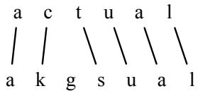

CHAPTER

D

# Spelling Correction and the Noisy Channel

ALGERNON: But my own sweet Cecily, I have never written you any letters.

CECILY: You need hardly remind me of that, Ernest. I remember only too well that I wasforced to write your lettersfor you. I wrote always three times a week, and sometimes oftener.

ALGERNON: Oh, do let me read them, Cecily?

CECILY: Oh, I couldn’t possibly. They would make you far too conceited. The three you wrote me after I had broken off the engagement are so beautiful, and so badly spelled, that even now I can hardly read them without crying a little.

Oscar Wilde, The Importance ofBeing Earnest

Like Oscar Wilde’s fabulous Cecily, a lot of people were thinking about spelling during the last turn of the century. Gilbert and Sullivan provide many examples. The Gondoliers’ Giuseppe, for example, worries that his private secretary is “shaky in his spelling”, while Iolanthe’s Phyllis can “spell every word that she uses”. Thorstein Veblen’s explanation (in his 1899 classic The Theory of the Leisure Class) was that a main purpose of the “archaic, cumbrous, and ineffective” English spelling system was to be difficult enough to provide a test of membership in the leisure class.

Whatever the social role of spelling, we can certainly agree that many more of us are like Cecily than like Phyllis. Estimates for the frequency of spelling errors in human-typed text vary from 1-2% for carefully retyping already printed text to 10-15% for web queries.

In this chapter we introduce the problem of detecting and correcting spelling errors. Fixing spelling errors is an integral part of writing in the modern world, whether this writing is part of texting on a phone, sending email, writing longer documents, or finding information on the web. Modern spell correctors aren’t perfect (indeed, autocorrect-gone-wrong is a popular source of amusement on the web) but they are ubiquitous in pretty much any software that relies on keyboard input.

Spelling correction is often considered from two perspectives. Non-word spelling correction is the detection and correction of spelling errors that result in non-words (like graffe for giraffe). By contrast, real word spelling correction is the task of detecting and correcting spelling errors even if they accidentally result in an actual word of English (real-word errors). This can happen from typographical errors (insertion, deletion, transposition) that accidentally produce a real word (e.g., there for three), or cognitive errors where the writer substituted the wrong spelling of a homophone or near-homophone (e.g., dessert for desert, or piece for peace).

Non-word errors are detected by looking for any word not found in a dictionary. For example, the misspelling graffe above would not occur in a dictionary. The larger the dictionary the better; modern systems often use enormous dictionaries derived from the web. To correct non-word spelling errors we first generate candidates: real words that have a similar letter sequence to the error. Candidate corrections from the spelling error graffe might include giraffe, graf, gaffe, grail, or craft. We then rank the candidates using a distance metric between the source and the surface error. We’d like a metric that shares our intuition that giraffe is a more likely source than grail for graffe because giraffe is closer in spelling to graffe than grail is to graffe. The minimum edit distance algorithm from Chapter 2 will play a role here. But we’d also like to prefer corrections that are more frequent words, or more likely to occur in the context of the error. The noisy channel model introduced in the next section offers a way to formalize this intuition.

Real word spelling error detection is a much more difficult task, since any word in the input text could be an error. Still, it is possible to use the noisy channel to find candidates for each word w typed by the user, and rank the correction that is most likely to have been the user’s original intention.

## D.1 The Noisy Channel Model

In this section we introduce the noisy channel model and show how to apply it to the task of detecting and correcting spelling errors. The noisy channel model was applied to the spelling correction task at about the same time by researchers at AT&T Bell Laboratories (Kernighan et al. 1990, Church and Gale 1991) and IBM Watson Research (Mays et al., 1991).

  
Figure D.1 In the noisy channel model, we imagine that the surface form we see is actually a “distorted” form of an original word passed through a noisy channel. The decoder passes each hypothesis through a model of this channel and picks the word that best matches the surface noisy word.

The intuition of the noisy channel model (see Fig. D.1) is to treat the misspelled word as if a correctly spelled word had been “distorted” by being passed through a noisy communication channel.

This channel introduces “noise” in the form of substitutions or other changes to the letters, making it hard to recognize the “true” word. Our goal, then, is to build a model of the channel. Given this model, we then find the true word by passing every word of the language through our model of the noisy channel and seeing which one comes the closest to the misspelled word.

This noisy channel model is a kind of Bayesian inference. We see an observation x (a misspelled word) and our job is to find the word w that generated this misspelled word. Out of all possible words in the vocabulary V we want to find the word w such that $P ( w | x )$ is highest. We use the hat notation ˆ to mean “our estimate of the correct word”.

$$
{ \hat { w } } = \underset { w \in V } { \mathrm { a r g m a x } } P ( w | x )\tag{D.1}
$$

The function argmax $\operatorname { } _ { x } f ( x )$ means “the x such that $f ( x )$ is maximized”. Equation D.1 thus means, that out of all words in the vocabulary, we want the particular word that maximizes the right-hand side $P ( w | x )$

The intuition of Bayesian classification is to use Bayes’ rule to transform Eq. D.1 into a set of other probabilities. Bayes’ rule is presented in Eq. D.2; it gives us a way to break down any conditional probability $P ( a | b )$ into three other probabilities:

$$
P ( a | b ) = { \frac { P ( b | a ) P ( a ) } { P ( b ) } }\tag{D.2}
$$

We can then substitute Eq. D.2 into Eq. D.1 to get Eq. D.3:

$$
\hat { w } = \underset { w \in V } { \mathrm { a r g m a x } } \frac { P ( x | w ) P ( w ) } { P ( x ) }\tag{D.3}
$$

We can conveniently simplify Eq. D.3 by dropping the denominator $P ( x )$ . Why is that? Since we are choosing a potential correction word out of all words, we will be computing $\frac { P ( x | w ) P ( w ) } { P ( x ) }$ for each word. But $P ( x )$ doesn’t change for each word; we are always asking about the most likely word for the same observed error x, which must have the same probability $P ( x )$ . Thus, we can choose the word that maximizes this simpler formula:

$$
\hat { w } = \underset { w \in V } { \mathrm { a r g m a x } } P ( x | w ) P ( w )\tag{D.4}
$$

To summarize, the noisy channel model says that we have some true underlying word w, and we have a noisy channel that modifies the word into some possible misspelled observed surface form. The likelihood or channel model of the noisy channel producing any particular observation sequence x is modeled by $P ( x | w )$ . The prior probability of a hidden word is modeled by $P ( w )$ . We can compute the most probable word ˆw given that we’ve seen some observed misspelling x by multiplying the prior $P ( w )$ and the likelihood $P ( x | w )$ and choosing the word for which this product is greatest.

We apply the noisy channel approach to correcting non-word spelling errors by taking any word not in our spelling dictionary, generating a list of candidate words, ranking them according to Eq. D.4, and picking the highest-ranked one. We can modify Eq. D.4 to refer to this list of candidate words instead of the full vocabulary V as follows:

$$
\hat { w } = \underset { w \in C } { \mathrm { c h a n n e l ~ m o d e l } } \overset { \mathrm { p r i o r } } { \overbrace { P ( x | w ) } } , \overset { \mathrm { p r i o r } } { \overbrace { P ( w ) } }\tag{D.5}
$$

The noisy channel algorithm is shown in Fig. D.2.

To see the details of the computation of the likelihood and the prior (language model), let’s walk through an example, applying the algorithm to the example misspelling acress. The first stage of the algorithm proposes candidate corrections by finding words that have a similar spelling to the input word. Analysis of spelling error data has shown that the majority of spelling errors consist of a single-letter change and so we often make the simplifying assumption that these candidates have an edit distance of 1 from the error word. To find this list of candidates we’ll use the minimum edit distance algorithm introduced in Chapter 2, but extended so that in addition to insertions, deletions, and substitutions, we’ll add a fourth type of edit, transpositions, in which two letters are swapped. The version of edit distance with transposition is called Damerau-Levenshtein edit distance. Applying all such single transformations to acress yields the list of candidate words in Fig. D.3.

function NOISY CHANNEL SPELLING(word x, dict D, lm, editprob) returns correction   
if x ∈/ D   
candidates, edits←All strings at edit distance 1 from x that are ∈ D, and their edit   
for each c,e in candidates, edits   
channel←editprob(e)   
prior ← lm(x)   
score[c] = log channel + log prior   
return argmax score[c]  
Figure D.2 Noisy channel model for spelling correction for unknown words.

<table><tr><td colspan="6">Transformation</td></tr><tr><td>Error</td><td>Correction</td><td>Correct Letter</td><td>Error Letter</td><td>Position (Letter #)</td><td>Type</td></tr><tr><td>acress</td><td>actress</td><td>t</td><td></td><td>2</td><td>deletion</td></tr><tr><td>acress</td><td>cress</td><td>一</td><td>a</td><td>0</td><td>insertion</td></tr><tr><td>acress</td><td>caress</td><td>ca</td><td>ac</td><td>0</td><td>transposition</td></tr><tr><td>acress</td><td>access</td><td>C</td><td>r</td><td>2</td><td>substitution</td></tr><tr><td>acress</td><td>across</td><td>0</td><td>e</td><td>3</td><td>substitution</td></tr><tr><td>acress</td><td>acres</td><td>一</td><td>S</td><td>5</td><td>insertion</td></tr><tr><td>acress</td><td>acres</td><td></td><td>S</td><td>4</td><td>insertion</td></tr></table>

Figure D.3 Candidate corrections for the misspelling acress and the transformations that would have produced the error (after Kernighan et al. (1990)). “—” represents a null letter.

Once we have a set of a candidates, to score each one using Eq. D.5 requires that we compute the prior and the channel model.

The prior probability of each correction P(w) is the language model probability of the word w in context, which can be computed using any language model, from unigram to trigram or 4-gram. For this example let’s start in the following table by assuming a unigram language model. We computed the language model from the 404,253,213 words in the Corpus of Contemporary English (COCA).

<table><tr><td>W</td><td>count(w) p(w)</td></tr><tr><td>actress</td><td>9,321 .0000231</td></tr><tr><td>cress</td><td>220 .000000544</td></tr><tr><td>caress</td><td>686 .00000170</td></tr><tr><td>access</td><td>37,038 .0000916</td></tr><tr><td>across</td><td>120,844 .000299</td></tr><tr><td>acres</td><td>12,874 .0000318</td></tr></table>

How can we estimate the likelihood P(x|w), also called the channel model or error model? A perfect model of the probability that a word will be mistyped would condition on all sorts of factors: who the typist was, whether the typist was lefthanded or right-handed, and so on. Luckily, we can get a pretty reasonable estimate of $P ( x | w )$ just by looking at local context: the identity of the correct letter itself, the misspelling, and the surrounding letters. For example, the letters m and n are often substituted for each other; this is partly a fact about their identity (these two letters are pronounced similarly and they are next to each other on the keyboard) and partly a fact about context (because they are pronounced similarly and they occur in similar contexts).

A simple model might estimate, for example, p(acress|across) just using the number of times that the letter e was substituted for the letter o in some large corpus of errors. To compute the probability for each edit in this way we’ll need a confusion matrix that contains counts of errors. In general, a confusion matrix lists the number of times one thing was confused with another. Thus for example a substitution matrix will be a square matrix of size 26×26 (or more generally $| A | \times | A |$ for an alphabet A) that represents the number of times one letter was incorrectly used instead of another. Following Kernighan et al. (1990) we’ll use four confusion matrices.

$\mathrm { d e l } [ x , y ]$ : count(xy typed as x)

$\mathrm { i n s } [ x , y ] ;$ : count(x typed as xy)

$\operatorname { s u b } [ x , y ]$ : count(x typed as y)

trans[x,y]: count(xy typed as yx)

Note that we’ve conditioned the insertion and deletion probabilities on the previous character; we could instead have chosen to condition on the following character.

Where do we get these confusion matrices? One way is to extract them from lists of misspellings like the following:

additional: addional, additonal

environments: enviornments, enviorments, enviroments

preceded: preceeded

There are lists available on Wikipedia and from Roger Mitton (http://www. dcs.bbk.ac.uk/ ROGER/corpora.html) and Peter Norvig (http://norvig. com/ngrams/). Norvig also gives the counts for each single-character edit that can be used to directly create the error model probabilities.

An alternative approach used by Kernighan et al. (1990) is to compute the matrices by iteratively using this very spelling error correction algorithm itself. The iterative algorithm first initializes the matrices with equal values; thus, any character is equally likely to be deleted, equally likely to be substituted for any other character, etc. Next, the spelling error correction algorithm is run on a set of spelling errors. Given the set of typos paired with their predicted corrections, the confusion matrices can now be recomputed, the spelling algorithm run again, and so on. This iterative algorithm is an instance of the important EM algorithm (Dempster et al., 1977), which we discuss in Appendix A.

Once we have the confusion matrices, we can estimate $P ( x | w )$ as follows (where $w _ { i }$ is the ith character of the correct word w) and $x _ { i }$ is the ith character of the typo x:

$$
P ( x | w ) = \left\{ \begin{array} { l l } { \displaystyle \frac { \operatorname { d e l } [ x _ { i - 1 } , w _ { i } ] } { \operatorname { c o u n t } [ x _ { i - 1 } , w _ { i } ] } \mathrm { , ~ i f ~ d e l e t i o n } } \\ { \displaystyle \frac { \operatorname { i n s } [ x _ { i - 1 } , w _ { i } ] } { \operatorname { c o u n t } [ w _ { i - 1 } ] } \mathrm { , ~ i f ~ i n s e r t i o n } } \\ { \displaystyle \frac { \operatorname { s u b } [ x _ { i } , w _ { i } ] } { \operatorname { c o u n t } [ w _ { i } ] } \mathrm { , ~ i f ~ s u b s t i u t i o n } } \\ { \displaystyle \frac { \operatorname { t r a n s } [ w _ { i } , w _ { i + 1 } ] } { \operatorname { c o u n t } [ w _ { i } , w _ { i + 1 } ] } \mathrm { , ~ i f ~ t r a n s p o s i t i o n } } \end{array} \right.\tag{D.6}
$$

Using the counts from Kernighan et al. (1990) results in the error model probabilities for acress shown in Fig. D.4.

<table><tr><td>Candidate Correction</td><td>Correct Letter</td><td>Error Letter</td><td></td><td>P(x|w)</td></tr><tr><td>actress</td><td>t</td><td>–</td><td>x|w c|ct</td><td>.000117</td></tr><tr><td>cress</td><td></td><td>a</td><td>a|#</td><td>.00000144</td></tr><tr><td>caress</td><td>ca</td><td>ac</td><td>ac|ca</td><td>.00000164</td></tr><tr><td>access</td><td>C</td><td>r</td><td>r|c</td><td>.000000209</td></tr><tr><td>across</td><td>0</td><td>e</td><td>e|o</td><td>.0000093</td></tr><tr><td>acres</td><td>(</td><td>S</td><td>es|e</td><td>.0000321</td></tr><tr><td>acres</td><td>一</td><td>S</td><td>ss|s</td><td>.0000342</td></tr></table>

Figure D.4 Channel model for acress; the probabilities are taken from the del[], ins[], sub[], and trans[] confusion matrices as shown in Kernighan et al. (1990).

Figure D.5 shows the final probabilities for each of the potential corrections; the unigram prior is multiplied by the likelihood (computed with Eq. D.6 and the confusion matrices). The final column shows the product, multiplied by $1 0 ^ { 9 }$ just for readability.

<table><tr><td>Candidate</td><td>Correct Error</td><td colspan="4"></td></tr><tr><td>Correction</td><td>Letter</td><td>Letter</td><td> x|w</td><td>P(x|w)</td><td>P(w)  $\mathbf { 1 0 } ^ { 9 * } \mathbf { P ( x | w ) P ( w ) }$ </td></tr><tr><td>actress</td><td>t</td><td>一</td><td>c|ct</td><td>.000117</td><td>.0000231 2.7</td></tr><tr><td>cress</td><td>一</td><td>a a|#</td><td>.00000144</td><td>.000000544</td><td>0.00078</td></tr><tr><td>caress</td><td>ca</td><td>ac</td><td>ac|ca .00000164</td><td>.00000170</td><td>0.0028</td></tr><tr><td>access</td><td>C</td><td>r</td><td>r|c</td><td>.000000209 .0000916</td><td>0.019</td></tr><tr><td>across</td><td>0</td><td>e</td><td>elo</td><td>.0000093 .000299</td><td>2.8</td></tr><tr><td>acres</td><td>一</td><td>S</td><td>es|e</td><td>.0000321</td><td>.0000318 1.0</td></tr><tr><td>acres</td><td></td><td>S</td><td>ss|s</td><td>.0000342</td><td>.0000318 1.0</td></tr></table>

Figure D.5 Computation of the ranking for each candidate correction, using the language model shown earlier and the error model from Fig. D.4. The final score is multiplied by $1 { \overset { \smile } { 0 } } ^ { 9 }$ for readability.

The computations in Fig. D.5 show that our implementation of the noisy channel model chooses across as the best correction, and actress as the second most likely word.

Unfortunately, the algorithm was wrong here; the writer’s intention becomes clear from the context: . . . was called a “stellar and versatile acress whose combination of sass and glamour has defined her. . . ”. The surrounding words make it clear that actress and not across was the intended word.

For this reason, it is important to use larger language models than unigrams. For example, if we use the Corpus of Contemporary American English to compute bigram probabilities for the words actress and across in their context using add-one smoothing, we get the following probabilities:

$$
\mathrm { P ( a c t r e s s | v e r s a t i l e ) \ = \ . 0 0 0 0 2 1 }
$$

$$
\mathrm { P ( a c r o s s | v e r s a t i l e ) = . 0 0 0 0 2 1 }
$$

$$
\mathrm { P ( w h o s e | a c t r e s s ) ~ = ~ . 0 0 1 0 }
$$

$$
\mathrm { P ( w h o s e | a c r o s s ) ~ = ~ . 0 0 0 0 0 6 }
$$

Multiplying these out gives us the language model estimate for the two candidates in context:

$$
\mathrm { P ^ { ( ^ { * } v e r s a t i l e ~ a c t r e s s ~ w h o s e ^ { * } ) } ~ = ~ . 0 0 0 0 2 1 * . 0 0 1 0 = 2 1 0 \times 1 0 ^ { - 1 0 } ~ }
$$

$$
\mathrm { P ^ { ( ^ { * } v e r s a t i l e ~ a c r o s s ~ w h o s e ^ { * } ) } ~ = ~ . 0 0 0 0 2 1 * . 0 0 0 0 0 6 = 1 \times 1 0 ^ { - 1 0 } }
$$

Combining the language model with the error model in Fig. D.5, the bigram noisy channel model now chooses the correct word actress.

Evaluating spell correction algorithms is generally done by holding out a training, development and test set from lists of errors like those on the Norvig and Mitton sites mentioned above.

## D.2 Real-word spelling errors

The noisy channel approach can also be applied to detect and correct real-word spelling errors, errors that result in an actual word of English. This can happen from typographical errors (insertion, deletion, transposition) that accidentally produce a real word (e.g., there for three) or because the writer substituted the wrong spelling of a homophone or near-homophone (e.g., dessert for desert, or piece for peace). A number of studies suggest that between 25% and 40% of spelling errors are valid English words as in the following examples (Kukich, 1992):

This used to belong to thew queen. They are leaving in about fifteen minuets to go to her house.

The design an construction of the system will take more than a year.

Can they lave him my messages?

The study was conducted mainly be John Black.

The noisy channel can deal with real-word errors as well. Let’s begin with a version of the noisy channel model first proposed by Mays et al. (1991) to deal with these real-word spelling errors. Their algorithm takes the input sentence $X =$ $\left\{ x _ { 1 } , x _ { 2 } , \ldots , x _ { k } , \ldots , x _ { n } \right\}$ , generates a large set of candidate correction sentences C(X), then picks the sentence with the highest language model probability.

To generate the candidate correction sentences, we start by generating a set of candidate words for each input word $x _ { i } .$ . The candidates, $C ( x _ { i } )$ , include every English word with a small edit distance from $x _ { i } .$ . With edit distance 1, a common choice (Mays et al., 1991), the candidate set for the real word error thew (a rare word meaning ‘muscular strength’) might be C(thew) = {the, thaw, threw, them, thwe}. We then make the simplifying assumption that every sentence has only one error. Thus the set of candidate sentences $C ( \boldsymbol X )$ for a sentence $\mathbf { X } = 0 \mathbf { n } \mathbf { 1 } \mathbf { y }$ two of thew apples would be:

$$
{ \begin{array} { r l } & { { \mathrm { o n l y ~ t w o ~ o f ~ t h e u ~ a p p l e s } } } \\ & { { \mathrm { o i x l y ~ t w o ~ o f ~ t h e u ~ a p p l e s } } } \\ & { { \mathrm { o n l y ~ t o 0 ~ o f ~ t h e w ~ a p p l e s } } } \\ & { { \mathrm { o n l y ~ t o ~ o f ~ t h e u ~ a p p l e s } } } \\ & { { \mathrm { o n l y ~ t a o ~ o f ~ t h e ~ u p l e s } } } \\ & { { \mathrm { o n l y ~ t a o ~ o f ~ t h e ~ a p p l e s } } } \\ & { { \mathrm { o n l y ~ t w o ~ o f ~ t h e ~ a p p l e s } } } \\ & { { \mathrm { o n l y ~ t w o ~ o f ~ t h e ~ a p p l e s } } } \\ & { { \mathrm { o n l y ~ t u o ~ o f ~ t h e ~ a p p l e s } } } \\ & { { \mathrm { o n l y ~ t w o ~ o f ~ t h e ~ a p p l e s } } } \\ & { { \mathrm { o n l y ~ t w o ~ o f ~ t h e ~ e u p ~ a p p l i e s } } } \\ & { { \mathrm { o n l y ~ t w o ~ o f ~ t h e ~ e u p ~ a p p l i e s } } } \\ & { { \mathrm { o n l y ~ t w o ~ o f ~ t h e ~ w o ~ a p p l i e s } } } \\ & { { \mathrm { . . . } } } \end{array} }
$$

Each sentence is scored by the noisy channel:

$$
\hat { W } = \underset { W \in C ( X ) } { \mathrm { a r g m a x } } P ( X | W ) P ( W )\tag{D.7}
$$

For $P ( W )$ , we can use the trigram probability of the sentence.

What about the channel model? Since these are real words, we need to consider the possibility that the input word is not an error. Let’s say that the channel probability of writing a word correctly, $P ( w | w )$ , is α; we can make different assumptions about exactly what the value of α is in different tasks; perhaps α is .95, assuming people write 1 word wrong out of 20, for some tasks, or maybe .99 for others. Mays et al. (1991) proposed a simple model: given a typed word x, let the channel model $P ( x | w )$ be α when $x = w$ , and then just distribute $1 - \alpha$ evenly over all other candidate corrections $C ( x )$

$$
p ( x | w ) = { \left\{ \begin{array} { l l } { \alpha \qquad { \mathrm { i f ~ } } x = w } \\ { 1 - \alpha } \\ { \displaystyle { \frac { 1 - ( x ) } { | C ( x ) | } } \qquad { \mathrm { i f ~ } } x \in C ( x ) } \\ { \qquad 0 \qquad { \mathrm { o t h e r w i s e } } } \end{array} \right. }\tag{D.8}
$$

Now we can replace the equal distribution of $1 - \alpha$ over all corrections in Eq. D.8; we’ll make the distribution proportional to the edit probability from the more sophisticated channel model from Eq. D.6 that used the confusion matrices.

Let’s see an example of this integrated noisy channel model applied to a real word. Suppose we see the string two of thew. The author might have intended to type the real word thew (‘muscular strength’). But thew here could also be a typo for the or some other word. For the purposes of this example let’s consider edit distance 1, and only the following five candidates the, thaw, threw, and thwe (a rare name) and the string as typed, thew. We took the edit probabilities from Norvig’s 2009 analysis of this example. For the language model probabilities, we used a Stupid Backoff model (Section ??) trained on the Google n-grams:

$$
{ \begin{array} { r l } { \operatorname { P } ( { \mathrm { t h e } } | { \mathrm { t w o ~ o f } } ) } & { = \ 0 . 4 7 6 0 1 2 } \\ { \operatorname { P } ( { \mathrm { t h e w } } | { \mathrm { t w o ~ o f } } ) } & { = \ 9 . 9 5 0 5 1 \times 1 0 ^ { - 8 } } \\ { \operatorname { P } ( { \mathrm { t h a w } } | { \mathrm { t w o ~ o f } } ) } & { = \ 2 . 0 9 2 6 7 \times 1 0 ^ { - 7 } } \\ { \operatorname { P } ( { \mathrm { t h r e w } } | { \mathrm { t w o ~ o f } } ) } & { = \ 8 . 9 0 6 4 \times 1 0 ^ { - 7 } } \\ { \operatorname { P } ( { \mathrm { t h e m } } | { \mathrm { t w o ~ o f } } ) } & { = \ 0 . 0 0 1 4 4 4 8 8 } \\ { \operatorname { P } ( { \mathrm { t h w e } } | { \mathrm { t w o ~ o f } } ) } & { = \ 5 . 1 8 6 8 1 \times 1 0 ^ { - 9 } } \end{array} }
$$

Here we’ve just computed probabilities for the single phrase two of thew, but the model applies to entire sentences; so if the example in context was two of thew people, we’d need to also multiply in probabilities for P(people|of the), P(people|of thew), P(people|of threw), and so on.

Following Norvig (2009), we assume that the probability of a word being a typo in this task is .05, meaning that $\alpha = P ( w | w )$ is .95. Fig. D.6 shows the computation.
<table><tr><td>X W</td><td></td><td>x|w  $\mathbf { P } ( \mathbf { x } | \mathbf { w } )$ </td><td></td><td> $\mathbf { P } ( \mathbf { w } | \mathbf { w _ { i - 2 } } , \mathbf { w _ { i - 1 } } )$ </td><td> $\mathbf { 1 0 ^ { 8 } P ( x | w ) P ( w | w _ { i - 2 } , w _ { i - 1 } ) }$ </td></tr><tr><td>thew the</td><td></td><td>ew|e</td><td>0.000007 0.48</td><td></td><td>333</td></tr><tr><td></td><td>thew thew</td><td></td><td>α=0.95</td><td> $9 . 9 5 \times 1 0 ^ { - 8 }$ </td><td>9.45</td></tr><tr><td>thew</td><td>thaw</td><td> ${ \mathrm { e } } | { \mathrm { a } }$ </td><td>0.001</td><td> $2 . 1 \times 1 0 ^ { - 7 }$ </td><td>0.0209</td></tr><tr><td>thew</td><td>threw</td><td>h|hr</td><td>0.000008</td><td> $8 . 9 \times 1 0 ^ { - 7 }$ </td><td>0.000713</td></tr><tr><td>thew thwe</td><td></td><td>ew|we</td><td>0.000003</td><td> $5 . 2 \times 1 0 ^ { - 9 }$ </td><td>0.00000156</td></tr></table>

Figure D.6 The noisy channel model on 5 possible candidates for thew, with a Stupid Backoff trigram language model computed from the Google n-gram corpus and the error model from Norvig (2009).

For the error phrase two ofthew, the model correctly picks the as the correction. But note that a lower error rate might change things; in a task where the probability of an error is low enough (α is very high), the model might instead decide that the word thew was what the writer intended.

## D.3 Noisy Channel Model: The State of the Art

State of the art implementations of noisy channel spelling correction make a number of extensions to the simple models we presented above.

First, rather than make the assumption that the input sentence has only a single error, modern systems go through the input one word at a time, using the noisy channel to make a decision for that word. But if we just run the basic noisy channel system described above on each word, it is prone to overcorrecting, replacing correct but rare words (for example names) with more frequent words (Whitelaw et al. 2009, Wilcox-O’Hearn 2014). Modern algorithms therefore need to augment the noisy channel with methods for detecting whether or not a real word should actually be corrected. For example state of the art systems like Google’s (Whitelaw et al., 2009) use a blacklist, forbidding certain tokens (like numbers, punctuation, and single letter words) from being changed. Such systems are also more cautious in deciding whether to trust a candidate correction. Instead of just choosing a candidate correction if it has a higher probability $P ( w | x )$ than the word itself, these more careful systems choose to suggest a correction w over keeping the non-correction x only if the difference in probabilities is sufficiently great. The best correction w is chosen only if:

$$
\log P ( w | x ) - \log P ( x | x ) > \theta
$$

Depending on the specific application, spell-checkers may decide to autocorrect (automatically change a spelling to a hypothesized correction) or merely to flag the error and offer suggestions. This decision is often made by another classifier which decides whether the best candidate is good enough, using features such as the difference in log probabilities between the candidates (we’ll introduce algorithms for classification in the next chapter).

Modern systems also use much larger dictionaries than early systems. Ahmad and Kondrak (2005) found that a 100,000 word UNIX dictionary only contained

73% of the word types in their corpus of web queries, missing words like pics, multiplayer, google, xbox, clipart, and mallorca. For this reason modern systems often use much larger dictionaries automatically derived from very large lists of unigrams like the Google n-gram corpus. Whitelaw et al. (2009), for example, used the most frequently occurring ten million word types in a large sample of web pages. Because this list will include lots of misspellings, their system requires a more sophisticated error model. The fact that words are generally more frequent than their misspellings can be used in candidate suggestion, by building a set of words and spelling variations that have similar contexts, sorting by frequency, treating the most frequent variant as the source, and learning an error model from the difference, whether from web text (Whitelaw et al., 2009) or from query logs (Cucerzan and Brill, 2004). Words can also be automatically added to the dictionary when a user rejects a correction, and systems running on phones can automatically add words from the user’s address book or calendar.

We can also improve the performance of the noisy channel model by changing how the prior and the likelihood are combined. In the standard model they are just multiplied together. But often these probabilities are not commensurate; the language model or the channel model might have very different ranges. Alternatively for some task or dataset we might have reason to trust one of the two models more. Therefore we use a weighted combination, by raising one of the factors to a power $\lambda \colon$

$$
\hat { w } = \underset { w \in V } { \operatorname { a r g m a x } } P ( x | w ) P ( w ) ^ { \lambda }\tag{D.9}
$$

or in log space:

$$
\hat { w } = \underset { w \in V } { \mathrm { a r g m a x } } \log P ( x | w ) + \lambda \log P ( w )\tag{D.10}
$$

We then tune the parameter $\lambda$ on a development test set.

Finally, if our goal is to do real-word spelling correction only for specific confusion sets like peace/piece, affect/effect, weather/whether, or even grammar correction examples like among/between, we can train supervised classifiers to draw on many features of the context and make a choice between the two candidates. Such classifiers can achieve very high accuracy for these specific sets, especially when drawing on large-scale features from web statistics (Golding and Roth 1999, Lapata and Keller 2004, Bergsma et al. 2009, Bergsma et al. 2010).

## D.3.1 Improved Edit Models: Partitions and Pronunciation

Other recent research has focused on improving the channel model $P ( t | c )$ . One important extension is the ability to compute probabilities for multiple-letter transformations. For example Brill and Moore (2000) propose a channel model that (informally) models an error as being generated by a typist first choosing a word, then choosing a partition of the letters of that word, and then typing each partition, possibly erroneously. For example, imagine a person chooses the word physical, then chooses the partition ph $\texttt { y s i c a l }$ . She would then generate each partition, possibly with errors. For example the probability that she would generate the string fisikle with partition $\textbf { f } \textbf { i } \textbf { s } \textbf { i }$ k le would be $p ( \mathbf { f } | \mathbf { p h } ) * p ( \mathbf { i } | \mathbf { y } ) * p ( \mathbf { s } | \mathbf { s } ) *$ ∗ $p ( \mathbf { i } | \mathbf { i } ) * p ( \mathbf { k } | \mathbf { k } ) * p ( \mathbf { \vec { 1 } } \mathbf { e } | \mathbf { a } 1 )$ ). Unlike the Damerau-Levenshtein edit distance, the Brill-Moore channel model can thus model edit probabilities like $P ( \mathbf { f } | \mathbf { p h } )$ or $P ( \ l _ { 1 } { \mathsf { e } } | { \mathsf { a } } \ l _ { 1 } )$ ), or the high likelihood of $P ( { \mathrm { e n t } } | { \mathrm { a n t } } )$ . Furthermore, each edit is conditioned on where it is in the word (beginning, middle, end) so instead of $P ( \mathbf { f } | \mathbf { p h } )$ the model actually estimates $P ( \mathtt { f } | \mathtt { p h }$ ,beginning).

More formally, let R be a partition of the typo string x into adjacent (possibly empty) substrings, and T be a partition of the candidate string. Brill and Moore (2000) then approximates the total likelihood $P ( x | w )$ (e.g., P(fisikle|physical)) by the probability of the single best partition:

$$
P ( x | w ) \approx \operatorname* { m a x } _ { \substack { R , T s . t . | T | = | R | } } \sum _ { i = 1 } ^ { | R | } P ( T _ { i } | R _ { i } , \mathrm { p o s i t i o n } )\tag{D.11}
$$

The probability of each transform $P ( T _ { i } | R _ { i } )$ can be learned from a training set of triples of an error, the correct string, and the number of times it occurs. For example given a training pair akgsual/actual, standard minimum edit distance is used to produce an alignment:

This alignment corresponds to the sequence of edit operations:

$$
a {  } a , c {  } \mathrm { k } , \epsilon {  } \mathrm { g } \mathrm { t } {  } s , \mathrm { u } {  } \mathrm { u } , a {  } a , 1 {  } 1
$$

Each nonmatch substitution is then expanded to incorporate up to N additional edits; For N=2, we would expand c→k to:

$$
\begin{array} { l } { \tt a c { \to a k } } \\ { \tt c { \to c g } } \\ { \tt a c { \to a k g } } \\ { \tt c t { \to k g s } } \end{array}
$$

Each of these multiple edits then gets a fractional count, and the probability for   
each edit $\alpha  \beta$ is then estimated from counts in the training corpus of triples as   
count(α→β) count( )

Another research direction in channel models is the use of pronunciation in addition to spelling. Pronunciation is an important feature in some non-noisy-channel algorithms for spell correction like the GNU aspell algorithm (Atkinson, 2011), which makes use of the metaphone pronunciation of a word (Philips, 1990). Metaphone is a series of rules that map a word to a normalized representation of its pronunciation. Some example rules:

• “Drop duplicate adjacent letters, except for $\mathrm { { C . } } ^ { \ast }$

• “If the word begins with ‘KN’, ‘GN’, ‘PN’, ‘AE’, ‘WR’, drop the first letter.”

• “Drop ‘B’ if after ‘M’ and if it is at the end of the word”

Aspell works similarly to the channel component of the noisy channel model, finding all words in the dictionary whose pronunciation string is a short edit distance (1 or 2 pronunciation letters) from the typo, and then scoring this list of candidates by a metric that combines two edit distances: the pronunciation edit distance and the weighted letter edit distance.

Pronunciation can also be incorporated directly the noisy channel model. For example the Toutanova and Moore (2002) model, like aspell, interpolates two channel

## function SOUNDEX(name) returns soundexform

1. Keep the first letter of name   
2. Drop all occurrences of non-initial a, e, h, i, o, u, w, y.   
3. Replace the remaining letters with the following numbers:   
b, f, p, v → 1   
c, g, j, k, q, s, x, z → 2   
d, t → 3   
l → 4   
m, n → 5   
r → 6   
4. Replace any sequences of identical numbers, only if they derive from two or more   
letters that were adjacent in the original name, with a single number (e.g., 666 → 6).   
5. Convert to the form Letter Digit Digit Digit by dropping digits past the   
third (if necessary) or padding with trailing zeros (if necessary).

## Figure D.7 The Soundex Algorithm

models, one based on spelling and one based on pronunciation. The pronunciation model is based on using letter-to-sound models to translate each input word and each dictionary word into a sequences of phones representing the pronunciation of the word. For example actress and aktress would both map to the phone string ae k t r ix s. See Chapter 18 on the task of letter-to-sound or grapheme-tophoneme.

Some additional string distance functions have been proposed for dealing specifically with names. These are mainly used for the task of deduplication (deciding if two names in a census list or other namelist are the same) rather than spell-checking.

The Soundex algorithm (Knuth 1973, Odell and Russell 1918/1922) is an older method used originally for census records for representing people’s names. It has the advantage that versions of the names that are slightly misspelled will still have the same representation as correctly spelled names. (e.g., Jurafsky, Jarofsky, Jarovsky, and Jarovski all map to J612). The algorithm is shown in Fig. D.7.

Instead of Soundex, more recent work uses Jaro-Winkler distance, which is an edit distance algorithm designed for names that allows characters to be moved longer distances in longer names, and also gives a higher similarity to strings that have identical initial characters (Winkler, 2006).

## Historical Notes

Algorithms for spelling error detection and correction have existed since at least Blair (1960). Most early algorithms were based on similarity keys like the Soundex algorithm (Odell and Russell 1918/1922, Knuth 1973). Damerau (1964) gave a dictionary-based algorithm for error detection; most error-detection algorithms since then have been based on dictionaries. Early research (Peterson, 1986) had suggested that spelling dictionaries might need to be kept small because large dictionaries contain very rare words (wont, veery) that resemble misspellings of other words, but Damerau and Mays (1989) found that in practice larger dictionaries proved more helpful. Damerau (1964) also gave a correction algorithm that worked for single errors.

The idea of modeling language transmission as a Markov source passed through a noisy channel model was developed very early on by Claude Shannon (1948). The idea of combining a prior and a likelihood to deal with the noisy channel was developed at IBM Research by Raviv (1967), for the similar task of optical character recognition (OCR). While earlier spell-checkers like Kashyap and Oommen (1983) had used likelihood-based models of edit distance, the idea of combining a prior and a likelihood seems not to have been applied to the spelling correction task until researchers at AT&T Bell Laboratories (Kernighan et al. 1990, Church and Gale 1991) and IBM Watson Research (Mays et al., 1991) roughly simultaneously proposed noisy channel spelling correction. Much later, the Mays et al. (1991) algorithm was reimplemented and tested on standard datasets by Wilcox-O’Hearn et al. (2008), who showed its high performance.

Most algorithms since Wagner and Fischer (1974) have relied on dynamic programming.

Recent focus has been on using the web both for language models and for training the error model, and on incorporating additional features in spelling, like the pronunciation models described earlier, or other information like parses or semantic relatedness (Jones and Martin 1997, Hirst and Budanitsky 2005).

See Mitton (1987) for a survey of human spelling errors, and Kukich (1992) for an early survey of spelling error detection and correction. Norvig (2007) gives a nice explanation and a Python implementation of the noisy channel model, with more details and an efficient algorithm presented in Norvig (2009).

## Exercises

D.1 Suppose we want to apply add-one smoothing to the likelihood term (channel model) $P ( x | w )$ of a noisy channel model of spelling. For simplicity, pretend that the only possible operation is deletion. The MLE estimate for deletion is given in Eq. D.6, which is $P ( x | w ) = { \frac { \mathrm { d e l } [ x _ { i } - 1 , w _ { i } ] } { \mathrm { c o u n t } ( x _ { i - 1 } w _ { i } ) } }$ . What is the estimate for $P ( x | w )$ if we use add-one smoothing on the deletion edit model? Assume the only characters we use are lower case a-z, that there are V word types in our corpus, and N total characters, not counting spaces.

Ahmad, F. and G. Kondrak. 2005. Learning a spelling error model from search query logs. EMNLP.

Atkinson, K. 2011. Gnu aspell.

Bergsma, S., D. Lin, and R. Goebel. 2009. Web-scale n-gram models for lexical disambiguation. IJCAI.

Bergsma, S., E. Pitler, and D. Lin. 2010. Creating robust supervised classifiers via web-scale n-gram data. ACL.

Blair, C. R. 1960. A program for correcting spelling errors. Information and Control, 3:60–67.

Brill, E. and R. C. Moore. 2000. An improved error model for noisy channel spelling correction. ACL.

Church, K. W. and W. A. Gale. 1991. Probability scoring for spelling correction. Statistics and Computing, 1(2):93– 103.

Cucerzan, S. and E. Brill. 2004. Spelling correction as an iterative process that exploits the collective knowledge of web users. EMNLP, volume 4.

Damerau, F. J. 1964. A technique for computer detection and correction of spelling errors. CACM, 7(3):171–176.

Damerau, F. J. and E. Mays. 1989. An examination of un detected typing errors. Information Processing and Man agement, 25(6):659–664.

Dempster, A. P., N. M. Laird, and D. B. Rubin. 1977. Maximum likelihood from incomplete data via the EM algorithm. Journal of the Royal Statistical Society, 39(1):1– 21.

Golding, A. R. and D. Roth. 1999. A Winnow based approach to context-sensitive spelling correction. Machine Learning, 34(1-3):107–130.

Hirst, G. and A. Budanitsky. 2005. Correcting real-word spelling errors by restoring lexical cohesion. Natural Language Engineering, 11:87–111.

Jones, M. P. and J. H. Martin. 1997. Contextual spelling correction using latent semantic analysis. ANLP.

Kashyap, R. L. and B. J. Oommen. 1983. Spelling correction using probabilistic methods. Pattern Recognition Letters, 2:147–154.

Kernighan, M. D., K. W. Church, and W. A. Gale. 1990. A spelling correction program base on a noisy channel model. COLING, volume II.

Knuth, D. E. 1973. Sorting and Searching: The Art ofCom puter Programming Volume 3. Addison-Wesley.

Kukich, K. 1992. Techniques for automatically correcting words in text. ACM Computing Surveys, 24(4):377–439.

Lapata, M. and F. Keller. 2004. The web as a baseline: Evaluating the performance of unsupervised web-based models for a range of NLP tasks. HLT-NAACL.

Mays, E., F. J. Damerau, and R. L. Mercer. 1991. Context based spelling correction. Information Processing and Management, 27(5):517–522.

Mitton, R. 1987. Spelling checkers, spelling correctors and the misspellings of poor spellers. Information processing & management, 23(5):495–505.

Norvig, P. 2007. How to write a spelling corrector. http: //www.norvig.com/spell-correct.html.

Norvig, P. 2009. Natural language corpus data. In T. Segaran and J. Hammerbacher, eds, Beautiful data: the stories behind elegant data solutions. O’Reilly.

Odell, M. K. and R. C. Russell. 1918/1922. U.S. Patents 1261167 (1918), 1435663 (1922). Cited in Knuth (1973).

Peterson, J. L. 1986. A note on undetected typing errors. CACM, 29(7):633–637.

Philips, L. 1990. Hanging on the metaphone. Computer Language, 7(12).

Raviv, J. 1967. Decision making in Markov chains applied to the problem of pattern recognition. IEEE Transactions on Information Theory, 13(4):536–551.

Shannon, C. E. 1948. A mathematical theory of communication. Bell System Technical Journal, 27(3):379–423. Continued in the following volume.

Toutanova, K. and R. C. Moore. 2002. Pronunciation modeling for improved spelling correction. ACL.

Veblen, T. 1899. Theory of the Leisure Class. Macmillan, New York.

Wagner, R. A. and M. J. Fischer. 1974. The string-to-string correction problem. Journal ofthe ACM, 21:168–173.

Whitelaw, C., B. Hutchinson, G. Y. Chung, and G. Ellis. 2009. Using the web for language independent spellchecking and autocorrection. EMNLP.

Wilcox-O’Hearn, L. A. 2014. Detection is the central problem in real-word spelling correction. http://arxiv. org/abs/1408.3153.

Wilcox-O’Hearn, L. A., G. Hirst, and A. Budanitsky. 2008. Real-word spelling correction with trigrams: A reconsideration of the Mays, Damerau, and Mercer model. CICLing-2008.

Winkler, W. E. 2006. Overview of record linkage and current research directions. Technical report, Statistical Research Division, U.S. Census Bureau.