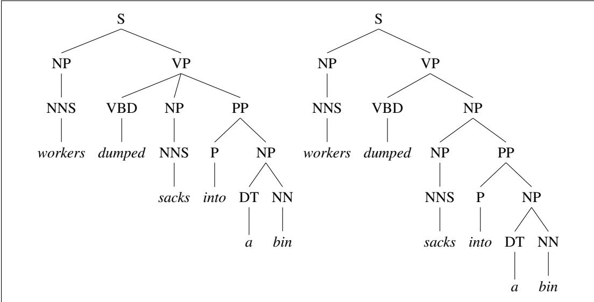
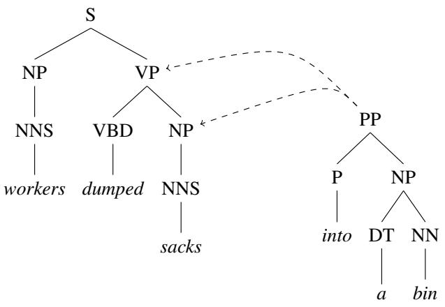
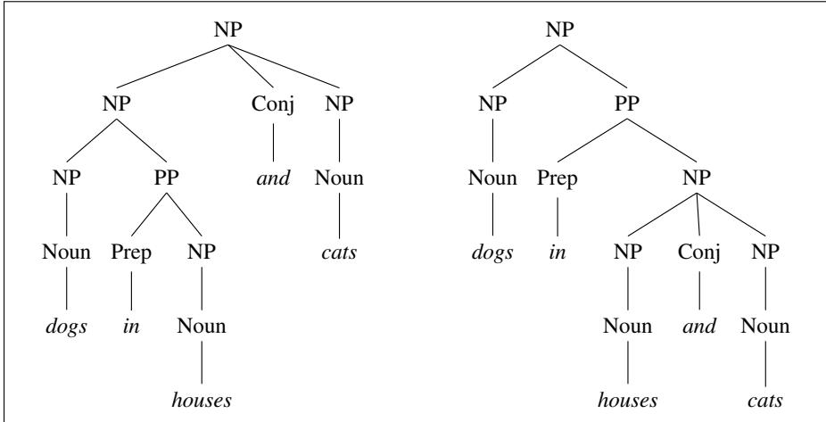
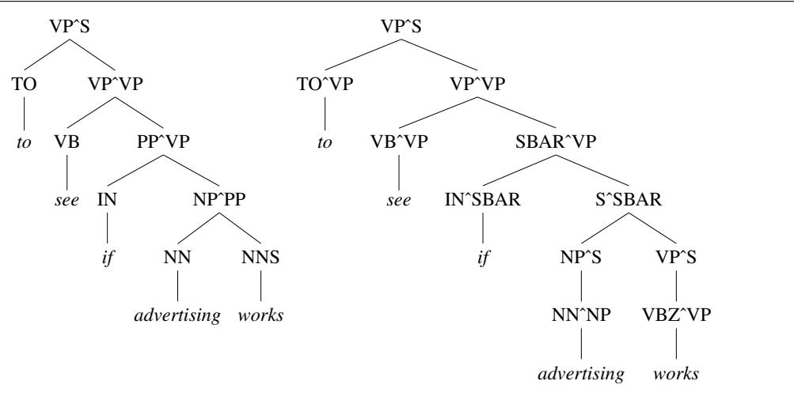
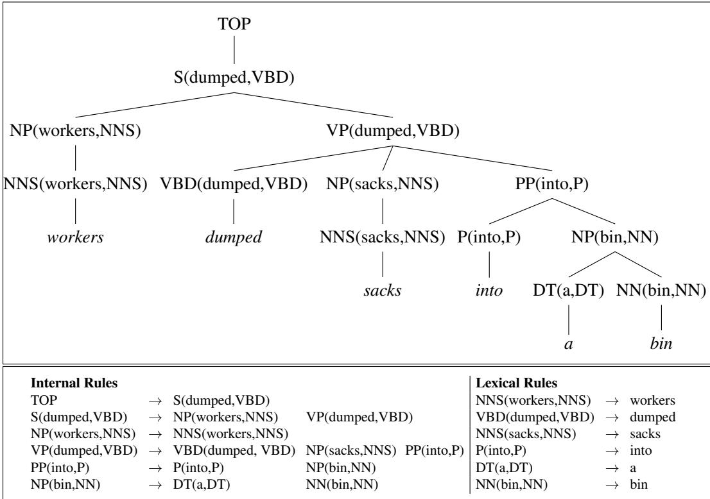
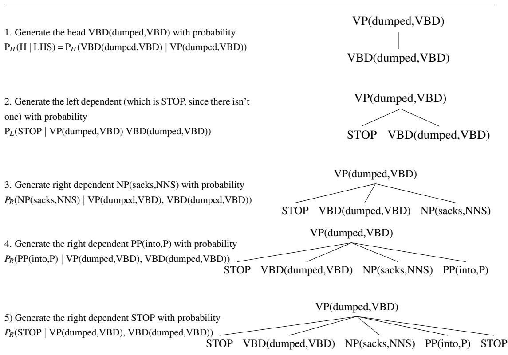

CHAPTER

# Statistical Constituency Parsing

The characters in Damon Runyon’s short stories are willing to bet “on any proposition whatever”, as Runyon says about Sky Masterson in The Idyll of Miss Sarah Brown, from getting aces back-to-back to a man being able to throw a peanut from second base to home plate. There is a moral here for language processing: with enough knowledge we can estimate the probability of just about anything. Chapter 19 introduced constituency structure and the task of parsing it. Here, we show how to build probabilistic models of syntactic knowledge and efficient probabilistic parsers.

One use of probabilistic parsing is to solve the problem of disambiguation. Recall from Chapter 19 that sentences on average tend to be syntactically ambiguous because of phenomena like coordination ambiguity and attachment ambiguity. The CKY parsing algorithm can represent these ambiguities in an efficient way but is not equipped to resolve them. There we introduced a neural algorithm for disambiguation. Here we introduce probabilistic parsers, which offer an alternative solution to the problem: compute the probability of each interpretation and choose the most probable interpretation. The most commonly used probabilistic constituency grammar formalism is the probabilistic context-free grammar (PCFG), a probabilistic augmentation of context-free grammars in which each rule is associated with a probability. We introduce PCFGs in the next section, showing how they can be trained on Treebank grammars and how they can be parsed with a probabilistic version of the CKY algorithm of Chapter 19.

We then show a number of ways that we can improve on this basic probability model (PCFGs trained on Treebank grammars), such as by modifying the set of non-terminals (making them either more specific or more general), or adding more sophisticated conditioning factors like subcategorization or dependencies. Heavily lexicalized grammar formalisms such as Lexical-Functional Grammar (LFG) (Bresnan, 1982), Head-Driven Phrase Structure Grammar (HPSG) (Pollard and Sag, 1994), Tree-Adjoining Grammar (TAG) (Joshi, 1985), and Combinatory Categorial Grammar (CCG) pose additional problems for probabilistic parsers. Section ?? introduces the task of supertagging and the use of heuristic search methods based on the A\* algorithm in the context of CCG parsing.

## E.1 Probabilistic Context-Free Grammars

The simplest augmentation of the context-free grammar is the Probabilistic Context-  
PCFG Free Grammar (PCFG), also known as the Stochastic Context-Free Grammar   
SCFG (SCFG), first proposed by Booth (1969). Recall that a context-free grammar G is defined by four parameters (N, Σ, R, S); a probabilistic context-free grammar is also defined by four parameters, with a slight augmentation to each of the rules in R:

N a set of non-terminal symbols (or variables)   
Σ a set of terminal symbols (disjoint from N)   
R a set of rules or productions, each of the form $A \to \beta [ p ] _ { \ l }$   
where A is a non-terminal,   
$\beta$ is a string of symbols from the infinite set of strings (Σ ∪ N)∗,   
and $p$ is a number between 0 and 1 expressing $P ( \beta | A )$   
S a designated start symbol

That is, a PCFG differs from a standard CFG by augmenting each rule in R with a conditional probability:

$$
A  \beta ~ [ p ]\tag{E.1}
$$

Here $p$ expresses the probability that the given non-terminal A will be expanded to the sequence $\beta .$ . That is, $p$ is the conditional probability of a given expansion $\beta$ given the left-hand-side (LHS) non-terminal A. We can represent this probability as

$$
P ( A \to \beta )
$$

or as

$$
P ( A \to \beta | A )
$$

or as

$$
P ( R H S | L H S )
$$

Thus, if we consider all the possible expansions of a non-terminal, the sum of their probabilities must be 1:

$$
\sum _ { \beta } P ( A \to \beta ) = 1
$$

Figure E.1 shows a PCFG: a probabilistic augmentation of the $\mathcal { L } _ { 1 }$ miniature English CFG grammar and lexicon. Note that the probabilities of all of the expansions of each non-terminal sum to 1. Also note that these probabilities were made up for pedagogical purposes. A real grammar has a great many more rules for each non-terminal; hence, the probabilities of any particular rule would tend to be much smaller.

A PCFG is said to be consistent if the sum of the probabilities of all sentences in the language equals 1. Certain kinds of recursive rules cause a grammar to be inconsistent by causing infinitely looping derivations for some sentences. For example, a rule S → S with probability 1 would lead to lost probability mass due to derivations that never terminate. See Booth and Thompson (1973) for more details on consistent and inconsistent grammars.

How are PCFGs used? A PCFG can be used to estimate a number of useful probabilities concerning a sentence and its parse tree(s), including the probability of a particular parse tree (useful in disambiguation) and the probability of a sentence or a piece of a sentence (useful in language modeling). Let’s see how this works.

## E.1.1 PCFGs for Disambiguation

A PCFG assigns a probability to each parse tree T (i.e., each derivation) of a sentence S. This attribute is useful in disambiguation. For example, consider the two parses of the sentence “Book the dinner flight” shown in Fig. E.2. The sensible parse on the left means “Book a flight that serves dinner”. The nonsensical parse on the right, however, would have to mean something like “Book a flight on behalf of ‘the dinner”’ just as a structurally similar sentence like “Can you book John a flight?” means something like “Can you book a flight on behalf of John?”

<table><tr><td>Grammar</td><td colspan="6">Lexicon</td></tr><tr><td>S → NP VP</td><td>[.80]</td><td>Det → that [.10] a [.30]  the [.60]</td><td></td><td></td><td></td><td></td></tr><tr><td> $S  A u x N P V P$ </td><td>[.15]</td><td>Noun → book [.10]  trip [.30]</td><td></td><td></td><td></td><td></td></tr><tr><td>S → VP</td><td>[.05]</td><td></td><td></td><td>meal [.05] money [.05]</td><td></td><td></td></tr><tr><td> $N P  P r o n o u n$ </td><td>[.35]</td><td></td><td>|flight [.40]dinner [.10]</td><td></td><td></td><td></td></tr><tr><td> $N P  P r o p e r – N o u n$ </td><td>[.30]</td><td>Verb → book [.30] | include [.30]</td><td></td><td></td><td></td><td></td></tr><tr><td> $N P  D e t N o m i n a l$ </td><td>[.20]</td><td></td><td> $\mid p r e f e r \left[ . 4 0 \right]$ </td><td></td><td></td><td></td></tr><tr><td>NP → Nominal</td><td>[.15]</td><td> $P r o n o u n  I [ . 4 0 ] \mid s h e [ . 0 5 ]$ </td><td></td><td></td><td></td><td></td></tr><tr><td>Nominal → Noun</td><td>[.75]</td><td></td><td>me [.15] | you [.40]</td><td></td><td></td><td></td></tr><tr><td>Nominal → Nominal Noun</td><td>[.20]</td><td>Proper-Noun → Houston [.60]</td><td></td><td></td><td></td><td></td></tr><tr><td>Nominal → Nominal PP</td><td>[.05]</td><td></td><td>NWA [.40]</td><td></td><td></td><td></td></tr><tr><td>VP → Verb</td><td>[.35]</td><td> $A u x  d o e s [ . 6 0 ] \ | \ c a n [ . 4 0 ]$ </td><td></td><td></td><td></td><td></td></tr><tr><td> $V P  V e r b N P$ </td><td>[.20]</td><td> $P r e p o s i t i o n  f r o m [ . 3 0 ] \mid t o [ . 3 0 ]$ </td><td></td><td></td><td></td><td></td></tr><tr><td> $V P  V e r b N P P P P$ </td><td>[.10]</td><td></td><td> $o n \left[ . 2 0 \right] \ | \ n e a r \left[ . 1 5 \right]$ </td><td></td><td></td><td></td></tr><tr><td> $V P  V e r b P P$ </td><td>[.15]</td><td></td><td>through [.05]</td><td></td><td></td><td></td></tr><tr><td>VP → Verb NP NP</td><td>[.05]</td><td></td><td></td><td></td><td></td><td></td></tr><tr><td>VP → VP PP</td><td>[.15]</td><td></td><td></td><td></td><td></td><td></td></tr><tr><td>PP → Preposition NP</td><td>[1.0]</td><td></td><td></td><td></td><td></td><td></td></tr></table>

Figure E.1 A PCFG that is a probabilistic augmentation of the L miniature English CFG grammar and lexicon of Fig. ??. These probabilities were made up for pedagogical purposes and are not based on a corpus (any real corpus would have many more rules, so the true probabilities of each rule would be much smaller).

The probability of a particular parse $T$ is defined as the product of the probabilities of all the n rules used to expand each of the n non-terminal nodes in the parse tree T, where each rule i can be expressed as $L H S _ { i }  R H S _ { i }$

$$
P ( T , S ) = \prod _ { i = 1 } ^ { n } P ( R H S _ { i } | L H S _ { i } )\tag{E.2}
$$

The resulting probability $P ( T , S )$ is both the joint probability of the parse and the sentence and also the probability of the parse $P ( T )$ . How can this be true? First, by the definition of joint probability:

$$
P ( T , S ) = P ( T ) P ( S | T )\tag{E.3}
$$

But since a parse tree includes all the words of the sentence, $P ( S | T )$ is 1. Thus,

$$
P ( T , S ) = P ( T ) P ( S | T ) = P ( T )\tag{E.4}
$$

We can compute the probability of each of the trees in Fig. E.2 by multiplying the probabilities of each of the rules used in the derivation. For example, the probability of the left tree in Fig. E.2a (call it $T _ { l e f t } )$ and the right tree (Fig. E.2b or $T _ { r i g h t } )$ can be computed as follows:

$$
P ( T _ { l e f t } ) = . 0 5 * . 2 0 * . 2 0 * . 2 0 * . 7 5 * . 3 0 * . 6 0 * . 1 0 * . 4 0 = 2 . 2 \times { \bf 1 0 } ^ { - 6 }
$$

$$
P ( T _ { r i g h t } ) ~ = ~ . 0 5 * . 1 0 * . 2 0 * . 1 5 * . 7 5 * . 7 5 * . 3 0 * . 6 0 * . 1 0 * . 4 0 = 6 . 1 \times 1 0 ^ { - 7 }
$$

  
Figure E.2 Two parse trees for an ambiguous sentence. The parse on the left corresponds to the sensible meaning “Book a flight that serves dinner”, while the parse on the right corresponds to the nonsensical meaning “Book a flight on behalf of ‘the dinner’ ”.

We can see that the left tree in Fig. E.2 has a much higher probability than the tree on the right. Thus, this parse would correctly be chosen by a disambiguation algorithm that selects the parse with the highest PCFG probability.

Let’s formalize this intuition that picking the parse with the highest probability is the correct way to do disambiguation. Consider all the possible parse trees for a given sentence S. The string of words S is called the yield of any parse tree over S. Thus, out of all parse trees with a yield of S, the disambiguation algorithm picks the parse tree that is most probable given S:

$$
\hat { T } ( S ) = \underset { T s . t . S = \mathrm { y i e l d } ( T ) } { \mathrm { a r g m a x } } P ( T | S )\tag{E.5}
$$

By definition, the probability $P ( T | S )$ can be rewritten as $P ( T , S ) / P ( S )$ , thus leading to

$$
{ \hat { T } } ( S ) = \operatorname * { a r g m a x } _ { T s . t . S = \operatorname { y i e l d } ( T ) } { \frac { P ( T , S ) } { P ( S ) } }\tag{E.6}
$$

Since we are maximizing over all parse trees for the same sentence, P(S) will be a

constant for each tree, so we can eliminate it:

$$
\hat { T } ( S ) = \underset { T s . t . S = \mathrm { y i e l d } ( T ) } { \mathrm { a r g m a x } } P ( T , S )\tag{E.7}
$$

Furthermore, since we showed above that $P ( T , S ) = P ( T )$ , the final equation for choosing the most likely parse neatly simplifies to choosing the parse with the highest probability:

$$
\hat { T } ( S ) = \underset { T s . t . S = \mathrm { y i e l d } ( T ) } { \mathrm { a r g m a x } } P ( T )\tag{E.8}
$$

## E.1.2 PCFGs for Language Modeling

A second attribute of a PCFG is that it assigns a probability to the string of words constituting a sentence. This is important in language modeling, whether for use in speech recognition, machine translation, spelling correction, augmentative communication, or other applications. The probability of an unambiguous sentence is $P ( T , S ) = P ( T )$ or just the probability of the single parse tree for that sentence. The probability of an ambiguous sentence is the sum of the probabilities of all the parse trees for the sentence:

$$
P ( S ) = \sum _ { T s . t . S = \mathrm { y i e l d } ( T ) } P ( T , S )\tag{E.9}
$$

(E.10)

An additional feature of PCFGs that is useful for language modeling is their ability to assign a probability to substrings of a sentence. For example, suppose we want to know the probability of the next word $w _ { i }$ in a sentence given all the words we’ve seen so far $w _ { 1 } , . . . , w _ { i - 1 }$ . The general formula for this is

$$
P ( w _ { i } | w _ { 1 } , w _ { 2 } , . . . , w _ { i - 1 } ) = \frac { P ( w _ { 1 } , w _ { 2 } , . . . , w _ { i - 1 } , w _ { i } ) } { P ( w _ { 1 } , w _ { 2 } , . . . , w _ { i - 1 } ) }\tag{E.11}
$$

We saw in Chapter 3 a simple approximation of this probability using N-grams, conditioning on only the last word or two instead of the entire context; thus, the bigram approximation would give us

$$
P ( w _ { i } | w _ { 1 } , w _ { 2 } , . . . , w _ { i - 1 } ) \approx \frac { P ( w _ { i - 1 } , w _ { i } ) } { P ( w _ { i - 1 } ) }\tag{E.12}
$$

But the fact that the N-gram model can only make use of a couple words of context means it is ignoring potentially useful prediction cues. Consider predicting the word after in the following sentence from Chelba and Jelinek (2000):

## (E.13) the contract ended with a loss of 7 cents after trading as low as 9 cents

A trigram grammar must predict after from the words 7 cents, while it seems clear that the verb ended and the subject contract would be useful predictors that a PCFGbased parser could help us make use of. Indeed, it turns out that PCFGs allow us to condition on the entire previous context w1, $w _ { 2 } , . . . , w _ { i - 1 }$ shown in Eq. E.11.

In summary, PCFGs can be applied both to disambiguation in syntactic parsing and to word prediction in language modeling. Both of these applications require that we be able to compute the probability of parse tree T for a given sentence S. The next few sections introduce some algorithms for computing this probability.

## E.2 Probabilistic CKY Parsing of PCFGs

The parsing problem for PCFGs is to produce the most-likely parse $\hat { T }$ for a given sentence S, that is,

$$
\hat { T } ( S ) = \underset { T s . t . S = \mathrm { y i e l d } ( T ) } { \mathrm { a r g m a x } } P ( T )\tag{E.14}
$$

The algorithms for computing the most likely parse are simple extensions of the standard algorithms for parsing; most modern probabilistic parsers are based on the probabilistic CKY algorithm, first described by Ney (1991). The probabilistic CKY algorithm assumes the PCFG is in Chomsky normal form. Recall from page ?? that in CNF, the right-hand side of each rule must expand to either two non-terminals or to a single terminal, i.e., rules have the form $A \to B C , \operatorname { o r } A \to w$

For the CKY algorithm, we represented each sentence as having indices between the words. Thus, an example sentence like

(E.15) Book the flight through Houston.

would assume the following indices between each word:

(E.16) ⃝0 Book ⃝1 the ⃝2 flight ⃝3 through ⃝4 Houston ⃝5

Using these indices, each constituent in the CKY parse tree is encoded in a two-dimensional matrix. Specifically, for a sentence of length n and a grammar that contains V non-terminals, we use the upper-triangular portion of an $( n + 1 ) \times$ $( n + 1 )$ matrix. For CKY, each cell $t a b l e [ i , j ]$ contained a list of constituents that could span the sequence of words from i to j. For probabilistic CKY, it’s slightly simpler to think of the constituents in each cell as constituting a third dimension of maximum length V. This third dimension corresponds to each non-terminal that can be placed in this cell, and the value of the cell is then a probability for that nonterminal/constituent rather than a list of constituents. In summary, each cell $[ i , j , A ]$ in this $( n + 1 ) \times ( n + 1 ) \times V$ matrix is the probability of a constituent of type A that spans positions i through j of the input.

Figure E.3 gives the probabilistic CKY algorithm.

function PROBABILISTIC-CKY(words,grammar) returns most probable parse   
and its probability   
for j←from 1 to LENGTH(words) do   
for all {A|A → words[j] ∈ grammar}   
table[j − 1, j,A] ← P(A → words[j])   
for i←from j − 2 downto 0 do   
for k←i + 1 to j − 1 do   
for all $\{ A | A \to B C \in$ grammar,   
and $t a b l e [ i , k , B ] > 0$ and $t a b l e [ k , j , C ] > 0 \}$   
if $( t a b l e [ i , j , A ] < P ( A  B C ) \times t a b l e [ i , k , B ] \times t a b l e [ k , j , C ] )$ then   
$t a b l e [ i , j , A ] \gets P ( A \to B C ) \times t a b l e [ i , k , B ] \times t a b l e [ k , j , C ]$   
back[i,j,A]← {k,B,C}   
return BUILD TREE(back[1, LENGTH(words), S]), table[1, LENGTH(words), S]

Figure E.3 The probabilistic CKY algorithm for finding the maximum probability parse of a string of num words words given a PCFG grammar with num rules rules in Chomsky normal form. back is an array of backpointers used to recover the best parse. The build tree function is left as an exercise to the reader.

Like the basic CKY algorithm in Fig. ??, the probabilistic CKY algorithm requires a grammar in Chomsky normal form. Converting a probabilistic grammar to CNF requires that we also modify the probabilities so that the probability of each parse remains the same under the new CNF grammar. Exercise E.2 asks you to modify the algorithm for conversion to CNF in Chapter 19 so that it correctly handles rule probabilities.

In practice, a generalized CKY algorithm that handles unit productions directly is typically used. Recall that Exercise 13.3 asked you to make this change in CKY; Exercise E.3 asks you to extend this change to probabilistic CKY.

Let’s see an example of the probabilistic CKY chart, using the following minigrammar, which is already in CNF:

$$
\begin{array} { r l } { S ~  ~ N P ~ V P \quad . 8 0 } & { \qquad D e t ~  ~ t h e \quad . 4 0 } \\ { N P ~  ~ D e t ~ N \quad . 3 0 } & { \qquad D e t ~  ~ a \qquad . 4 0 } \\ { V P ~  ~ V ~ N P \quad . 2 0 } & { \qquad N ~  ~ m e a l \quad . 0 1 } \\ { V ~  ~ i n c l u d e s ~ . 0 5 } & { \qquad N ~  ~ f l i g h t \enspace . 0 2 } \end{array}
$$

Given this grammar, Fig. E.4 shows the first steps in the probabilistic CKY parse of the sentence “The flight includes a meal”.

<table><tr><td rowspan=1 colspan=1>Det: .40[0,1]</td><td rowspan=1 colspan=1>NP: .30 *.40 *.02= .0024[0,2]</td><td rowspan=1 colspan=1>[0,3]</td><td rowspan=1 colspan=1>[0,4]</td><td rowspan=1 colspan=1>[[0,5]</td><td rowspan=1 colspan=1></td></tr><tr><td></td><td rowspan=1 colspan=1>N: .02[1,2]</td><td rowspan=1 colspan=1>[1,3]</td><td rowspan=1 colspan=1>[1,4]</td><td rowspan=1 colspan=1>[[1,5]</td><td rowspan=1 colspan=1></td></tr><tr><td></td><td rowspan=1 colspan=1></td><td rowspan=1 colspan=1>V: .05[2,3]</td><td rowspan=1 colspan=1>[2,4]</td><td rowspan=1 colspan=1>[[2,5]</td><td rowspan=1 colspan=1></td></tr><tr><td rowspan=2 colspan=3></td><td rowspan=1 colspan=1></td><td rowspan=1 colspan=1>Det: .40[3,4]</td><td rowspan=1 colspan=1>[3,5]</td></tr><tr><td rowspan=1 colspan=1></td><td rowspan=1 colspan=1>N: .01[4,5]</td><td></td></tr></table>

Figure E.4 The beginning of the probabilistic CKY matrix. Filling out the rest of the chart is left as Exercise E.4 for the reader.

## E.3 Ways to Learn PCFG Rule Probabilities

Where do PCFG rule probabilities come from? There are two ways to learn probabilities for the rules of a grammar. The simplest way is to use a treebank, a corpus of already parsed sentences. Recall that we introduced in Appendix F the idea of treebanks and the commonly used Penn Treebank, a collection of parse trees in English, Chinese, and other languages that is distributed by the Linguistic Data Consortium. Given a treebank, we can compute the probability of each expansion of a non-terminal by counting the number of times that expansion occurs and then normalizing.

$$
P ( \alpha  \beta | \alpha ) = { \frac { \mathrm { C o u n t } ( \alpha  \beta ) } { \sum _ { \gamma } \mathrm { C o u n t } ( \alpha  \gamma ) } } = { \frac { \mathrm { C o u n t } ( \alpha  \beta ) } { \mathrm { C o u n t } ( \alpha ) } }\tag{E.17}
$$

If we don’t have a treebank but we do have a (non-probabilistic) parser, we can generate the counts we need for computing PCFG rule probabilities by first parsing a corpus of sentences with the parser. If sentences were unambiguous, it would be as simple as this: parse the corpus, increment a counter for every rule in the parse, and then normalize to get probabilities.

But wait! Since most sentences are ambiguous, that is, have multiple parses, we don’t know which parse to count the rules in. Instead, we need to keep a separate count for each parse of a sentence and weight each of these partial counts by the probability of the parse it appears in. But to get these parse probabilities to weight the rules, we need to already have a probabilistic parser.

The intuition for solving this chicken-and-egg problem is to incrementally improve our estimates by beginning with a parser with equal rule probabilities, then parse the sentence, compute a probability for each parse, use these probabilities to weight the counts, re-estimate the rule probabilities, and so on, until our probabilities converge. The standard algorithm for computing this solution is called the inside-outside algorithm; it was proposed by Baker (1979) as a generalization of the forward-backward algorithm for HMMs. Like forward-backward, inside-outside is a special case of the Expectation Maximization (EM) algorithm, and hence has two steps: the expectation step, and the maximization step. See Lari and Young (1990) or Manning and Schutze¨ (1999) for more on the algorithm.

## E.4 Problems with PCFGs

While probabilistic context-free grammars are a natural extension to context-free grammars, they have two main problems as probability estimators:

Poor independence assumptions: CFG rules impose an independence assumption on probabilities that leads to poor modeling of structural dependencies across the parse tree.

Lack of lexical conditioning: CFG rules don’t model syntactic facts about specific words, leading to problems with subcategorization ambiguities, preposition attachment, and coordinate structure ambiguities.

Because of these problems, probabilistic constituent parsing models use some augmented version of PCFGs, or modify the Treebank-based grammar in some way.

In the next few sections after discussing the problems in more detail we introduce some of these augmentations.

## E.4.1 Independence Assumptions Miss Rule Dependencies

Let’s look at these problems in more detail. Recall that in a CFG the expansion of a non-terminal is independent of the context, that is, of the other nearby nonterminals in the parse tree. Similarly, in a PCFG, the probability of a particular rule like NP → Det N is also independent of the rest of the tree. By definition, the probability of a group of independent events is the product of their probabilities. These two facts explain why in a PCFG we compute the probability of a tree by just multiplying the probabilities of each non-terminal expansion.

Unfortunately, this CFG independence assumption results in poor probability estimates. This is because in English the choice of how a node expands can after all depend on the location of the node in the parse tree. For example, in English it turns out that NPs that are syntactic subjects are far more likely to be pronouns, and NPs that are syntactic objects are far more likely to be non-pronominal (e.g., a proper noun or a determiner noun sequence), as shown by these statistics for NPs in the Switchboard corpus (Francis et al., 1999):1

<table><tr><td></td><td>Pronoun Non-Pronoun</td></tr><tr><td>Subject</td><td>91% 9%</td></tr><tr><td>Object</td><td>34% 66%</td></tr></table>

Unfortunately, there is no way to represent this contextual difference in the probabilities of a PCFG. Consider two expansions of the non-terminal NP as a pronoun or as a determiner+noun. How shall we set the probabilities of these two rules? If we set their probabilities to their overall probability in the Switchboard corpus, the two rules have about equal probability.

$$
\begin{array} { l } { { N P \  \ D T \ N N \ . 2 8 } } \\ { { N P \  \ P R P \ . 2 5 } } \end{array}
$$

Because PCFGs don’t allow a rule probability to be conditioned on surrounding context, this equal probability is all we get; there is no way to capture the fact that in subject position, the probability for $N P  P R P$ should go up to .91, while in object position, the probability for $N P  D T N N$ should go up to .66.

These dependencies could be captured if the probability of expanding an NP as a pronoun $( { \bf e } . { \bf g } . , N P  P R P )$ versus a lexical $N P ( \mathrm { e . g . , } N P  D T N N )$ were conditioned on whether the NP was a subject or an object. Section E.5 introduces the technique of parent annotation for adding this kind of conditioning.

## E.4.2 Lack of Sensitivity to Lexical Dependencies

A second class of problems with PCFGs is their lack of sensitivity to the words in the parse tree. Words do play a role in PCFGs since the parse probability includes the probability of a word given a part-of-speech (e.g., from rules like V → sleep, NN → book, etc.).

But it turns out that lexical information is useful in other places in the grammar, such as in resolving prepositional phrase (PP) attachment ambiguities. Since prepositional phrases in English can modify a noun phrase or a verb phrase, when a parser finds a prepositional phrase, it must decide where to attach it in the tree. Consider the following example:

(E.18) Workers dumped sacks into a bin.

Figure E.5 shows two possible parse trees for this sentence; the one on the left is the correct parse; Fig. E.6 shows another perspective on the preposition attachment problem, demonstrating that resolving the ambiguity in Fig. E.5 is equivalent to deciding whether to attach the prepositional phrase into the rest of the tree at the NP or VP nodes; we say that the correct parse requires VP attachment, and the incorrect parse implies NP attachment.

  
Figure E.5 Two possible parse trees for a prepositional phrase attachment ambiguity. The left parse is the sensible one, in which “into a bin” describes the resulting location of the sacks. In the right incorrect parse, the sacks to be dumped are the ones which are already “into a bin”, whatever that might mean.

Why doesn’t a PCFG already deal with PP attachment ambiguities? Note that the two parse trees in Fig. E.5 have almost exactly the same rules; they differ only in that the left-hand parse has this rule:

$$
V P ~ \to ~ V B D ~ N P ~ P P
$$

while the right-hand parse has these:

$$
\begin{array} { l } { { V P \  \ V B D N P } } \\ { { N P \  \ N P P P } } \end{array}
$$

Depending on how these probabilities are set, a PCFG will always either prefer NP attachment or VP attachment. As it happens, NP attachment is slightly more common in English, so if we trained these rule probabilities on a corpus, we might always prefer NP attachment, causing us to misparse this sentence.

But suppose we set the probabilities to prefer the VP attachment for this sentence. Now we would misparse the following, which requires NP attachment:

  
Figure E.6 Another view of the preposition attachment problem. Should the PP on the right attach to the VP or NP nodes of the partial parse tree on the left?

## (E.19) fishermen caught tons of herring

What information in the input sentence lets us know that (E.19) requires NP attachment while (E.18) requires VP attachment? These preferences come from the identities of the verbs, nouns, and prepositions. The affinity between the verb dumped and the preposition into is greater than the affinity between the noun sacks and the preposition into, thus leading to VP attachment. On the other hand, in (E.19) the affinity between tons and of is greater than that between caught and of, leading to NP attachment. Thus, to get the correct parse for these kinds of examples, we need a model that somehow augments the PCFG probabilities to deal with these lexical dependency statistics for different verbs and prepositions.

Coordination ambiguities are another case in which lexical dependencies are the key to choosing the proper parse. Figure E.7 shows an example from Collins (1999) with two parses for the phrase dogs in houses and cats. Because dogs is semantically a better conjunct for cats than houses (and because most dogs can’t fit inside cats), the parse [dogs in [ houses and cats]] is intuitively unnatural and should be dispreferred. The two parses in Fig. E.7, however, have exactly the same PCFG rules, and thus a PCFG will assign them the same probability.

In summary, we have shown in this section and the previous one that probabilistic context-free grammars are incapable of modeling important structural and lexical dependencies. In the next two sections we sketch current methods for augmenting PCFGs to deal with both these issues.

## E.5 Improving PCFGs by Splitting Non-Terminals

Let’s start with the first of the two problems with PCFGs mentioned above: their inability to model structural dependencies, like the fact that NPs in subject position tend to be pronouns, whereas NPs in object position tend to have full lexical (nonpronominal) form. How could we augment a PCFG to correctly model this fact? One idea would be to split the NP non-terminal into two versions: one for subjects, one for objects. Having two nodes $( \mathbf { e . g . , } N P _ { s u b j e c t }$ and $N P _ { o b j e c t } )$ would allow us to correctly model their different distributional properties, since we would have different probabilities for the rule $N P _ { s u b j e c t }  P R P$ and the rule $N P _ { o b j e c t }  P R P$ One way to implement this intuition of splits is to do parent annotation (Johnson, 1998), in which we annotate each node with its parent in the parse tree. Thus, an NP node that is the subject of the sentence and hence has parent S would be annotated $N P ^ { \bullet } S ,$ , while a direct object NP whose parent is VP would be annotated $N P ^ { \bullet } V P$ Figure E.8 shows an example of a tree produced by a grammar that parent-annotates the phrasal non-terminals (like NP and VP).

  
Figure E.7 An instance of coordination ambiguity. Although the left structure is intuitively the correct one, a PCFG will assign them identical probabilities since both structures use exactly the same set of rules. After Collins (1999).

a)  
  
Figure E.8 A standard PCFG parse tree (a) and one which has parent annotation on the nodes which aren’t pre-terminal (b). All the non-terminal nodes (except the pre-terminal part-of-speech nodes) in parse (b) have been annotated with the identity of their parent.

In addition to splitting these phrasal nodes, we can also improve a PCFG by splitting the pre-terminal part-of-speech nodes (Klein and Manning, 2003b). For example, different kinds of adverbs (RB) tend to occur in different syntactic positions: the most common adverbs with ADVP parents are also and now, with VP parents n’t and not, and with NP parents only and just. Thus, adding tags like RBˆADVP, RBˆVP, and RBˆNP can be useful in improving PCFG modeling.

Similarly, the Penn Treebank tag IN can mark a wide variety of parts-of-speech, including subordinating conjunctions (while, as, if), complementizers (that, for), and prepositions $( o f , i n , f r o m )$ . Some of these differences can be captured by parent annotation (subordinating conjunctions occur under S, prepositions under PP), while others require splitting the pre-terminal nodes. Figure E.9 shows an example from Klein and Manning (2003b) in which even a parent-annotated grammar incorrectly parses works as a noun in to see ifadvertising works. Splitting pre-terminals to allow if to prefer a sentential complement results in the correct verbal parse.

Node-splitting is not without problems; it increases the size of the grammar and hence reduces the amount of training data available for each grammar rule, leading to overfitting. Thus, it is important to split to just the correct level of granularity for a particular training set. While early models employed handwritten rules to try to find an optimal number of non-terminals (Klein and Manning, 2003b), modern models automatically search for the optimal splits. The split and merge algorithm of Petrov et al. (2006), for example, starts with a simple X-bar grammar, alternately splits the non-terminals, and merges non-terminals, finding the set of annotated nodes that maximizes the likelihood of the training set treebank.

## E.6 Probabilistic Lexicalized CFGs

The previous section showed that a simple probabilistic CKY algorithm for parsing raw PCFGs can achieve extremely high parsing accuracy if the grammar rule symbols are redesigned by automatic splits and merges.

In this section, we discuss an alternative family of models in which instead of modifying the grammar rules, we modify the probabilistic model of the parser to allow for lexicalized rules. The resulting family of lexicalized parsers includes the Collins parser (Collins, 1999) and the Charniak parser (Charniak, 1997).

We saw in Section ?? that syntactic constituents could be associated with a lexical head, and we defined a lexicalized grammar in which each non-terminal in the tree is annotated with its lexical head, where a rule like VP → VBD NP PP would be extended as

$$
V P ( d u m p e d )  V B D ( d u m p e d ) \ N P ( s a c k s ) \ P P ( i n t o )\tag{E.20}
$$

  
Figure E.9 An incorrect parse even with a parent-annotated parse (left). The correct parse (right), was produced by a grammar in which the pre-terminal nodes have been split, allowing the probabilistic grammar to capture the fact that ifprefers sentential complements. Adapted from Klein and Manning (2003b).

In the standard type of lexicalized grammar, we actually make a further extension, which is to associate the head tag, the part-of-speech tags of the headwords, with the non-terminal symbols as well. Each rule is thus lexicalized by both the headword and the head tag of each constituent resulting in a format for lexicalized rules like

$$
V P ( d u m p e d , V B D )  V B D ( d u m p e d , V B D ) N P ( s a c k s , N N S ) P P ( i n t o , P )\tag{E.21}
$$

We show a lexicalized parse tree with head tags in Fig. E.10, extended from Fig. ??.

  
Figure E.10 A lexicalized tree, including head tags, for a WSJ sentence, adapted from Collins (1999). Below we show the PCFG rules needed for this parse tree, internal rules on the left, and lexical rules on the right.

To generate such a lexicalized tree, each PCFG rule must be augmented to identify one right-hand constituent to be the head daughter. The headword for a node is then set to the headword of its head daughter, and the head tag to the part-of-speech tag of the headword. Recall that we gave in Fig. ?? a set of handwritten rules for identifying the heads of particular constituents.

A natural way to think of a lexicalized grammar is as a parent annotation, that is, as a simple context-free grammar with many copies of each rule, one copy for each possible headword/head tag for each constituent. Thinking of a probabilistic lexicalized CFG in this way would lead to the set of simple PCFG rules shown below the tree in Fig. E.10.

Note that Fig. E.10 shows two kinds of rules: lexical rules, which express the expansion of a pre-terminal to a word, and internal rules, which express the other rule expansions. We need to distinguish these kinds of rules in a lexicalized grammar because they are associated with very different kinds of probabilities. The lexical rules are deterministic, that is, they have probability 1.0 since a lexicalized preterminal like $N N ( b i n , N N )$ can only expand to the word bin. But for the internal rules, we need to estimate probabilities.

Suppose we were to treat a probabilistic lexicalized CFG like a really big CFG that just happened to have lots of very complex non-terminals and estimate the probabilities for each rule from maximum likelihood estimates. Thus, according to Eq. E.17, the MLE estimate for the probability for the rule P(VP(dumped,VBD) → VBD(dumped, VBD) NP(sacks,NNS) PP(into,P)) would be

$$
\frac { C o u n t ( V P ( d u m p e d , V B D )  V B D ( d u m p e d , V B D ) N P ( s a c k s , N N S ) P P ( i n t o , P ) ) } { C o u n t ( V P ( d u m p e d , V B D ) ) }\tag{E.22}
$$

But there’s no way we can get good estimates of counts like those in Eq. E.22 because they are so specific: we’re unlikely to see many (or even any) instances of a sentence with a verb phrase headed by dumped that has one NP argument headed by sacks and a PP argument headed by into. In other words, counts of fully lexicalized PCFG rules like this will be far too sparse, and most rule probabilities will come out 0.

The idea of lexicalized parsing is to make some further independence assumptions to break down each rule so that we would estimate the probability

$$
P ( V P ( d u m p e d , V B D )  V B D ( d u m p e d , V B D ) N P ( s a c k s , N N S ) P P ( i n t o , P ) )
$$

as the product of smaller independent probability estimates for which we could acquire reasonable counts. The next section summarizes one such method, the Collins parsing method.

## E.6.1 The Collins Parser

Statistical parsers differ in exactly which independence assumptions they make. Let’s look at the assumptions in a simplified version of the Collins parser. The first intuition of the Collins parser is to think of the right-hand side of every (internal) CFG rule as consisting of a head non-terminal, together with the non-terminals to the left of the head and the non-terminals to the right of the head. In the abstract, we think about these rules as follows:

$$
L H S  L _ { n } L _ { n - 1 } \ldots L _ { 1 } H R _ { 1 } \ldots R _ { n - 1 } R _ { n }\tag{E.23}
$$

Since this is a lexicalized grammar, each of the symbols like $L _ { 1 }$ or $R _ { 3 }$ or $H$ or LHS is actually a complex symbol representing the category and its head and head tag, like VP(dumped,VP) or NP(sacks,NNS).

Now, instead of computing a single MLE probability for this rule, we are going to break down this rule via a neat generative story, a slight simplification of what is called Collins Model 1. This new generative story is that given the left-hand side, we first generate the head of the rule and then generate the dependents of the head, one by one, from the inside out. Each of these steps will have its own probability.

We also add a special STOP non-terminal at the left and right edges of the rule; this non-terminal allows the model to know when to stop generating dependents on a given side. We generate dependents on the left side of the head until we’ve generated STOP on the left side of the head, at which point we move to the right side of the head and start generating dependents there until we generate STOP. So it’s as if we are generating a rule augmented as follows:

$$
P ( V P ( d u m p e d , V B D )\tag{E.24}
$$

$$
\operatorname { S T O P } V B D ( d u m p e d , V B D ) N P ( s a c k s , N N S ) P P ( i n t o , P ) S \mathrm { T O P } )
$$

Let’s see the generative story for this augmented rule. We make use of three kinds of probabilities: $P _ { H }$ for generating heads, $P _ { L }$ for generating dependents on the left, and $P _ { R }$ for generating dependents on the right.

In summary, the probability of this rule

$$
\begin{array} { r l r } {  { P ( V P ( d u m p e d , V B D ) \to } } \\ & { } & { V B D ( d u m p e d , V B D ) ~ N P ( s a c k s , N N S ) ~ P P ( i n t o , P ) ) } \end{array}\tag{E.25}
$$

is estimated (simplifying the notation a bit from the steps above):

$$
\begin{array} { r c l } { P _ { H } ( V B D | V P , d u m p e d ) } & { \times } & { P _ { L } ( S T O P | V P , V B D , d u m p e d ) } \\ & { \times } & { P _ { R } ( N P ( s a c k s , N N S ) | V P , V B D , d u m p e d ) } \\ & { \times } & { P _ { R } ( P P ( i n t o , P ) | V P , V B D , d u m p e d ) } \\ & { \times } & { P _ { R } ( S T O P | V P , V B D , d u m p e d ) } \end{array}\tag{E.26}
$$

Each of these probabilities can be estimated from much smaller amounts of data than the full probability in Eq. E.25. For example, the maximum likelihood estimate for the component probability P (NP(sacks,NNS)|VP,VBD,dumped) is

$$
\frac { \mathrm { C o u n t } ( V P ( d u m p e d , V B D ) \mathrm { w i t h } N N S ( s a c k s ) \mathrm { a s } \mathrm { a } \mathrm { d a u g h t e r } \mathrm { s o m e w h e r e } \mathrm { o n t h e } \mathrm { r i g h t } ) } { \mathrm { C o u n t } ( V P ( d u m p e d , V B D ) ) }\tag{E.27}
$$

These counts are much less subject to sparsity problems than are complex counts like those in Eq. E.25.

More generally, if H is a head with head word hw and head tag ht, lw/lt and rw/rt are the word/tag on the left and right respectively, and P is the parent, then the probability of an entire rule can be expressed as follows:

1. Generate the head of the phrase $H ( h w , h t )$ with probability:

$$
P _ { H } ( H ( h w , h t ) | P , h w , h t )
$$

2. Generate modifiers to the left of the head with total probability

$$
\prod _ { i = 1 } ^ { n + 1 } P _ { L } ( L _ { i } ( l w _ { i } , l t _ { i } ) | P , H , h w , h t )
$$

such that $L _ { n + 1 } ( l w _ { n + 1 } , l t _ { n + 1 } ) = \mathrm { { S T O P } }$ , and we stop generating once we’ve generated a STOP token.

3. Generate modifiers to the right of the head with total probability:

$$
\prod _ { i = 1 } ^ { n + 1 } P _ { R } ( R _ { i } ( r w _ { i } , r t _ { i } ) | P , H , h w , h t )
$$

such that $R _ { n + 1 } ( r w _ { n + 1 } , r t _ { n + 1 } ) = \mathrm { { s T O P } }$ , and we stop generating once we’ve generated a STOP token.

The parsing algorithm for the Collins model is an extension of probabilistic CKY. Extending the CKY algorithm to handle basic lexicalized probabilities is left as Exercises 14.5 and 14.6 for the reader.

## E.7 Summary

This chapter has sketched the basics of probabilistic parsing, concentrating on probabilistic context-free grammars.

• Probabilistic grammars assign a probability to a sentence or string of words while attempting to capture sophisticated grammatical information.

• A probabilistic context-free grammar (PCFG) is a context-free grammar in which every rule is annotated with the probability of that rule being chosen. Each PCFG rule is treated as if it were conditionally independent; thus, the probability of a sentence is computed by multiplying the probabilities of each rule in the parse of the sentence.

• The probabilistic CKY (Cocke-Kasami-Younger) algorithm is a probabilistic version of the CKY parsing algorithm.

• PCFG probabilities can be learned by counting in a parsed corpus or by parsing a corpus. The inside-outside algorithm is a way of dealing with the fact that the sentences being parsed are ambiguous.

• Raw PCFGs suffer from poor independence assumptions among rules and lack of sensitivity to lexical dependencies.

• One way to deal with this problem is to split and merge non-terminals (automatically or by hand).

• Probabilistic lexicalized CFGs are another solution to this problem in which the basic PCFG model is augmented with a lexical head for each rule. The probability of a rule can then be conditioned on the lexical head or nearby heads.

• Parsers for lexicalized PCFGs (like the Collins parser) are based on extensions to probabilistic CKY parsing.

## Historical Notes

Many of the formal properties of probabilistic context-free grammars were first worked out by Booth (1969) and Salomaa (1969). Baker (1979) proposed the insideoutside algorithm for unsupervised training of PCFG probabilities, and used a CKYstyle parsing algorithm to compute inside probabilities. Jelinek and Lafferty (1991) extended the CKY algorithm to compute probabilities for prefixes. Stolcke (1995) adapted the Earley algorithm to use with PCFGs.

A number of researchers starting in the early 1990s worked on adding lexical dependencies to PCFGs and on making PCFG rule probabilities more sensitive to surrounding syntactic structure. For example, Schabes et al. (1988) and Schabes (1990) presented early work on the use of heads. Many papers on the use of lexical dependencies were first presented at the DARPA Speech and Natural Language Workshop in June 1990. A paper by Hindle and Rooth (1990) applied lexical dependencies to the problem of attaching prepositional phrases; in the question session to a later paper, Ken Church suggested applying this method to full parsing (Marcus, 1990). Early work on such probabilistic CFG parsing augmented with probabilistic dependency information includes Magerman and Marcus (1991), Black et al. (1992), Bod (1993), and Jelinek et al. (1994), in addition to Collins (1996), Charniak (1997), and Collins (1999) discussed above. Other recent PCFG parsing models include Klein and Manning (2003a) and Petrov et al. (2006).

This early lexical probabilistic work led initially to work focused on solving specific parsing problems like preposition-phrase attachment by using methods including transformation-based learning (TBL) (Brill and Resnik, 1994), maximum entropy (Ratnaparkhi et al., 1994), memory-based learning (Zavrel and Daelemans, 1997), log-linear models (Franz, 1997), decision trees that used semantic distance between heads (computed from WordNet) (Stetina and Nagao, 1997), and boosting (Abney et al., 1999). Another direction extended the lexical probabilistic parsing work to build probabilistic formulations of grammars other than PCFGs, such as probabilistic TAG grammar (Resnik 1992, Schabes 1992), based on the TAG grammars discussed in Appendix F, probabilistic LR parsing (Briscoe and Carroll, 1993), and probabilistic link grammar (Lafferty et al., 1992). The supertagging approach we saw for CCG was developed for TAG grammars (Bangalore and Joshi 1999, Joshi and Srinivas 1994), based on the lexicalized TAG grammars of Schabes et al. (1988).

## Exercises

## E.1 Implement the CKY algorithm.

E.2 Modify the algorithm for conversion to CNF from Chapter 19 to correctly handle rule probabilities. Make sure that the resulting CNF assigns the same total probability to each parse tree.

E.3 Recall that Exercise 13.3 asked you to update the CKY algorithm to handle unit productions directly rather than converting them to CNF. Extend this change to probabilistic CKY.

E.4 Fill out the rest of the probabilistic CKY chart in Fig. E.4.

E.5 Sketch how the CKY algorithm would have to be augmented to handle lexicalized probabilities.

E.6 Implement your lexicalized extension of the CKY algorithm.

Abney, S. P., R. E. Schapire, and Y. Singer. 1999. Boosting applied to tagging and PP attachment. EMNLP/VLC.

Baker, J. K. 1979. Trainable grammars for speech recognition. Speech Communication Papers for the 97th Meeting ofthe Acoustical Society ofAmerica.

Bangalore, S. and A. K. Joshi. 1999. Supertagging: An approach to almost parsing. Computational Linguistics, 25(2):237–265.

Black, E., F. Jelinek, J. D. Lafferty, D. M. Magerman, R. L. Mercer, and S. Roukos. 1992. Towards history-based grammars: Using richer models for probabilistic parsing. HLT.

Bod, R. 1993. Using an annotated corpus as a stochastic grammar. EACL.

Booth, T. L. 1969. Probabilistic representation of formal languages. IEEE Conference Record of the 1969 Tenth Annual Symposium on Switching and Automata Theory.

Booth, T. L. and R. A. Thompson. 1973. Applying probability measures to abstract languages. IEEE Transactions on Computers, C-22(5):442–450.

Bresnan, J., ed. 1982. The Mental Representation of Gram matical Relations. MIT Press.

Brill, E. and P. Resnik. 1994. A rule-based approach to prepositional phrase attachment disambiguation. COL-ING.

Briscoe, T. and J. Carroll. 1993. Generalized probabilistic LR parsing of natural language (corpora) with unification-based grammars. Computational Linguistics, 19(1):25–59.

Charniak, E. 1997. Statistical parsing with a context-free grammar and word statistics. AAAI.

Chelba, C. and F. Jelinek. 2000. Structured language model ing. Computer Speech and Language, 14:283–332.

Collins, M. 1996. A new statistical parser based on bigram lexical dependencies. ACL.

Collins, M. 1999. Head-Driven Statistical Models for Natu ral Language Parsing. Ph.D. thesis, University of Penn sylvania, Philadelphia.

Francis, H. S., M. L. Gregory, and L. A. Michaelis. 1999. Are lexical subjects deviant? CLS-99. University of Chicago.

Franz, A. 1997. Independence assumptions considered harmful. ACL.

Givon, T. 1990. ´ Syntax: A Functional Typological Introduc tion. John Benjamins.

Hindle, D. and M. Rooth. 1990. Structural ambiguity and lexical relations. Speech and Natural Language Workshop.

Hindle, D. and M. Rooth. 1991. Structural ambiguity and lexical relations. ACL.

Jelinek, F. and J. D. Lafferty. 1991. Computation of the probability of initial substring generation by stochastic context-free grammars. Computational Linguistics, 17(3):315–323.

Jelinek, F., J. D. Lafferty, D. M. Magerman, R. L. Mercer, A. Ratnaparkhi, and S. Roukos. 1994. Decision tree parsing using a hidden derivation model. ARPA Human Language Technologies Workshop.

Johnson, M. 1998. PCFG models of linguistic tree representations. Computational Linguistics, 24(4):613–632.

Joshi, A. K. 1985. Tree adjoining grammars: How much context-sensitivity is required to provide reasonable structural descriptions? In D. R. Dowty, L. Karttunen, and A. Zwicky, eds, Natural Language Parsing, 206–250. Cambridge University Press.

Joshi, A. K. and B. Srinivas. 1994. Disambiguation of super parts of speech (or supertags): Almost parsing. COLING.

Klein, D. and C. D. Manning. 2001. Parsing and hypergraphs. IWPT-01.

Klein, D. and C. D. Manning. 2003a. A\* parsing: Fast exact Viterbi parse selection. HLT-NAACL.

Klein, D. and C. D. Manning. 2003b. Accurate unlexicalized parsing. HLT-NAACL.

Lafferty, J. D., D. Sleator, and D. Temperley. 1992. Grammatical trigrams: A probabilistic model of link grammar. AAAI Fall Symposium on Probabilistic Approaches to Natural Language.

Lari, K. and S. J. Young. 1990. The estimation of stochastic context-free grammars using the Inside-Outside algorithm. Computer Speech and Language, 4:35–56.

Magerman, D. M. and M. P. Marcus. 1991. Pearl: A probabilistic chart parser. EACL.

Manning, C. D. and H. Schutze. 1999. ¨ Foundations of Statistical Natural Language Processing. MIT Press.

Marcus, M. P. 1990. Summary of session 9: Automatic acquisition of linguistic structure. Speech and Natural Language Workshop.

Ney, H. 1991. Dynamic programming parsing for contextfree grammars in continuous speech recognition. IEEE Transactions on Signal Processing, 39(2):336–340.

Petrov, S., L. Barrett, R. Thibaux, and D. Klein. 2006. Learning accurate, compact, and interpretable tree annotation. COLING/ACL.

Pollard, C. and I. A. Sag. 1994. Head-Driven Phrase Structure Grammar. University of Chicago Press.

Ratnaparkhi, A., J. C. Reynar, and S. Roukos. 1994. A maximum entropy model for prepositional phrase attachment. ARPA Human Language Technologies Workshop.

Resnik, P. 1992. Probabilistic tree-adjoining grammar as a framework for statistical natural language processing. COLING.

Salomaa, A. 1969. Probabilistic and weighted grammars. Information and Control, 15:529–544.

Schabes, Y. 1990. Mathematical and Computational Aspects of Lexicalized Grammars. Ph.D. thesis, University of Pennsylvania, Philadelphia, PA.

Schabes, Y. 1992. Stochastic lexicalized tree-adjoining grammars. COLING.

Schabes, Y., A. Abeille, and A. K. Joshi. 1988. Parsing´ strategies with ‘lexicalized’ grammars: Applications to Tree Adjoining Grammars. COLING.

Stetina, J. and M. Nagao. 1997. Corpus based PP attachment ambiguity resolution with a semantic dictionary. Proceedings ofthe Fifth Workshop on Very Large Corpora.

Stolcke, A. 1995. An efficient probabilistic context-free parsing algorithm that computes prefix probabilities. Computational Linguistics, 21(2):165–202.

Zavrel, J. and W. Daelemans. 1997. Memory-based learning: Using similarity for smoothing. ACL.