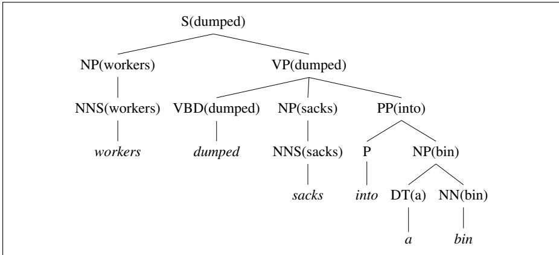

CHAPTER


# Constituency Grammars

Because the Night by Bruce Springsteen and Patty Smith

The Fire Next Time by James Baldwin

If on a winter’s night a traveler by Italo Calvino

Love Actually by Richard Curtis

Suddenly Last Summer by Tennessee Williams

A Scanner Darkly by Philip K. Dick

Six titles that are not constituents, from Geoffrey K. Pullum on Language Log (who was pointing out their incredible rarity).

The study of grammar has an ancient pedigree. The grammar of Sanskrit was described by the Indian grammarian Pan¯ <sub>.</sub> ini sometime between the 7th and 4th centuries BCE, in his famous treatise the Astadhy¯ ay¯ ¯ı (‘8 books’). And our word syntax comes from the Greek syntaxis ´ , meaning “setting out together or arrangement”, and refers to the way words are arranged together. We have seen various syntactic notions in previous chapters: ordering of sequences of words (Chapter 2), probabilities for these word sequences (Chapter 3), and the use of part-of-speech categories as a grammatical equivalence class for words (Chapter 18). In this chapter and the next three we introduce a variety of syntactic phenomena that go well beyond these simpler approaches, together with formal models for capturing them in a computationally useful manner.

The bulk of this chapter is devoted to context-free grammars. Context-free grammars are the backbone of many formal models of the syntax of natural language (and, for that matter, of computer languages). As such, they play a role in many computational applications, including grammar checking, semantic interpretation, dialogue understanding, and machine translation. They are powerful enough to express sophisticated relations among the words in a sentence, yet computationally tractable enough that efficient algorithms exist for parsing sentences with them (as we show in Chapter 19). Here we also introduce the concept of lexicalized grammars, focusing on one example, combinatory categorial grammar, or CCG.

In Chapter 20 we introduce a formal model of grammar called syntactic dependencies that is an alternative to these constituency grammars, and we’ll give algorithms for dependency parsing. Both constituency and dependency formalisms are important for language processing.

Finally, we provide a brief overview of the grammar of English, illustrated from a domain with relatively simple sentences called ATIS (Air Traffic Information System) (Hemphill et al., 1990). ATIS systems were an early spoken language system for users to book flights, by expressing sentences like I’d like tofly to Atlanta.

<table><tr><td>three parties from Brooklyn arrive... a high-class spot such as Mindy&#x27;s attracts...</td></tr><tr><td></td></tr><tr><td>the Broadway coppers love...</td></tr><tr><td>they sit</td></tr></table>

## F.1 Constituency

Syntactic constituency is the idea that groups of words can behave as single units, or constituents. Part of developing a grammar involves building an inventory of the constituents in the language. How do words group together in English? Consider the noun phrase, a sequence of words surrounding at least one noun. Here are some examples of noun phrases (thanks to Damon Runyon):

<table><tr><td>Harry the Horse</td><td>a high-class spot such as Mindy&#x27;s</td></tr><tr><td>the Broadway coppers</td><td>the reason he comes into the Hot Box</td></tr><tr><td>they</td><td>three parties from Brooklyn</td></tr></table>

What evidence do we have that these words group together (or “form constituents”)? One piece of evidence is that they can all appear in similar syntactic environments, for example, before a verb.

But while the whole noun phrase can occur before a verb, this is not true of each of the individual words that make up a noun phrase. The following are not grammatical sentences of English (recall that we use an asterisk (\*) to mark fragments that are not grammatical English sentences):

<table><tr><td>*from arrive...</td><td>*as attracts...</td></tr><tr><td>*the is...</td><td>*spot sat...</td></tr></table>

Thus, to correctly describe facts about the ordering of these words in English, we must be able to say things like “Noun Phrases can occur before verbs”.

Other kinds of evidence for constituency come from what are called preposed or postposed constructions. For example, the prepositional phrase on September seventeenth can be placed in a number of different locations in the following examples, including at the beginning (preposed) or at the end (postposed):

On September seventeenth, I’d like to fly from Atlanta to Denver

I’d like to fly on September seventeenth from Atlanta to Denver

I’d like to fly from Atlanta to Denver on September seventeenth

But again, while the entire phrase can be placed differently, the individual words making up the phrase cannot be:

\*On September, I’d like to fly seventeenth from Atlanta to Denver \*On I’d like to fly September seventeenth from Atlanta to Denver \*I’d like to fly on September from Atlanta to Denver seventeenth

## F.2 Context-Free Grammars

The most widely used formal system for modeling constituent structure in English CFG and other natural languages is the Context-Free Grammar, or CFG. Contextfree grammars are also called Phrase-Structure Grammars, and the formalism is equivalent to Backus-Naur Form, or BNF. The idea of basing a grammar on constituent structure dates back to the psychologist Wilhelm Wundt 1900 but was not formalized until Chomsky (1956) and, independently, Backus (1959).

A context-free grammar consists of a set of rules or productions, each of which expresses the ways that symbols of the language can be grouped and ordered together, and a lexicon of words and symbols. For example, the following productions express that an NP (or noun phrase) can be composed of either a ProperNoun or a determiner (Det) followed by a Nominal; a Nominal in turn can consist of one or more Nouns.<sup>1</sup>

$$
\begin{array} { c } { { N P \mathrm { ~  ~ } D e t N o m i n a l } } \\ { { N P \mathrm { ~  ~ } P r o p e r N o u n } } \\ { { N o m i n a l \mathrm { ~  ~ } N o u n \mathrm { ~ \mid ~ } N o m i n a l N o u n } } \end{array}
$$

Context-free rules can be hierarchically embedded, so we can combine the previous rules with others, like the following, that express facts about the lexicon:

$$
\begin{array} { c } { { D e t \mathrm { ~ \tiny ~ \to ~ } a } } \\ { { D e t \mathrm { ~ \tiny ~ \to ~ } t h e } } \\ { { N o u n \mathrm { ~ \tiny ~ \to ~ } f i g h t } } \end{array}
$$

The symbols that are used in a CFG are divided into two classes. The symbols that correspond to words in the language (“the”, “nightclub”) are called terminal symbols; the lexicon is the set of rules that introduce these terminal symbols. The symbols that express abstractions over these terminals are called non-terminals. In each context-free rule, the item to the right of the arrow (→) is an ordered list of one or more terminals and non-terminals; to the left of the arrow is a single non-terminal symbol expressing some cluster or generalization. The non-terminal associated with each word in the lexicon is its lexical category, or part of speech.

A CFG can be thought of in two ways: as a device for generating sentences and as a device for assigning a structure to a given sentence. Viewing a CFG as a generator, we can read the → arrow as “rewrite the symbol on the left with the string of symbols on the right”.

$$
{ \begin{array} { l l l } { { \mathrm { S o ~ s t a r t i n g ~ f r o m ~ t h e ~ s y m b o l : } } } & { } & { \qquad N P } \\ { } & { { \mathrm { w e ~ c a n ~ u s e ~ o u r ~ f r s t ~ r u l e ~ t o ~ r e w r i t e ~ } } N P { \mathrm { ~ a s : } } } & { } & { D e t N o m i n a l } \\ { } & { { \mathrm { a n d ~ t h e n ~ r e w r i t e ~ } } N o m i n a l ~ a s : } & { } & { N o u n } \\ { } & { { \mathrm { a n d ~ f i n a l l y ~ r e w r i t e ~ t h e s e ~ p a r t s \to ~ o f - s p e e c h ~ a s : } } } & { } & { a f i g h t } \end{array} }
$$

We say the string a flight can be derived from the non-terminal NP. Thus, a CFG can be used to generate a set of strings. This sequence of rule expansions is called a derivation of the string of words. It is common to represent a derivation by a parse tree (commonly shown inverted with the root at the top). Figure F.1 shows the tree representation of this derivation.

In the parse tree shown in Fig. F.1, we can say that the node NP dominates all the nodes in the tree (Det, Nom, Noun, a, flight). We can say further that it immediately dominates the nodes Det and Nom.

The formal language defined by a CFG is the set of strings that are derivable from the designated start symbol. Each grammar must have one designated start symbol, which is often called S. Since context-free grammars are often used to define sentences, S is usually interpreted as the “sentence” node, and the set of strings that are derivable from S is the set of sentences in some simplified version of English.

<table><tr><td>NP Det Nom a Noun flight</td></tr></table>

Figure F.1 A parse tree for “a flight”.

Let’s add a few additional rules to our inventory. The following rule expresses the fact that a sentence can consist of a noun phrase followed by a verb phrase:

$$
S ~  ~ N P ~ V P \quad \mathrm { I p r e f e r ~ a ~ m o r n i n g ~ f l i g h t }
$$

A verb phrase in English consists of a verb followed by assorted other things; for example, one kind of verb phrase consists of a verb followed by a noun phrase:

$$
V P ~  ~ V e r b ~ N P { \mathrm { p r e f e r ~ a ~ m o r n i n g ~ f i g h t } }
$$

Or the verb may be followed by a noun phrase and a prepositional phrase:

$$
V P ~  ~ V e r b ~ N P ~ P P \mathrm { l e a v e ~ B o s t o n ~ i n ~ t h e ~ m o r n i n g }
$$

Or the verb phrase may have a verb followed by a prepositional phrase alone:

$$
V P ~ \to ~ V e r b ~ P P \quad \mathrm { l e a v i n g ~ o n ~ T h u r s d a y }
$$

A prepositional phrase generally has a preposition followed by a noun phrase. For example, a common type of prepositional phrase in the ATIS corpus is used to indicate location or direction:

## PP → Preposition NP from Los Angeles

The NP inside a PP need not be a location; PPs are often used with times and dates, and with other nouns as well; they can be arbitrarily complex. Here are ten examples from the ATIS corpus:

<table><tr><td>to Seattle</td><td>on these flights</td></tr><tr><td>in Minneapolis</td><td>about the ground transportation in Chicago</td></tr><tr><td>on Wednesday</td><td>of the round trip flight on United Airlines</td></tr><tr><td>in the evening</td><td>of the AP fifty seven flight</td></tr><tr><td>on the ninth of July</td><td>with a stopover in Nashville</td></tr></table>

Figure F.2 gives a sample lexicon, and Fig. F.3 summarizes the grammar rules we’ve seen so far, which we’ll call L . Note that we can use the or-symbol | to indicate that a non-terminal has alternate possible expansions.

We can use this grammar to generate sentences of this “ATIS-language”. We start with S, expand it to NP VP, then choose a random expansion of NP (let’s say, to I), and a random expansion of VP (let’s say, to Verb NP), and so on until we generate the string I prefer a morning flight. Figure F.4 shows a parse tree that represents a complete derivation of I prefer a morningflight.

We can also represent a parse tree in a more compact format called bracketed notation; here is the bracketed representation of the parse tree of Fig. F.4:

  
Figure F.2 The lexicon for L<sub>0</sub>.

<table><tr><td colspan="3">Grammar Rules</td><td>Examples</td></tr><tr><td></td><td>S → NP VP</td><td></td><td>I + want a morning flight</td></tr><tr><td rowspan="2"></td><td>NP → Pronoun</td><td></td><td>I</td></tr><tr><td></td><td>Proper-Noun</td><td>Los Angeles</td></tr><tr><td rowspan="4"></td><td></td><td> Det Nominal</td><td>a + flight</td></tr><tr><td></td><td>Nominal → Nominal Noun</td><td>morning + flight</td></tr><tr><td> Noun</td><td></td><td>flights</td></tr><tr><td></td><td></td><td></td></tr><tr><td></td><td>VP → Verb Verb NP</td><td></td><td>do</td></tr><tr><td rowspan="3"></td><td></td><td>Verb NP PP</td><td>want + a flight</td></tr><tr><td>Verb</td><td> $P P$  </td><td>leave + Boston + in the morning</td></tr><tr><td></td><td></td><td>leaving + on Thursday</td></tr><tr><td></td><td></td><td>PP → Preposition NP</td><td>from + Los Angeles</td></tr></table>

$$
{ \mathcal { L } } _ { 0 } ,
$$

  
Figure F.4 The parse tree for “I prefer a morning flight” according to grammar ${ \mathcal { L } } _ { 0 } .$

(F.1) [<sub>S</sub> [<sub>NP</sub> $[ { \boldsymbol { P } } { \boldsymbol { r } } { \boldsymbol { o } }$ I]] [<sub>VP</sub> [<sub>V</sub> prefer] [<sub>NP</sub> [<sub>Det</sub> a] $\operatorname { \Pi } [ { \gamma } _ { o m }$ [<sub>N</sub> morning] $\left[ { { N o m } } \right.$ [<sub>N</sub> flight]]]]]]

A CFG like that of $\mathcal { L } _ { 0 }$ defines a formal language. We saw in Chapter 2 that a formal language is a set of strings. Sentences (strings of words) that can be derived by a grammar are in the formal language defined by that grammar, and are called grammatical sentences. Sentences that cannot be derived by a given formal grammar are not in the language defined by that grammar and are referred to as ungrammatical.

This hard line between “in” and “out” characterizes all formal languages but is only a very simplified model of how natural languages really work. This is because determining whether a given sentence is part of a given natural language (say, English) often depends on the context. In linguistics, the use of formal languages to model natural languages is called generative grammar since the language is defined by the set of possible sentences “generated” by the grammar.

## F.2.1 Formal Definition of Context-Free Grammar

We conclude this section with a quick, formal description of a context-free grammar and the language it generates. A context-free grammar G is defined by four parameters: N, Σ, R, S (technically this is a “4-tuple”).

N a set of non-terminal symbols (or variables)

Σ a set of terminal symbols (disjoint from N)

R a set of rules or productions, each of the form $A  \beta$

where A is a non-terminal,

β is a string of symbols from the infinite set of strings (Σ ∪ N)<sup>∗</sup>

S a designated start symbol and a member of N

For the remainder of the book we adhere to the following conventions when discussing the formal properties of context-free grammars (as opposed to explaining particular facts about English or other languages).

<table><tr><td>Capital letters like A, B, and S</td><td>Non-terminals</td></tr><tr><td>S</td><td>The start symbol</td></tr><tr><td>Lower-case Greek letters like α, β, and γ</td><td>Strings drawn from (Σ∪N)*</td></tr><tr><td>Lower-case Roman letters like u, v, and w</td><td>Strings of terminals</td></tr></table>

A language is defined through the concept of derivation. One string derives another one if it can be rewritten as the second one by some series of rule applications. More formally, following Hopcroft and Ullman (1979),

if A → β is a production of R and α and γ are any strings in the set

(Σ ∪ N)<sup>∗</sup> , then we say that αAγ directly derives αβ γ, or $\alpha A \gamma \Rightarrow \alpha \beta \gamma .$

Derivation is then a generalization of direct derivation:

Let $\alpha _ { 1 } , \alpha _ { 2 } , \ldots , \alpha _ { m }$ be strings in $( \Sigma \cup N ) ^ { * } , m \geq 1$ , such that

$$
\alpha _ { 1 } \Rightarrow \alpha _ { 2 } , \alpha _ { 2 } \Rightarrow \alpha _ { 3 } , \ldots , \alpha _ { m - 1 } \Rightarrow \alpha _ { m }
$$

We say that $\alpha _ { 1 }$ derives $\alpha _ { m } .$ , or $\alpha _ { 1 } \stackrel { * } { \Rightarrow } \alpha _ { m }$

We can then formally define the language $\mathcal { L } _ { G }$ generated by a grammar G as the set of strings composed of terminal symbols that can be derived from the designated start symbol S.

$$
\mathcal { L } _ { G } = \{ w | w \mathrm { i s } \mathrm { i n } \Sigma ^ { * } \mathrm { a n d } S \stackrel { * } { \Rightarrow } w \}
$$

The problem of mapping from a string of words to its parse tree is called syntactic parsing; we define algorithms for constituency parsing in Chapter 19.

## F.3 Some Grammar Rules for English

In this section, we introduce a few more aspects of the phrase structure of English; for consistency we will continue to focus on sentences from the ATIS domain. Because of space limitations, our discussion is necessarily limited to highlights. Readers are strongly advised to consult a good reference grammar of English, such as Huddleston and Pullum (2002).

## F.3.1 Sentence-Level Constructions

In the small grammar L , we provided only one sentence-level construction for declarative sentences like I prefer a morning flight. Among the large number of constructions for English sentences, four are particularly common and important: declaratives, imperatives, yes-no questions, and wh-questions.

Sentences with declarative structure have a subject noun phrase followed by a verb phrase, like “I prefer a morning flight”. Sentences with this structure have a great number of different uses; here examples from the ATIS domain:

I want a flight from Ontario to Chicago

The flight should be eleven a.m. tomorrow

The return flight should leave at around seven p.m.

Sentences with imperative structure often begin with a verb phrase and have no subject. They are called imperative because they are almost always used for commands and suggestions; in the ATIS domain they are commands to the system.

Show the lowest fare

Give me Sunday’s flights arriving in Las Vegas from New York City

List all flights between five and seven p.m.

We can model this sentence structure with another rule for the expansion of S:

$$
S ~  ~ V P
$$

Sentences with yes-no question structure are often (though not always) used to ask questions; they begin with an auxiliary verb, followed by a subject NP, followed by a VP. Here are some examples. Note that the third example is not a question at all but a request.

Do any of these flights have stops?

Does American’s flight eighteen twenty five serve dinner?

Can you give me the same information for United?

Here’s the rule:

$$
S ~  ~ A u x ~ N P ~ V P
$$

The most complex sentence-level structures we examine here are the various whstructures. These are so named because one of their constituents is a wh-phrase, that is, one that includes a wh-word (who, whose, when, where, what, which, how, why). These may be broadly grouped into two classes of sentence-level structures. The wh-subject-question structure is identical to the declarative structure, except that the first noun phrase contains some wh-word.

What airlines fly from Burbank to Denver?

Which flights depart Burbank after noon and arrive in Denver by six p.m? Whose flights serve breakfast?

Here is a rule. Exercise F.7 discusses rules for the constituents that make up the $W h – N P$

$$
S ~  ~ W h { \cdot } N P ~ V P
$$

In the wh-non-subject-question structure, the wh-phrase is not the subject of the sentence, and so the sentence includes another subject. In these types of sentences the auxiliary appears before the subject NP, just as in the yes-no question structures. Here is an example followed by a sample rule:

What flights do you have from Burbank to Tacoma Washington?

$$
S ~  ~ W h { - } N P A u x ~ N P ~ V P
$$

Constructions like the wh-non-subject-question contain what are called longdistance dependencies because the Wh-NP whatflights is far away from the predicate that it is semantically related to, the main verb have in the VP. In some models of parsing and understanding compatible with the grammar rule above, long-distance dependencies like the relation betweenflights and have are thought of as a semantic relation. In such models, the job of figuring out that flights is the argument of have is done during semantic interpretation. Other models of parsing represent the relationship between flights and have as a syntactic relation, and the grammar is modified to insert a small marker called a trace or empty category after the verb. We discuss empty-category models when we introduce the Penn Treebank on page 15.

## F.3.2 Clauses and Sentences

Before we move on, we should clarify the status of the S rules in the grammars we just described. S rules are intended to account for entire sentences that stand alone as fundamental units of discourse. However, S can also occur on the right-hand side of grammar rules and hence can be embedded within larger sentences. Clearly then, there’s more to being an S than just standing alone as a unit of discourse.

What differentiates sentence constructions (i.e., the S rules) from the rest of the grammar is the notion that they are in some sense complete. In this way they correspond to the notion of a clause, which traditional grammars often describe as forming a complete thought. One way of making this notion of “complete thought” more precise is to say an S is a node of the parse tree below which the main verb of the S has all of its arguments. We define verbal arguments later, but for now let’s just see an illustration from the tree for I prefer a morning flight in Fig. F.4 on page 5. The verb prefer has two arguments: the subject I and the object a morningflight. One of the arguments appears below the VP node, but the other one, the subject NP, appears only below the S node.

## F.3.3 The Noun Phrase

Our L grammar introduced three of the most frequent types of noun phrases that occur in English: pronouns, proper nouns and the NP → Det Nominal construction. The central focus of this section is on the last type since that is where the bulk of the syntactic complexity resides. These noun phrases consist of a head, the central noun in the noun phrase, along with various modifiers that can occur before or after the head noun. Let’s take a close look at the various parts.

## The Determiner

Noun phrases can begin with simple lexical determiners: a stop the flights this flight those flights any flights some flights

The role of the determiner can also be filled by more complex expressions:

United’s flight

United’s pilot’s union

Denver’s mayor’s mother’s canceled flight

In these examples, the role of the determiner is filled by a possessive expression consisting of a noun phrase followed by an ’s as a possessive marker, as in the following rule.

$$
D e t \  \ N P ^ { \ \prime } s
$$

The fact that this rule is recursive (since an NP can start with a Det) helps us model the last two examples above, in which a sequence of possessive expressions serves as a determiner.

Under some circumstances determiners are optional in English. For example, determiners may be omitted if the noun they modify is plural:

## (F.2) Show meflights from San Francisco to Denver on weekdays

As we saw in Chapter 18, mass nouns also don’t require determination. Recall that mass nouns often (not always) involve something that is treated like a substance (including e.g., water and snow), don’t take the indefinite article $\ " a \ "$ , and don’t tend to pluralize. Many abstract nouns are mass nouns (music, homework). Mass nouns in the ATIS domain include breakfast, lunch, and dinner:

(F.3) Does this flight serve dinner?

## The Nominal

The nominal construction follows the determiner and contains any pre- and posthead noun modifiers. As indicated in grammar ${ \mathcal { L } } _ { 0 } .$ , in its simplest form a nominal can consist of a single noun.

$$
N o m i n a l  N o u n
$$

As we’ll see, this rule also provides the basis for the bottom of various recursive rules used to capture more complex nominal constructions.

## Before the Head Noun

A number of different kinds of word classes can appear before the head noun but after the determiner (the “postdeterminers”) in a nominal. These include cardinal numbers, ordinal numbers, quantifiers, and adjectives. Examples of cardinal numbers:

two friends one stop

Ordinal numbers includefirst, second, third, and so on, but also words like next, last, past, other, and another:

the first one the next day the second leg the last flight the other American flight

Some quantifiers (many, (a) few, several) occur only with plural count nouns:

## many fares

Adjectives occur after quantifiers but before nouns.

a first-class fare a non-stop flight the longest layover the earliest lunch flight

Adjectives can also be grouped into a phrase called an adjective phrase or AP. APs can have an adverb before the adjective (see Chapter 18 for definitions of adjectives and adverbs):

the least expensive fare

## After the Head Noun

A head noun can be followed by postmodifiers. Three kinds of nominal postmodifiers are common in English:

prepositional phrases all flightsfrom Cleveland non-finite clauses any flights arriving after eleven a.m. relative clauses a flight that serves breakfast

They are especially common in the ATIS corpus since they are used to mark the origin and destination of flights.

Here are some examples of prepositional phrase postmodifiers, with brackets inserted to show the boundaries of each PP; note that two or more PPs can be strung together within a single NP:

all flights [from Cleveland] [to Newark]

arrival [in San Jose] [before seven p.m.]

a reservation [on flight six oh six] [from Tampa] [to Montreal]

Here’s a new nominal rule to account for postnominal PPs:

## Nominal → Nominal PP

The three most common kinds of non-finite postmodifiers are the gerundive (- ing), -ed, and infinitive forms.

Gerundive postmodifiers are so called because they consist of a verb phrase that begins with the gerundive (-ing) form of the verb. Here are some examples:

any of those [leaving on Thursday]

any flights [arriving after eleven a.m.]

flights [arriving within thirty minutes of each other]

We can define the Nominals with gerundive modifiers as follows, making use of a new non-terminal GerundVP:

## Nominal → Nominal GerundVP

We can make rules for GerundVP constituents by duplicating all of our VP productions, substituting GerundV for V.

$$
\begin{array} { l } { { G e r u n d V P ~  ~ G e r u n d V N P } } \\ { { \mid ~ G e r u n d V P P \mid G e r u n d V \mid G e r u n d V N P P P } } \end{array}
$$

GerundV can then be defined as

$$
G e r u n d V \to b e i n g \mid a r r i \nu i n g \mid l e a \nu i n g \mid . . .
$$

The phrases in italics below are examples of the two other common kinds of non-finite clauses, infinitives and -ed forms:

the last flight to arrive in Boston

I need to have dinner served

Which is the aircraft used by this flight?

A postnominal relative clause (more correctly a restrictive relative clause), is a clause that often begins with a relative pronoun (that and who are the most common). The relative pronoun functions as the subject of the embedded verb in the following examples:

a flight that serves breakfast

flights that leave in the morning

the one that leaves at ten thirtyfive

We might add rules like the following to deal with these:

$$
N o m i n a l ~  ~ N o m i n a l R e l C l a u s e
$$

$$
R e l C l a u s e  \ ( w h o \mid t h a t ) \ V P
$$

The relative pronoun may also function as the object of the embedded verb, as in the following example; we leave for the reader the exercise of writing grammar rules for more complex relative clauses of this kind.

the earliest American Airlines flight that I can get

Various postnominal modifiers can be combined:

a flight [from Phoenix to Detroit] [leaving Monday evening]

evening flights [from Nashville to Houston] [that serve dinner]

a friend [living in Denver] [that would like to visit me in DC]

## Before the Noun Phrase

Word classes that modify and appear before NPs are called predeterminers. Many of these have to do with number or amount; a common predeterminer is all:

all the flights all flights all non-stop flights

The example noun phrase given in Fig. F.5 illustrates some of the complexity that arises when these rules are combined.

## F.3.4 The Verb Phrase

The verb phrase consists of the verb and a number of other constituents. In the simple rules we have built so far, these other constituents include NPs and PPs and combinations of the two:

VP → Verb disappear

VP → Verb NP prefer a morning flight

VP → Verb NP PP leave Boston in the morning

VP → Verb PP leaving on Thursday

Verb phrases can be significantly more complicated than this. Many other kinds of constituents, such as an entire embedded sentence, can follow the verb. These are called sentential complements:

You [<sub>VP</sub> [<sub>V</sub> said [<sub>S</sub> you had a two hundred sixty-six dollar fare]]

[<sub>VP</sub> [<sub>V</sub> Tell] [<sub>NP</sub> me] [<sub>S</sub> how to get from the airport to downtown]]

I [<sub>VP</sub> [<sub>V</sub> think [<sub>S</sub> I would like to take the nine thirty flight]]

  
Figure F.5 A parse tree for “all the morning flights from Denver to Tampa leaving before 10”.

Here’s a rule for these:

$$
V P \ \to \ V e r b \ S
$$

Similarly, another potential constituent of the VP is another VP. This is often the case for verbs like want, would like, try, intend, need:

I want [<sub>VP</sub> to fly from Milwaukee to Orlando]

Hi, I want [<sub>VP</sub> to arrange three flights]

While a verb phrase can have many possible kinds of constituents, not every verb is compatible with every verb phrase. For example, the verb want can be used either with an NP complement (I want a flight . . . ) or with an infinitive VP complement (I want to fly to . . . ). By contrast, a verb like find cannot take this sort of VP complement (\* I found to fly to Dallas).

This idea that verbs are compatible with different kinds of complements is a very old one; traditional grammar distinguishes between transitive verbs likefind, which take a direct object NP (I found a flight), and intransitive verbs like disappear, which do not (\*I disappeared a flight).

Where traditional grammars subcategorize verbs into these two categories (transitive and intransitive), modern grammars distinguish as many as 100 subcategories. We say that a verb like find subcategorizes for an NP, and a verb like want subcategorizes for either an NP or a non-finite VP. We also call these constituents the complements of the verb (hence our use of the term sentential complement above). So we say that want can take a VP complement. These possible sets of complements are called the subcategorization frame for the verb. Another way of talking about the relation between the verb and these other constituents is to think of the verb as a logical predicate and the constituents as logical arguments of the predicate. So we can think of such predicate-argument relations as FIND(I, A FLIGHT) or WANT(I, TO FLY). We talk more about this view of verbs and arguments in Appendix H when we talk about predicate calculus representations of verb semantics. Subcategorization frames for a set of example verbs are given in Fig. F.6.

<table><tr><td>Frame</td><td>Verb</td><td>Example</td></tr><tr><td>0</td><td>eat, sleep</td><td>I ate</td></tr><tr><td> $N P$   $N P N P$ </td><td>prefer, find, leave</td><td>Find [np the flight from Pittsburgh to Boston]</td></tr><tr><td> $P P _ { \mathrm { f r o m } } P P _ { \mathrm { t o } }$ </td><td>show, give</td><td>Show  $[ \boldsymbol { \ l } _ { N P }$  me]  $[ \boldsymbol { \ l } _ { N P }$  airlines with flights from Pittsburgh]</td></tr><tr><td> $N P ~ P P _ { \mathrm { w i t h } }$ </td><td>fly, travel help, load</td><td>I would like to fly [pp from Boston]  $[ { \boldsymbol { P P } }$  to Philadelphia] Can you help  $\mathrm { [ } _ { N P } \mathrm { m e ] } \mathrm { [ } _ { P P }$  with a flight]</td></tr><tr><td> $V P t o$   $s$ </td><td>prefer, want, need mean</td><td>I would prefer  $[ \boldsymbol { V P t o }$  to go by United Airlines] has a hub in Boston]</td></tr></table>

Figure F.6 Subcategorization frames for a set of example verbs.

We can capture the association between verbs and their complements by making separate subtypes of the class Verb (e.g., Verb-with-NP-complement, Verb-with-Inf-VP-complement, Verb-with-S-complement, and so on):

$$
V e r b - w i t h - N P - c o m p l e m e n t  f u n d \mid l e a \nu e \mid r e p e a t \mid . . .
$$

$$
V e r b - w i t h - S - c o m p l e m e n t \enspace  \enspace t h i n k \enspace \vert \enspace b e l i e \nu e \vert \enspace s a y \vert \enspace . . .
$$

$$
V e r b - w i t h - I n f - V P - c o m p l e m e n t  w a n t \mid t r y \mid n e e d \mid . . .
$$

Each VP rule could then be modified to require the appropriate verb subtype:

$$
V P ~  ~ V e r b \ – w i t h { - n o - c o m p l e m e n t } ~ \mathrm { d i s a p p e a r }
$$

$$
V P ~  ~ V e r b - w i t h - N P - c o m p ~ N P ~ \mathrm { p r e f e r ~ a ~ m o r n i n g ~ f i i g h t }
$$

$$
V P ~ \to ~ V e r b - w i t h { - } S { \cdot } c o m p ~ S ~ \mathrm { s a i d ~ t h e r e ~ w e r e ~ t w o ~ f l i g h t s }
$$

A problem with this approach is the significant increase in the number of rules and the associated loss of generality.

## F.3.5 Coordination

The major phrase types discussed here can be conjoined with conjunctions like and, $^ { o r , }$ and but to form larger constructions of the same type. For example, a coordinate noun phrase can consist of two other noun phrases separated by a conjunction:

Please repeat [<sub>NP</sub> [<sub>NP</sub> the flights] and [<sub>NP</sub> the costs]]

I need to know [<sub>NP</sub> [<sub>NP</sub> the aircraft] and $[ \boldsymbol { \ l } _ { N P }$ the flight number]]

Here’s a rule that allows these structures:

$$
N P ~  ~ N P a n d N P
$$

Note that the ability to form coordinate phrases through conjunctions is often used as a test for constituency. Consider the following examples, which differ from the ones given above in that they lack the second determiner.

Please repeat the $\operatorname { [ } _ { N o m } \ [ _ { N o m }$ flights] and $\left[ { { N o m } } \right.$ costs]]

$$
\mathrm { ~ I ~ n e e d ~ t o ~ k n o w ~ t h e ~ } [ \chi _ { o m } \ [ \chi _ { o m } \ \mathrm { a i r c r a f t } ] \ a n d \ [ \chi _ { o m } \ \mathrm { f i g h t ~ n u m b e r } ] ]
$$

The fact that these phrases can be conjoined is evidence for the presence of the underlying Nominal constituent we have been making use of. Here’s a rule for this:

$$
N o m i n a l ~  ~ N o m i n a l a n d N o m i n a l
$$

The following examples illustrate conjunctions involving VPs and Ss.

What flights do you have [<sub>VP</sub> [<sub>VP</sub> leaving Denver] and [<sub>VP</sub> arriving in San Francisco]]

[ [ I’m interested in a flight from Dallas to Washington] and [ I’m also interested in going to Baltimore]]

The rules for VP and S conjunctions mirror the NP one given above.

$$
V P ~  ~ V P a n d V P
$$

$$
S  S a n d S
$$

Since all the major phrase types can be conjoined in this fashion, it is also possible to represent this conjunction fact more generally; a number of grammar formalisms such as GPSG (Gazdar et al., 1985) do this using metarules like:

$$
X  X a n d X
$$

This metarule states that any non-terminal can be conjoined with the same nonterminal to yield a constituent of the same type; the variable X must be designated as a variable that stands for any non-terminal rather than a non-terminal itself.

## F.4 Treebanks

Sufficiently robust grammars consisting of context-free grammar rules can be used to assign a parse tree to any sentence. This means that it is possible to build a corpus where every sentence in the collection is paired with a corresponding parse tree. Such a syntactically annotated corpus is called a treebank. Treebanks play an important role in parsing, as we discuss in Chapter 19, as well as in linguistic investigations of syntactic phenomena.

A wide variety of treebanks have been created, generally through the use of parsers (of the sort described in the next few chapters) to automatically parse each sentence, followed by the use of humans (linguists) to hand-correct the parses. The Penn Treebank project (whose POS tagset we introduced in Chapter 18) has produced treebanks from the Brown, Switchboard, ATIS, and Wall Street Journal corpora of English, as well as treebanks in Arabic and Chinese. A number of treebanks use the dependency representation we will introduce in Chapter 20, including many that are part of the Universal Dependencies project (Nivre et al., 2016).

## F.4.1 Example: The Penn Treebank Project

Figure F.7 shows sentences from the Brown and ATIS portions of the Penn Treebank.<sup>2</sup> Note the formatting differences for the part-of-speech tags; such small differences are common and must be dealt with in processing treebanks. The Penn Treebank part-of-speech tagset was defined in Chapter 18. The use of LISP-style parenthesized notation for trees is extremely common and resembles the bracketed notation we saw earlier in (F.1). For those who are not familiar with it we show a standard node-and-line tree representation in Fig. F.8.

Figure F.9 shows a tree from the Wall Street Journal. This tree shows another feature of the Penn Treebanks: the use of traces (-NONE- nodes) to mark long-distance dependencies or syntactic movement. For example, quotations often follow a quotative verb like say. But in this example, the quotation “We would have to wait until we have collected on those assets” precedes the words he said. An empty S containing only the node -NONE- marks the position after said where the quotation sentence often occurs. This empty node is marked (in Treebanks II and III) with the index 2, as is the quotation S at the beginning of the sentence. Such co-indexing may make it easier for some parsers to recover the fact that this fronted or topicalized quotation is the complement of the verb said. A similar -NONE- node marks the fact that there is no syntactic subject right before the verb to wait; instead, the subject is the earlier NP We. Again, they are both co-indexed with the index 1.

<table><tr><td>CS (NP-SBJ (DT That) ((S</td></tr><tr><td>(JJ cold) (, ,) (NP-SBJ The/DT flight/NN )</td></tr><tr><td>(JJ empty) (NN sky) ) (VP should/MD</td></tr><tr><td>(VP (VBD was) (VP arrive/VB</td></tr><tr><td>(ADJP-PRD (JJ ful1) (PP-TMP at/IN</td></tr><tr><td>(PP (IN of) (NP eleven/CD a.m/RB )) (NP (NN fire) (NP-TMP tomorrow/NN )))))</td></tr><tr><td>(CC and)</td></tr><tr><td>(NN light) ))))</td></tr><tr><td>(. .)) (a) (b)</td></tr><tr><td></td></tr><tr><td></td></tr></table>

Figure F.7 Parsed sentences from the LDC Treebank3 version of the (a) Brown and (b) ATIS corpora.

  
Figure F.8 The tree corresponding to the Brown corpus sentence in the previous figure.

The Penn Treebank II and Treebank III releases added further information to make it easier to recover the relationships between predicates and arguments. Certain phrases were marked with tags indicating the grammatical function of the phrase (as surface subject, logical topic, cleft, non-VP predicates) its presence in particular text categories (headlines, titles), and its semantic function (temporal phrases, locations) (Marcus et al. 1994, Bies et al. 1995). Figure F.9 shows examples of the -SBJ (surface subject) and -TMP (temporal phrase) tags. Figure F.8 shows in addition the -PRD tag, which is used for predicates that are not VPs (the one in Fig. F.8 is an ADJP). We’ll return to the topic of grammatical function when we consider dependency grammars and parsing in Chapter 20.

```lisp
( (S (‘‘ ‘‘)
(S-TPC-2
(NP-SBJ-1 (PRP We) )
(VP (MD would)
(VP (VB have)
(S
(NP-SBJ (-NONE- *-1) )
(VP (TO to)
(VP (VB wait)
(SBAR-TMP (IN until)
(S
(NP-SBJ (PRP we) )
(VP (VBP have)
(VP (VBN collected)
(PP-CLR (IN on)
(NP (DT those)(NNS assets)))))))))))))
(, ,) (’’ ’’)
(NP-SBJ (PRP he) )
(VP (VBD said)
(S (-NONE- *T*-2) ))
(. .) ))
```  
Figure F.9 A sentence from the Wall Street Journal portion of the LDC Penn Treebank. Note the use of the empty -NONE- nodes.

## F.4.2 Treebanks as Grammars

The sentences in a treebank implicitly constitute a grammar of the language represented by the corpus being annotated. For example, from the three parsed sentences in Fig. F.7 and Fig. F.9, we can extract each of the CFG rules in them. For simplicity, let’s strip off the rule suffixes (-SBJ and so on). The resulting grammar is shown in Fig. F.10.

The grammar used to parse the Penn Treebank is relatively flat, resulting in very many and very long rules. For example, among the approximately 4,500 different rules for expanding VPs are separate rules for PP sequences of any length and every possible arrangement of verb arguments:

VP → VBD PP   
VP → VBD PP PP   
VP → VBD PP PP PP   
VP → VBD PP PP PP PP   
VP → VB ADVP PP   
VP → VB PP ADVP   
VP → ADVP VB PP

as well as even longer rules, such as

VP → VBP PP PP PP PP PP ADVP PP

Grammar Lexicon   
S → NP VP . PRP → we | he   
S → NP VP DT → the | that | those   
S → “ S ” , NP VP . JJ → cold | empty | full   
S → -NONE- NN → sky | fire | light | flight | tomorrow   
NP → DTNN NNS → assets   
NP → DTNNS CC → and   
NP → NNCCNN IN → of| at | until | on   
NP → CD RB CD → eleven   
NP → DTJJ , JJ NN RB → a.m.   
NP → PRP VB → arrive | have | wait   
NP → -NONE- VBD → was | said   
VP → MD VP VBP → have   
VP → VBD ADJP VBN → collected   
VP → VBD S MD → should | would   
VP → VBNPP TO → to   
VP → VB S   
VP → VB SBAR   
VP → VBP VP   
VP → VBNPP   
VP → TO VP   
SBAR → IN S   
ADJP → JJ PP   
PP → INNP

Figure F.10 A sample of the CFG grammar rules and lexical entries that would be extracted from the three treebank sentences in Fig. F.7 and Fig. F.9.

which comes from the VP marked in italics:

This mostly happens because we go from football in the fall to lifting in the winter to football again in the spring.

Some of the many thousands of NP rules include

NP → DT JJ NN   
NP → DT JJ NNS   
NP → DT JJ NN NN   
NP → DT JJ JJ NN   
NP → DT JJ CD NNS   
NP → RB DT JJ NN NN   
NP → RB DT JJ JJ NNS   
NP → DT JJ JJ NNP NNS   
NP → DT NNP NNP NNP NNP JJ NN   
NP → DT JJ NNP CC JJ JJ NN NNS   
NP → RB DT JJS NN NN SBAR   
NP → DT VBG JJ NNP NNP CC NNP   
NP → DT JJ NNS , NNS CC NN NNS NN   
NP → DT JJ JJ VBG NN NNP NNP FW NNP   
NP → NP JJ , JJ ‘‘ SBAR ’’ NNS

The last two of those rules, for example, come from the following two noun phrases:

[<sub>DT</sub> The] [<sub>JJ</sub> state-owned] [<sub>JJ</sub> industrial] [<sub>VBG</sub> holding] [<sub>NN</sub> company] [<sub>NNP</sub> Instituto] [<sub>NNP</sub> Nacional] [<sub>FW</sub> de] [<sub>NNP</sub> Industria]

```json
[<sub>NP</sub> Shearson’s] [<sub>JJ</sub> easy-to-film], [<sub>JJ</sub> black-and-white] “[<sub>SBAR</sub> Where We Stand]” [<sub>NNS</sub> commercials]
```

Viewed as a large grammar in this way, the Penn Treebank III Wall Street Journal corpus, which contains about 1 million words, also has about 1 million non-lexical rule tokens, consisting of about 17,500 distinct rule types.

  
Figure F.11 A lexicalized tree from Collins (1999).

Various facts about the treebank grammars, such as their large numbers of flat rules, pose problems for probabilistic parsing algorithms. For this reason, it is common to make various modifications to a grammar extracted from a treebank. We discuss these further in Appendix E.

## F.4.3 Heads and Head-Finding

We suggested informally earlier that syntactic constituents could be associated with a lexical head; N is the head of an NP, V is the head of a VP. This idea of a head for each constituent dates back to Bloomfield 1914, and is central to the dependency grammars and dependency parsing we’ll introduce in Chapter 20. Heads are also important in probabilistic parsing (Appendix E) and in constituent-based grammar formalisms like Head-Driven Phrase Structure Grammar (Pollard and Sag, 1994)..

In one simple model of lexical heads, each context-free rule is associated with a head (Charniak 1997, Collins 1999). The head is the word in the phrase that is grammatically the most important. Heads are passed up the parse tree; thus, each non-terminal in a parse tree is annotated with a single word, which is its lexical head. Figure F.11 shows an example of such a tree from Collins (1999), in which each non-terminal is annotated with its head.

For the generation of such a tree, each CFG rule must be augmented to identify one right-side constituent to be the head child. The headword for a node is then set to the headword of its head child. Choosing these head children is simple for textbook examples (NN is the head of NP) but is complicated and indeed controversial for most phrases. (Should the complementizer to or the verb be the head of an infinite verb phrase?) Modern linguistic theories of syntax generally include a component that defines heads (see, e.g., (Pollard and Sag, 1994)).

An alternative approach to finding a head is used in most practical computational systems. Instead of specifying head rules in the grammar itself, heads are identified dynamically in the context of trees for specific sentences. In other words, once a sentence is parsed, the resulting tree is walked to decorate each node with the appropriate head. Most current systems rely on a simple set of handwritten rules, such as a practical one for Penn Treebank grammars given in Collins (1999) but developed originally by Magerman (1995). For example, the rule for finding the head of an NP is as follows (Collins, 1999, p. 238):

• If the last word is tagged POS, return last-word.

• Else search from right to left for the first child which is an NN, NNP, NNPS, NX, POS, or JJR.

• Else search from left to right for the first child which is an NP.

• Else search from right to left for the first child which is a \$, ADJP, or PRN.

• Else search from right to left for the first child which is a CD.

• Else search from right to left for the first child which is a JJ, JJS, RB or QP.

• Else return the last word

Selected other rules from this set are shown in Fig. F.12. For example, for VP rules of the form $V P  Y _ { 1 } \cdots Y _ { n } ,$ , the algorithm would start from the left of $Y _ { 1 } \cdots$ $Y _ { n }$ looking for the first $Y _ { i }$ of type TO; if no TOs are found, it would search for the first $Y _ { i }$ of type VBD; if no VBDs are found, it would search for a VBN, and so on. See Collins (1999) for more details.

<table><tr><td>Parent</td><td>Direction</td><td>Priority List</td></tr><tr><td>ADJP</td><td>Left</td><td>NNS QP NN $ ADVP JJ VBN VBG ADJP JJR NP JJS DT FW RBR RBS SBAR RB</td></tr><tr><td>ADVP</td><td>Right</td><td>RB RBR RBS FW ADVP TO CD JJR JJ IN NP JJS NN</td></tr><tr><td>PRN PRT</td><td>Left Right</td><td>RP</td></tr><tr><td>QP</td><td>Left</td><td>$ IN NNS NN JJ RB DT CD NCD QP JJR JJS</td></tr><tr><td>S</td><td>Left</td><td>TO IN VP S SBAR ADJP UCP NP</td></tr><tr><td>SBAR</td><td>Left</td><td>WHNP WHPP WHADVP WHADJP IN DT S SQ SINV SBAR FRAG</td></tr><tr><td>VP</td><td>Left</td><td>TO VBD VBN MD VBZ VB VBG VBP VP ADJP NN NNS NP</td></tr><tr><td colspan="3">Figure F.12 Some head rules from Collins (1999). The head rules are also called a head percolation table.</td></tr></table>

## F.5 Grammar Equivalence and Normal Form

A formal language is defined as a (possibly infinite) set of strings of words. This suggests that we could ask if two grammars are equivalent by asking if they generate the same set of strings. In fact, it is possible to have two distinct context-free grammars generate the same language.

We usually distinguish two kinds of grammar equivalence: weak equivalence and strong equivalence. Two grammars are strongly equivalent if they generate the same set of strings and if they assign the same phrase structure to each sentence (allowing merely for renaming of the non-terminal symbols). Two grammars are weakly equivalent if they generate the same set of strings but do not assign the same phrase structure to each sentence.

It is sometimes useful to have a normal form for grammars, in which each of the productions takes a particular form. For example, a context-free grammar is in Chomsky normal form (CNF) (Chomsky, 1963) if it is ϵ-free and if in addition each production is either of the form A → B C or A → a. That is, the right-hand side of each rule either has two non-terminal symbols or one terminal symbol. Chomsky normal form grammars are binary branching, that is they have binary trees (down to the prelexical nodes). We make use of this binary branching property in the CKY parsing algorithm in Chapter 19.

Any context-free grammar can be converted into a weakly equivalent Chomsky normal form grammar. For example, a rule of the form

$$
\textit { A } \to \textit { B C D }
$$

can be converted into the following two CNF rules (Exercise F.?? asks the reader to formulate the complete algorithm):

$$
A \ \to \ B \ X
$$

$$
X  C D
$$

Sometimes using binary branching can actually produce smaller grammars. For example, the sentences that might be characterized as

$$
\tt V P \to \tt V B D \mathbb { N P \ P P ^ { * } }
$$

are represented in the Penn Treebank by this series of rules:

$$
\begin{array} { r l } & { \mathrm { V P ~  ~ V B D ~ N P ~ P P } } \\ & { \mathrm { V P ~  ~ V B D ~ N P ~ P P ~ P P } } \\ & { \mathrm { V P ~  ~ V B D ~ N P ~ P P ~ P P ~ P P } } \\ & { \mathrm { V P ~  ~ V B D ~ N P ~ P P ~ P P ~ P P ~ P P } } \\ & { \mathrm { . . . } } \end{array}
$$

but could also be generated by the following two-rule grammar:

$$
\tt V P  V B D \twoheadrightarrow P P
$$

Chomskyadjunction

The generation of a symbol A with a potentially infinite sequence of symbols B with a rule of the form A → A B is known as Chomsky-adjunction.

## F.6 Summary

This chapter has introduced a number of fundamental concepts in syntax through the use of context-free grammars.

• In many languages, groups of consecutive words act as a group or a constituent, which can be modeled by context-free grammars (which are also known as phrase-structure grammars).

• A context-free grammar consists of a set of rules or productions, expressed over a set of non-terminal symbols and a set of terminal symbols. Formally, a particular context-free language is the set of strings that can be derived from a particular context-free grammar.

• A generative grammar is a traditional name in linguistics for a formal language that is used to model the grammar of a natural language.

• There are many sentence-level grammatical constructions in English; declarative, imperative, yes-no question, and wh-question are four common types; these can be modeled with context-free rules.

• An English noun phrase can have determiners, numbers, quantifiers, and adjective phrases preceding the head noun, which can be followed by a number of postmodifiers; gerundive and infinitive VPs are common possibilities.

• Subjects in English agree with the main verb in person and number.

• Verbs can be subcategorized by the types of complements they expect. Simple subcategories are transitive and intransitive; most grammars include many more categories than these.

• Treebanks of parsed sentences exist for many genres of English and for many languages. Treebanks can be searched with tree-search tools.

• Any context-free grammar can be converted to Chomsky normal form, in which the right-hand side of each rule has either two non-terminals or a single terminal.

## Historical Notes

According to Percival (1976), the idea of breaking up a sentence into a hierarchy of constituents appeared in the Volkerpsychologie¨ of the groundbreaking psychologist Wilhelm Wundt (Wundt, 1900):

...den sprachlichen Ausdruckfur die willk¨ urliche Gliederung einer Ge-¨ sammtvorstellung in ihre in logische Beziehung zueinander gesetzten Bestandteile

[the linguistic expression for the arbitrary division of a total idea into its constituent parts placed in logical relations to one another]

Wundt’s idea of constituency was taken up into linguistics by Leonard Bloomfield in his early book An Introduction to the Study ofLanguage (Bloomfield, 1914). By the time of his later book, Language (Bloomfield, 1933), what was then called “immediate-constituent analysis” was a well-established method of syntactic study in the United States. By contrast, traditional European grammar, dating from the Classical period, defined relations between words rather than constituents, and European syntacticians retained this emphasis on such dependency grammars, the subject of Chapter 20.

American Structuralism saw a number of specific definitions of the immediate constituent, couched in terms of their search for a “discovery procedure”: a methodological algorithm for describing the syntax of a language. In general, these attempt to capture the intuition that “The primary criterion of the immediate constituent is the degree in which combinations behave as simple units” (Bazell, 1952/1966, p. 284). The most well known of the specific definitions is Harris’ idea of distributional similarity to individual units, with the substitutability test. Essentially, the method proceeded by breaking up a construction into constituents by attempting to substitute simple structures for possible constituents—if a substitution of a simple form, say, man, was substitutable in a construction for a more complex set (like intense young man), then the form intense young man was probably a constituent. Harris’s test was the beginning of the intuition that a constituent is a kind of equivalence class.

The first formalization of this idea of hierarchical constituency was the phrasestructure grammar defined in Chomsky (1956) and further expanded upon (and argued against) in Chomsky (1957) and Chomsky (1956/1975). From this time on, most generative linguistic theories were based at least in part on context-free grammars or generalizations of them (such as Head-Driven Phrase Structure Grammar (Pollard and Sag, 1994), Lexical-Functional Grammar (Bresnan, 1982), the Minimalist Program (Chomsky, 1995), and Construction Grammar (Kay and Fillmore, 1999), inter alia); many of these theories used schematic context-free templates known as X-bar schemata, which also relied on the notion of syntactic head.

Shortly after Chomsky’s initial work, the context-free grammar was reinvented by Backus (1959) and independently by Naur et al. (1960) in their descriptions of the ALGOL programming language; Backus (1996) noted that he was influenced by the productions of Emil Post and that Naur’s work was independent of his (Backus’)

own. After this early work, a great number of computational models of natural language processing were based on context-free grammars because of the early development of efficient algorithms to parse these grammars (see Chapter 19).

Thre are various classes of extensions to CFGs, many designed to handle longdistance dependencies in the syntax. (Other grammars instead treat long-distancedependent items as being related semantically rather than syntactically (Kay and Fillmore 1999, Culicover and Jackendoff 2005).

One extended formalism is Tree Adjoining Grammar (TAG) (Joshi, 1985). The primary TAG data structure is the tree, rather than the rule. Trees come in two kinds: initial trees and auxiliary trees. Initial trees might, for example, represent simple sentential structures, and auxiliary trees add recursion into a tree. Trees are combined by two operations called substitution and adjunction. The adjunction operation handles long-distance dependencies. See Joshi (1985) for more details. Tree Adjoining Grammar is a member of the family of mildly context-sensitive languages.

We mentioned on page 15 another way of handling long-distance dependencies, based on the use of empty categories and co-indexing. The Penn Treebank uses this model, which draws (in various Treebank corpora) from the Extended Standard Theory and Minimalism (Radford, 1997).

Readers interested in the grammar of English should get one of the three large reference grammars of English: Huddleston and Pullum (2002), Biber et al. (1999), and Quirk et al. (1985).

There are many good introductory textbooks on syntax from different perspectives. Sag et al. (2003) is an introduction to syntax from a generative perspective, focusing on the use of phrase-structure rules, unification, and the type hierarchy in Head-Driven Phrase Structure Grammar. Van Valin, Jr. and La Polla (1997) is an introduction from a functional perspective, focusing on cross-linguistic data and on the functional motivation for syntactic structures.

## Exercises

## F.1 Draw tree structures for the following ATIS phrases:

1. Dallas   
2. from Denver   
3. after five p.m.   
4. arriving in Washington   
5. early flights   
6. all redeye flights   
7. on Thursday   
8. a one-way fare   
9. any delays in Denver

F.2 Draw tree structures for the following ATIS sentences:

1. Does American Airlines have a flight between five a.m. and six a.m.?

2. I would like to fly on American Airlines.

3. Please repeat that.

4. Does American 487 have a first-class section?

5. I need to fly between Philadelphia and Atlanta.

6. What is the fare from Atlanta to Denver?

7. Is there an American Airlines flight from Philadelphia to Dallas?

F.3 Assume a grammar that has many VP rules for different subcategorizations, as expressed in Section F.3.4, and differently subcategorized verb rules like Verbwith-NP-complement. How would the rule for postnominal relative clauses (F.4) need to be modified if we wanted to deal properly with examples like the earliestflight that you have? Recall that in such examples the pronoun that is the object of the verb get. Your rules should allow this noun phrase but should correctly rule out the ungrammatical S \*I get.

F.4 Does your solution to the previous problem correctly model the NP the earliest flight that I can get? How about the earliest flight that I think my mother wants me to book for her? Hint: this phenomenon is called long-distance dependency.

F.5 Write rules expressing the verbal subcategory of English auxiliaries; for example, you might have a rule verb-with-bare-stem-VP-complement → can.

F.6 NPs like Fortune’s office or my uncle’s marks are called possessive or genitive noun phrases. We can model possessive noun phrases by treating the sub-NP like Fortune’s or my uncle’s as a determiner of the following head noun. Write grammar rules for English possessives. You may treat ’s as if it were a separate word (i.e., as if there were always a space before ’s).

F.7 Page 8 discussed the need for a Wh-NP constituent. The simplest Wh-NP is one of the Wh-pronouns (who, whom, whose, which). The Wh-words what and which can be determiners: whichfour will you have?, what credit do you have with the Duke? Write rules for the different types of Wh-NPs.

Backus, J. W. 1959. The syntax and semantics of the proposed international algebraic language of the Zurich ACM-GAMM Conference. Information Processing: Proceedings of the International Conference on Information Processing, Paris. UNESCO.

Backus, J. W. 1996. Transcript of question and answer session. In R. L. Wexelblat, ed., History of Programming Languages, page 162. Academic Press.

Bazell, C. E. 1952/1966. The correspondence fallacy in structural linguistics. In E. P. Hamp, F. W. Householder, and R. Austerlitz, eds, Studies by Members of the En glish Department, Istanbul University (3), reprinted in Readings in Linguistics II (1966), 271–298. University of Chicago Press.

Biber, D., S. Johansson, G. Leech, S. Conrad, and E. Finegan. 1999. Longman Grammar of Spoken and Written English. Pearson.

Bies, A., M. Ferguson, K. Katz, and R. MacIntyre. 1995. Bracketing guidelines for Treebank II style Penn Treebank Project.

Bloomfield, L. 1914. An Introduction to the Study of Lan guage. Henry Holt and Company.

Bloomfield, L. 1933. Language. University of Chicago Press.

Bresnan, J., ed. 1982. The Mental Representation of Gram matical Relations. MIT Press.

Charniak, E. 1997. Statistical parsing with a context-free grammar and word statistics. AAAI.

Chomsky, N. 1956. Three models for the description of language. IRE Transactions on Information Theory, 2(3):113–124.

Chomsky, N. 1956/1975. The Logical Structure of Linguistic Theory. Plenum.

Chomsky, N. 1957. Syntactic Structures. Mouton.

Chomsky, N. 1963. Formal properties of grammars. In R. D. Luce, R. Bush, and E. Galanter, eds, Handbook of Math ematical Psychology, volume 2, 323–418. Wiley.

Chomsky, N. 1995. The Minimalist Program. MIT Press.

Collins, M. 1999. Head-Driven Statistical Models for Natural Language Parsing. Ph.D. thesis, University of Pennsylvania, Philadelphia.

Culicover, P. W. and R. Jackendoff. 2005. Simpler Syntax. Oxford University Press.

Gazdar, G., E. Klein, G. K. Pullum, and I. A. Sag. 1985. Generalized Phrase Structure Grammar. Blackwell.

Harris, Z. S. 1946. From morpheme to utterance. Language, 22(3):161–183.

Hemphill, C. T., J. Godfrey, and G. Doddington. 1990. The ATIS spoken language systems pilot corpus. Speech and Natural Language Workshop.

Hopcroft, J. E. and J. D. Ullman. 1979. Introduction to Automata Theory, Languages, and Computation. Addison Wesley.

Huddleston, R. and G. K. Pullum. 2002. The Cambridge Grammar of the English Language. Cambridge Univer sity Press.

Joshi, A. K. 1985. Tree adjoining grammars: How much context-sensitivity is required to provide reasonable structural descriptions? In D. R. Dowty, L. Karttunen, and A. Zwicky, eds, Natural Language Parsing, 206–250. Cambridge University Press.

Kay, P. and C. J. Fillmore. 1999. Grammatical constructions and linguistic generalizations: The What’s X Doing Y? construction. Language, 75(1):1–33.

Magerman, D. M. 1995. Statistical decision-tree models for parsing. ACL.

Marcus, M. P., G. Kim, M. A. Marcinkiewicz, R. MacIntyre, A. Bies, M. Ferguson, K. Katz, and B. Schasberger. 1994. The Penn Treebank: Annotating predicate argument structure. HLT.

Marcus, M. P., B. Santorini, and M. A. Marcinkiewicz. 1993. Building a large annotated corpus of English: The Penn treebank. Computational Linguistics, 19(2):313–330.

Naur, P., J. W. Backus, F. L. Bauer, J. Green, C. Katz, J. McCarthy, A. J. Perlis, H. Rutishauser, K. Samelson, B. Vauquois, J. H. Wegstein, A. van Wijnagaarden, and M. Woodger. 1960. Report on the algorithmic language ALGOL 60. CACM, 3(5):299–314. Revised in CACM 6:1, 1-17, 1963.

Nivre, J., M.-C. de Marneffe, F. Ginter, Y. Goldberg, J. Hajic,ˇ C. D. Manning, R. McDonald, S. Petrov, S. Pyysalo, N. Silveira, R. Tsarfaty, and D. Zeman. 2016. Universal Dependencies v1: A multilingual treebank collection. LREC.

Percival, W. K. 1976. On the historical source of immediate constituent analysis. In J. D. McCawley, ed., Syntax and Semantics Volume 7, Notes from the Linguistic Underground, 229–242. Academic Press.

Pollard, C. and I. A. Sag. 1994. Head-Driven Phrase Structure Grammar. University of Chicago Press.

Quirk, R., S. Greenbaum, G. Leech, and J. Svartvik. 1985. A Comprehensive Grammar of the English Language. Longman.

Radford, A. 1997. Syntactic Theory and the Structure of English: A Minimalist Approach. Cambridge University Press.

Sag, I. A., T. Wasow, and E. M. Bender, eds. 2003. Syntactic Theory: A Formal Introduction. CSLI Publications, Stanford, CA.

Van Valin, Jr., R. D. and R. La Polla. 1997. Syntax: Structure, Meaning, and Function. Cambridge University Press.

Wundt, W. 1900. Volkerpsychologie: eine Untersuchung der¨ Entwicklungsgesetze von Sprache, Mythus, und Sitte. W. Engelmann, Leipzig. Band II: Die Sprache, Zweiter Teil.