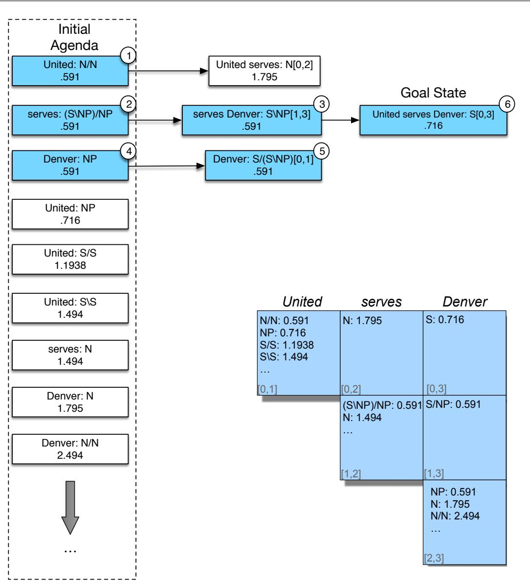

CHAPTER

G

categorial grammar combinatory categorial grammar

# Combinatory Categorial Grammar

In this chapter, we provide an overview of categorial grammar (Ajdukiewicz 1935, Bar-Hillel 1953), an early lexicalized grammar model, as well as an important modern extension, combinatory categorial grammar, or CCG (Steedman 1996, Steedman 1989, Steedman 2000). CCG is a heavily lexicalized approach motivated by both syntactic and semantic considerations. It is an exemplar of a set of computationally relevant approaches to grammar that emphasize putting grammatical information in a rich lexicon, including Lexical-Functional Grammar (LFG) (Bresnan, 1982), Head-Driven Phrase Structure Grammar (HPSG) (Pollard and Sag, 1994), and Tree-Adjoining Grammar (TAG) (Joshi, 1985).

The categorial approach consists of three major elements: a set of categories, a lexicon that associates words with categories, and a set of rules that govern how categories combine in context.

## G.1 CCG Categories

Categories are either atomic elements or single-argument functions that return a category as a value when provided with a desired category as argument. More formally, we can define $\mathcal { C } ,$ , a set of categories for a grammar as follows:

${ \mathcal { A } } \subseteq { \mathcal { C } }$ , where A is a given set of atomic elements

$$
\bullet \ ( X / Y ) , ( X \backslash Y ) \in { \mathcal { C } } , { \mathrm { i f } } \ X , Y \in { \mathcal { C } }
$$

The slash notation shown here is used to define the functions in the grammar. It specifies the type of the expected argument, the direction it is expected be found, and the type of the result. Thus, (X/Y) is a function that seeks a constituent of type Y to its right and returns a value of X; (X\Y) is the same except it seeks its argument to the left.

The set of atomic categories is typically very small and includes familiar elements such as sentences and noun phrases. Functional categories include verb phrases and complex noun phrases among others.

## G.2 The Lexicon

The lexicon in a categorial approach consists of assignments of categories to words. These assignments can either be to atomic or functional categories, and due to lexical ambiguity words can be assigned to multiple categories. Consider the following

sample lexical entries.

$$
\begin{array} { c c } { { \theta i g h t : } } & { { N } } \\ { { M i a m i : } } & { { N P } } \\ { { c a n c e l : } } & { { ( S \backslash N P ) / N P } } \end{array}
$$

Nouns and proper nouns likeflight and Miami are assigned to atomic categories, reflecting their typical role as arguments to functions. On the other hand, a transitive verb like cancel is assigned the category (S\NP)/NP: a function that seeks an NP on its right and returns as its value a function with the type (S\NP). This function can, in turn, combine with an NP on the left, yielding an S as the result. This captures subcategorization information with a computationally useful, internal structure.

Ditransitive verbs like give, which expect two arguments after the verb, would have the category ((S\NP)/NP)/NP: a function that combines with an NP on its right to yield yet another function corresponding to the transitive verb (S\NP)/NP category such as the one given above for cancel.

## G.3 Rules

The rules of a categorial grammar specify how functions and their arguments combine. The following two rule templates constitute the basis for all categorial grammars.

$$
\begin{array} { l } { { X / Y \ Y \ \Rightarrow \ X } } \\ { { Y \ X \backslash Y \ \Rightarrow \ X } } \end{array}\tag{G.1}
$$

(G.2)

The first rule applies a function to its argument on the right, while the second looks to the left for its argument. We’ll refer to the first as forward function application, and the second as backward function application. The result of applying either of these rules is the category specified as the value of the function being applied.

Given these rules and a simple lexicon, let’s consider an analysis of the sentence United serves Miami. Assume that serves is a transitive verb with the category (S\NP)/NP and that United and Miami are both simple NPs. Using both forward and backward function application, the derivation would proceed as follows:

<table><tr><td>United</td><td>serves</td><td>Miami</td></tr><tr><td rowspan="2">NP</td><td>(S\NP)/NP</td><td>NP</td></tr><tr><td>S\NP</td><td>-&gt;</td></tr><tr><td></td><td>S</td><td>&lt;</td></tr></table>

Categorial grammar derivations are illustrated growing down from the words, rule applications are illustrated with a horizontal line that spans the elements involved, with the type of the operation indicated at the right end of the line. In this example, there are two function applications: one forward function application indicated by the > that applies the verb serves to the NP on its right, and one backward function application indicated by the < that applies the result of the first to the NP United on its left.

English permits the coordination of two constituents of the same type, resulting in a new constituent of the same type. The following rule provides the mechanism

to handle such examples.

$$
X \ C O N J \ X \ \Rightarrow \ X\tag{G.3}
$$

This rule states that when two constituents of the same category are separated by a constituent of type CONJ they can be combined into a single larger constituent of the same type. The following derivation illustrates the use of this rule.

$$
\begin{array} { c } { { \displaystyle \frac { W e } { \mathrm { N P } } \ \frac { f l e w } { ( \mathrm { S } \backslash \mathrm { N P } ) / \mathrm { P P } } \underbrace { \frac { t o } { \mathrm { P P } / \mathrm { N P } } \ \frac { G e n e v a } { \mathrm { N P } } } _ { \mathrm { P P } } \ \frac { a n d } { \mathrm { C O N J } } \ \frac { d r o v e } { ( \mathrm { S } \backslash \mathrm { N P } ) / \mathrm { P P } } \underbrace { \frac { t o } { \mathrm { P P } / \mathrm { N P } } \ \frac { C h a m o n i x } { \mathrm { N P } } } _ { \mathrm { P P } } > } } \\ { { \displaystyle \frac { S \backslash \mathrm { N P } } { \mathrm { S } \backslash \mathrm { N P } } \ > \ \qquad \ \frac { S \backslash \mathrm { N P } } { \mathrm { S N P } } } _ { \mathrm { S } } < \Phi > } \end{array}
$$

Here the two $S \backslash N P$ constituents are combined via the conjunction operator ${ \bf < } \Phi { \bf > }$ to form a larger constituent of the same type, which can then be combined with the subject NP via backward function application.

These examples illustrate the lexical nature of the categorial grammar approach. The grammatical facts about a language are largely encoded in the lexicon, while the rules of the grammar are boiled down to a set of three rules. Unfortunately, the basic categorial approach does not give us any more expressive power than we had with traditional CFG rules; it just moves information from the grammar to the lexicon. To move beyond these limitations CCG includes operations that operate over functions.

The first pair of operators permit us to compose adjacent functions.

$$
X / Y \ Y / Z \ \Rightarrow \ X / Z\tag{G.4}
$$

$$
Y \backslash Z \ X \backslash Y \ \Rightarrow \ X \backslash Z\tag{G.5}
$$

The first rule, called forward composition, can be applied to adjacent constituents where the first is a function seeking an argument of type Y to its right, and the second is a function that provides Y as a result. This rule allows us to compose these two functions into a single one with the type of the first constituent and the argument of the second. Although the notation is a little awkward, the second rule, backward composition is the same, except that we’re looking to the left instead of to the right for the relevant arguments. Both kinds of composition are signalled by a B in CCG diagrams, accompanied by $\mathbf { a } < \mathbf { o r } > \mathbf { t o }$ indicate the direction.

The next operator is type raising. Type raising elevates simple categories to the status of functions. More specifically, type raising takes a category and converts it to a function that seeks as an argument a function that takes the original category as its argument. The following schema show two versions of type raising: one for arguments to the right, and one for the left.

$$
X \ \Rightarrow \ T / ( T \backslash X )\tag{G.6}
$$

$$
X \ \Rightarrow \ T \backslash ( T / X )\tag{G.7}
$$

The category T in these rules can correspond to any of the atomic or functional categories already present in the grammar.

A particularly useful example of type raising transforms a simple NP argument in subject position to a function that can compose with a following VP. To see how

this works, let’s revisit our earlier example of United serves Miami. Instead of classifying United as an $N P$ which can serve as an argument to the function attached to serve, we can use type raising to reinvent it as a function in its own right as follows.

$$
N P \Rightarrow S / ( S \backslash N P )
$$

Combining this type-raised constituent with the forward composition rule (G.4) permits the following alternative to our previous derivation.

$$
\underbrace { \frac { U n i t e d } { \mathrm { N P } } \ \xrightarrow [ { \mathrm { ( S \backslash N P ) / N P } ] { M i a m i } } \ \frac { M i a m i } { \mathrm { N P } } } _ { \mathrm { S / ( S \backslash N P ) } } \underbrace { \ } { }
$$

By type raising United to $S / ( S \backslash N P )$ , we can compose it with the transitive verb serves to yield the $( S / N P )$ function needed to complete the derivation.

There are several interesting things to note about this derivation. First, it provides a left-to-right, word-by-word derivation that more closely mirrors the way humans process language. This makes CCG a particularly apt framework for psycholinguistic studies. Second, this derivation involves the use of an intermediate unit of analysis, United serves, that does not correspond to a traditional constituent in English. This ability to make use of such non-constituent elements provides CCG with the ability to handle the coordination of phrases that are not proper constituents, as in the following example.

## (G.8) We flew IcelandAir to Geneva and SwissAir to London.

Here, the segments that are being coordinated are IcelandAir to Geneva and SwissAir to London, phrases that would not normally be considered constituents, as can be seen in the following standard derivation for the verb phrase flew IcelandAir to Geneva.

$$
\frac { ( \frac { \displaystyle { \cal H } e w } { \displaystyle { \cal V } \mathrm { P / P P } } ) \frac { \displaystyle { \cal I } c e l a n d A i r } { \displaystyle { \mathrm { N P } } } } { \displaystyle { \mathrm { V P / P P } } } > \frac { t o } { \displaystyle { \mathrm { P P / N P } } } \frac { G e n e \nu a } { \displaystyle { \mathrm { N P } } } >
$$

In this derivation, there is no single constituent that corresponds to IcelandAir to Geneva, and hence no opportunity to make use of the <Φ> operator. Note that complex CCG categories can get a little cumbersome, so we’ll use VP as a shorthand for $( S \backslash N P )$ in this and the following derivations.

The following alternative derivation provides the required element through the use of both backward type raising (G.7) and backward function composition (G.5).

$$
\begin{array} { r } { \frac { \mathrm { \mathrm { \mathrm { f l e w } } } } { ( V P / P P ) / N P } \frac { \mathrm { \mathrm { \mathrm { I c e l a n d A i r } } } } { \frac { N P } { ( V P / P P ) \setminus ( ( V P / P P ) / N P ) } } \frac { \frac { \mathrm { \mathrm { t o } } } { P P / N P } \frac { \mathrm { \mathrm { G e n e v a } } } { N P } } { \frac { P P } { \frac { \mathrm { \mathrm { f } } P P } { P P } \mathrm { \mathrm { f } } P P } \frac { \mathrm {  { G e n e v a } } } { \frac { \mathrm { \mathrm { F } } P P } { V P \setminus ( V P / P P ) } \mathrm {  { F } } } } } \\ { \frac { \mathrm { \mathrm { \mathrm { ~ \ f ~ e n e f . } } } } { \frac { V P \setminus ( ( V P / P P ) / N P ) } { V P } \frac { \mathrm {  { G e n e v a } } } { \mathrm {  { F } } P } \mathrm {  { \mathrm { ~ \ f ~ e n e ~ } } } } } \end{array}
$$

Applying the same analysis to SwissAir to London satisfies the requirements for the <Φ> operator, yielding the following derivation for our original example (G.8).

$$
\begin{array} { r } { \frac { f e w } { ( V P / P P ) / N P } \frac { I c e l a n d A i r } { \frac { N P } { ( V P / P P ) / N P } } \frac { \frac { t o } { R P / N P } } { \frac { P P / N P } { N P } } \frac { \frac { t o n e v a t } { N P } } { \frac { N P / N P } { N P } } \frac { \frac { a n d } { C O N J } } { \frac { N P } { ( V P / P P ) / ( V P ) / N P } } \frac { \frac { t o n } { P P / N P } \frac { L o n d o n } { N P } } { \frac { 1 . 8 P / N P } { V P / ( V P P ) / N P } } } \\ { \frac { V P \backslash ( ( V P / P P ) / N P ) } { V P \backslash ( ( V P / P P ) / N P ) } \frac { V P } { V P \backslash ( ( V P / P P ) / N P ) } \frac { V P } { \frac { V P / ( V P ) / N P } { ( V P P / N P ) } \frac { \frac { t o n } { N P } \frac { ( V P / N P ) } { N P } } { < \frac { 8 p } { ( V P ) / N P } } } . } \end{array}
$$

Finally, let’s examine how these advanced operators can be used to handle longdistance dependencies (also referred to as syntactic movement or extraction). As mentioned in Appendix F, long-distance dependencies arise from many English constructions including wh-questions, relative clauses, and topicalization. What these constructions have in common is a constituent that appears somewhere distant from its usual, or expected, location. Consider the following relative clause as an example.

## the flight that United diverted

Here, divert is a transitive verb that expects two NP arguments, a subject NP to its left and a direct object NP to its right; its category is therefore $( S \backslash N P ) / N P$ . However, in this example the direct object theflight has been “moved” to the beginning of the clause, while the subject United remains in its normal position. What is needed is a way to incorporate the subject argument, while dealing with the fact that theflight is not in its expected location.

The following derivation accomplishes this, again through the combined use of type raising and function composition.

$$
\begin{array} { r } { \underbrace { \frac { t h e } { \mathrm { N P } / \mathrm { N } } \frac { f i g h t } { \mathrm { N } } } _ { \mathrm { N P } } \xrightarrow [ ] { t h a t } \underbrace { \frac { t h a t } { \mathrm { N P } / \mathrm { N P } } } _ { \mathrm { N P } / \mathrm { N P } } \underbrace { \frac { U n i t e d } { \mathrm { N P } } } _ { \xrightarrow [ ] { \mathrm { N P } } \mathrm { T } } \frac { d i v e r t e d } { \mathrm { ( S \backslash N P ) } / \mathrm { N P } } } \\ { \xrightarrow [ ] { \mathrm { N P } } \qquad \underbrace { \frac { \mathrm { N P } } { \mathrm { N P } / \mathrm { ( S \backslash N P ) } } } _ { \mathrm { N P } \mathrm { N P } } \xrightarrow [ ] { \mathrm { N P } } } \end{array}
$$

As we saw with our earlier examples, the first step of this derivation is type raising United to the category $S / ( S \backslash N P )$ allowing it to combine with diverted via forward composition. The result of this composition is S/NP which preserves the fact that we are still looking for an NP to fill the missing direct object. The second critical piece is the lexical category assigned to the word that: $( N P \backslash N P ) / ( S / N P )$ . This function seeks a verb phrase missing an argument to its right, and transforms it into an NP seeking a missing element to its left, precisely where we find the flight.

## G.4 CCGbank

As with phrase-structure approaches, treebanks play an important role in CCGbased approaches to parsing. CCGbank (Hockenmaier and Steedman, 2007) is the largest and most widely used CCG treebank. It was created by automatically translating phrase-structure trees from the Penn Treebank via a rule-based approach. The method produced successful translations of over 99% of the trees in the Penn Treebank resulting in 48,934 sentences paired with CCG derivations. It also provides a lexicon of 44,000 words with over 1200 categories. Appendix E will discuss how these resources can be used to train CCG parsers.

## G.5 Ambiguity in CCG

As is always the case in parsing, managing ambiguity is the key to successful CCG parsing. The difficulties with CCG parsing arise from the ambiguity caused by the large number of complex lexical categories combined with the very general nature of the grammatical rules. To see some of the ways that ambiguity arises in a categorial framework, consider the following example.

(G.9) United diverted the flight to Reno.

Our grasp of the role of the flight in this example depends on whether the prepositional phrase to Reno is taken as a modifier of theflight, as a modifier of the entire verb phrase, or as a potential second argument to the verb divert. In a context-free grammar approach, this ambiguity would manifest itself as a choice among the following rules in the grammar.

$$
\begin{array} { c } { { N o m i n a l \ \to \ N o m i n a l \ P P } } \\ { { V P \ \to \ V P \ P P } } \\ { { V P \ \to \ V e r b \ N P \ P P } } \end{array}
$$

In a phrase-structure approach we would simply assign the word to to the category P allowing it to combine with Reno to form a prepositional phrase. The subsequent choice of grammar rules would then dictate the ultimate derivation. In the categorial approach, we can associate to with distinct categories to reflect the ways in which it might interact with other elements in a sentence. The fairly abstract combinatoric rules would then sort out which derivations are possible. Therefore, the source of ambiguity arises not from the grammar but rather from the lexicon.

Let’s see how this works by considering several possible derivations for this example. To capture the case where the prepositional phrase to Reno modifies the flight, we assign the preposition to the category $( N P \backslash N P ) / N P ;$ , which gives rise to the following derivation.

$$
\begin{array} { r } { \frac { U n i t e d } { \mathrm { N P } } \frac { d i \nu e r t e d } { ( \mathrm { S } \backslash \mathrm { N P } ) / \mathrm { N P } } \frac { t h e } { \frac { \mathrm { N P } / \mathrm { N } } { \mathrm { N P } } } \frac { t i g h t } { \mathrm { N } } \frac { t o } { \mathrm { N } } \frac { R e n o } { \mathrm { N P } \backslash \mathrm { N P } } \frac { R e n o } { \mathrm { N P } } } \\ { \frac { \mathrm { S } } { \mathrm { N P } } \frac { \mathrm { N P } } { \mathrm { N P } } } \end{array}
$$

Here, the category assigned to to expects to find two arguments: one to the right as with a traditional preposition, and one to the left that corresponds to the NP to be modified.

Alternatively, we could assign to to the category $( S \backslash S ) / N P ,$ , which permits the following derivation where to Reno modifies the preceding verb phrase.

$$
\frac { U n i t e d } { \mathrm { N P } } \ \frac { d i \nu e r t e d } { ( \mathrm { S } \backslash \mathrm { N P } ) / \mathrm { N P } } \ \frac { t h e } { \mathrm { N P } / \mathrm { N } } \ \xrightarrow [ \mathrm { N } ] { H i g h t } \ \frac { t o } { ( \mathrm { S } \backslash \mathrm { S } ) / \mathrm { N P } } \ \frac { R e n o } { \mathrm { N P } }  { \mathrm { N P } } > \ \frac { \tilde { ( \mathrm { S } \backslash \mathrm { S } ) } } { \mathrm { S } \backslash \mathrm { S } } > \ \frac { \tilde { ( \mathrm { S } \backslash \mathrm { S } ) } } { \mathrm { S } }
$$

A third possibility is to view divert as a ditransitive verb by assigning it to the category $( ( S \backslash N P ) / P P ) / N P ,$ , while treating to Reno as a simple prepositional phrase.

$$
\frac { U n i t e d } { \mathrm { N P } } \underbrace { \frac { d i v e r t e d } { ( ( \mathrm { S } \backslash \mathrm { N P } ) / \mathrm { P P } ) / \mathrm { N P } } \frac { t h e } { \mathrm { N P } / \mathrm { N } } \frac { f i i g h t } { \mathrm { N } } \frac { t o } { \mathrm { P P } / \mathrm { N P } } \frac { R e n o } { \mathrm { N P } } } _ { \mathrm { N P } }  _ { \mathrm { S p } } \underbrace { \sum } _ { \mathrm { P P } } _ { \mathrm { N P } } ,
$$

While CCG parsers are still subject to ambiguity arising from the choice of grammar rules, including the kind of spurious ambiguity discussed above, it should be clear that the choice of lexical categories is the primary problem to be addressed in CCG parsing.

## G.6 CCG Parsing

Since the rules in combinatory grammars are either binary or unary, a bottom-up, tabular approach based on the CKY algorithm should be directly applicable to CCG parsing. Unfortunately, the large number of lexical categories available for each word, combined with the promiscuity of CCG’s combinatoric rules, leads to an explosion in the number of (mostly useless) constituents added to the parsing table. The key to managing this explosion of zombie constituents is to accurately assess and exploit the most likely lexical categories possible for each word—a process called supertagging.

These following sections describe an approach to CCG parsing that make use of supertags, structuring the parsing process as a heuristic search through the use of the $\mathbf { A } ^ { * }$ algorithm.

## G.6.1 Supertagging

Chapter 18 introduced the task of part-of-speech tagging, the process of assigning the correct lexical category to each word in a sentence. Supertagging is the corresponding task for highly lexicalized grammar frameworks, where the assigned tags often dictate much of the derivation for a sentence (Bangalore and Joshi, 1999).

CCG supertaggers rely on treebanks such as CCGbank to provide both the overall set of lexical categories as well as the allowable category assignments for each word in the lexicon. CCGbank includes over 1000 lexical categories, however, in practice, most supertaggers limit their tagsets to those tags that occur at least 10 times in the training corpus. This results in a total of around 425 lexical categories available for use in the lexicon. Note that even this smaller number is large in contrast to the 45 POS types used by the Penn Treebank tagset.

As with traditional part-of-speech tagging, the standard approach to building a CCG supertagger is to use supervised machine learning to build a sequence labeler from hand-annotated training data. To find the most likely sequence of tags given a sentence, it is most common to use a neural sequence model, either RNN or Transformer.

It’s also possible, however, to use the CRF tagging model described in Chapter 18, using similar features; the current word $w _ { i } ,$ its surrounding words within l words, local POS tags and character suffixes, and the supertag from the prior timestep, training by maximizing log-likelihood of the training corpus and decoding via the Viterbi algorithm as described in Chapter 18.

Unfortunately the large number of possible supertags combined with high perword ambiguity leads the naive CRF algorithm to error rates that are too high for practical use in a parser. The single best tag sequence $\hat { T }$ will typically contain too many incorrect tags for effective parsing to take place. To overcome this, we instead return a probability distribution over the possible supertags for each word in the input. The following table illustrates an example distribution for a simple sentence, in which each column represents the probability of each supertag for a given word in the context of the input sentence. The “...” represent all the remaining supertags possible for each word.

<table><tr><td>United serves</td><td>Denver</td></tr><tr><td>N/N: 0.4 (S\NP)/NP: 0.8</td><td>NP: 0.9</td></tr><tr><td>NP: 0.3 N: 0.1</td><td>N/N: 0.05</td></tr><tr><td>S/S: 0.1 S\S: .05</td><td></td></tr></table>

To get the probability of each possible word/tag pair, we’ll need to sum the probabilities of all the supertag sequences that contain that tag at that location. This can be done with the forward-backward algorithm that is also used to train the CRF, described in Appendix A.

## G.6.2 CCG Parsing using the A\* Algorithm

The A\* algorithm is a heuristic search method that employs an agenda to find an optimal solution. Search states representing partial solutions are added to an agenda based on a cost function, with the least-cost option being selected for further exploration at each iteration. When a state representing a complete solution is first selected from the agenda, it is guaranteed to be optimal and the search terminates.

The $\mathbf { A } ^ { * }$ cost function, $f ( n )$ , is used to efficiently guide the search to a solution. The f-cost has two components: $g ( n )$ , the exact cost of the partial solution represented by the state $n ,$ and $h ( n )$ a heuristic approximation of the cost of a solution that makes use of n. When $h ( n )$ satisfies the criteria of not overestimating the actual cost, $\mathbf { A } ^ { * }$ will find an optimal solution. Not surprisingly, the closer the heuristic can get to the actual cost, the more effective $\mathbf { A } ^ { * }$ is at finding a solution without having to explore a significant portion of the solution space.

When applied to parsing, search states correspond to edges representing completed constituents. Each edge specifies a constituent’s start and end positions, its grammatical category, and its f-cost. Here, the g component represents the current cost of an edge and the $h$ component represents an estimate of the cost to complete a derivation that makes use of that edge. The use of $\mathbf { A } ^ { * }$ for phrase structure parsing originated with Klein and Manning (2003), while the CCG approach presented here is based on the work of Lewis and Steedman (2014).

Using information from a supertagger, an agenda and a parse table are initialized with states representing all the possible lexical categories for each word in the input, along with their f-costs. The main loop removes the lowest cost edge from the agenda and tests to see if it is a complete derivation. If it reflects a complete derivation it is selected as the best solution and the loop terminates. Otherwise, new states based on the applicable CCG rules are generated, assigned costs, and entered into the agenda to await further processing. The loop continues until a complete derivation is discovered, or the agenda is exhausted, indicating a failed parse. The algorithm is given in Fig. G.1.

function CCG-ASTAR-PARSE(words) returns table or failure   
supertags← SUPERTAGGER(words)   
for i←from 1 to LENGTH(words) do   
for all {A|(words[i],A, score) ∈ supertags}   
edge← MAKEEDGE(i − 1, i,A, score)   
table← INSERTEDGE(table, edge)   
agenda← INSERTEDGE(agenda, edge)   
loop do   
if EMPTY?(agenda) return failure   
current← POP(agenda)   
if COMPLETEDPARSE?(current) return table   
table← INSERTEDGE(table, current)   
for each rule in APPLICABLERULES(current) do   
successor← APPLY(rule, current)   
if successor not ∈ in agenda or chart   
agenda← INSERTEDGE(agenda, successor)   
else if successor ∈ agenda with higher cost   
agenda← REPLACEEDGE(agenda, successor)  
Figure G.1 A\*-based CCG parsing.

## G.6.3 Heuristic Functions

Before we can define a heuristic function for our A\* search, we need to decide how to assess the quality of CCG derivations. We’ll make the simplifying assumption that the probability of a CCG derivation is just the product of the probability of the supertags assigned to the words in the derivation, ignoring the rules used in the derivation. More formally, given a sentence S and derivation D that contains supertag sequence T, we have:

$$
P ( D , S ) \ = \ P ( T , S )\tag{G.10}
$$

$$
= \prod _ { i = 1 } ^ { n } P ( t _ { i } | s _ { i } )\tag{G.11}
$$

To better fit with the traditional $\mathbf { A } ^ { * }$ approach, we’d prefer to have states scored by a cost function where lower is better (i.e., we’re trying to minimize the cost of a derivation). To achieve this, we’ll use negative log probabilities to score derivations; this results in the following equation, which we’ll use to score completed CCG derivations.

$$
P ( D , S ) ~ = ~ P ( T , S )\tag{G.12}
$$

$$
= \sum _ { i = 1 } ^ { n } - \log P ( t _ { i } | s _ { i } )\tag{G.13}
$$

Given this model, we can define our f-cost as follows. The f-cost of an edge is the sum of two components: $g ( n )$ , the cost of the span represented by the edge, and $h ( n )$ , the estimate of the cost to complete a derivation containing that edge (these are often referred to as the inside and outside costs). We’ll define $g ( n )$ for an edge using Equation G.13. That is, it is just the sum of the costs of the supertags that comprise the span.

For $h ( n )$ , we need a score that approximates but never overestimates the actual cost of the final derivation. A simple heuristic that meets this requirement assumes that each of the words in the outside span will be assigned its most probable supertag. If these are the tags used in the final derivation, then its score will equal the heuristic. If any other tags are used in the final derivation the f-cost will be higher since the new tags must have higher costs, thus guaranteeing that we will not overestimate.

Putting this all together, we arrive at the following definition of a suitable f-cost for an edge.

$$
\begin{array} { l } { { f ( w _ { i , j } , t _ { i , j } ) ~ = ~ g ( w _ { i , j } ) + h ( w _ { i , j } ) } } \\ { { ~ = ~ \displaystyle \sum _ { k = i } ^ { j } - \log P ( t _ { k } | w _ { k } ) + } } \\ { { ~ \displaystyle \sum _ { k = 1 } ^ { i - 1 } \displaystyle \operatorname* { m i n } _ { t \in t a g s } \left( - \log P ( t | w _ { k } ) \right) + \displaystyle \sum _ { k = j + 1 } ^ { N } \displaystyle \operatorname* { m i n } _ { t \in t a g s } \left( - \log P ( t | w _ { k } ) \right) } } \end{array}\tag{G.14}
$$

As an example, consider an edge representing the word serves with the supertag N in the following example.

(G.15) United serves Denver.

The g-cost for this edge is just the negative log probability of this tag, $- l o g _ { 1 0 } ( 0 . 1 )$ or 1. The outside h-cost consists of the most optimistic supertag assignments for United and Denver, which are $N / N$ and NP respectively. The resulting f-cost for this edge is therefore 1.443.

## G.6.4 An Example

Fig. G.2 shows the initial agenda and the progress of a complete parse for this example. After initializing the agenda and the parse table with information from the supertagger, it selects the best edge from the agenda—the entry for United with the tag N/N and f-cost 0.591. This edge does not constitute a complete parse and is therefore used to generate new states by applying all the relevant grammar rules. In this case, applying forward application to United: N/N and serves: N results in the creation of the edge United serves: N[0,2], 1.795 to the agenda.

Skipping ahead, at the third iteration an edge representing the complete derivation United serves Denver, S[0,3], .716 is added to the agenda. However, the algorithm does not terminate at this point since the cost of this edge (.716) does not place it at the top of the agenda. Instead, the edge representing Denver with the category NP is popped. This leads to the addition of another edge to the agenda (type-raising Denver). Only after this edge is popped and dealt with does the earlier state representing a complete derivation rise to the top of the agenda where it is popped, goal tested, and returned as a solution.

The effectiveness of the $\mathbf { A } ^ { * }$ approach is reflected in the coloring of the states in Fig. G.2 as well as the final parsing table. The edges shown in blue (including all the initial lexical category assignments not explicitly shown) reflect states in the search space that never made it to the top of the agenda and, therefore, never contributed any edges to the final table. This is in contrast to the PCKY approach where the parser systematically fills the parse table with all possible constituents for all possible spans in the input, filling the table with myriad constituents that do not contribute to the final analysis.

  
Figure G.2 Example of an $\mathbf { A } ^ { * }$ search for the example “United serves Denver”. The circled numbers on the blue boxes indicate the order in which the states are popped from the agenda. The costs in each state are based on f-costs using negative $l o g _ { 1 0 }$ probabilities.

## 12 APPENDIX G • COMBINATORY CATEGORIAL GRAMMAR

## G.7 Summary

This chapter has introduced combinatory categorial grammar (CCG):

• Combinatorial categorial grammar (CCG) is a computationally relevant lexicalized approach to grammar and parsing.

• Much of the difficulty in CCG parsing is disambiguating the highly rich lexical entries, and so CCG parsers are generally based on supertagging.

• Supertagging is the equivalent of part-of-speech tagging in highly lexicalized grammar frameworks. The tags are very grammatically rich and dictate much of the derivation for a sentence.

## Historical Notes

Ajdukiewicz, K. 1935. Die syntaktische Konnexitat.¨ Studia Philosophica, 1:1–27. English translation “Syntactic Connexion” by H. Weber in McCall, S. (Ed.) 1967. Polish Logic, pp. 207–231, Oxford University Press.

Bangalore, S. and A. K. Joshi. 1999. Supertagging: An approach to almost parsing. Computational Linguistics, 25(2):237–265.

Bar-Hillel, Y. 1953. A quasi-arithmetical notation for syn tactic description. Language, 29:47–58.

Bresnan, J., ed. 1982. The Mental Representation of Gram matical Relations. MIT Press.

Hockenmaier, J. and M. Steedman. 2007. CCGbank: a corpus of CCG derivations and dependency structures extracted from the penn treebank. Computational Linguis tics, 33(3):355–396.

Joshi, A. K. 1985. Tree adjoining grammars: How much context-sensitivity is required to provide reasonable structural descriptions? In D. R. Dowty, L. Karttunen, and A. Zwicky, eds, Natural Language Parsing, 206–250. Cambridge University Press.

Klein, D. and C. D. Manning. 2003. A\* parsing: Fast exact Viterbi parse selection. HLT-NAACL.

Lewis, M. and M. Steedman. 2014. A\* ccg parsing with a supertag-factored model. EMNLP.

Pollard, C. and I. A. Sag. 1994. Head-Driven Phrase Struc ture Grammar. University of Chicago Press.

Steedman, M. 1989. Constituency and coordination in a combinatory grammar. In M. R. Baltin and A. S. Kroch, eds, Alternative Conceptions of Phrase Structure, 201– 231. University of Chicago.

Steedman, M. 1996. Surface Structure and Interpretation. MIT Press. Linguistic Inquiry Monograph, 30.

Steedman, M. 2000. The Syntactic Process. The MIT Press.