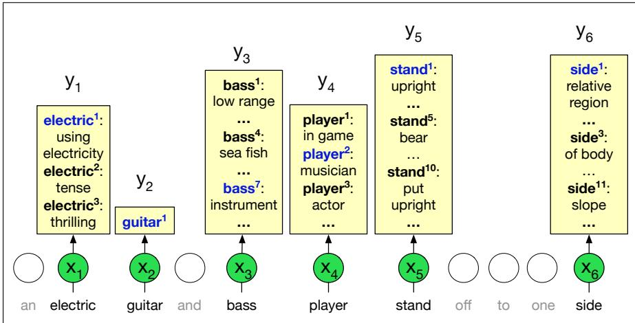

CHAPTER

# Word Senses and WordNet

Lady Bracknell. Are your parents living?

Jack. I have lost both my parents.

Lady Bracknell. To lose one parent, Mr. Worthing, may be regarded as a misfortune; to lose both looks like carelessness.

Oscar Wilde, The Importance ofBeing Earnest

Words are ambiguous: the same word can be used to mean different things. In Chapter 5 we saw that the word “mouse” has (at least) two meanings: (1) a small rodent, or (2) a hand-operated device to control a cursor. The word “bank” can mean: (1) a financial institution or (2) a sloping mound. In the quote above from his play The Importance ofBeing Earnest, Oscar Wilde plays with two meanings of “lose” (to misplace an object, and to suffer the death of a close person).

We say that the words ‘mouse’ or ‘bank’ are polysemous (from Greek ‘having many senses’, poly- ‘many’ + sema, ‘sign, mark’).<sup>1</sup> A sense (or word sense) is a discrete representation of one aspect of the meaning of a word. In this chapter we discuss word senses in more detail and introduce WordNet, a large online thesaurus —a database that represents word senses—with versions in many languages. WordNet also represents relations between senses. For example, there is an IS-A relation between dog and mammal (a dog is a kind of mammal) and a part-whole relation between engine and car (an engine is a part of a car).

Knowing the relation between two senses can play an important role in tasks involving meaning. Consider the antonymy relation. Two words are antonyms if they have opposite meanings, like long and short, or up and down. Distinguishing these is quite important; if a user asks a dialogue agent to turn up the music, it would be unfortunate to instead turn it down. But in fact in embedding models like word2vec, antonyms are easily confused with each other, because often one of the closest words in embedding space to a word (e.g., up) is its antonym (e.g., down). Thesauruses that represent this relationship can help!

We also introduce word sense disambiguation (WSD), the task of determining which sense of a word is being used in a particular context. We’ll give supervised and unsupervised algorithms for deciding which sense was intended in a particular context. This task has a very long history in computational linguistics and many applications. In question answering, we can be more helpful to a user who asks about “bat care” if we know which sense of bat is relevant. (Is the user a vampire? or just wants to play baseball.) And the different senses of a word often have different translations; in Spanish the animal bat is a murcielago´ while the baseball bat is a bate, and indeed word sense algorithms may help improve MT (Pu et al., 2018). Finally, WSD has long been used as a tool for evaluating language processing models, and understanding how models represent different word senses is an important

analytic direction.

## I.1 Word Senses

A sense (or word sense) is a discrete representation of one aspect of the meaning of a word. Loosely following lexicographic tradition, we represent each sense with a superscript: bank<sup>1</sup> and bank<sup>2</sup>, mouse<sup>1</sup> and mouse<sup>2</sup>. In context, it’s easy to see the different meanings:

mouse<sup>1</sup> : .... a mouse controlling a computer system in 1968.

mouse<sup>2</sup> : .... a quiet animal like a mouse

bank<sup>1</sup> : ...a bank can hold the investments in a custodial account ...

bank<sup>2</sup> : ...as agriculture burgeons on the east bank, the river ...

## I.1.1 Defining Word Senses

How can we define the meaning of a word sense? We introduced in Chapter 5 the standard computational approach of representing a word as an embedding, a point in semantic space. The intuition of embedding models like word2vec or GloVe is that the meaning of a word can be defined by its co-occurrences, the counts of words that often occur nearby. But that doesn’t tell us how to define the meaning of a word sense. As we saw in Chapter 9, contextual embeddings like BERT go further by offering an embedding that represents the meaning of a word in its textual context, and we’ll see that contextual embeddings lie at the heart of modern algorithms for word sense disambiguation.

But first, we need to consider the alternative ways that dictionaries and thesauruses offer for defining senses. One is based on the fact that dictionaries or thesauruses give textual definitions for each sense called glosses. Here are the glosses for two senses of bank:

1. financial institution that accepts deposits and channels the money into lending activities

2. sloping land (especially the slope beside a body of water)

Glosses are not a formal meaning representation; they are just written for people. Consider the following fragments from the definitions of right, left, red, and blood from the American Heritage Dictionary (Morris, 1985).

right adj. located nearer the right hand esp. being on the right when facing the same direction as the observer.

left adj. located nearer to this side of the body than the right.

red n. the color of blood or a ruby.

blood n. the red liquid that circulates in the heart, arteries and veins of animals.

Note the circularity in these definitions. The definition of right makes two direct references to itself, and the entry for left contains an implicit self-reference in the phrase this side of the body, which presumably means the left side. The entries for red and blood reference each other in their definitions. For humans, such entries are useful since the user of the dictionary has sufficient grasp of these other terms.

Yet despite their circularity and lack of formal representation, glosses can still be useful for computational modeling of senses. This is because a gloss is just a sentence, and from sentences we can compute sentence embeddings that tell us something about the meaning of the sense. Dictionaries often give example sentences along with glosses, and these can again be used to help build a sense representation.

The second way that thesauruses offer for defining a sense is—like the dictionary definitions—defining a sense through its relationship with other senses. For example, the above definitions make it clear that right and left are similar kinds of lemmas that stand in some kind of alternation, or opposition, to one another. Similarly, we can glean that red is a color and that blood is a liquid. Sense relations of this sort (IS-A, or antonymy) are explicitly listed in on-line databases like WordNet. Given a sufficiently large database of such relations, many applications are quite capable of performing sophisticated semantic tasks about word senses (even if they do not really know their right from their left).

## I.1.2 How many senses do words have?

Dictionaries and thesauruses give discrete lists of senses. By contrast, embeddings (whether static or contextual) offer a continuous high-dimensional model of meaning that doesn’t divide up into discrete senses.

Therefore creating a thesaurus depends on criteria for deciding when the differing uses of a word should be represented with discrete senses. We might consider two senses discrete if they have independent truth conditions, different syntactic behavior, and independent sense relations, or if they exhibit antagonistic meanings.

Consider the following uses of the verb serve from the WSJ corpus:

(I.1) They rarely serve red meat, preferring to prepare seafood.

(I.2) He served as U.S. ambassador to Norway in 1976 and 1977.

(I.3) He might have served his time, come out and led an upstanding life.

The serve of serving red meat and that of serving time clearly have different truth conditions and presuppositions; the serve of serve as ambassador has the distinct subcategorization structure serve as NP. These heuristics suggest that these are probably three distinct senses of serve. One practical technique for determining if two senses are distinct is to conjoin two uses of a word in a single sentence; this kind of conjunction of antagonistic readings is called zeugma. Consider the following examples:

(I.4) Which of those flights serve breakfast?

(I.5) Does Air France serve Philadelphia?

(I.6) ?Does Air France serve breakfast and Philadelphia?

We use (?) to mark those examples that are semantically ill-formed. The oddness of the invented third example (a case of zeugma) indicates there is no sensible way to make a single sense of serve work for both breakfast and Philadelphia. We can use this as evidence that serve has two different senses in this case.

Dictionaries tend to use many fine-grained senses so as to capture subtle meaning differences, a reasonable approach given that the traditional role of dictionaries is aiding word learners. For computational purposes, we often don’t need these fine distinctions, so we often group or cluster the senses; we have already done this for some of the examples in this chapter. Indeed, clustering examples into senses, or senses into broader-grained categories, is an important computational task that we’ll discuss in Section I.7.

## I.2 Relations Between Senses

This section explores the relations between word senses, especially those that have received significant computational investigation like synonymy, antonymy, and hypernymy.

## Synonymy

We introduced in Chapter 5 the idea that when two senses of two different words (lemmas) are identical, or nearly identical, we say the two senses are synonyms. Synonyms include such pairs as

## couch/sofa vomit/throw up filbert/hazelnut car/automobile

And we mentioned that in practice, the word synonym is commonly used to describe a relationship of approximate or rough synonymy. But furthermore, synonymy is actually a relationship between senses rather than words. Considering the words big and large. These may seem to be synonyms in the following sentences, since we could swap big and large in either sentence and retain the same meaning:

## (I.7) How big is that plane?

(I.8) Would I be flying on a large or small plane?

But note the following sentence in which we cannot substitute large for big:

(I.9) Miss Nelson, for instance, became a kind of big sister to Benjamin.

(I.10) ?Miss Nelson, for instance, became a kind of large sister to Benjamin.

This is because the word big has a sense that means being older or grown up, while large lacks this sense. Thus, we say that some senses of big and large are (nearly) synonymous while other ones are not.

## Antonymy

Whereas synonyms are words with identical or similar meanings, antonyms are words with an opposite meaning, like:

long/short big/little fast/slow cold/hot dark/light

rise/fall up/down in/out

Two senses can be antonyms if they define a binary opposition or are at opposite ends of some scale. This is the case for long/short,fast/slow, or big/little, which are at opposite ends of the length or size scale. Another group of antonyms, reversives, describe change or movement in opposite directions, such as rise/fall or up/down.

Antonyms thus differ completely with respect to one aspect of their meaning— their position on a scale or their direction—but are otherwise very similar, sharing almost all other aspects of meaning. Thus, automatically distinguishing synonyms from antonyms can be difficult.

## Taxonomic Relations

Another way word senses can be related is taxonomically. A word (or sense) is a hyponym of another word or sense if the first is more specific, denoting a subclass of the other. For example, car is a hyponym of vehicle, dog is a hyponym of animal, and mango is a hyponym offruit. Conversely, we say that vehicle is a hypernym of car, and animal is a hypernym of dog. It is unfortunate that the two words (hypernym and hyponym) are very similar and hence easily confused; for this reason, the word superordinate is often used instead of hypernym.

<table><tr><td>Superordinate vehicle fruit</td><td></td><td></td><td></td><td>t furniture mammal</td></tr><tr><td>Subordinate</td><td>car</td><td></td><td>mango chair</td><td>dog</td></tr></table>

We can define hypernymy more formally by saying that the class denoted by the superordinate extensionally includes the class denoted by the hyponym. Thus, the class of animals includes as members all dogs, and the class of moving actions includes all walking actions. Hypernymy can also be defined in terms of entailment. Under this definition, a sense A is a hyponym of a sense B if everything that is A is also B, and hence being an A entails being a B, or ∀x $A ( x ) \Rightarrow B ( x )$ . Hyponymy/hypernymy is usually a transitive relation; if A is a hyponym of B and B is a hyponym of C, then A is a hyponym of C. Another name for the hypernym/hyponym structure is the IS-A hierarchy, in which we say A IS-A B, or B subsumes A.

Hypernymy is useful for tasks like textual entailment or question answering; knowing that leukemia is a type of cancer, for example, would certainly be useful in answering questions about leukemia.

## Meronymy

Another common relation is meronymy, the part-whole relation. A leg is part of a chair; a wheel is part of a car. We say that wheel is a meronym of car, and car is a holonym of wheel.

## Structured Polysemy

The senses of a word can also be related semantically, in which case we call the relationship between them structured polysemy. Consider this sense bank:

## (I.11) The bank is on the corner of Nassau and Witherspoon.

This sense, perhaps bank<sup>4</sup>, means something like “the building belonging to a financial institution”. These two kinds of senses (an organization and the building associated with an organization ) occur together for many other words as well (school, university, hospital, etc.). Thus, there is a systematic relationship between senses that we might represent as

## BUILDING ↔ ORGANIZATION

This particular subtype of polysemy relation is called metonymy. Metonymy is the use of one aspect of a concept or entity to refer to other aspects of the entity or to the entity itself. We are performing metonymy when we use the phrase the White House to refer to the administration whose office is in the White House. Other common examples of metonymy include the relation between the following pairings of senses:

<table><tr><td>AUTHOR (Jane Austen wrote Emma)</td><td>↔ WORKS OF AUTHOR (I really love Jane Austen)</td></tr><tr><td>FRUITTREE</td><td>↔ FRUIT</td></tr><tr><td>(Plums have beautiful blossoms)</td><td>(I ate a preserved plum yesterday)</td></tr></table>

## I.3 WordNet: A Database of Lexical Relations

The most commonly used resource for sense relations in English and many other WordNet languages is the WordNet lexical database (Fellbaum, 1998). English WordNet consists of three separate databases, one each for nouns and verbs and a third for adjectives and adverbs; closed class words are not included. Each database contains a set of lemmas, each one annotated with a set of senses. The WordNet 3.0 release has 117,798 nouns, 11,529 verbs, 22,479 adjectives, and 4,481 adverbs. The average noun has 1.23 senses, and the average verb has 2.16 senses. WordNet can be accessed on the Web or downloaded locally. Figure I.1 shows the lemma entry for the noun bass.

The noun “bass” has 8 senses in WordNet.   
1. bass<sup>1</sup> - (the lowest part of the musical range)   
2. bass<sup>2</sup>, bass part<sup>1</sup> - (the lowest part in polyphonic music)   
3. bass<sup>3</sup>, basso<sup>1</sup> - (an adult male singer with the lowest voice)   
4. sea bass<sup>1</sup>, bass<sup>4</sup> - (the lean flesh of a saltwater fish of the family Serranidae)   
5. freshwater bass<sup>1</sup>, bass<sup>5</sup> - (any of various North American freshwater fish with   
lean flesh (especially of the genus Micropterus))   
6. bass<sup>6</sup>, bass voice<sup>1</sup>, basso<sup>2</sup> - (the lowest adult male singing voice)   
7. bass<sup>7</sup> - (the member with the lowest range of a family of musical instruments)   
8. bass<sup>8</sup> - (nontechnical name for any of numerous edible marine and   
freshwater spiny-finned fishes)  
Figure I.1 A portion of the WordNet 3.0 entry for the noun bass.

Note that there are eight senses, each of which has a gloss (a dictionary-style definition), a list of synonyms for the sense, and sometimes also usage examples. WordNet doesn’t represent pronunciation, so doesn’t distinguish the pronunciation [b ae s] in bass<sup>4</sup>, bass<sup>5</sup>, and bass<sup>8</sup> from the other senses pronounced [b ey s].

The set of near-synonyms for a WordNet sense is called a synset (for synonym set); synsets are an important primitive in WordNet. The entry for bass includes synsets like {bass<sup>1</sup>, deep<sup>6</sup>}, or {bass<sup>6</sup>, bass voice<sup>1</sup>, basso<sup>2</sup>}. We can think of a synset as representing a concept of the type we discussed in Appendix H. Thus, instead of representing concepts in logical terms, WordNet represents them as lists of the word senses that can be used to express the concept. Here’s another synset example:

{chump<sup>1</sup>, fool<sup>2</sup>, gull<sup>1</sup>, mark<sup>9</sup>, patsy<sup>1</sup>, fall guy<sup>1</sup>,

sucker<sup>1</sup>, soft touch<sup>1</sup>, mug<sup>2</sup>}

The gloss of this synset describes it as:

Gloss: a person who is gullible and easy to take advantage of.

Glosses are properties of a synset, so that each sense included in the synset has the same gloss and can express this concept. Because they share glosses, synsets like this one are the fundamental unit associated with WordNet entries, and hence it is synsets, not wordforms, lemmas, or individual senses, that participate in most of the lexical sense relations in WordNet.

WordNet also labels each synset with a lexicographic category drawn from a semantic field for example the 26 categories for nouns shown in Fig. I.2, as well as 15 for verbs (plus 2 for adjectives and 1 for adverbs). These categories are often

supersense called supersenses, because they act as coarse semantic categories or groupings of senses which can be useful when word senses are too fine-grained (Ciaramita and Johnson 2003, Ciaramita and Altun 2006). Supersenses have also been defined for adjectives (Tsvetkov et al., 2014) and prepositions (Schneider et al., 2018).
<table><tr><td>Category</td><td>Example</td><td>Category</td><td>Example</td><td>Category</td><td>Example</td></tr><tr><td>ACT</td><td>service</td><td>GROUP</td><td>place</td><td>PLANT</td><td>tree</td></tr><tr><td>ANIMAL</td><td>dog</td><td>LOCATION</td><td>area</td><td>POSSESSION</td><td>price</td></tr><tr><td>ARTIFACT</td><td>car</td><td>MOTIVE</td><td>reason</td><td>PROCESS</td><td>process</td></tr><tr><td>ATTRIBUTE</td><td>quality</td><td>NATURAL EVENT</td><td>experience</td><td>QUANTITY</td><td>amount</td></tr><tr><td>BODY</td><td>hair</td><td>NATURAL OBJECT</td><td>lower</td><td>RELATION</td><td>portion</td></tr><tr><td>COGNITION</td><td>way</td><td>OTHER</td><td>stuff</td><td>SHAPE</td><td>square</td></tr><tr><td>COMMUNICATION review</td><td></td><td>PERSON</td><td>people</td><td>STATE</td><td>pain</td></tr><tr><td>FEELING</td><td>discomfort</td><td>PHENOMENON</td><td>result</td><td>SUBSTANCE</td><td>oil</td></tr><tr><td>FOOD</td><td>food</td><td></td><td></td><td>TIME</td><td>day</td></tr></table>

Figure I.2 Supersenses: 26 lexicographic categories for nouns in WordNet.

## I.3.1 Sense Relations in WordNet

WordNet represents all the kinds of sense relations discussed in the previous section, as illustrated in Fig. I.3 and Fig. I.4.
<table><tr><td>Relation</td><td>Also Called</td><td>Definition</td><td>Example</td></tr><tr><td>Hypernym</td><td>Superordinate</td><td>From concepts to superordinates</td><td> $b r e a k f a s t ^ { 1 }  m e a l ^ { 1 }$ </td></tr><tr><td>Hyponym</td><td>Subordinate</td><td>From concepts to subtypes</td><td> $m e a l ^ { 1 }  l u n c h ^ { 1 }$ </td></tr><tr><td>Instance Hypernym Instance</td><td></td><td>From instances to their concepts</td><td> $A u s t e n ^ { 1 }  a u t h o r ^ { 1 }$ </td></tr><tr><td>Instance Hyponym</td><td>Has-Instance</td><td>From concepts to their instances</td><td> $c o m p o s e r ^ { 1 }  B a c h ^ { 1 }$ </td></tr><tr><td>Part Meronym</td><td>Has-Part</td><td>From wholes to parts</td><td> $t a b l e ^ { 2 }  l e g ^ { 3 }$ </td></tr><tr><td>Part Holonym</td><td>Part-Of</td><td>From parts to wholes</td><td> $c o u r s e ^ { 7 }  m e a l ^ { 1 }$ </td></tr><tr><td>Antonym</td><td></td><td>Semantic opposition between lemmas</td><td> $l e a d e r ^ { 1 } \Longleftrightarrow f o l l o w e r ^ { 1 }$ </td></tr><tr><td>Derivation</td><td></td><td>Lemmas w/same morphological root</td><td> $d e s t r u c t i o n ^ { 1 } \Longleftrightarrow d e s t r o y ^ { 1 }$ </td></tr><tr><td colspan="4">Figure I.3 Some of the noun relations in WordNet.</td></tr></table>

<table><tr><td>Relation</td><td>Definition</td><td>Example</td></tr><tr><td>Hypernym</td><td>From events to superordinate events</td><td> $\overline { { \mathcal { A } y ^ { 9 } \to t r a \nu e l ^ { 5 } } }$ </td></tr><tr><td>Troponym</td><td>From events to subordinate event</td><td> $w a l k ^ { 1 } \to s t r o l l ^ { 1 }$ </td></tr><tr><td>Entails</td><td>From verbs (events) to the verbs (events) they entail</td><td> $s n o r e ^ { 1 } \to s l e e p ^ { 1 }$ </td></tr><tr><td>Antonym</td><td>Semantic opposition between lemmas</td><td> $i n c r e a s e ^ { 1 } \Longleftrightarrow d e c r e a s e ^ { 1 }$ </td></tr><tr><td colspan="2">Figure I.4 Some verb relations in WordNet.</td><td></td></tr></table>

For example WordNet represents hyponymy (page 4) by relating each synset to its immediately more general and more specific synsets through direct hypernym and hyponym relations. These relations can be followed to produce longer chains of more general or more specific synsets. Figure I.5 shows hypernym chains for bass<sup>3</sup> and bass<sup>7</sup>; more general synsets are shown on successively indented lines.

WordNet has two kinds of taxonomic entities: classes and instances. An instance is an individual, a proper noun that is a unique entity. San Francisco is an instance of city, for example. But city is a class, a hyponym of municipality and eventually of location. Fig. I.6 shows a subgraph of WordNet demonstrating many of the relations.

```perl
bass<sup>3</sup>, basso (an adult male singer with the lowest voice)
=> singer, vocalist, vocalizer, vocaliser
=> musician, instrumentalist, player
=> performer, performing artist
=> entertainer
=> person, individual, someone...
=> organism, being
=> living thing, animate thing,
=> whole, unit
=> object, physical object
=> physical entity
=> entity
bass<sup>7</sup> (member with the lowest range of a family of instruments)
=> musical instrument, instrument
=> device
=> instrumentality, instrumentation
=> artifact, artefact
=> whole, unit
=> object, physical object
=> physical entity
=> entity
```

Figure I.5 Hyponymy chains for two separate senses of the lemma bass. Note that the chains are completely distinct, only converging at the very abstract level whole, unit.

  
Figure I.6 WordNet viewed as a graph. Figure from Navigli (2016).

## I.4 Word Sense Disambiguation

The task of selecting the correct sense for a word is called word sense disambiguation, or WSD. WSD algorithms take as input a word in context and a fixed inventory of potential word senses and outputs the correct word sense in context.

## I.4.1 WSD: The Task and Datasets

In this section we introduce the task setup for WSD, and then turn to algorithms. The inventory of sense tags depends on the task. For sense tagging in the context of translation from English to Spanish, the sense tag inventory for an English word might be the set of different Spanish translations. For automatic indexing of medical articles, the sense-tag inventory might be the set of MeSH (Medical Subject Headings) thesaurus entries. Or we can use the set of senses from a resource like WordNet, or supersenses if we want a coarser-grain set. Figure I.4.1 shows some such examples for the word bass.

<table><tr><td>WordNet Sense</td><td>Spanish Translation</td><td>WordNet Supersense</td><td>Target Word in Context</td></tr><tr><td>bass⁴</td><td>lubina</td><td>FOOD</td><td>... fish as Pacific salmon and striped bass and...</td></tr><tr><td>bass7</td><td>bajo</td><td>ARTIFACT</td><td>.. . play bass because he doesn&#x27;t have to solo...</td></tr></table>

Figure I.7 Some possible sense tag inventories for bass.

In some situations, we just need to disambiguate a small number of words. In such lexical sample tasks, we have a small pre-selected set of target words and an inventory of senses for each word from some lexicon. Since the set of words and the set of senses are small, simple supervised classification approaches work very well.

More commonly, however, we have a harder problem in which we have to disambiguate all the words in some text. In this all-words task, the system is given an entire texts and a lexicon with an inventory of senses for each entry and we have to disambiguate every word in the text (or sometimes just every content word). The all-words task is similar to part-of-speech tagging, except with a much larger set of tags since each lemma has its own set. A consequence of this larger set of tags is data sparseness.

Supervised all-word disambiguation tasks are generally trained from a semantic concordance, a corpus in which each open-class word in each sentence is labeled with its word sense from a specific dictionary or thesaurus, most often WordNet. The SemCor corpus is a subset of the Brown Corpus consisting of over 226,036 words that were manually tagged with WordNet senses (Miller et al. 1993, Landes et al. 1998). Other sense-tagged corpora have been built for the SENSEVAL and SemEval WSD tasks, such as the SENSEVAL-3 Task 1 English all-words test data with 2282 annotations (Snyder and Palmer, 2004) or the SemEval-13 Task 12 datasets. Large semantic concordances are also available in other languages including Dutch (Vossen et al., 2011) and German (Henrich et al., 2012).

Here’s an example from the SemCor corpus showing the WordNet sense numbers of the tagged words; we’ve used the standard WSD notation in which a subscript marks the part of speech (Navigli, 2009):

(I.12) You will find<sup>9</sup><sub>v</sub> that avocado<sup>1</sup><sub>n</sub> is<sup>1</sup><sub>v</sub> unlike<sup>1</sup> other<sup>1</sup> fruit<sup>1</sup><sub>n</sub> you have ever<sup>1</sup><sub>r</sub> tasted<sup>2</sup><sub>v</sub>

Given each noun, verb, adjective, or adverb word in the hand-labeled test set (say fruit), the SemCor-based WSD task is to choose the correct sense from the possible senses in WordNet. For fruit this would mean choosing between the correct answer fruit<sup>1</sup> (the ripened reproductive body of a seed plant), and the other two senses fruit<sup>2</sup> (yield; an amount of a product) and fruit<sup>3</sup> (the consequence of some effort or action). Fig. I.8 sketches the task.

WSD systems are typically evaluated intrinsically, by computing F1 against hand-labeled sense tags in a held-out set, such as the SemCor corpus or SemEval corpora discussed above.

  
Figure I.8 The all-words WSD task, mapping from input words (x) to WordNet senses (y). Only nouns, verbs, adjectives, and adverbs are mapped, and note that some words (like guitar in the example) only have one sense in WordNet. Figure inspired by Chaplot and Salakhutdinov (2018).

A surprisingly strong baseline is simply to choose the most frequent sense for each word from the senses in a labeled corpus (Gale et al., 1992a). For WordNet, this corresponds to the first sense, since senses in WordNet are generally ordered from most frequent to least frequent based on their counts in the SemCor sense-tagged corpus. The most frequent sense baseline can be quite accurate, and is therefore often used as a default, to supply a word sense when a supervised algorithm has insufficient training data.

A second heuristic, called one sense per discourse is based on the work of Gale et al. (1992b), who noticed that a word appearing multiple times in a text or discourse often appears with the same sense. This heuristic seems to hold better for coarse-grained senses and particularly when a word’s senses are unrelated, so isn’t generally used as a baseline. Nonetheless various kinds of disambiguation tasks often include some such bias toward resolving an ambiguity the same way inside a discourse segment.

## I.4.2 The WSD Algorithm: Contextual Embeddings

The best performing WSD algorithm is a simple 1-nearest-neighbor algorithm using contextual word embeddings, due to Melamud et al. (2016) and Peters et al. (2018). At training time we pass each sentence in the SemCore labeled dataset through any contextual embedding (e.g., BERT) resulting in a contextual embedding for each labeled token in SemCore. (There are various ways to compute this contextual embedding $\nu _ { i }$ for a token $i ;$ for BERT it is common to pool multiple layers by summing the vector representations of i from the last four BERT layers). Then for each sense s of any word in the corpus, for each of the n tokens of that sense, we average their n contextual representations v to produce a contextual sense embedding v for s:

$$
\mathbf { v } _ { s } = \frac { 1 } { n } \sum _ { i } \mathbf { v } _ { i } \qquad \forall \mathbf { v } _ { i } \in \mathrm { t o k e n s } ( s )\tag{I.13}
$$

At test time, given a token of a target word t in context, we compute its contextual embedding t and choose its nearest neighbor sense from the training set, i.e., the

sense whose sense embedding has the highest cosine with t:

$$
\mathrm { s e n s e } ( t ) = \underbrace { \mathrm { a r g m a x } \mathrm { c o s i n e } ( \mathbf { t } , \mathbf { v } _ { s } ) } _ { s \in \mathrm { s e n s e s } ( t ) }\tag{I.14}
$$

Fig. I.9 illustrates the model.  
  
Figure I.9 The nearest-neighbor algorithm for WSD. In green are the contextual embeddings precomputed for each sense of each word; here we just show a few of the senses for find. A contextual embedding is computed for the target word found, and then the nearest neighbor sense (in this case $\mathbf { f i n d } _ { \nu } ^ { 9 } )$ is chosen. Figure inspired by Loureiro and Jorge (2019).

What do we do for words we haven’t seen in the sense-labeled training data? After all, the number of senses that appear in SemCor is only a small fraction of the words in WordNet. The simplest algorithm is to fall back to the Most Frequent Sense baseline, i.e. taking the first sense in WordNet. But that’s not very satisfactory.

A more powerful approach, due to Loureiro and Jorge (2019), is to impute the missing sense embeddings, bottom-up, by using the WordNet taxonomy and supersenses. We get a sense embedding for any higher-level node in the WordNet taxonomy by averaging the embeddings of its children, thus computing the embedding for each synset as the average of its sense embeddings, the embedding for a hypernym as the average of its synset embeddings, and the lexicographic category (supersense) embedding as the average of the large set of synset embeddings with that category. More formally, for each missing sense in WordNet ${ \hat { s } } \in W$ , let the sense embeddings for the other members of its synset be $S _ { \hat { s } } ,$ the hypernym-specific synset embeddings be $H _ { \hat { s } } .$ , and the lexicographic (supersense-specific) synset embeddings be $L _ { \hat { s } } .$ We can then compute the sense embedding for ˆs as follows:

$$
{ \mathrm { i f } } \quad | S _ { \hat { s } } | > 0 , \ \mathbf { v } _ { \hat { s } } = { \frac { 1 } { | S _ { \hat { s } } | } } \sum \mathbf { v } _ { s } , \forall \mathbf { v } _ { s } \in S _ { \hat { s } }\tag{I.15}
$$

$$
\mathrm { e l s e i f } \quad | H _ { \hat { s } } | > 0 , \ : \ : \mathbf { v } _ { \hat { s } } = \frac { 1 } { | H _ { \hat { s } } | } \sum \mathbf { v } _ { s y n } , \forall \mathbf { v } _ { s y n } \in H _ { \hat { s } }\tag{I.16}
$$

$$
\mathrm { e l s e ~ i f } \quad | L _ { \hat { s } } | > 0 , \ : \ : \ : \mathbf { v } _ { \hat { s } } = \frac { 1 } { | L _ { \hat { s } } | } \sum \mathbf { v } _ { s y n } , \forall \mathbf { v } _ { s y n } \in L _ { \hat { s } }\tag{I.17}
$$

Since all of the supersenses have some labeled data in SemCor, the algorithm is guaranteed to have some representation for all possible senses by the time the algorithm backs off to the most general (supersense) information, although of course with a very coarse model.

## I.5 Alternate WSD algorithms and Tasks

## I.5.1 Feature-Based WSD

Feature-based algorithms for WSD are extremely simple and function almost as well as contextual language model algorithms. The best performing IMS algorithm (Zhong and Ng, 2010), augmented by embeddings (Iacobacci et al. 2016, Raganato et al. 2017b), uses an SVM classifier to choose the sense for each input word with the following simple features of the surrounding words:

• part-of-speech tags (for a window of 3 words on each side, stopping at sentence boundaries)

• collocation features of words or n-grams of lengths 1, 2, 3 at a particular location in a window of 3 words on each side (i.e., exactly one word to the right, or the two words starting 3 words to the left, and so on).

• weighted average of embeddings (of all words in a window of 10 words on each side, weighted exponentially by distance)

Consider the ambiguous word bass in the following WSJ sentence:

(I.18) An electric guitar and bass player stand off to one side,

If we used a small 2-word window, a standard feature vector might include parts-ofspeech, unigram and bigram collocation features, and a weighted sum g of embeddings, that is:

$$
\begin{array} { r l r } & { } & { \left[ w _ { i - 2 } , { \mathrm { P O S } } _ { i - 2 } , w _ { i - 1 } , { \mathrm { P O S } } _ { i - 1 } , w _ { i + 1 } , { \mathrm { P O S } } _ { i + 1 } , w _ { i + 2 } , { \mathrm { P O S } } _ { i + 2 } , w _ { i - 2 } ^ { i - 1 } , \right. } \\ & { } & { \left. w _ { i + 1 } ^ { i + 2 } , g ( E ( w _ { i - 2 } ) , E ( w _ { i - 1 } ) , E ( w _ { i + 1 } ) , E ( w _ { i + 2 } ) \right] } \end{array}\tag{I.19}
$$

would yield the following vector:

[guitar, NN, and, CC, player, NN, stand, VB, guitar and, player stand, g(E(guitar),E(and),E(player),E(stand))]

## I.5.2 The Lesk Algorithm as WSD Baseline

Generating sense labeled corpora like SemCor is quite difficult and expensive. An alternative class of WSD algorithms, knowledge-based algorithms, rely solely on WordNet or other such resources and don’t require labeled data. While supervised algorithms generally work better, knowledge-based methods can be used in languages or domains where thesauruses or dictionaries but not sense labeled corpora are available.

The Lesk algorithm is the oldest and most powerful knowledge-based WSD method, and is a useful baseline. Lesk is really a family of algorithms that choose the sense whose dictionary gloss or definition shares the most words with the target word’s neighborhood. Figure I.10 shows the simplest version of the algorithm, often called the Simplified Lesk algorithm (Kilgarriff and Rosenzweig, 2000).

As an example of the Lesk algorithm at work, consider disambiguating the word bank in the following context:

(I.20) The bank can guarantee deposits will eventually cover future tuition costs because it invests in adjustable-rate mortgage securities.

given the following two WordNet senses:

function SIMPLIFIED LESK(word, sentence) returns best sense of word   
best-sense ←most frequent sense for word   
max-overlap←0   
context←set of words in sentence   
for each sense in senses of word do   
signature←set of words in the gloss and examples of sense   
overlap← COMPUTEOVERLAP(signature, context)   
if overlap > max-overlap then   
max-overlap←overlap   
best-sense ←sense   
end   
return(best-sense)

Figure I.10 The Simplified Lesk algorithm. The COMPUTEOVERLAP function returns the number of words in common between two sets, ignoring function words or other words on a stop list. The original Lesk algorithm defines the context in a more complex way.

<table><tr><td rowspan="2">bank</td><td>Gloss:</td><td>a financial institution that accepts deposits and channels the money into lending activities “he cashed a check at the bank&quot;, “that bank holds the mortgage</td></tr><tr><td>Examples: Gloss: Examples:</td><td>on my home&quot; sloping land (especially the slope beside a body of water) “they pulled the canoe up on the bank&quot;, “he sat on the bank of</td></tr></table>

Sense $\mathbf { b a n k } ^ { 1 }$ has two non-stopwords overlapping with the context in (I.20): deposits and mortgage, while sense bank<sup>2</sup> has zero words, so sense bank<sup>1</sup> is chosen.

There are many obvious extensions to Simplified Lesk, such as weighing the overlapping words by IDF (inverse document frequency) (Chapter 5) to downweight frequent words like function words; best performing is to use word embedding cosine instead of word overlap to compute the similarity between the definition and the context (Basile et al., 2014). Modern neural extensions of Lesk use the definitions to compute sense embeddings that can be directly used instead of SemCor-training embeddings (Kumar et al. 2019, Luo et al. 2018a, Luo et al. 2018b).

## I.5.3 Word-in-Context Evaluation

Word Sense Disambiguation is a much more fine-grained evaluation of word meaning than the context-free word similarity tasks we described in Chapter 5. Recall that tasks like LexSim-999 require systems to match human judgments on the contextfree similarity between two words (how similar is cup to mug?). We can think of WSD as a kind of contextualized similarity task, since our goal is to be able to distinguish the meaning of a word like bass in one context (playing music) from another context (fishing).

Somewhere in between lies the word-in-context task. Here the system is given two sentences, each with the same target word but in a different sentential context. The system must decide whether the target words are used in the same sense in the two sentences or in a different sense. Fig. I.11 shows sample pairs from the WiC dataset of Pilehvar and Camacho-Collados (2019).

The WiC sentences are mainly taken from the example usages for senses in WordNet. But WordNet senses are very fine-grained. For this reason tasks like

F Justify the margins — The end justifies the means

T Air pollution — Open a window and let in some air

T The expanded window will give us time to catch the thieves —

You have a two-hour window of clear weather to finish working on the lawn

Figure I.11 Positive (T) and negative (F) pairs from the WiC dataset (Pilehvar and Camacho-Collados, 2019).

word-in-context first cluster the word senses into coarser clusters, so that the two sentential contexts for the target word are marked as T if the two senses are in the same cluster. WiC clusters all pairs of senses if they are first degree connections in the WordNet semantic graph, including sister senses, or if they belong to the same supersense; we point to other sense clustering algorithms at the end of the chapter.

The baseline algorithm to solve the WiC task uses contextual embeddings like BERT with a simple thresholded cosine. We first compute the contextual embeddings for the target word in each of the two sentences, and then compute the cosine between them. If it’s above a threshold tuned on a devset we respond true (the two senses are the same) else we respond false.

## I.5.4 Wikipedia as a source of training data

Datasets other than SemCor have been used for all-words WSD. One important direction is to use Wikipedia as a source of sense-labeled data. When a concept is mentioned in a Wikipedia article, the article text may contain an explicit link to the concept’s Wikipedia page, which is named by a unique identifier. This link can be used as a sense annotation. For example, the ambiguous word bar is linked to a different Wikipedia article depending on its meaning in context, including the page BAR (LAW), the page BAR (MUSIC), and so on, as in the following Wikipedia examples (Mihalcea, 2007).

In 1834, Sumner was admitted to the [[bar (law)|bar]] at the age of twenty-three, and entered private practice in Boston.

It is danced in 3/4 time (like most waltzes), with the couple turning approx. 180 degrees every [[bar (music)|bar]].

Jenga is a popular beer in the [[bar (establishment)|bar]]s of Thailand.

These sentences can then be added to the training data for a supervised system. In order to use Wikipedia in this way, however, it is necessary to map from Wikipedia concepts to whatever inventory of senses is relevant for the WSD application. Automatic algorithms that map from Wikipedia to WordNet, for example, involve finding the WordNet sense that has the greatest lexical overlap with the Wikipedia sense, by comparing the vector of words in the WordNet synset, gloss, and related senses with the vector of words in the Wikipedia page title, outgoing links, and page category (Ponzetto and Navigli, 2010). The resulting mapping has been used to create BabelNet, a large sense-annotated resource (Navigli and Ponzetto, 2012).

## I.6 Using Thesauruses to Improve Embeddings

Thesauruses have also been used to improve both static and contextual word embeddings. For example, static word embeddings have a problem with antonyms. A word like expensive is often very similar in embedding cosine to its antonym like cheap. Antonymy information from thesauruses can help solve this problem; Fig. I.12 shows nearest neighbors to some target words in GloVe, and the improvement after one such method.

<table><tr><td colspan="4">Before counterfitting</td><td colspan="3">After counterfitting</td></tr><tr><td>east</td><td>west</td><td>north</td><td>south</td><td>eastward eastern easterly</td><td></td><td></td></tr><tr><td>expensive pricey</td><td></td><td>cheaper</td><td>costly</td><td>costly</td><td>pricy</td><td>overpriced</td></tr><tr><td>British</td><td></td><td>American Australian Britain</td><td></td><td>Brits</td><td>London BBC</td><td></td></tr></table>

Figure I.12 The nearest neighbors in GloVe to east, expensive, and British include antonyms like west. The right side showing the improvement in GloVe nearest neighbors after the counterfitting method (Mrksiˇ c et al.´ , 2016).

There are two families of solutions. The first requires retraining: we modify the embedding training to incorporate thesaurus relations like synonymy, antonym, or supersenses. This can be done by modifying the static embedding loss function for word2vec (Yu and Dredze 2014, Nguyen et al. 2016) or by modifying contextual embedding training (Levine et al. 2020, Lauscher et al. 2019).

The second, for static embeddings, is more light-weight; after the embeddings have been trained we learn a second mapping based on a thesaurus that shifts the embeddings of words in such a way that synonyms (according to the thesaurus) are pushed closer and antonyms further apart. Such methods are called retrofitting (Faruqui et al. 2015, Lengerich et al. 2018) or counterfitting (Mrksiˇ c et al.´ , 2016).

## I.7 Word Sense Induction

It is expensive and difficult to build large corpora in which each word is labeled for its word sense. For this reason, an unsupervised approach to sense disambiguation, often called word sense induction or WSI, is an important direction. In unsupervised approaches, we don’t use human-defined word senses. Instead, the set of “senses” of each word is created automatically from the instances of each word in the training set.

Most algorithms for word sense induction follow the early work of Schutze¨ (Schutze¨ 1992, Schutze¨ 1998) in using some sort of clustering over word embeddings. In training, we use three steps:

1. For each token w<sub>i</sub> of word w in a corpus, compute a context vector c.

2. Use a clustering algorithm to cluster these word-token context vectors c into a predefined number of groups or clusters. Each cluster defines a sense of w.

3. Compute the vector centroid of each cluster. Each vector centroid s<sub>j</sub> is a sense vector representing that sense of w.

Since this is an unsupervised algorithm, we don’t have names for each of these “senses” of w; we just refer to the jth sense of w.

To disambiguate a particular token t of w we again have three steps:

1. Compute a context vector c for t.

2. Retrieve all sense vectors s<sub>j</sub> for w.

3. Assign t to the sense represented by the sense vector s<sub>j</sub> that is closest to t.

All we need is a clustering algorithm and a distance metric between vectors. Clustering is a well-studied problem with a wide number of standard algorithms that can be applied to inputs structured as vectors of numerical values (Duda and Hart, 1973). A frequently used technique in language applications is known as agglomerative clustering. In this technique, each of the N training instances is initially assigned to its own cluster. New clusters are then formed in a bottom-up fashion by the successive merging of the two clusters that are most similar. This process continues until either a specified number of clusters is reached, or some global goodness measure among the clusters is achieved. In cases in which the number of training instances makes this method too expensive, random sampling can be used on the original training set to achieve similar results.

How can we evaluate unsupervised sense disambiguation approaches? As usual, the best way is to do extrinsic evaluation embedded in some end-to-end system; one example used in a SemEval bakeoff is to improve search result clustering and diversification (Navigli and Vannella, 2013). Intrinsic evaluation requires a way to map the automatically derived sense classes into a hand-labeled gold-standard set so that we can compare a hand-labeled test set with a set labeled by our unsupervised classifier. Various such metrics have been tested, for example in the SemEval tasks (Manandhar et al. 2010, Navigli and Vannella 2013, Jurgens and Klapaftis 2013), including cluster overlap metrics, or methods that map each sense cluster to a predefined sense by choosing the sense that (in some training set) has the most overlap with the cluster. However it is fair to say that no evaluation metric for this task has yet become standard.

## I.8 Summary

This chapter has covered a wide range of issues concerning the meanings associated with lexical items. The following are among the highlights:

• A word sense is the locus of word meaning; definitions and meaning relations are defined at the level of the word sense rather than wordforms.

• Many words are polysemous, having many senses.

• Relations between senses include synonymy, antonymy, meronymy, and taxonomic relations hyponymy and hypernymy.

• WordNet is a large database of lexical relations for English, and WordNets exist for a variety of languages.

• Word-sense disambiguation (WSD) is the task of determining the correct sense of a word in context. Supervised approaches make use of a corpus of sentences in which individual words (lexical sample task) or all words (all-words task) are hand-labeled with senses from a resource like WordNet. SemCor is the largest corpus with WordNet-labeled senses.

• The standard supervised algorithm for WSD is nearest neighbors with contextual embeddings.

• Feature-based algorithms using parts of speech and embeddings of words in the context of the target word also work well.

• An important baseline for WSD is the most frequent sense, equivalent, in WordNet, to take the first sense.

• Another baseline is a knowledge-based WSD algorithm called the Lesk algorithm which chooses the sense whose dictionary definition shares the most words with the target word’s neighborhood.

• Word sense induction is the task of learning word senses unsupervised.

## Historical Notes

Word sense disambiguation traces its roots to some of the earliest applications of digital computers. The insight that underlies modern algorithms for word sense disambiguation was first articulated by Weaver (1949/1955) in the context of machine translation:

If one examines the words in a book, one at a time as through an opaque mask with a hole in it one word wide, then it is obviously impossible to determine, one at a time, the meaning of the words. [. . . ] But if one lengthens the slit in the opaque mask, until one can see not only the central word in question but also say N words on either side, then if N is large enough one can unambiguously decide the meaning of the central word. [. . . ] The practical question is : “What minimum value of N will, at least in a tolerable fraction of cases, lead to the correct choice of meaning for the central word?”

Other notions first proposed in this early period include the use of a thesaurus for disambiguation (Masterman, 1957), supervised training of Bayesian models for disambiguation (Madhu and Lytel, 1965), and the use of clustering in word sense analysis (Sparck Jones, 1986).

Much disambiguation work was conducted within the context of early AI-oriented natural language processing systems. Quillian (1968) and Quillian (1969) proposed a graph-based approach to language processing, in which the definition of a word was represented by a network of word nodes connected by syntactic and semantic relations, and sense disambiguation by finding the shortest path between senses in the graph. Simmons (1973) is another influential early semantic network approach. Wilks proposed one of the earliest non-discrete models with his Preference Semantics (Wilks 1975c, Wilks 1975b, Wilks 1975a), and Small and Rieger (1982) and Riesbeck (1975) proposed understanding systems based on modeling rich procedural information for each word. Hirst’s ABSITY system (Hirst and Charniak 1982, Hirst 1987, Hirst 1988), which used a technique called marker passing based on semantic networks, represents the most advanced system of this type. As with these largely symbolic approaches, early neural network (at the time called ‘connectionist’) approaches to word sense disambiguation relied on small lexicons with handcoded representations (Cottrell 1985, Kawamoto 1988).

The earliest implementation of a robust empirical approach to sense disambiguation is due to Kelly and Stone (1975), who directed a team that hand-crafted a set of disambiguation rules for 1790 ambiguous English words. Lesk (1986) was the first to use a machine-readable dictionary for word sense disambiguation. Fellbaum (1998) collects early work on WordNet. Early work using dictionaries as lexical resources include Amsler’s 1981 use of the Merriam Webster dictionary and Longman’s Dictionary ofContemporary English (Boguraev and Briscoe, 1989).

Supervised approaches to disambiguation began with the use of decision trees by Black (1988). In addition to the IMS and contextual-embedding based methods for supervised WSD, recent supervised algorithms includes encoder-decoder models (Raganato et al., 2017a).

The need for large amounts of annotated text in supervised methods led early on to investigations into the use of bootstrapping methods (Hearst 1991, Yarowsky 1995). For example the semi-supervised algorithm of Diab and Resnik (2002) is based on aligned parallel corpora in two languages. For example, the fact that the French word catastrophe might be translated as English disaster in one instance and tragedy in another instance can be used to disambiguate the senses of the two English words (i.e., to choose senses of disaster and tragedy that are similar).

The earliest use of clustering in the study of word senses was by Sparck Jones (1986); Pedersen and Bruce (1997), Schutze¨ (1997), and Schutze¨ (1998) applied distributional methods. Clustering word senses into coarse senses has also been used to address the problem of dictionary senses being too fine-grained (Section I.5.3) (Dolan 1994, Chen and Chang 1998, Mihalcea and Moldovan 2001, Agirre and de Lacalle 2003, Palmer et al. 2004, Navigli 2006, Snow et al. 2007, Pilehvar et al. 2013). Corpora with clustered word senses for training supervised clustering algorithms include Palmer et al. (2006) and OntoNotes (Hovy et al., 2006).

See Pustejovsky (1995), Pustejovsky and Boguraev (1996), Martin (1986), and Copestake and Briscoe (1995), inter alia, for computational approaches to the representation of polysemy. Pustejovsky’s theory of the generative lexicon, and in particular his theory of the qualia structure of words, is a way of accounting for the dynamic systematic polysemy of words in context.

Historical overviews of WSD include Agirre and Edmonds (2006) and Navigli (2009).

## Exercises

I.1 Collect a small corpus of example sentences of varying lengths from any newspaper or magazine. Using WordNet or any standard dictionary, determine how many senses there are for each of the open-class words in each sentence. How many distinct combinations of senses are there for each sentence? How does this number seem to vary with sentence length?

I.2 Using WordNet or a standard reference dictionary, tag each open-class word in your corpus with its correct tag. Was choosing the correct sense always a straightforward task? Report on any difficulties you encountered.

I.3 Using your favorite dictionary, simulate the original Lesk word overlap disambiguation algorithm described on page 13 on the phrase Time flies like an arrow. Assume that the words are to be disambiguated one at a time, from left to right, and that the results from earlier decisions are used later in the process.

I.4 Build an implementation of your solution to the previous exercise. Using WordNet, implement the original Lesk word overlap disambiguation algorithm described on page 13 on the phrase Timeflies like an arrow.

Agirre, E. and O. L. de Lacalle. 2003. Clustering WordNet word senses. RANLP 2003.

Agirre, E. and P. Edmonds, eds. 2006. Word Sense Disambiguation: Algorithms and Applications. Kluwer.

Amsler, R. A. 1981. A taxonomy for English nouns and verbs. ACL.

Basile, P., A. Caputo, and G. Semeraro. 2014. An enhanced Lesk word sense disambiguation algorithm through a distributional semantic model. COLING.

Black, E. 1988. An experiment in computational discrimination of English word senses. IBM Journal ofResearch and Development, 32(2):185–194.

Boguraev, B. K. and T. Briscoe, eds. 1989. Computational Lexicography for Natural Language Processing. Longman.

Chaplot, D. S. and R. Salakhutdinov. 2018. Knowledgebased word sense disambiguation using topic models. AAAI.

Chen, J. N. and J. S. Chang. 1998. Topical clustering of MRD senses based on information retrieval techniques. Computational Linguistics, 24(1):61–96.

Ciaramita, M. and Y. Altun. 2006. Broad-coverage sense disambiguation and information extraction with a supersense sequence tagger. EMNLP.

Ciaramita, M. and M. Johnson. 2003. Supersense tagging of unknown nouns in WordNet. EMNLP-2003.

Copestake, A. and T. Briscoe. 1995. Semi-productive polysemy and sense extension. Journal of Semantics, 12(1):15–68.

Cottrell, G. W. 1985. A Connectionist Approach to Word Sense Disambiguation. Ph.D. thesis, University of Rochester, Rochester, NY. Revised version published by Pitman, 1989.

Diab, M. and P. Resnik. 2002. An unsupervised method for word sense tagging using parallel corpora. ACL.

Dolan, B. 1994. Word sense ambiguation: Clustering related senses. COLING.

Duda, R. O. and P. E. Hart. 1973. Pattern Classification and Scene Analysis. John Wiley and Sons.

Faruqui, M., J. Dodge, S. K. Jauhar, C. Dyer, E. Hovy, and N. A. Smith. 2015. Retrofitting word vectors to semantic lexicons. NAACL HLT.

Fellbaum, C., ed. 1998. WordNet: An Electronic Lexical Database. MIT Press.

Gale, W. A., K. W. Church, and D. Yarowsky. 1992a. Estimating upper and lower bounds on the performance of word-sense disambiguation programs. ACL.

Gale, W. A., K. W. Church, and D. Yarowsky. 1992b. One sense per discourse. HLT.

Haber, J. and M. Poesio. 2020. Assessing polyseme sense similarity through co-predication acceptability and contextualised embedding distance. \*SEM.

Hearst, M. A. 1991. Noun homograph disambiguation. Proceedings of the 7th Conference of the University of Wa terloo Centrefor the New OED and Text Research.

Henrich, V., E. Hinrichs, and T. Vodolazova. 2012. WebCAGe – a web-harvested corpus annotated with GermaNet senses. EACL.

Hirst, G. 1987. Semantic Interpretation and the Resolution of Ambiguity. Cambridge University Press.

Hirst, G. 1988. Resolving lexical ambiguity computationally with spreading activation and polaroid words. In S. L. Small, G. W. Cottrell, and M. K. Tanenhaus, eds, Lexical Ambiguity Resolution, 73–108. Morgan Kaufmann.

Hirst, G. and E. Charniak. 1982. Word sense and case slot disambiguation. AAAI.

Hovy, E. H., M. P. Marcus, M. Palmer, L. A. Ramshaw, and R. Weischedel. 2006. OntoNotes: The 90% solution. HLT-NAACL.

Iacobacci, I., M. T. Pilehvar, and R. Navigli. 2016. Embeddings for word sense disambiguation: An evaluation study. ACL.

Jurgens, D. and I. P. Klapaftis. 2013. SemEval-2013 task 13: Word sense induction for graded and non-graded senses. \*SEM.

Kawamoto, A. H. 1988. Distributed representations of ambiguous words and their resolution in connectionist networks. In S. L. Small, G. W. Cottrell, and M. Tanenhaus, eds, Lexical Ambiguity Resolution, 195–228. Morgan Kaufman.

Kelly, E. F. and P. J. Stone. 1975. Computer Recognition of English Word Senses. North-Holland.

Kilgarriff, A. and J. Rosenzweig. 2000. Framework and results for English SENSEVAL. Computers and the Humanities, 34:15–48.

Kumar, S., S. Jat, K. Saxena, and P. Talukdar. 2019. Zeroshot word sense disambiguation using sense definition embeddings. ACL.

Landes, S., C. Leacock, and R. I. Tengi. 1998. Building semantic concordances. In C. Fellbaum, ed., WordNet: An Electronic Lexical Database, 199–216. MIT Press.

Lauscher, A., I. Vulic, E. M. Ponti, A. Korhonen, and´ G. Glavas. 2019. Informing unsupervised pretrainingˇ with external linguistic knowledge. ArXiv preprint arXiv:1909.02339.

Lengerich, B., A. Maas, and C. Potts. 2018. Retrofitting distributional embeddings to knowledge graphs with functional relations. COLING.

Lesk, M. E. 1986. Automatic sense disambiguation using machine readable dictionaries: How to tell a pine cone from an ice cream cone. Proceedings of the 5th International Conference on Systems Documentation.

Levine, Y., B. Lenz, O. Dagan, O. Ram, D. Padnos, O. Sharir, S. Shalev-Shwartz, A. Shashua, and Y. Shoham. 2020. SenseBERT: Driving some sense into BERT. ACL.

Loureiro, D. and A. Jorge. 2019. Language modelling makes sense: Propagating representations through WordNet for full-coverage word sense disambiguation. ACL.

Luo, F., T. Liu, Z. He, Q. Xia, Z. Sui, and B. Chang. 2018a. Leveraging gloss knowledge in neural word sense disambiguation by hierarchical co-attention. EMNLP.

Luo, F., T. Liu, Q. Xia, B. Chang, and Z. Sui. 2018b. Incorporating glosses into neural word sense disambiguation. ACL.

Madhu, S. and D. Lytel. 1965. A figure of merit technique for the resolution of non-grammatical ambiguity. Mechanical Translation, 8(2):9–13.

Manandhar, S., I. P. Klapaftis, D. Dligach, and S. Pradhan. 2010. SemEval-2010 task 14: Word sense induction & disambiguation. SemEval.

Martin, J. H. 1986. The acquisition of polysemy. ICML.

Masterman, M. 1957. The thesaurus in syntax and semantics. Mechanical Translation, 4(1):1–2.

Melamud, O., J. Goldberger, and I. Dagan. 2016. context2vec: Learning generic context embedding with bidirectional LSTM. CoNLL.

Mihalcea, R. 2007. Using Wikipedia for automatic word sense disambiguation. NAACL-HLT.

Mihalcea, R. and D. Moldovan. 2001. Automatic generation of a coarse grained WordNet. NAACL Workshop on WordNet and Other Lexical Resources.

Miller, G. A., C. Leacock, R. I. Tengi, and R. T. Bunker. 1993. A semantic concordance. HLT.

Morris, W., ed. 1985. American Heritage Dictionary, 2nd college edition edition. Houghton Mifflin.

Mrksiˇ c, N., D.´ O. S<sup>´</sup> eaghdha, B. Thomson, M. Ga´ siˇ c, L. M.´ Rojas-Barahona, P.-H. Su, D. Vandyke, T.-H. Wen, and S. Young. 2016. Counter-fitting word vectors to linguistic constraints. NAACL HLT.

Navigli, R. 2006. Meaningful clustering of senses helps boost word sense disambiguation performance. COL-ING/ACL.

Navigli, R. 2009. Word sense disambiguation: A survey. ACM Computing Surveys, 41(2).

Navigli, R. 2016. Chapter 20. ontologies. In R. Mitkov, ed., The Oxford handbook of computational linguistics. Ox ford University Press.

Navigli, R. and S. P. Ponzetto. 2012. BabelNet: The automatic construction, evaluation and application of a wide coverage multilingual semantic network. Artificial Intel ligence, 193:217–250.

Navigli, R. and D. Vannella. 2013. SemEval-2013 task 11: Word sense induction and disambiguation within an enduser application. \*SEM.

Nguyen, K. A., S. Schulte im Walde, and N. T. Vu. 2016. Integrating distributional lexical contrast into word embeddings for antonym-synonym distinction. ACL.

Palmer, M., O. Babko-Malaya, and H. T. Dang. 2004. Different sense granularities for different applications. HLT NAACL Workshop on Scalable Natural Language Understanding.

Palmer, M., H. T. Dang, and C. Fellbaum. 2006. Making fine-grained and coarse-grained sense distinctions, both manually and automatically. Natural Language Engineering, 13(2):137–163.

Pedersen, T. and R. Bruce. 1997. Distinguishing word senses in untagged text. EMNLP.

Peters, M., M. Neumann, M. Iyyer, M. Gardner, C. Clark, K. Lee, and L. Zettlemoyer. 2018. Deep contextualized word representations. NAACL HLT.

Pilehvar, M. T. and J. Camacho-Collados. 2019. WiC: the word-in-context dataset for evaluating context-sensitive meaning representations. NAACL HLT.

Pilehvar, M. T., D. Jurgens, and R. Navigli. 2013. Align, disambiguate and walk: A unified approach for measur ing semantic similarity. ACL.

Ponzetto, S. P. and R. Navigli. 2010. Knowledge-rich word sense disambiguation rivaling supervised systems. ACL.

Pu, X., N. Pappas, J. Henderson, and A. Popescu-Belis. 2018. Integrating weakly supervised word sense disambiguation into neural machine translation. TACL, 6:635– 649.

Pustejovsky, J. 1995. The Generative Lexicon. MIT Press.

Pustejovsky, J. and B. K. Boguraev, eds. 1996. Lexical Semantics: The Problem of Polysemy. Oxford University Press.

Quillian, M. R. 1968. Semantic memory. In M. Minsky, ed., Semantic Information Processing, 227–270. MIT Press.

Quillian, M. R. 1969. The teachable language comprehender: A simulation program and theory of language. CACM, 12(8):459–476.

Raganato, A., C. D. Bovi, and R. Navigli. 2017a. Neural sequence learning models for word sense disambiguation. EMNLP.

Raganato, A., J. Camacho-Collados, and R. Navigli. 2017b. Word sense disambiguation: A unified evaluation framework and empirical comparison. EACL.

Riesbeck, C. K. 1975. Conceptual analysis. In R. C. Schank, ed., Conceptual Information Processing, 83–156. American Elsevier, New York.

Schneider, N., J. D. Hwang, V. Srikumar, J. Prange, A. Blodgett, S. R. Moeller, A. Stern, A. Bitan, and O. Abend. 2018. Comprehensive supersense disambiguation of English prepositions and possessives. ACL.

Schutze, H. 1992. ¨ Dimensions of meaning. Proceedings of Supercomputing ’92. IEEE Press.

Schutze, H. 1997.¨ Ambiguity Resolution in Language Learning: Computational and Cognitive Models. CSLI Publications, Stanford, CA.

Schutze, H. 1998.¨ Automatic word sense discrimination. Computational Linguistics, 24(1):97–124.

Simmons, R. F. 1973. Semantic networks: Their computation and use for understanding English sentences. In R. C. Schank and K. M. Colby, eds, Computer Models of Thought and Language, 61–113. W.H. Freeman & Co.

Small, S. L. and C. Rieger. 1982. Parsing and comprehending with Word Experts. In W. G. Lehnert and M. H. Ringle, eds, Strategiesfor Natural Language Processing, 89–147. Lawrence Erlbaum.

Snow, R., S. Prakash, D. Jurafsky, and A. Y. Ng. 2007. Learning to merge word senses. EMNLP/CoNLL.

Snyder, B. and M. Palmer. 2004. The English all-words task. SENSEVAL-3.

Sparck Jones, K. 1986. Synonymy and Semantic Classification. Edinburgh University Press, Edinburgh. Republication of 1964 PhD Thesis.

Tsvetkov, Y., N. Schneider, D. Hovy, A. Bhatia, M. Faruqui, and C. Dyer. 2014. Augmenting English adjective senses with supersenses. LREC.

Vossen, P., A. Gor¨ og, F. Laan, M. Van Gompel, R. Izquierdo,¨ and A. Van Den Bosch. 2011. Dutch-semcor: building a semantically annotated corpus for dutch. Proceedings of eLex.

Weaver, W. 1949/1955. Translation. In W. N. Locke and A. D. Boothe, eds, Machine Translation of Languages, 15–23. MIT Press. Reprinted from a memorandum written by Weaver in 1949.

Wilks, Y. 1975a. An intelligent analyzer and understander of English. CACM, 18(5):264–274.

Wilks, Y. 1975b. Preference semantics. In E. L. Keenan, ed., The Formal Semantics of Natural Language, 329– 350. Cambridge Univ. Press.

Wilks, Y. 1975c. A preferential, pattern-seeking, semantics for natural language inference. Artificial Intelligence, 6(1):53–74.

Yarowsky, D. 1995. Unsupervised word sense disambiguation rivaling supervised methods. ACL.

Yu, M. and M. Dredze. 2014. Improving lexical embeddings with semantic knowledge. ACL.

Zhong, Z. and H. T. Ng. 2010. It makes sense: A widecoverage word sense disambiguation system for free text. ACL.