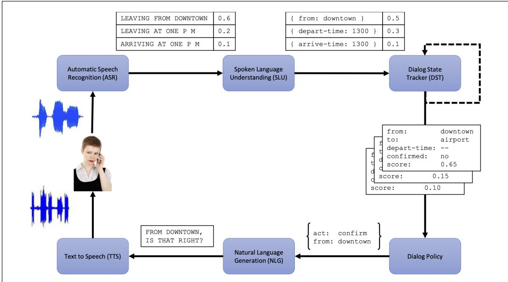
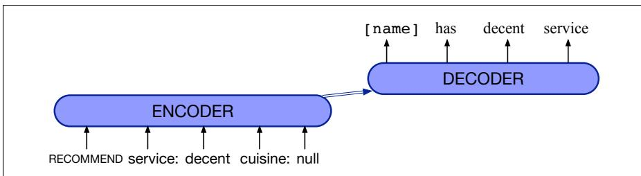

CHAPTER

K

# Frame-Based Dialogue Systems

A task-based dialogue system has the goal of helping a user solve a specific task like making a travel reservation or buying a product. Task-based dialogue systems are based around frames, first introduced in the early influential GUS system for travel planning (Bobrow et al., 1977). Frames are knowledge structures representing the details of the user’s task specification. Each frame consists of a collection of slots, each of which can take a set of possible values. Together a set of frames is sometimes called a domain ontology.

Here we’ll describe the most well-studied frame-based architecture, the dialoguestate architecture, made up of the six components shown in Fig. K.1. In the next sections we’ll introduce four of them, after introducing the idea of frames (deferring the speech recognition and synthesis components to Chapter 16).

  
Figure K.1 Architecture of a dialogue-state system for task-oriented dialogue from Williams et al. (2016).

## K.0.1 Frames and Slot Filling

The frame and its slots in a task-based dialogue system specify what the system needs to know to perform its task. A hotel reservation system needs dates and locations. An alarm clock system needs a time. The system’s goal is to fill the slots in the frame with the fillers the user intends, and then perform the relevant action for the user (answering a question, or booking a flight).

Fig. K.2 shows a sample frame for booking air travel, with some sample questions used for filling slots. In the simplest frame-based systems (including most commercial assistants until quite recently), these questions are pre-written templates, but in more sophisticated systems, questions are generated on-the-fly. The slot fillers are often constrained to a particular semantic type, like type CITY (taking on values like San Francisco, or Hong Kong) or DATE, AIRLINE, or TIME.

<table><tr><td colspan="2">Slot Type Example Question</td></tr><tr><td>ORIGIN CITY city</td><td>&quot;From what city are you leaving?&quot;</td></tr><tr><td>DESTINATION CITY city</td><td>“Where are you going?”</td></tr><tr><td>DEPARTURE TIME time</td><td>“When would you like to leave?&quot;</td></tr><tr><td>DEPARTURE DATE date</td><td>“What day would you like to leave?&quot;”</td></tr><tr><td>ARRIVAL TIME time</td><td>“When do you want to arrive?&quot;</td></tr><tr><td>ARRIVAL DATE date</td><td>“What day would you like to arrive?&quot;</td></tr></table>

Figure K.2 A frame in a frame-based dialogue system, showing the type of each slot and a sample question used to fill the slot.

Many domains require multiple frames. Besides frames for car or hotel reservations, we might need other frames for things like general route information (for questions like Which airlines fly from Boston to San Francisco?), That means the system must be able to disambiguate which slot of which frame a given input is supposed to fill.

The task of slot-filling is usually combined with two other tasks, to extract 3 things from each user utterance. The first is domain classification: is this user for example talking about airlines, programming an alarm clock, or dealing with their calendar? The second is user intent determination: what general task or goal is the user trying to accomplish? For example the task could be to Find a Movie, or Show a Flight, or Remove a Calendar Appointment. Together, the domain classification and intent determination tasks decide which frame we are filling. Finally, we need to do slot filling itself: extract the particular slots and fillers that the user intends the system to understand from their utterance with respect to their intent. From a user utterance like this one:

Show me morning flights from Boston to San Francisco on Tuesday a system might want to build a representation like:

DOMAIN: AIR-TRAVEL

INTENT: SHOW-FLIGHTS

ORIGIN-CITY: Boston

DEST-CITY: San Francisco

ORIGIN-DATE: Tuesday

ORIGIN-TIME: morning

Similarly an utterance like this:

should give an intent like this:

Wake me tomorrow at 6

DOMAIN: ALARM-CLOCK

INTENT: SET-ALARM

TIME: 2017-07-01 0600

The simplest dialogue systems use handwritten rules for slot-filling, like this regular expression for recognizing the SET-ALARM intent:

wake me (up) | set (the|an) alarm | get me up

But most systems use supervised machine-learning: each sentence in a training set is annotated with slots, domain, and intent, and a sequence model maps from input words to slot fillers, domain and intent. For example we’ll have pairs of sentences that are labeled for domain (AIRLINE) and intent (SHOWFLIGHT), and are also labeled with BIO representations for the slots and fillers. (Recall from Chapter 18 that in BIO tagging we introduce a tag for the beginning (B) and inside (I) of each slot label, and one for tokens outside (O) any slot label.)

Fig. K.3 shows a typical architecture for inference. The input words $w _ { 1 } . . . w _ { n }$ are passed through a pretrained language model encoder, followed by a feedforward layer and a softmax at each token position over possible BIO tags, with the output a series of BIO tags $s _ { 1 } . . . s _ { n }$ . We generally combine the domain-classification and intent-extraction tasks with slot-filling by adding a domain concatenated with an intent as the desired output for the final EOS token.

  
Figure K.3 Slot filling by passing input words through an encoder, and then using a linear or feedforward layer followed by a softmax to generate a series of BIO tags. Here we also show a final state: a domain concatenated with an intent.

Once the sequence labeler has tagged the user utterance, a filler string can be extracted for each slot from the tags (e.g., “San Francisco”), and these word strings can then be normalized to the correct form in the ontology (perhaps the airport code ‘SFO’), for example with dictionaries that specify that SF, SFO, and San Francisco are synonyms. Often in industrial contexts, combinations of rules and machine learning are used for each of these components.

We can make a very simple frame-based dialogue system by wrapping a small amount of code around this slot extractor. Mainly we just need to ask the user questions until all the slots are full, do a database query, then report back to the user, using hand-built templates for generating sentences.

## K.0.2 Evaluating Task-Based Dialogue

We evaluate task-based systems by computing the task error rate, or task success rate: the percentage of times the system booked the right plane flight, or put the right event on the calendar. A more fine-grained, but less extrinsic metric is the slot error rate, the percentage of slots filled with the correct values:

$$
{ \mathrm { S l o t ~ E r r o r ~ R a t e ~ f o r ~ a ~ S e n t e n c e } } = { \frac { \# { \mathrm { ~ o f ~ i n s e r t e d / d e l e t e d / s u b s i t u t e d ~ s l o t s } } } { \# { \mathrm { ~ o f ~ t o t a l ~ r e f e r e n c e ~ s l o t s ~ f o r ~ s e n t e n c e } } } }\tag{K.1}
$$

For example a system that extracted the slot structure below from this sentence:

(K.2) Make an appointment with Chris at 10:30 in Gates 104
<table><tr><td>Slot</td><td>Filler</td></tr><tr><td>PERSON Chris</td><td></td></tr><tr><td>TIME</td><td>11:30 a.m.</td></tr><tr><td>ROOM</td><td>Gates 104</td></tr></table>

has a slot error rate of 1/3, since the TIME is wrong. Instead of error rate, slot precision, recall, and F-score can also be used. We can also measure efficiency efficiency costs costs like the length of the dialogue in seconds or turns.

## K.1 Dialogue Acts and Dialogue State

While the naive slot-extractor system described above can handle simple dialogues, often we want more complex interactions. For example, we might want to confirm that we’ve understand the user, or ask them to repeat themselves. We can build a more sophisticated system using dialogue acts and dialogue state.

## K.1.1 Dialogue Acts

dialogue acts Dialogue acts are a generalization of speech acts that also represent grounding. The set of acts can be general, or can be designed for particular dialogue tasks.

<table><tr><td>Tag</td><td>Sys User</td><td>Description</td></tr><tr><td>HELI  $\scriptstyle \_ 0 ( a = x , b = y , \ldots )$ </td><td></td><td>Open a dialogue and give info  $a = x , b = y , \ldots$ </td></tr><tr><td> $\mathrm { I N F O R M } ( a = x , b = y , \ldots )$ </td><td>5</td><td>Give info  $a = x , b = y , .$ </td></tr><tr><td> ${ \mathrm { R E Q U E S T } } ( a , b = x , \ldots )$ </td><td></td><td>Request value for a given  $b = x , \ldots$ </td></tr><tr><td> ${ \mathrm { R E Q A L T S } } ( a = x , \ldots )$ </td><td>X</td><td>Request alternative with  $a = x , \ldots$ </td></tr><tr><td> $\mathbf { C O N F I R M } ( a = x , b = y , \ldots )$ </td><td>7</td><td>Explicitly confirm  $a = x , b = y ,$ </td></tr><tr><td> $\mathrm { C O N F R E Q } ( a = x , . . . , d )$ </td><td>X</td><td>Implicitly confirm  $a = x , \ldots$  and request value of d</td></tr><tr><td> $\mathtt { S E L E C T } ( a = x , a = y )$ </td><td>X</td><td>Implicitly confirm  $a = x , . . ,$  . and request value of d</td></tr><tr><td> $\mathrm { A F F I R M } ( a = x , b = y , \ldots )$ </td><td>✓</td><td>Affirm and give further info  $a = x , b = y , . .$ </td></tr><tr><td>NEGATE(a = x)</td><td>X</td><td>Negate and give corrected value  $a = x$ </td></tr><tr><td>DENY(a = x)</td><td>X</td><td>Deny that a = x</td></tr><tr><td>BYE()</td><td></td><td>Close a dialogue</td></tr></table>

Figure K.4 Dialogue acts used by the HIS restaurant recommendation system of Young et al. (2010). The Sys and User columns indicate which acts are valid as system outputs and user inputs, respectively.

Figure K.4 shows a tagset for a restaurant recommendation system, and Fig. K.5 shows these tags labeling a sample dialogue from the HIS system (Young et al., 2010). This example also shows the content of each dialogue act, which are the slot fillers being communicated. So the user might INFORM the system that they want Italian food near a museum, or CONFIRM with the system that the price is reasonable.

## K.1.2 Dialogue State Tracking

The job of the dialogue-state tracker is to determine the current state of the frame (the fillers of each slot), and the user’s most recent dialogue act. The dialogue-state is not just the slot-fillers in the current sentence; it includes the entire state of the frame at this point, summarizing all of the user’s constraints. Fig. K.6 from Mrksiˇ c´ et al. (2017) shows the dialogue state after each turn.

Dialogue act detection is done just like domain or intent classification, by passing the input sentence through an encoder and adding an act classifier. Often passing in the prior dialogue act as well can improve classification. And since dialogue acts place some constraints on the slots and values, the tasks of dialogue-act detection and slot-filling are often performed jointly. The state tracker can just take the output of a slot-filling sequence-model (Section K.0.1) after each sentence, or do something more complicated like training a classifier to decide if a value has been changed.

<table><tr><td>Utterance</td><td></td><td>Dialogue act</td></tr><tr><td></td><td>U: Hi, I am looking for somewhere to eat.</td><td>hello(task = find,type=restaurant)</td></tr><tr><td></td><td>S: You are looking for a restaurant. What confreq(type = restaurant, food) type of food do you like?</td><td></td></tr><tr><td></td><td>U: I&#x27;d like an Italian near the museum.</td><td>inform(food = Italian, near=museum)</td></tr><tr><td></td><td>the museum.</td><td>S: Roma is a nice Italian restaurant near inform(name = &quot;Roma&quot;, type = restaurant, food = Italian, near = museum)</td></tr><tr><td></td><td>U: Is it reasonably priced?</td><td>confirm(pricerange = moderate)</td></tr><tr><td></td><td>S: Yes, Roma is in the moderate price affirm(name = &quot;Roma&quot;, pricerange =</td><td>moderate)</td></tr><tr><td></td><td>range. U: What is the phone number?</td><td>request(phone)</td></tr><tr><td></td><td>S: The number of Roma is 385456.</td><td>inform(name = &quot;Roma&quot;, phone = &quot;385456&quot;)</td></tr><tr><td></td><td>U: Ok, thank you goodbye.</td><td>bye()</td></tr></table>

Figure K.5 A dialogue from the HIS System of Young et al. (2010) using the dialogue acts in Fig. K.4.

<table><tr><td>User:</td><td>I&#x27;m looking for a cheaper restaurant</td></tr><tr><td>User:</td><td>inform(price=cheap) System: Sure. What kind - and where?</td></tr><tr><td>System: The House serves cheap Thai food</td><td>Thai food, somewhere downtown inform(price=cheap， food=Thai， area=centre)</td></tr><tr><td>User:</td><td></td></tr><tr><td>Where is it?</td><td></td></tr><tr><td>System: The House is at 106 Regent Street</td><td>inform(price=cheap, food=Thai, area=centre); request(address)</td></tr></table>

Figure K.6 The output of the dialogue state tracker after each turn (Mrksiˇ c et al.´ , 2017).

A special case: detecting correction acts. If a dialogue system misrecognizes or misunderstands an utterance, users will repeat or reformulate the utterance. De  
user correction tecting these user correction acts is quite important, especially for spoken language. Ironically, corrections are actually harder to recognize than normal sentences (Swerts et al., 2000), because users who are frustrated adjust their speech in a way that is difficult for speech recognizers (Goldberg et al., 2003). For example speak  
hyperarticula- ers often use a prosodic style for corrections called hyperarticulation, in which the utterance is louder or longer or exaggerated in pitch, such as I said BAL-TI-MORE, not Boston (Wade et al. 1992, Levow 1998, Hirschberg et al. 2001). Detecting acts can be part of the general dialogue act detection classifier, or can make use of special features beyond the words, like those shown below (Levow 1998, Litman et al. 1999, Hirschberg et al. 2001, Bulyko et al. 2005, Awadallah et al. 2015).

<table><tr><td>features</td><td>examples</td></tr><tr><td>semantic</td><td>embedding similarity between correction and user&#x27;s prior utterance</td></tr><tr><td>phonetic</td><td>phonetic overlap between candidate correction act and user&#x27;s prior utterance (i.e. “WhatsApp” may be incorrectly recognized as “What&#x27;s up”)</td></tr><tr><td>prosodic</td><td>hyperarticulation, increases in F0 range, pause duration, and word duration</td></tr><tr><td>ASR</td><td>ASR confidence, language model probability</td></tr></table>

## K.1.3 Dialogue Policy: Which act to generate

In early commercial frame-based systems, the dialogue policy is simple: ask questions until all the slots are full, do a database query, then report back to the user. A more sophisticated dialogue policy can help a system decide when to answer the user’s questions, when to instead ask the user a clarification question, and so on. A dialogue policy thus decides what dialogue act to generate. Choosing a dialogue act to generate, along with its arguments, is sometimes called content planning.

Let’s see how to do this for some important dialogue acts. Dialogue systems, especially speech systems, often misrecognize the users’ words or meaning. To ensure system and user share a common ground, systems must confirm understandings with the user or reject utterances that the system don’t understand. A system might use an explicit confirmation act to confirm with the user, like Is that correct? below:

U: I’d like to fly from Denver Colorado to New York City on September twenty first in the morning on United Airlines

S: Let’s see then. I have you going from Denver Colorado to New York on September twenty first. Is that correct?

When using an implicit confirmation act, a system instead grounds more implicitly, for example by repeating the system’s understanding as part of asking the next question, as Shanghai is confirmed in passing in this example:

U: I want to travel to to Shanghai

S: When do you want to travel to Shanghai?

There’s a tradeoff. Explicit confirmation makes it easier for users to correct misrecognitions by just answering “no” to the confirmation question. But explicit confirmation is time-consuming and awkward (Danieli and Gerbino 1995, Walker et al. 1998). We also might want an act that expresses lack of understanding: rejection, for example with a prompt like I’m sorry, I didn’t understand that. To decide among these acts, we can make use of the fact that ASR systems often compute their confidence in their transcription (often based on the log-likelihood the system assigns the sentence). A system can thus choose to explicitly confirm only lowconfidence sentences. Or systems might have a four-tiered level of confidence with three thresholds α, β, and γ:

< α low confidence reject

≥ α above the threshold confirm explicitly

≥ β high confidence confirm implictly

≥ γ very high confidence don’t confirm at all

## K.1.4 Natural language generation: Sentence Realization

recommend(restaurant name= Au Midi, neighborhood = midtown, cuisine = french)

1 Au Midi is in Midtown and serves French food.

2 There is a French restaurant in Midtown called Au Midi.

Figure K.7 Sample inputs to the sentence realization phase of NLG, showing the dialogue act and attributes prespecified by the content planner, and two distinct potential output sentences to be generated. From the restaurant recommendation system of Nayak et al. (2017).

Once a dialogue act has been chosen, we need to generate the text of the response to the user. This part of the generation process is called sentence realization. Fig. K.7 shows a sample input/output for the sentence realization phase. The content planner has chosen the dialogue act RECOMMEND and some slots (name, neighborhood, cuisine) and fillers. The sentence realizer generates a sentence like lines 1 or 2 (by training on examples of representation/sentence pairs from a corpus of labeled dialogues). Because we won’t see every restaurant or attribute in every possible wording, we can delexicalize: generalize the training examples by replacing specific slot value words in the training set with a generic placeholder token representing the slot. Fig. K.8 shows the sentences in Fig. K.7 delexicalized.

recommend(restaurant name= Au Midi, neighborhood = midtown,   
cuisine = french)   
1 restaurant name is in neighborhood and serves cuisine food.   
2 There is a cuisine restaurant in neighborhood called restaurant name.   
Figure K.8 Delexicalized sentences that can be used for generating many different relexi  
calized sentences. From the restaurant recommendation system of Nayak et al. (2017).

We can map from frames to delexicalized sentences with an encoder decoder model (Mrksiˇ c et al.´ 2017, inter alia), trained on hand-labeled dialogue corpora like MultiWOZ (Budzianowski et al., 2018). The input to the encoder is a sequence of tokens xt that represent the dialogue act (e.g., RECOMMEND) and its arguments (e.g., service:decent, cuisine:null) (Nayak et al., 2017), as in Fig. K.9.

  
Figure K.9 An encoder decoder sentence realizer mapping slots/fillers to English.

The decoder outputs the delexicalized English sentence “name has decent service”, which we can then relexicalize, i.e. fill back in correct slot values, resulting in “Au Midi has decent service”.

## Historical Notes

The linguistic, philosophical, and psychological literature on dialogue is quite extensive. For example the idea that utterances in a conversation are a kind of action being performed by the speaker was due originally to the philosopher Wittgenstein (1953) but worked out more fully by Austin (1962) and his student John Searle. Various sets of speech acts have been defined over the years, and a rich linguistic and philosophical literature developed, especially focused on explaining the use of indirect speech acts. The idea of dialogue acts draws also from a number of other sources, including the ideas of adjacency pairs, pre-sequences, and other aspects of the interactional properties of human conversation developed in the field of conversation analysis (see Levinson (1983) for an introduction to the field). This idea that acts set up strong local dialogue expectations was also prefigured by Firth (1935, p. 70), in a famous quotation:

Most of the give-and-take of conversation in our everyday life is stereotyped and very narrowly conditioned by our particular type of culture. It is a sort ofroughly prescribed social ritual, in which you generally say what the other fellow expects you, one way or the other, to say.

Another important research thread modeled dialogue as a kind of collaborative behavior, including the ideas of common ground (Clark and Marshall, 1981), reference as a collaborative process (Clark and Wilkes-Gibbs, 1986), joint intention (Levesque et al., 1990), and shared plans (Grosz and Sidner, 1980).

The earliest conversational systems were simple pattern-action chatbots like ELIZA (Weizenbaum, 1966). ELIZA had a widespread influence on popular perceptions of artificial intelligence, and brought up some of the first ethical questions in natural language processing —such as the issues of privacy we discussed above as well the role of algorithms in decision-making— leading its creator Joseph Weizenbaum to fight for social responsibility in AI and computer science in general.

Computational-implemented theories of dialogue blossomed in the 1970. That period saw the very influential GUS system (Bobrow et al., 1977), which in the late 1970s established the frame-based paradigm that became the dominant industrial paradigm for dialogue systems for over 30 years.

Another influential line of research from that decade focused on modeling the hierarchical structure of dialogue. Grosz’s pioneering 1977 dissertation first showed that “task-oriented dialogues have a structure that closely parallels the structure of the task being performed” (p. 27), leading to her work with Sidner and others showing how to use similar notions of intention and plans to model discourse structure and coherence in dialogue. See, e.g., Lochbaum et al. (2000) for a summary of the role of intentional structure in dialogue.

Yet a third line, first suggested by Bruce (1975), suggested that since speech acts are actions, they should be planned like other actions, and drew on the AI planning literature (Fikes and Nilsson, 1971). A system seeking to find out some information can come up with the plan of asking the interlocutor for the information. A system hearing an utterance can interpret a speech act by running the planner “in reverse”, using inference rules to infer from what the interlocutor said what the plan might have been. Plan-based models of dialogue are referred to as BDI models because such planners model the beliefs, desires, and intentions (BDI) of the system and interlocutor. BDI models of dialogue were first introduced by Allen, Cohen, Perrault, and their colleagues in a number of influential papers showing how speech acts could be generated (Cohen and Perrault, 1979) and interpreted (Perrault and Allen 1980, Allen and Perrault 1980). At the same time, Wilensky (1983) introduced plan-based models of understanding as part of the task of interpreting stories.

In the 1990s, machine learning models that had first been applied to natural language processing began to be applied to dialogue tasks like slot filling (Miller et al. 1994, Pieraccini et al. 1991). This period also saw lots of analytic work on the linguistic properties of dialogue acts and on machine-learning-based methods for their detection. (Sag and Liberman 1975, Hinkelman and Allen 1989, Nagata and Morimoto 1994, Goodwin 1996, Chu-Carroll 1998, Shriberg et al. 1998, Stolcke et al. 2000, Gravano et al. 2012. This work strongly informed the development of the dialogue-state model (Larsson and Traum, 2000). Dialogue state tracking quickly became an important problem for task-oriented dialogue, and there has been an influential annual evaluation of state-tracking algorithms (Williams et al., 2016).

The turn of the century saw a line of work on applying reinforcement learning to dialogue, which first came out of AT&T and Bell Laboratories with work on MDP dialogue systems (Walker 2000, Levin et al. 2000, Singh et al. 2002) along with work on cue phrases, prosody, and rejection and confirmation. Reinforcement learning research turned quickly to the more sophisticated POMDP models (Roy et al. 2000, Lemon et al. 2006, Williams and Young 2007) applied to small slotfilling dialogue tasks. Neural reinforcement learning models have been used both for chatbot systems, for example simulating dialogues between two dialogue systems, rewarding good conversational properties like coherence and ease of answering (Li et al., 2016), and for task-oriented dialogue (Williams et al., 2017).

By around 2010 the GUS architecture finally began to be widely used commercially in dialogue systems on phones like Apple’s SIRI (Bellegarda, 2013) and other digital assistants.

Other important dialogue areas include the study of affect in dialogue (Rashkin et al. 2019, Lin et al. 2019) and conversational interface design (Cohen et al. 2004, Harris 2005, Pearl 2017, Deibel and Evanhoe 2021).

## [TBD: Modern history of neural dialogue systems]

Allen, J. and C. R. Perrault. 1980. Analyzing intention in utterances. Artificial Intelligence, 15:143–178.

Austin, J. L. 1962. How to Do Things with Words. Harvard University Press.

Awadallah, A. H., R. G. Kulkarni, U. Ozertem, and R. Jones. 2015. Charaterizing and predicting voice query reformu lation. CIKM-15.

Bellegarda, J. R. 2013. Natural language technology in mobile devices: Two grounding frameworks. In Mobile Speech and Advanced Natural Language Solutions, 185– 196. Springer.

Bobrow, D. G., R. M. Kaplan, M. Kay, D. A. Norman, H. Thompson, and T. Winograd. 1977. GUS, A frame driven dialog system. Artificial Intelligence, 8:155–173.

Bruce, B. C. 1975. Generation as a social action. Proceedings of TINLAP-1 (Theoretical Issues in Natural Language Processing).

Budzianowski, P., T.-H. Wen, B.-H. Tseng, I. Casanueva, S. Ultes, O. Ramadan, and M. Gasiˇ c. 2018.´ MultiWOZ - a large-scale multi-domain wizard-of-Oz dataset for task oriented dialogue modelling. EMNLP.

Bulyko, I., K. Kirchhoff, M. Ostendorf, and J. Goldberg. 2005. Error-sensitive response generation in a spoken language dialogue system. Speech Communication, 45(3):271–288.

Chu-Carroll, J. 1998. A statistical model for discourse act recognition in dialogue interactions. Applying Machine Learning to Discourse Processing. Papers from the 1998 AAAI Spring Symposium. Tech. rep. SS-98-01. AAAI Press.

Clark, H. H. and C. Marshall. 1981. Definite reference and mutual knowledge. In A. K. Joshi, B. L. Webber, and I. A. Sag, eds, Elements of Discourse Understanding, 10–63. Cambridge.

Clark, H. H. and D. Wilkes-Gibbs. 1986. Referring as a col laborative process. Cognition, 22:1–39.

Cohen, M. H., J. P. Giangola, and J. Balogh. 2004. Voice User Interface Design. Addison-Wesley.

Cohen, P. R. and C. R. Perrault. 1979. Elements of a planbased theory of speech acts. Cognitive Science, 3(3):177– 212.

Danieli, M. and E. Gerbino. 1995. Metrics for evaluating dialogue strategies in a spoken language system. AAAI Spring Symposium on Empirical Methods in Discourse Interpretation and Generation.

Deibel, D. and R. Evanhoe. 2021. Conversations with Things: UX Designfor Chat and Voice. Rosenfeld.

Fikes, R. E. and N. J. Nilsson. 1971. STRIPS: A new approach to the application of theorem proving to problem solving. Artificial Intelligence, 2:189–208.

Firth, J. R. 1935. The technique of semantics. Transactions ofthe philological society, 34(1):36–73.

Goldberg, J., M. Ostendorf, and K. Kirchhoff. 2003. The impact of response wording in error correction subdialogs. ISCA Tutorial and Research Workshop on Error Handling in Spoken Dialogue Systems.

Goodwin, C. 1996. Transparent vision. In E. Ochs, E. A. Schegloff, and S. A. Thompson, eds, Interaction and Grammar, 370–404. Cambridge University Press.

Gravano, A., J. Hirschberg, and S. Beˇ nuˇ s. 2012.ˇ Affirmative cue words in task-oriented dialogue. Computational Linguistics, 38(1):1–39.

Grosz, B. J. 1977. The Representation and Use of Focus in Dialogue Understanding. Ph.D. thesis, University of California, Berkeley.

Grosz, B. J. and C. L. Sidner. 1980. Plans for discourse. In P. R. Cohen, J. Morgan, and M. E. Pollack, eds, Intentions in Communication, 417–444. MIT Press.

Harris, R. A. 2005. Voice Interaction Design: Crafting the New Conversational Speech Systems. Morgan Kaufmann.

Hinkelman, E. A. and J. Allen. 1989. Two constraints on speech act ambiguity. ACL.

Hirschberg, J., D. J. Litman, and M. Swerts. 2001. Identifying user corrections automatically in spoken dialogue systems. NAACL.

Larsson, S. and D. R. Traum. 2000. Information state and dialogue management in the trindi dialogue move engine toolkit. Natural Language Engineering, 6(323-340):97– 114.

Lemon, O., K. Georgila, J. Henderson, and M. Stuttle. 2006. An ISU dialogue system exhibiting reinforcement learning of dialogue policies: Generic slot-filling in the TALK in-car system. EACL.

Levesque, H. J., P. R. Cohen, and J. H. T. Nunes. 1990. On acting together. AAAI. Morgan Kaufmann.

Levin, E., R. Pieraccini, and W. Eckert. 2000. A stochastic model of human-machine interaction for learning dialog strategies. IEEE Transactions on Speech and Audio Processing, 8:11–23.

Levinson, S. C. 1983. Conversational Analysis, chapter 6. Cambridge University Press.

Levow, G.-A. 1998. Characterizing and recognizing spoken corrections in human-computer dialogue. COLING/ACL.

Li, J., W. Monroe, A. Ritter, D. Jurafsky, M. Galley, and J. Gao. 2016. Deep reinforcement learning for dialogue generation. EMNLP.

Lin, Z., A. Madotto, J. Shin, P. Xu, and P. Fung. 2019. MoEL: Mixture of empathetic listeners. EMNLP.

Litman, D. J., M. A. Walker, and M. Kearns. 1999. Automatic detection of poor speech recognition at the dialogue level. ACL.

Lochbaum, K. E., B. J. Grosz, and C. L. Sidner. 2000. Discourse structure and intention recognition. In R. Dale, H. Moisl, and H. L. Somers, eds, Handbook of Natural Language Processing. Marcel Dekker.

Miller, S., R. J. Bobrow, R. Ingria, and R. Schwartz. 1994. Hidden understanding models of natural language. ACL.

Mrksiˇ c, N., D.´ O S´ eaghdha, T.-H. Wen, B. Thomson, and´ S. Young. 2017. Neural belief tracker: Data-driven dialogue state tracking. ACL.

Nagata, M. and T. Morimoto. 1994. First steps toward statistical modeling of dialogue to predict the speech act type of the next utterance. Speech Communication, 15:193– 203.

Nayak, N., D. Hakkani-Tur, M. A. Walker, and L. P. Heck.¨ 2017. To plan or not to plan? discourse planning in slot-value informed sequence to sequence models for language generation. INTERSPEECH.

Pearl, C. 2017. Designing Voice User Interfaces: Principles of Conversational Experiences. O’Reilly.

Perrault, C. R. and J. Allen. 1980. A plan-based analysis of indirect speech acts. American Journal of Computational Linguistics, 6(3-4):167–182.

Young, S. J., M. Gasiˇ c, S. Keizer, F. Mairesse, J. Schatz-´ mann, B. Thomson, and K. Yu. 2010. The Hidden Information State model: A practical framework for POMDPbased spoken dialogue management. Computer Speech & Language, 24(2):150–174.

Pieraccini, R., E. Levin, and C.-H. Lee. 1991. Stochastic representation of conceptual structure in the ATIS task. Speech and Natural Language Workshop.

Rashkin, H., E. M. Smith, M. Li, and Y.-L. Boureau. 2019. Towards empathetic open-domain conversation models: A new benchmark and dataset. ACL.

Roy, N., J. Pineau, and S. Thrun. 2000. Spoken dialogue management using probabilistic reasoning. ACL.

Sag, I. A. and M. Y. Liberman. 1975. The intonational dis ambiguation of indirect speech acts. In CLS-75, 487–498. University of Chicago.

Shriberg, E., R. Bates, P. Taylor, A. Stolcke, D. Jurafsky, K. Ries, N. Coccaro, R. Martin, M. Meteer, and C. Van Ess-Dykema. 1998. Can prosody aid the automatic classification of dialog acts in conversational speech? Lan guage and Speech (Special Issue on Prosody and Conversation), 41(3-4):439–487.

Singh, S. P., D. J. Litman, M. Kearns, and M. A. Walker. 2002. Optimizing dialogue management with reinforcement learning: Experiments with the NJFun system. JAIR, 16:105–133.

Stolcke, A., K. Ries, N. Coccaro, E. Shriberg, R. Bates, D. Jurafsky, P. Taylor, R. Martin, M. Meteer, and C. Van Ess-Dykema. 2000. Dialogue act modeling for automatic tagging and recognition of conversational speech. Computational Linguistics, 26(3):339–371.

Swerts, M., D. J. Litman, and J. Hirschberg. 2000. Corrections in spoken dialogue systems. ICSLP.

Wade, E., E. Shriberg, and P. J. Price. 1992. User behaviors affecting speech recognition. ICSLP.

Walker, M. A. 2000. An application of reinforcement learning to dialogue strategy selection in a spoken dialogue system for email. JAIR, 12:387–416.

Walker, M. A., J. C. Fromer, and S. S. Narayanan. 1998. Learning optimal dialogue strategies: A case study of a spoken dialogue agent for email. COLING/ACL.

Weizenbaum, J. 1966. ELIZA – A computer program for the study of natural language communication between man and machine. CACM, 9(1):36–45.

Wilensky, R. 1983. Planning and Understanding: A Computational Approach to Human Reasoning. Addison-Wesley.

Williams, J. D., K. Asadi, and G. Zweig. 2017. Hybrid code networks: practical and efficient end-to-end dialog control with supervised and reinforcement learning. ACL.

Williams, J. D., A. Raux, and M. Henderson. 2016. The di alog state tracking challenge series: A review. Dialogue & Discourse, 7(3):4–33.

Williams, J. D. and S. J. Young. 2007. Partially observable markov decision processes for spoken dialog systems. Computer Speech and Language, 21(1):393–422.

Wittgenstein, L. 1953. Philosophical Investigations. (Translated by Anscombe, G.E.M.). Blackwell.